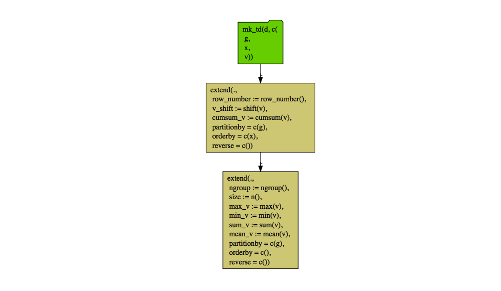
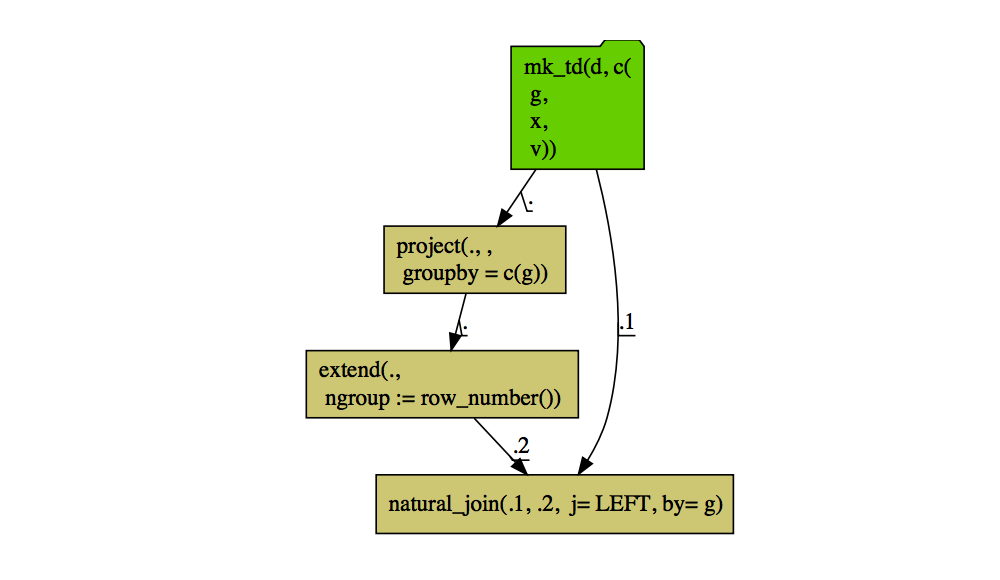
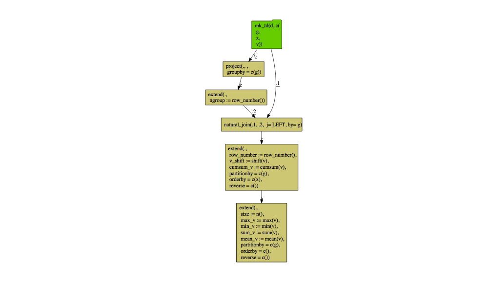

WindowFunctions
================

John Mount October 13,
2019

[This](https://github.com/WinVector/data_algebra/blob/master/Examples/WindowFunctions/WindowFunctions.md)
is an tutorial on how to use window functions in either the `R`
[`rquery`](https://github.com/WinVector/rquery) package, or in the
`Python` [`data_algebra`](https://github.com/WinVector/data_algebra)
package (`R` example [here](), `Python` example
[here](https://github.com/WinVector/data_algebra/blob/master/Examples/WindowFunctions/WindowFunctions.md)).

The [`rquery`](https://github.com/WinVector/rquery) provides a
simplified (though verbose) unified interface to Pandas and SQL data
transforms, including windows functions. (Note: for a `Python` of this
please see
[here](https://github.com/WinVector/data_algebra/blob/master/Examples/WindowFunctions/WindowFunctions.md).)

Let’s work an example. First bring in our packages.

``` r
library(wrapr)
library(rquery)
library(rqdatatable)
```

Now some example data.

``` r
d <- data.frame(
  g = c('a', 'b', 'b', 'c', 'c', 'c'),
  x = c(1, 4, 5, 7, 8, 9),
  v = c(10, 40, 50, 70, 80, 90),
  stringsAsFactors = FALSE)

knitr::kable(d)
```

| g | x |  v |
| :- | -: | -: |
| a | 1 | 10 |
| b | 4 | 40 |
| b | 5 | 50 |
| c | 7 | 70 |
| c | 8 | 80 |
| c | 9 | 90 |

And we can run a number of ordered and un-ordered window functions (the
distinction is given by if there is an `orderby` argument present).

``` r
table_description = local_td(d)
shift <- data.table::shift

ops <- table_description %.>%
  extend(., 
         row_number := row_number(),
         v_shift := shift(v),
         orderby = 'x',
         partitionby = 'g') %.>%
  extend(., 
         ngroup := ngroup(),
         size := n(),
         max_v := max(v),
         min_v := min(v),
         sum_v := mean(v),
         mean_v := mean(v),
         partitionby = 'g') 

d %.>%
  ops %.>%
  knitr::kable(.)
```

| g | x |  v | row\_number | v\_shift | ngroup | size | max\_v | min\_v | sum\_v | mean\_v |
| :- | -: | -: | ----------: | -------: | -----: | ---: | -----: | -----: | -----: | ------: |
| a | 1 | 10 |           1 |       NA |      1 |    1 |     10 |     10 |     10 |      10 |
| b | 4 | 40 |           1 |       NA |      2 |    2 |     50 |     40 |     45 |      45 |
| b | 5 | 50 |           2 |       40 |      2 |    2 |     50 |     40 |     45 |      45 |
| c | 7 | 70 |           1 |       NA |      3 |    3 |     90 |     70 |     80 |      80 |
| c | 8 | 80 |           2 |       70 |      3 |    3 |     90 |     70 |     80 |      80 |
| c | 9 | 90 |           3 |       80 |      3 |    3 |     90 |     70 |     80 |      80 |

One of the benefits of `rquery` is the commands are saved in an object.

``` r
cat(format(ops))
```

    ## mk_td("d", c(
    ##   "g",
    ##   "x",
    ##   "v")) %.>%
    ##  extend(.,
    ##   row_number := row_number(),
    ##   v_shift := shift(v),
    ##   partitionby = c('g'),
    ##   orderby = c('x'),
    ##   reverse = c()) %.>%
    ##  extend(.,
    ##   ngroup := ngroup(),
    ##   size := n(),
    ##   max_v := max(v),
    ##   min_v := min(v),
    ##   sum_v := mean(v),
    ##   mean_v := mean(v),
    ##   partitionby = c('g'),
    ##   orderby = c(),
    ##   reverse = c())

We can also present a diagram of the operator chain.

``` r
ops %.>%
  op_diagram(.) %.>% 
  DiagrammeR::grViz(.)
```

<!-- -->

And these commands can be re-used and even exported to SQL (including
large scale SQL such as PostgreSQL, Apache Spark, or Google Big Query).

For a simple demonstration we will use small-scale SQL as realized in
SQLite.

Note: we are not demonstrating `shift` in the `R` `SQLite` example.
However the [`Python` `SQLite`
example](https://github.com/WinVector/data_algebra/blob/master/Examples/WindowFunctions/WindowFunctions.md)
does have include this function.

``` r
raw_connection <- DBI::dbConnect(RSQLite::SQLite(), ":memory:")
RSQLite::initExtension(raw_connection)
db <- rquery_db_info(
  connection = raw_connection,
  is_dbi = TRUE,
  connection_options = rq_connection_tests(raw_connection))

ops_db <- table_description %.>%
  extend(., 
         row_number := row_number(),
         #v_shift := shift(v),
         orderby = 'x',
         partitionby = 'g') %.>%
  extend(., 
         # ngroup := ngroup(),
         size := n(),
         max_v := max(v),
         min_v := min(v),
         sum_v := mean(v),
         mean_v := mean(v),
         partitionby = 'g') 

rq_copy_to(db, 'd',
           d,
           temporary = TRUE, 
           overwrite = TRUE)
```

    ## [1] "mk_td(\"d\", c( \"g\", \"x\", \"v\"))"

``` r
sql1 <- to_sql(ops_db, db)

cat(sql1)
```

    ## SELECT
    ##  `g`,
    ##  `x`,
    ##  `v`,
    ##  `row_number`,
    ##  COUNT ( 1 ) OVER (  PARTITION BY `g` ) AS `size`,
    ##  max ( `v` ) OVER (  PARTITION BY `g` ) AS `max_v`,
    ##  min ( `v` ) OVER (  PARTITION BY `g` ) AS `min_v`,
    ##  AVG ( `v` ) OVER (  PARTITION BY `g` ) AS `sum_v`,
    ##  AVG ( `v` ) OVER (  PARTITION BY `g` ) AS `mean_v`
    ## FROM (
    ##  SELECT
    ##   `g`,
    ##   `x`,
    ##   `v`,
    ##   row_number ( ) OVER (  PARTITION BY `g` ORDER BY `x` ) AS `row_number`
    ##  FROM (
    ##   SELECT
    ##    `g`,
    ##    `x`,
    ##    `v`
    ##   FROM
    ##    `d`
    ##   ) tsql_23115959802959697384_0000000000
    ##  ) tsql_23115959802959697384_0000000001

And we can execute this SQL either to materialize a remote result (which
involves no data motion, as we send the SQL commands to the database,
not move the data to/from R), or to bring a result back from the
database to R.

``` r
res1_db <- execute(db, ops_db)

knitr::kable(res1_db)
```

| g | x |  v | row\_number | size | max\_v | min\_v | sum\_v | mean\_v |
| :- | -: | -: | ----------: | ---: | -----: | -----: | -----: | ------: |
| a | 1 | 10 |           1 |    1 |     10 |     10 |     10 |      10 |
| b | 4 | 40 |           1 |    2 |     50 |     40 |     45 |      45 |
| b | 5 | 50 |           2 |    2 |     50 |     40 |     45 |      45 |
| c | 7 | 70 |           1 |    3 |     90 |     70 |     80 |      80 |
| c | 8 | 80 |           2 |    3 |     90 |     70 |     80 |      80 |
| c | 9 | 90 |           3 |    3 |     90 |     70 |     80 |      80 |

Notice we didn’t calculate the group-id `rgroup` in the `SQL` version.
This is because this is a much less common window function (and not
often used in applications). This is also only interesting when we are
using a composite key (else the single key column is already the
per-group id). So not all data\_algebra pipelines can run in all
environments. However, we can compute (arbitrary) group IDs in a domain
independent manner as follows.

``` r
id_ops_a = table_description %.>%
  project(.,
          groupby = 'g') %.>%
  extend(.,
         ngroup:= row_number(),
         orderby = 'g')

id_ops_b = table_description %.>%
    natural_join(.,
                 id_ops_a, by = 'g', jointype = 'LEFT')

cat(format(id_ops_b))
```

    ## mk_td("d", c(
    ##   "g",
    ##   "x",
    ##   "v")) %.>%
    ##  natural_join(.,
    ##   mk_td("d", c(
    ##     "g",
    ##     "x",
    ##     "v")) %.>%
    ##    project(., ,
    ##     groupby = c('g')) %.>%
    ##    extend(.,
    ##     ngroup := row_number()),
    ##   jointype = "LEFT", by = c('g'))

Here we land the result in the database, without moving data through R.

``` r
table_2 <- materialize(db, id_ops_b, 'remote_result')

table_2
```

    ## [1] "mk_td(\"remote_result\", c( \"g\", \"x\", \"v\", \"ngroup\"))"

And we later copy it over to look at.

``` r
res2_db <- execute(db, table_2)

knitr::kable(res2_db)
```

| g | x |  v | ngroup |
| :- | -: | -: | -----: |
| a | 1 | 10 |      1 |
| b | 4 | 40 |      2 |
| b | 5 | 50 |      2 |
| c | 7 | 70 |      3 |
| c | 8 | 80 |      3 |
| c | 9 | 90 |      3 |

And we can use the same pipeline in R.

``` r
d %.>% 
  id_ops_b %.>%
  knitr::kable(.)
```

| g |  v | x | ngroup |
| :- | -: | -: | -----: |
| a | 10 | 1 |      1 |
| b | 40 | 4 |      2 |
| b | 50 | 5 |      2 |
| c | 70 | 7 |      3 |
| c | 80 | 8 |      3 |
| c | 90 | 9 |      3 |

And we can diagram the group labeling operation.

``` r
id_ops_b %.>%
  op_diagram(., merge_tables = TRUE) %.>% 
  DiagrammeR::grViz(.)
```

<!-- -->

Or all the steps in one sequence.

``` r
all_ops <- id_ops_b %.>%
  extend(., 
         row_number := row_number(),
         #v_shift := shift(v),
         orderby = 'x',
         partitionby = 'g') %.>%
  extend(., 
         # ngroup := ngroup(),
         size := n(),
         max_v := max(v),
         min_v := min(v),
         sum_v := mean(v),
         mean_v := mean(v),
         partitionby = 'g') 

all_ops %.>%
  op_diagram(., merge_tables = TRUE) %.>% 
  DiagrammeR::grViz(.)
```

<!-- -->

And we can run this whole sequence with `data.table`.

``` r
d %.>% 
  all_ops %.>%
  knitr::kable(.)
```

| g |  v | x | ngroup | row\_number | size | max\_v | min\_v | sum\_v | mean\_v |
| :- | -: | -: | -----: | ----------: | ---: | -----: | -----: | -----: | ------: |
| a | 10 | 1 |      1 |           1 |    1 |     10 |     10 |     10 |      10 |
| b | 40 | 4 |      2 |           1 |    2 |     50 |     40 |     45 |      45 |
| b | 50 | 5 |      2 |           2 |    2 |     50 |     40 |     45 |      45 |
| c | 70 | 7 |      3 |           1 |    3 |     90 |     70 |     80 |      80 |
| c | 80 | 8 |      3 |           2 |    3 |     90 |     70 |     80 |      80 |
| c | 90 | 9 |      3 |           3 |    3 |     90 |     70 |     80 |      80 |

Or in the database (via automatic `SQL` generation).

``` r
all_ops %.>%
  execute(db, .) %.>%
  knitr::kable(.)
```

| g | x |  v | ngroup | row\_number | size | max\_v | min\_v | sum\_v | mean\_v |
| :- | -: | -: | -----: | ----------: | ---: | -----: | -----: | -----: | ------: |
| a | 1 | 10 |      1 |           1 |    1 |     10 |     10 |     10 |      10 |
| b | 4 | 40 |      2 |           1 |    2 |     50 |     40 |     45 |      45 |
| b | 5 | 50 |      2 |           2 |    2 |     50 |     40 |     45 |      45 |
| c | 7 | 70 |      3 |           1 |    3 |     90 |     70 |     80 |      80 |
| c | 8 | 80 |      3 |           2 |    3 |     90 |     70 |     80 |      80 |
| c | 9 | 90 |      3 |           3 |    3 |     90 |     70 |     80 |      80 |

``` r
# clean up
DBI::dbDisconnect(raw_connection)
```
