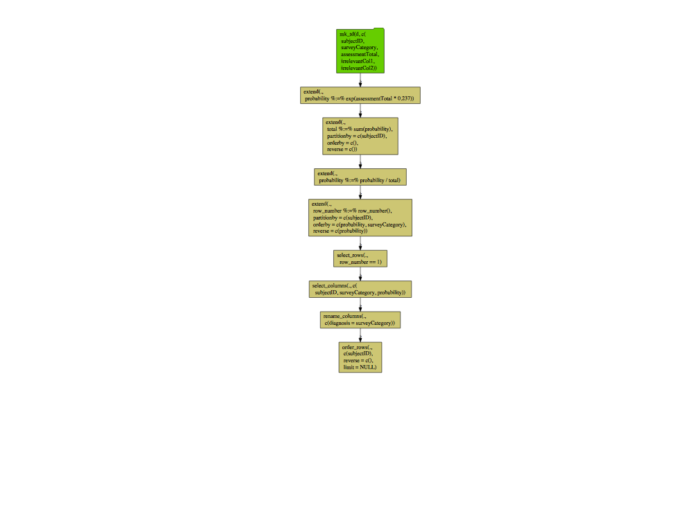

yaml
================

This is an example of `R` reading a `YAML` representation of a `Python`
[`data_algebra`](https://github.com/WinVector/data_algebra) pipeline.
The example being read comes from
[here](https://github.com/WinVector/data_algebra/blob/master/Examples/LogisticExample/ScoringExample.ipynb).

``` r
library(yaml)
library(wrapr)
library(rquery)
library(rqdatatable)

rep <- yaml.load_file("pipeline_yaml.txt")


expr_map_to_expr_array <- function(emap) {
  r = vapply(names(emap), function(k) paste0(k, " := ", emap[[k]]), character(1))
  names(r) <- NULL
  return(r)
}

convert_yaml_to_pipleline <- function(rep, source=NULL) {
  if(is.null(names(rep))) {
    # unnamed list, a pipleline
    res <- convert_yaml_to_pipleline(rep[[1]])
    for(i in seqi(2, length(rep))) {
      res <- convert_yaml_to_pipleline(rep[[i]], source=res)
    }
    return(res)
  } else {
    # named list, a stage
    op = rep$op
    if(op=="TableDescription") {
      return(mk_td(table_name = rep$table_name,
                   columns = rep$column_names))
    } else if(op=="Extend") {
      return(extend_se(source, 
                       assignments = expr_map_to_expr_array(rep$ops),
                       partitionby = as.character(rep$partition_by),
                       orderby = as.character(rep$order_by),
                       reverse = as.character(rep$reverse)))
    } else if(op=="SelectRows") {
      return(select_rows_se(source,
                            expr = rep$expr))
    } else if(op=="SelectColumns") {
      return(select_columns(source, columns=rep$columns))
    } else if(op=="Rename") {
      return(rename_columns(source, cmap=rep$column_remapping))  # TODO: see if map is dumped (or __repr__() call wrote a string)
    } else if(op=="Order") {
      return(orderby(source, cols=rep$order_columns, reverse=rep$reverse, limit=rep$limit))
    } else {
      stop("Unexpected node type: " + op) 
    }
  }
} <- function(rep, source=NULL) {
  if(is.null(names(rep))) {
    # unnamed list, a pipleline
    res <- convert_yaml_to_pipleline(rep[[1]])
    for(i in seqi(2, length(res))) {
      res <- convert_yaml_to_pipleline(rep[[i]], source=res)
    }
    return(res)
  } else {
    # named list, a stage
    op = rep$op
    if(op=="TableDescription") {
      return(mk_td(table_name = rep$table_name,
                   columns = rep$column_names))
    } else if(op=="Extend") {
      return(extend_se(source, 
                       assignments = expr_map_to_expr_array(rep$ops),
                       partitionby = as.character(rep$partition_by),
                       orderby = as.character(rep$order_by),
                       reverse = as.character(rep$reverse)))
    } else if(op=="SelectRows") {
      return(select_rows_se(source,
                            expr = rep$expr))
    } else if(op=="SelectColumns") {
      return(select_columns(source, columns=rep$columns))
    } else if(op=="Rename") {
      return(rename_columns(source, cmap=rep$column_remapping))  # TODO: see if map is dumped (or __repr__() call wrote a string)
    } else if(op=="Order") {
      return(orderby(source, cols=rep$order_columns, reverse=rep$reverse, limit=rep$limit))
    } else {
      stop("Unexpected node type: " + op) 
    }
  }
}

ops <- convert_yaml_to_pipleline(rep)
cat(format(ops))
```

    ## table(d; 
    ##   subjectID,
    ##   surveyCategory,
    ##   assessmentTotal,
    ##   irrelevantCol1,
    ##   irrelevantCol2) %.>%
    ##  extend(.,
    ##   probability := exp(assessmentTotal * 0.237)) %.>%
    ##  extend(.,
    ##   total := sum(probability),
    ##   p= subjectID) %.>%
    ##  extend(.,
    ##   probability := probability / total) %.>%
    ##  extend(.,
    ##   row_number := row_number(),
    ##   p= subjectID,
    ##   o= "probability" DESC, "surveyCategory") %.>%
    ##  select_rows(.,
    ##    row_number == 1) %.>%
    ##  select_columns(.,
    ##    subjectID, surveyCategory, probability) %.>%
    ##  rename_columns(.,
    ##   c('diagnosis' = 'surveyCategory')) %.>%
    ##  orderby(., subjectID)

``` r
cat(to_sql(ops, rquery_default_db_info()))
```

    ## SELECT * FROM (
    ##  SELECT
    ##   "subjectID" AS "subjectID",
    ##   "surveyCategory" AS "diagnosis",
    ##   "probability" AS "probability"
    ##  FROM (
    ##   SELECT
    ##    "subjectID",
    ##    "surveyCategory",
    ##    "probability"
    ##   FROM (
    ##    SELECT * FROM (
    ##     SELECT
    ##      "subjectID",
    ##      "surveyCategory",
    ##      "probability",
    ##      row_number ( ) OVER (  PARTITION BY "subjectID" ORDER BY "probability" DESC, "surveyCategory" ) AS "row_number"
    ##     FROM (
    ##      SELECT
    ##       "subjectID",
    ##       "surveyCategory",
    ##       "probability" / "total"  AS "probability"
    ##      FROM (
    ##       SELECT
    ##        "subjectID",
    ##        "surveyCategory",
    ##        "probability",
    ##        sum ( "probability" ) OVER (  PARTITION BY "subjectID" ) AS "total"
    ##       FROM (
    ##        SELECT
    ##         "subjectID",
    ##         "surveyCategory",
    ##         exp ( "assessmentTotal" * 0.237 )  AS "probability"
    ##        FROM (
    ##         SELECT
    ##          "subjectID",
    ##          "surveyCategory",
    ##          "assessmentTotal"
    ##         FROM
    ##          "d"
    ##         ) tsql_02609915120935452077_0000000000
    ##        ) tsql_02609915120935452077_0000000001
    ##       ) tsql_02609915120935452077_0000000002
    ##      ) tsql_02609915120935452077_0000000003
    ##    ) tsql_02609915120935452077_0000000004
    ##    WHERE "row_number" = 1
    ##   ) tsql_02609915120935452077_0000000005
    ##  ) tsql_02609915120935452077_0000000006
    ## ) tsql_02609915120935452077_0000000007 ORDER BY "subjectID"

``` r
d_local <- build_frame(
   "subjectID", "surveyCategory"     , "assessmentTotal", "irrelevantCol1", "irrelevantCol2" |
   1L         , "withdrawal behavior", 5                , "irrel1"        , "irrel2"         |
   1L         , "positive re-framing", 2                , "irrel1"        , "irrel2"         |
   2L         , "withdrawal behavior", 3                , "irrel1"        , "irrel2"         |
   2L         , "positive re-framing", 4                , "irrel1"        , "irrel2"         )

d_local %.>% 
  ops %.>% 
  knitr::kable(.)
```

| subjectID | diagnosis           | probability |
| --------: | :------------------ | ----------: |
|         1 | withdrawal behavior |   0.6706221 |
|         2 | positive re-framing |   0.5589742 |

``` r
ops %.>%
  op_diagram(.) %.>% 
  DiagrammeR::grViz(.)
```

<!-- -->
