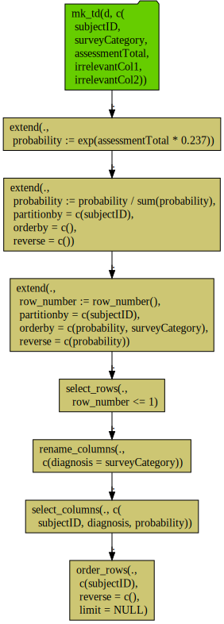

Let's work a non-trivial example: the `dplyr` pipeline from [Let’s Have Some Sympathy For The Part-time R User](http://www.win-vector.com/blog/2017/08/lets-have-some-sympathy-for-the-part-time-r-user/).

For `RSQlite` this is going to be a mess, as we do not have window functions and self-joins can be problematic in `RSQlite`.

``` r
library("rquery")
library("wrapr")

raw_connection <- DBI::dbConnect(RSQLite::SQLite(), ":memory:")
RSQLite::initExtension(raw_connection)
db <- rquery_db_info(
  connection = raw_connection,
  is_dbi = TRUE,
  connection_options = rq_connection_tests(raw_connection))
tree_rewriter <- function(x, db_info) {
  if(("pre_sql_sub_expr" %in% class(x)) && 
     (length(x$info$name) == 1) &&
     (x$info$name == "modulo")) {
    lhs <- x$toks[[3]]
    rhs <- x$toks[[5]]
    return(pre_sql_sub_expr(
      list(pre_sql_token("("),
           lhs,
           pre_sql_token("%"),
           rhs,
           pre_sql_token(")")),
      info=list(name = "user_replaced"))
    )
  }
  x
}
# attach our tree-rewriter to the databse handle.
# this handle now uses this re-writer.
db$tree_rewriter <- tree_rewriter

tmps <- mk_tmp_name_source("ex")


# copy data in so we have an example
d_local <- build_frame(
   "subjectID", "surveyCategory"     , "assessmentTotal", "irrelevantCol1", "irrelevantCol2" |
   1L         , "withdrawal behavior", 5                , "irrel1"        , "irrel2"         |
   1L         , "positive re-framing", 2                , "irrel1"        , "irrel2"         |
   2L         , "withdrawal behavior", 3                , "irrel1"        , "irrel2"         |
   2L         , "positive re-framing", 4                , "irrel1"        , "irrel2"         )
rq_copy_to(db, 'd',
            d_local,
            temporary = TRUE, 
            overwrite = TRUE)
```

    ## [1] "table(`d`; subjectID, surveyCategory, assessmentTotal, irrelevantCol1, irrelevantCol2)"

``` r
# produce a hande to existing table
d <- db_td(db, "d")
```

``` r
collector <- make_relop_list(tmps)

scale <- 0.237

# convert assessmentTotal to unscaled proabilities
dqp_ops <- d %.>%
  extend(.,
         probability :=
           exp(assessmentTotal * scale)) 
dqp_table <- add_relop(collector, dqp_ops)

# total the probabilities per-group
dqs_ops <- dqp_table %.>%
  project(., 
          tot_prob := sum(probability),
          groupby = 'subjectID') 
dqs_table <- add_relop(collector, dqs_ops)

# join total back in and scale
dqx_ops <- natural_join(dqp_table, dqs_table,
                    by = 'subjectID',
                    jointype = 'LEFT') %.>%
  extend(., 
         probability := probability/tot_prob) 
dqx_table <- add_relop(collector, dqx_ops)

# find largest per subject probability
mp_ops <- dqx_table %.>%
  project(., 
          probability := max(probability),
          groupby = 'subjectID') 
mp_table <- add_relop(collector, mp_ops)

# join in by best score and probability per subject 
# (to break ties)
# and finish the scoring as before
dq <- natural_join(mp_table, dqx_table,
                   by = c("subjectID", "probability")) %.>%
  project(., 
          probability := max(probability), # pseudo aggregator
          surveyCategory := min(surveyCategory),
          groupby = 'subjectID') %.>%
  rename_columns(., 'diagnosis' := 'surveyCategory') %.>%
  select_columns(., c('subjectID', 
                      'diagnosis', 
                      'probability')) %.>%
  orderby(., cols = 'subjectID')
result = add_relop(collector, dq)
```

We then build our result.

``` r
materialize_relop_list_stages(db, collector,
                              temporary = TRUE, overwrite = TRUE)
```

    ## [1] "table(`ex_35817741576415267707_0000000004`; subjectID, diagnosis, probability)"

And take a look.

``` r
class(result)
```

    ## [1] "relop_table_source" "relop"

``` r
result
```

    ## [1] "table(ex_35817741576415267707_0000000004; subjectID, diagnosis, probability)"

``` r
DBI::dbReadTable(db$connection, result$table_name) %.>%
  knitr::kable(.)
```

|  subjectID| diagnosis           |  probability|
|----------:|:--------------------|------------:|
|          1| withdrawal behavior |    0.6706221|
|          2| positive re-framing |    0.5589742|

We can also diagram the calculation.

``` r
c(get_relop_list_stages(collector), list(result)) %.>%
  op_diagram(., merge_tables = TRUE) %.>% 
  DiagrammeR::grViz(.) %.>%
  DiagrammeRsvg::export_svg(.) %.>%
  write(., file="RSQLite_diagram.svg")
```



Or even print the enormous SQL required to implement the calculation.

``` r
for(stage in get_relop_list_stages(collector)) {
  cat(paste0("\n-- ", stage$materialize_as, "\n"))
  cat(paste0(to_sql(stage, db), ";\n\n"))
}
```

    ## 
    ## -- ex_35817741576415267707_0000000000
    ## SELECT
    ##  `subjectID`,
    ##  `surveyCategory`,
    ##  `assessmentTotal`,
    ##  `irrelevantCol1`,
    ##  `irrelevantCol2`,
    ##  exp ( `assessmentTotal` * 0.237 )  AS `probability`
    ## FROM (
    ##  SELECT
    ##   `subjectID`,
    ##   `surveyCategory`,
    ##   `assessmentTotal`,
    ##   `irrelevantCol1`,
    ##   `irrelevantCol2`
    ##  FROM
    ##   `d`
    ##  ) tsql_89935923958488852982_0000000000
    ## ;
    ## 
    ## 
    ## -- ex_35817741576415267707_0000000001
    ## SELECT `subjectID`, sum ( `probability` ) AS `tot_prob` FROM (
    ##  SELECT
    ##   `subjectID`,
    ##   `probability`
    ##  FROM
    ##   `ex_35817741576415267707_0000000000`
    ##  ) tsql_22510624255418959285_0000000000
    ## GROUP BY
    ##  `subjectID`
    ## ;
    ## 
    ## 
    ## -- ex_35817741576415267707_0000000002
    ## SELECT
    ##  `subjectID`,
    ##  `surveyCategory`,
    ##  `assessmentTotal`,
    ##  `irrelevantCol1`,
    ##  `irrelevantCol2`,
    ##  `tot_prob`,
    ##  `probability` / `tot_prob`  AS `probability`
    ## FROM (
    ##  SELECT
    ##   COALESCE(`tsql_86811511583764084572_0000000000`.`subjectID`, `tsql_86811511583764084572_0000000001`.`subjectID`) AS `subjectID`,
    ##   `tsql_86811511583764084572_0000000000`.`surveyCategory` AS `surveyCategory`,
    ##   `tsql_86811511583764084572_0000000000`.`assessmentTotal` AS `assessmentTotal`,
    ##   `tsql_86811511583764084572_0000000000`.`irrelevantCol1` AS `irrelevantCol1`,
    ##   `tsql_86811511583764084572_0000000000`.`irrelevantCol2` AS `irrelevantCol2`,
    ##   `tsql_86811511583764084572_0000000000`.`probability` AS `probability`,
    ##   `tsql_86811511583764084572_0000000001`.`tot_prob` AS `tot_prob`
    ##  FROM (
    ##   SELECT
    ##    `subjectID`,
    ##    `surveyCategory`,
    ##    `assessmentTotal`,
    ##    `irrelevantCol1`,
    ##    `irrelevantCol2`,
    ##    `probability`
    ##   FROM
    ##    `ex_35817741576415267707_0000000000`
    ##  ) `tsql_86811511583764084572_0000000000`
    ##  LEFT JOIN (
    ##   SELECT
    ##    `subjectID`,
    ##    `tot_prob`
    ##   FROM
    ##    `ex_35817741576415267707_0000000001`
    ##  ) `tsql_86811511583764084572_0000000001`
    ##  ON
    ##   `tsql_86811511583764084572_0000000000`.`subjectID` = `tsql_86811511583764084572_0000000001`.`subjectID`
    ##  ) tsql_86811511583764084572_0000000002
    ## ;
    ## 
    ## 
    ## -- ex_35817741576415267707_0000000003
    ## SELECT `subjectID`, max ( `probability` ) AS `probability` FROM (
    ##  SELECT
    ##   `subjectID`,
    ##   `probability`
    ##  FROM
    ##   `ex_35817741576415267707_0000000002`
    ##  ) tsql_79073732857557851998_0000000000
    ## GROUP BY
    ##  `subjectID`
    ## ;
    ## 
    ## 
    ## -- ex_35817741576415267707_0000000004
    ## SELECT * FROM (
    ##  SELECT
    ##   `subjectID`,
    ##   `diagnosis`,
    ##   `probability`
    ##  FROM (
    ##   SELECT
    ##    `subjectID` AS `subjectID`,
    ##    `probability` AS `probability`,
    ##    `surveyCategory` AS `diagnosis`
    ##   FROM (
    ##    SELECT `subjectID`, max ( `probability` ) AS `probability`, min ( `surveyCategory` ) AS `surveyCategory` FROM (
    ##     SELECT
    ##      COALESCE(`tsql_22037768713765261957_0000000000`.`subjectID`, `tsql_22037768713765261957_0000000001`.`subjectID`) AS `subjectID`,
    ##      COALESCE(`tsql_22037768713765261957_0000000000`.`probability`, `tsql_22037768713765261957_0000000001`.`probability`) AS `probability`,
    ##      `tsql_22037768713765261957_0000000001`.`surveyCategory` AS `surveyCategory`
    ##     FROM (
    ##      SELECT
    ##       `subjectID`,
    ##       `probability`
    ##      FROM
    ##       `ex_35817741576415267707_0000000003`
    ##     ) `tsql_22037768713765261957_0000000000`
    ##     INNER JOIN (
    ##      SELECT
    ##       `subjectID`,
    ##       `surveyCategory`,
    ##       `probability`
    ##      FROM
    ##       `ex_35817741576415267707_0000000002`
    ##     ) `tsql_22037768713765261957_0000000001`
    ##     ON
    ##      `tsql_22037768713765261957_0000000000`.`subjectID` = `tsql_22037768713765261957_0000000001`.`subjectID` AND `tsql_22037768713765261957_0000000000`.`probability` = `tsql_22037768713765261957_0000000001`.`probability`
    ##     ) tsql_22037768713765261957_0000000002
    ##    GROUP BY
    ##     `subjectID`
    ##   ) tsql_22037768713765261957_0000000003
    ##  ) tsql_22037768713765261957_0000000004
    ## ) tsql_22037768713765261957_0000000005 ORDER BY `subjectID`
    ## ;

``` r
# clean up tmps
intermediates <- tmps(dumpList = TRUE)
for(ti in intermediates) {
  rquery::rq_remove_table(db, ti)
}

DBI::dbDisconnect(raw_connection)
rm(list = c("raw_connection", "db"))
```
