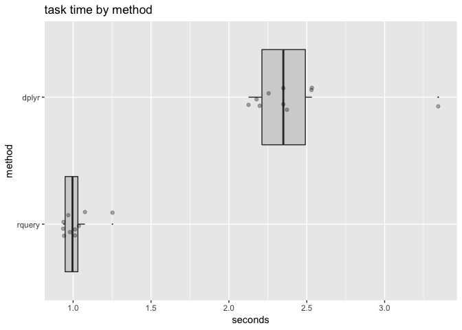

Collecting Expressions
================

An example showing the advantage of being able to collect many expressions and pack them into a single `extend_se()` node. This example may seem extreme or unnatural. However we have seen once you expose a system to enough users you see a lot more extreme use cases than you would at first expect. We have actually seen large tens of columns added to a mart in a large irregular block (so not the same transform for each columns) by building up long pipelines, so this simplified example is in fact relevant to production deployments.

First set up our packages, database connection, and remote table.

``` r
library("dplyr")
```

    ## Warning: package 'dplyr' was built under R version 3.5.1

    ## 
    ## Attaching package: 'dplyr'

    ## The following objects are masked from 'package:stats':
    ## 
    ##     filter, lag

    ## The following objects are masked from 'package:base':
    ## 
    ##     intersect, setdiff, setequal, union

``` r
library("rquery")
library("microbenchmark")
library("ggplot2")
library("WVPlots")
library("rqdatatable")
library("cdata")

use_spark <- TRUE
# connect
if(use_spark) {
  conf <- sparklyr::spark_config()
  conf$spark.yarn.am.cores <- 2
  conf$spark.executor.cores <- 2
  mem_size <- "4G"
  conf$spark.executor.memory <- mem_size
  conf$spark.yarn.am.memory <- mem_size 
  conf$`sparklyr.shell.driver-memory` <- mem_size
  conf$`sparklyr.shell.executor-memory` <- mem_size
  conf$`spark.yarn.executor.memoryOverhead` <- mem_size
  con <- sparklyr::spark_connect(version='2.2.0', 
                                 master = "local",
                                 config = conf)
} else {
  con <- DBI::dbConnect(RPostgreSQL::PostgreSQL(),
                        host = 'localhost',
                        port = 5432,
                        user = 'johnmount',
                        password = '')
}

# configure rquery connection options
dbopts <- rq_connection_tests(con)
db_hdl <- rquery_db_info(
  connection = con,
  is_dbi = TRUE,
  connection_options = dbopts)
print(db_hdl)
```

    ## [1] "rquery_db_info(DBIConnection_spark_connection_spark_shell_connection, is_dbi=TRUE, note=\"\")"

``` r
nrow <- 1000000
td <- rq_copy_to(db_hdl, 
                 "d",
                 data.frame(x = seq_len(nrow)),
                 overwrite = TRUE,
                 temporary = TRUE)

tbl <- dplyr::tbl(con, "d")

ncol <- 100
```

[`rquery`](https://CRAN.R-project.org/package=rquery) torture function: add 100 columns to a 1000000 row table.

``` r
rquery_fn <- function(db_hdl, td, ncol, return_sql = FALSE) {
  expressions <- character(0)
  for(i in seq_len(ncol)) {
    expri <- paste0("x_", i) %:=% paste0("x + ", i)
    expressions <- c(expressions, expri)
  }
  ops <- td %.>%
    extend_se(., expressions) %.>%
    select_rows_nse(., x == 3)
  if(return_sql) {
    return(to_sql(ops, db_hdl))
  }
  # force execution
  db_hdl %.>% ops
}

cat(rquery_fn(db_hdl, td, 5, return_sql = TRUE))
```

    ## SELECT * FROM (
    ##  SELECT
    ##   `x`,
    ##   `x` + 1  AS `x_1`,
    ##   `x` + 2  AS `x_2`,
    ##   `x` + 3  AS `x_3`,
    ##   `x` + 4  AS `x_4`,
    ##   `x` + 5  AS `x_5`
    ##  FROM (
    ##   SELECT
    ##    `x`
    ##   FROM
    ##    `d`
    ##   ) tsql_97238965696940256963_0000000000
    ## ) tsql_97238965696940256963_0000000001
    ## WHERE `x` = 3

``` r
rquery_fn(db_hdl, td, 5)
```

    ##   x x_1 x_2 x_3 x_4 x_5
    ## 1 3   4   5   6   7   8

The row-selection step is cut down on the in-memory cost of bringing the result back to `R`. Obviously we could optimize the example away by pivoting the filter to earlier in the example pipeline. We ask the reader to take this example as a stand-in for a more complicated (though nasty) real-world example where such optimizations are not available.

Same torture for [`dplyr`](https://CRAN.R-project.org/package=dplyr).

``` r
dplyr_fn <- function(tbl, ncol, return_sql = FALSE) {
  pipeline <- tbl
  xvar <- rlang::sym("x")
  for(i in seq_len(ncol)) {
    res_i <- rlang::sym(paste0("x_", i))
    pipeline <- pipeline %>%
      mutate(., !!res_i := !!xvar + i)
  }
  pipeline <- pipeline %>%
    filter(., x == 3)
  if(return_sql) {
    return(dbplyr::remote_query(pipeline))
  }
  # force execution
  pipeline %>% collect(.)
}

cat(dplyr_fn(tbl, 5, return_sql = TRUE))
```

    ## SELECT *
    ## FROM (SELECT `x`, `x_1`, `x_2`, `x_3`, `x_4`, `x` + 5 AS `x_5`
    ## FROM (SELECT `x`, `x_1`, `x_2`, `x_3`, `x` + 4 AS `x_4`
    ## FROM (SELECT `x`, `x_1`, `x_2`, `x` + 3 AS `x_3`
    ## FROM (SELECT `x`, `x_1`, `x` + 2 AS `x_2`
    ## FROM (SELECT `x`, `x` + 1 AS `x_1`
    ## FROM `d`) `tyiyhhxjag`) `gshhunpiup`) `teowzjcshb`) `hdrfwlzycc`) `lsniejpwft`
    ## WHERE (`x` = 3.0)

``` r
dplyr_fn(tbl, 5)
```

    ## # A tibble: 1 x 6
    ##       x   x_1   x_2   x_3   x_4   x_5
    ##   <int> <int> <int> <int> <int> <int>
    ## 1     3     4     5     6     7     8

We can also collect expressions efficiently using [`seplyr`](https://CRAN.R-project.org/package=seplyr) (`seplyr` is a thin wrapper over `dplyr`, so `seplyr`'s method [`mutate_se()`](https://winvector.github.io/seplyr/reference/mutate_se.html) is essentially instructions how to do the same thing using `rlang`).

``` r
seplyr_fn <- function(tbl, ncol, return_sql = FALSE) {
  expressions <- character(0)
  for(i in seq_len(ncol)) {
    expri <- paste0("x_", i) %:=% paste0("x + ", i)
    expressions <- c(expressions, expri)
  }
  pipeline <- tbl %>%
    seplyr::mutate_se(., expressions) %>%
    filter(., x == 3)
  if(return_sql) {
    return(dbplyr::remote_query(pipeline))
  }
  # force execution
  pipeline %>% collect(.)
}

cat(seplyr_fn(tbl, 5, return_sql = TRUE))
```

    ## SELECT *
    ## FROM (SELECT `x`, `x` + 1.0 AS `x_1`, `x` + 2.0 AS `x_2`, `x` + 3.0 AS `x_3`, `x` + 4.0 AS `x_4`, `x` + 5.0 AS `x_5`
    ## FROM `d`) `gaktzzkzxq`
    ## WHERE (`x` = 3.0)

``` r
seplyr_fn(tbl, 5)
```

    ## # A tibble: 1 x 6
    ##       x   x_1   x_2   x_3   x_4   x_5
    ##   <int> <dbl> <dbl> <dbl> <dbl> <dbl>
    ## 1     3     4     5     6     7     8

Time the functions. Timing is not going to be certain given issues such as cluster state and query caching.

``` r
timings <- microbenchmark(
  rquery = rquery_fn(db_hdl, td, ncol),
  dplyr = dplyr_fn(tbl, ncol),
  seplyr = seplyr_fn(tbl, ncol),
  times = 10L)

saveRDS(timings, "CollectExprs_timings.RDS")
```

Present the results.

``` r
print(timings)
```

    ## Unit: milliseconds
    ##    expr      min       lq     mean   median       uq      max neval
    ##  rquery  995.955 1018.481 1153.364 1065.092 1281.715 1502.717    10
    ##   dplyr 2156.264 2219.900 2899.534 2473.929 3791.673 4714.063    10
    ##  seplyr 1074.775 1180.591 1453.980 1273.424 1598.804 2398.883    10

``` r
#autoplot(timings)

timings <- as.data.frame(timings)
timings$seconds <- timings$time/10^9
timings$method <- factor(timings$expr)
timings$method <- reorder(timings$method, timings$seconds)
WVPlots::ScatterBoxPlotH(timings, "seconds", "method", "task time by method")
```



``` r
tratio <- timings %.>%
  project_nse(., 
              groupby = "method", 
              mean_seconds = mean(seconds)) %.>%
  pivot_to_rowrecs(., 
                   columnToTakeKeysFrom = "method", 
                   columnToTakeValuesFrom = "mean_seconds", 
                   rowKeyColumns = NULL) %.>%
  extend_nse(.,
             ratio = dplyr/rquery)

tratio[]
```

    ##       dplyr   rquery  seplyr    ratio
    ## 1: 2.899534 1.153364 1.45398 2.513979

``` r
ratio_str <- sprintf("%.2g", tratio$ratio)
```

`rquery` is about 2.5 times faster than `dplyr` for this task at this scale for this data implementation and configuration (we have also seen an over 8 times difference for this example on `PostgreSQL`).

``` r
if(use_spark) {
  sparklyr::spark_disconnect(con)
} else {
  DBI::dbDisconnect(con)
}
```
