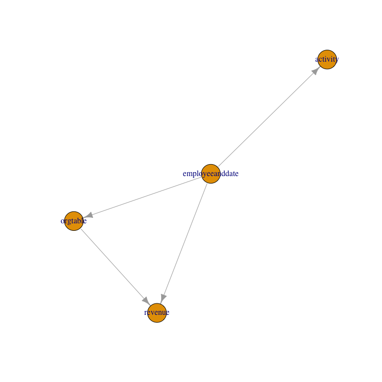
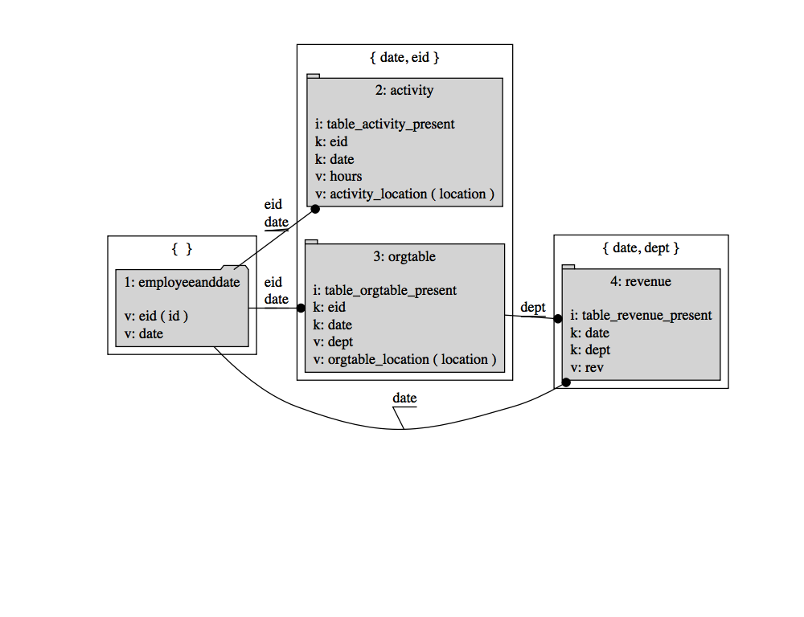
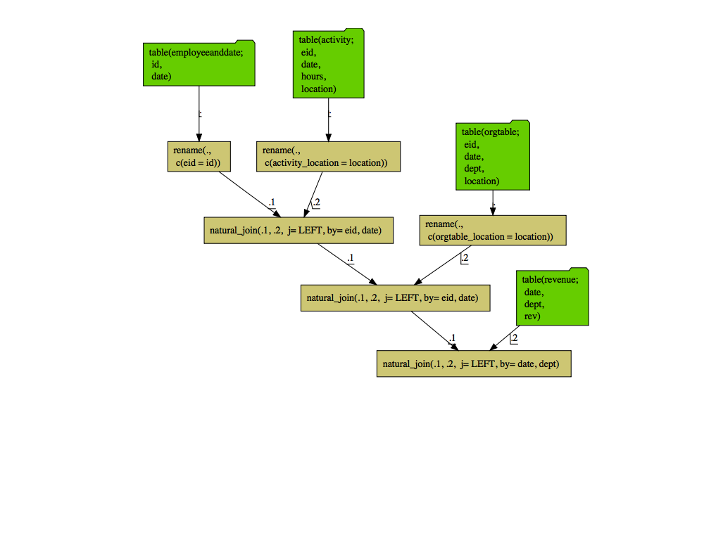

Join Dependency Sorting
================
John Mount

This note is an update of [our 2017
article](http://www.win-vector.com/blog/2017/07/join-dependency-sorting/).

Let’s discuss the task of left joining many tables from a data warehouse
using [`R`](https://www.r-project.org) and a system called “a join
controller” (last discussed
[here](https://github.com/WinVector/rquery/blob/master/extras/JoinController.md)).

One of the great advantages to specifying complicated sequences of
operations in data (rather than in code) is: it is often easier to
transform and extend data. Explicit rich data beats vague convention and
complicated code.

For example suppose we have a `DBI` `RSQLite` database handle in the
variable `raw_connection` and we are using the following names for our
tables in this database.

``` r
raw_connection <- DBI::dbConnect(RSQLite::SQLite(), ":memory:")
RSQLite::initExtension(raw_connection)
```

We can now use `rquery::describe_tables()` to get descriptions of these
tables *including* any declared primary key structure.

``` r
library("rquery")

my_db <- rquery_db_info(
  connection = raw_connection,
  is_dbi = TRUE,
  connection_options = rq_connection_tests(raw_connection))

exDesc <- rquery:::example_employee_date(my_db$connection)
tableNames <- c('employeeanddate',
                'revenue',
                'activity',
                'orgtable')

tDesc <- describe_tables(my_db, tableNames,
                         keyInspector = key_inspector_sqlite)

tDesc[, qc(tableName, columns, keys, colClass)] %.>%
  knitr::kable(.)
```

| tableName       | columns                               | keys                            | colClass                                                                           |
| :-------------- | :------------------------------------ | :------------------------------ | :--------------------------------------------------------------------------------- |
| employeeanddate | c(“id”, “date”)                       | character(0)                    | c(id = “character”, date = “integer”)                                              |
| revenue         | c(“date”, “dept”, “rev”)              | c(date = “date”, dept = “dept”) | c(date = “integer”, dept = “character”, rev = “integer”)                           |
| activity        | c(“eid”, “date”, “hours”, “location”) | c(eid = “eid”, date = “date”)   | c(eid = “character”, date = “integer”, hours = “integer”, location = “character”)  |
| orgtable        | c(“eid”, “date”, “dept”, “location”)  | c(eid = “eid”, date = “date”)   | c(eid = “character”, date = “integer”, dept = “character”, location = “character”) |

This is more legible if we turn it into a column join plan.

``` r
columnJoinPlan <- build_join_plan(tDesc, check= FALSE)
columnJoinPlan[,  qc(tableName, sourceColumn, resultColumn, isKey)] %.>%
  knitr::kable(.)
```

|           | tableName       | sourceColumn | resultColumn       | isKey |
| --------- | :-------------- | :----------- | :----------------- | :---- |
| id        | employeeanddate | id           | id                 | FALSE |
| date      | employeeanddate | date         | date               | FALSE |
| date1     | revenue         | date         | date               | TRUE  |
| dept      | revenue         | dept         | dept               | TRUE  |
| rev       | revenue         | rev          | rev                | FALSE |
| eid       | activity        | eid          | eid                | TRUE  |
| date2     | activity        | date         | date               | TRUE  |
| hours     | activity        | hours        | hours              | FALSE |
| location  | activity        | location     | activity\_location | FALSE |
| eid1      | orgtable        | eid          | eid                | TRUE  |
| date3     | orgtable        | date         | date               | TRUE  |
| dept1     | orgtable        | dept         | dept               | FALSE |
| location1 | orgtable        | location     | orgtable\_location | FALSE |

At this point we are *almost* ready to execute a left join plan on these
four tables. What we need to do is:

  - Regularize the key structure of the tables. In our example the
    analyst would have the domain knowledge that the `id` column in the
    `employeeanddate` table is an “employee id” and mean to match the
    `eid` columns in other tables.
  - Specify a left-most or controlling table for the analysis. In this
    case it is `employeeanddate` which we assume the analyst created
    through a join or cross-product of an employee list and set of
    dates. The left most table represents the experimental design or the
    exact set of row if the other tables are uniquely keyed. The left
    join outcome depends on rows and values in the left most table, and
    not on its declared key structure (that is why we do not care that
    the `employeeanddate` has no declared keys, which is common for
    derived tables).
  - Find an ordering of the rest of the tables that makes the left join
    executable or realizable (more on this later).

First let’s patch up the key structure. This could be done by exporting
the `columnJoinPlan` as a spreadsheet and editing it, but for our
example we will just alter it in place.

``` r
columnJoinPlan$resultColumn[columnJoinPlan$sourceColumn=='id'] <- 'eid'
columnJoinPlan[,  qc(tableName, sourceColumn, resultColumn, isKey)] %.>%
  knitr::kable(.)
```

|           | tableName       | sourceColumn | resultColumn       | isKey |
| --------- | :-------------- | :----------- | :----------------- | :---- |
| id        | employeeanddate | id           | eid                | FALSE |
| date      | employeeanddate | date         | date               | FALSE |
| date1     | revenue         | date         | date               | TRUE  |
| dept      | revenue         | dept         | dept               | TRUE  |
| rev       | revenue         | rev          | rev                | FALSE |
| eid       | activity        | eid          | eid                | TRUE  |
| date2     | activity        | date         | date               | TRUE  |
| hours     | activity        | hours        | hours              | FALSE |
| location  | activity        | location     | activity\_location | FALSE |
| eid1      | orgtable        | eid          | eid                | TRUE  |
| date3     | orgtable        | date         | date               | TRUE  |
| dept1     | orgtable        | dept         | dept               | FALSE |
| location1 | orgtable        | location     | orgtable\_location | FALSE |

Now we can worry about left join order.

The most important choice in a left join plan is which table is
left-most. If all the other tables are addressed by primary keys (i.e.,
there is not more than one row matching any row of the left-table) then
the left-most table completely determines the set of rows in the left
join result, no matter how many tables we are joining in. The order the
rest of the tables are joined becomes irrelevant assuming it is an order
we can execute.

What prevents a proposed left join order from being executable is trying
to join in a table that has a key that we do not yet have values for.
Let’s show this as part of our example. Suppose we know that we want the
table “`employeeanddate`” to be the left-most table in our left join
sequence (and again, this is the one important choice). We can see our
current left join plan (`columnJoinPlan`) is not executable in the order
it is currently
    specifying:

``` r
print(paste("issues:", inspect_join_plan(tDesc, columnJoinPlan)))
```

    ## [1] "issues: key col(s) ( dept ) not contained in result cols of previous table(s) for table: revenue"

This message is saying: when it comes time to join in the “`revenue`”
table rows do not yet have values for the “`dept`” key column (so we
can’t do the join in that order).

The table to table conditions are well-defined if a few invariants and
conventions are maintained in the `tDesc` table descriptions:

  - Each `resultColumn` name can occur at most once with `isKey==FALSE`.
  - `resultColumn` names with `isKey==TRUE` have the same interpretation
    in all tables (due to the ability to re-map names from
    `sourceColumn`).
  - The left-most table is treated as special in that it is “joinable”
    no matter what key constraints it does or does not declare and no
    other table can be joined before it.

Since not all orders are valid left join plans the task is to find a
re-ordering (if there is one) that is a valid left join plan. The
requirement that each table’s keys have known values before we join
gives us order relations on the tables (we know which tables must be
joined before others). Finding an ordering that obeys all the relations
is called “topological sorting” We can compute the join path
dependencies *and* re-order the join plan to be realizable as follows
(assuming the `igraph` package is available do perform the topological
sorting and plot the directed relations).

``` r
sorted <- topo_sort_tables(columnJoinPlan, 'employeeanddate')
plot(sorted$dependencyGraph)
```

<!-- -->

``` r
print(sorted$tableOrder)
```

    ## [1] "employeeanddate" "activity"        "orgtable"        "revenue"

In the above graph a table can only be joined after all of the tables
pointing to it have been joined. See that this captures that the
“`revenue`” table must be joined after the “`orgtable`” (as
“`orgtable`” is our mapping from employees to departments). We could
work on the legibility of the above graph using `igraph` controls, but I
feel that it is just as well to move on to the detailed `DiagrammeR`
based left join diagrams.

And (again assuming we have the `igraph` package), we have a new
`sorted$columnJoinPlan` that passes checks:

``` r
paste("issues:", inspect_join_plan(tDesc, 
                                   sorted$columnJoinPlan))
```

    ## [1] "issues: "

The new `sorted$columnJoinPlan` can be re-plotted (needs the suggested
packages: `DiagrammeR`, `htmlwidgets`, `webshot`, and `magick`):

``` r
sorted$columnJoinPlan %.>%
  graph_join_plan(.) %.>%
  DiagrammeR::grViz(.)
```

<!-- -->

And the new `sorted$columnJoinPlan` is ready to be executed:

``` r
optree <- actualize_join_plan(sorted$columnJoinPlan)

cat(format(optree))
```

    ## table(employeeanddate; 
    ##   id,
    ##   date) %.>%
    ##  rename(.,
    ##   c('eid' = 'id')) %.>%
    ##  natural_join(.,
    ##   table(activity; 
    ##     eid,
    ##     date,
    ##     hours,
    ##     location) %.>%
    ##    rename(.,
    ##     c('activity_location' = 'location')),
    ##   j= LEFT, by= eid, date) %.>%
    ##  natural_join(.,
    ##   table(orgtable; 
    ##     eid,
    ##     date,
    ##     dept,
    ##     location) %.>%
    ##    rename(.,
    ##     c('orgtable_location' = 'location')),
    ##   j= LEFT, by= eid, date) %.>%
    ##  natural_join(.,
    ##   table(revenue; 
    ##     date,
    ##     dept,
    ##     rev),
    ##   j= LEFT, by= date, dept)

``` r
optree %.>%
  op_diagram(., merge_tables = TRUE) %.>%
  DiagrammeR::grViz(.)
```

<!-- -->

``` r
execute(my_db, optree) %.>%
  knitr::kable(.)
```

|     date | dept | eid | hours | activity\_location | orgtable\_location |  rev |
| -------: | :--- | :-- | ----: | :----------------- | :----------------- | ---: |
| 20140501 | IT   | i4  |    50 | office             | CA                 |   NA |
| 20140601 | SL   | i4  |     3 | client             | TX                 | 2000 |

And this is how we use tools to do the heavy lifting in building a left
join plan:

  - The table descriptions can be largely built by
    `rquery::describe_tables()`.
  - The column names can be disambiguated by
    `rquery::build_join_plan()`.
  - The user can then export `columnJoinPlan` and refine the definition
    of table keys using an editor or spreadsheet software. This is key
    documentation that should be shared with other groups and kept under
    source-control.
  - `rquery::topo_sort_tables()` can then reorder `columnJoinPlan` to
    bring the tables together in a realizable order.
  - `rquery::op_diagram() %.>% DiagrammeR::grViz(.)` can then produce
    and capture a detailed diagram of the final join plan.
  - Finally `rquery::actualize_join_plan()` realizes the join plan as an
    `rquery` operation tree.

<!-- end list -->

``` r
DBI::dbDisconnect(raw_connection)
```

Related work:

  - [datamodelr](https://github.com/bergant/datamodelr)
  - [polyply](https://github.com/russHyde/polyply)
  - [dm](https://krlmlr.github.io/dm/)
