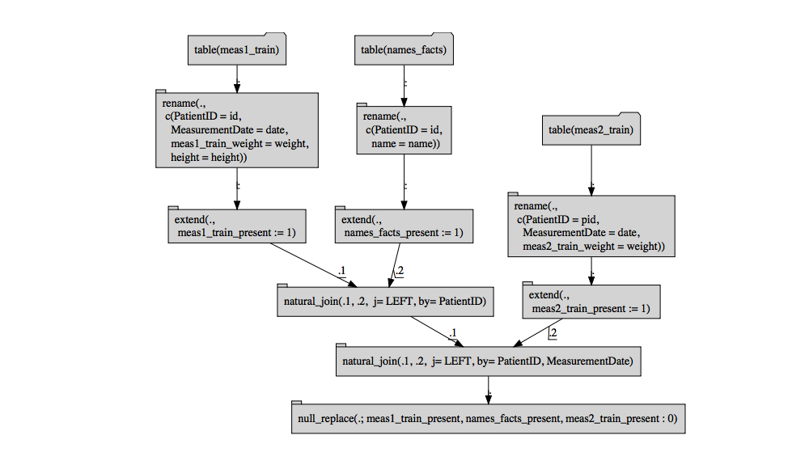

Join Controller
================
John Mount
2018-04-16

#### [`rquery`](https://github.com/WinVector/rquery) Join Controller

This note describes a useful tool we call a "join controller" (and is part of our "[R and Big Data](http://www.win-vector.com/blog/tag/r-and-big-data/)" series, please see [here](http://www.win-vector.com/blog/2017/05/new-series-r-and-big-data-concentrating-on-spark-and-sparklyr/) for the introduction, and [here](https://github.com/WinVector/BigDataRStrata2017) for one our big data courses).

When working on real world predictive modeling tasks in production, the ability to join data and document how you join data is paramount. There are very strong reasons to organize production data in something resembling one of the [Codd normal forms](https://en.wikipedia.org/wiki/Database_normalization). However, for machine learning we need a fully denormalized form (all columns populated into a single to ready to go row, no matter what their provenance, keying, or stride).

This is not an essential difficulty as in relational data systems moving between these forms can be done by joining, and data stores such as [PostgreSQL](https://www.postgresql.org) or [Apache Spark](https://spark.apache.org) are designed to provide powerful join capabilities.

However there are some inessential (in that they can be avoided) but substantial difficulties in managing and documenting long join plans. It is not uncommon to have to join 7 or more tables to get an analysis ready. This at first seems trivial, but once you add in the important tasks of narrowing tables (eliminating columns not used later) and disambiguating column names (ensuring unique names after the join) the documentation and work can become substantial. Specifying the join process directly in [`R`](https://www.r-project.org) code leads to hard to manage, hard to inspect, and hard to share spaghetti code (even when using a high-level data abstraction such as [`dplyr`](https://CRAN.R-project.org/package=dplyr)).

If you have done non-trivial work with production data you have seen this pain point.

The fix is to apply the following principles:

-   Anything long, repetitive, and tedious should not be done directly.
-   Moving specification out of code and into data is of huge benefit.
-   A common special case can be treated separately, as that documents intent.

To supply such a solution the development version of [`rquery`](https://github.com/WinVector/rquery) now supplies a item called a "join controller" under the method `rquery::executeLeftJoinPlan()`.

This is easiest to explain through a concrete example, which is what we will do here.

First let's load the needed packages.

``` r
execute_vignette <- requireNamespace("RSQLite", quietly = TRUE) &&
  requireNamespace("DiagrammeR", quietly = TRUE) 
```

``` r
# load packages
library("rquery")
```

    ## Loading required package: wrapr

``` r
packageVersion("rquery")
```

    ## [1] '0.4.3'

Now let's load some notional example data. For our example we have:

-   One primary table of measurements (called "`meas1`") keyed by `id` and `date`.
-   A fact table that maps `id`s to patient names (called "`names`", and keyed by `id`).
-   A second table of additional measurements (called "`meas2`") That we consider "nice to have." That is: rows missing from this table should not censor-out `meas1` rows, and additional rows found here should not be included in the analysis.

The data is given below:

``` r
# load notional example data
my_db <- DBI::dbConnect(RSQLite::SQLite(), ":memory:")
RSQLite::initExtension(my_db)
# example data
DBI::dbWriteTable(my_db,
                  'meas1_train',
                  data.frame(id= c(1,1,2,2),
                             date= c(1,2,1,2),
                             weight= c(200, 180, 98, 120),
                             height= c(60, 54, 12, 14)))
DBI::dbWriteTable(my_db,
                  'names_facts',
                  data.frame(id= seq_len(length(letters)),
                             name= letters,
                             stringsAsFactors=FALSE))

DBI::dbWriteTable(my_db,
                  'meas2_train',
                  data.frame(pid= c(2,3),
                             date= c(2,2),
                             weight= c(105, 110),
                             width= 1))
```

An important (and very neglected) step in data science tasks is documenting roles of tables, especially their key-structure (which we also call "stride" in the sense it describes how you move from row to row). `rquery::describe_tables()` is a function that builds an initial description of the tables.

``` r
# map from abstract names to realized names
trainTables <- c('meas1_train', 
                 'names_facts', 
                 'meas2_train')

tDesc <- describe_tables(my_db, trainTables,
                         keyInspector = key_inspector_sqlite)
```

`tDesc` is essentially a slightly enriched version of the data handle concordance described in "[Managing Spark data handles in R](http://www.win-vector.com/blog/2017/05/managing-spark-data-handles-in-r/)." We can take a quick look at the stored simplified [summaries](http://www.win-vector.com/blog/2017/05/summarizing-big-data-in-r/):

``` r
knitr::kable(tDesc)
```

| tableName    | isEmpty | indicatorColumn              | columns                             | keys         | colClass                                      |
|:-------------|:--------|:-----------------------------|:------------------------------------|:-------------|:----------------------------------------------|
| meas1\_train | FALSE   | table\_meas1\_train\_present | c("id", "date", "weight", "height") | character(0) | c("numeric", "numeric", "numeric", "numeric") |
| names\_facts | FALSE   | table\_names\_facts\_present | c("id", "name")                     | character(0) | c("integer", "character")                     |
| meas2\_train | FALSE   | table\_meas2\_train\_present | c("pid", "date", "weight", "width") | character(0) | c("numeric", "numeric", "numeric", "numeric") |

`tableDescription()` produces tables that hold the following:

-   `tableName`: the abstract name we wish to use for this table.
-   `isEmpty`: an advisory column indicating if any rows were present when we looked.
-   `indicatorColumn`: a name to indicate if the table contributed a row in later joins.
-   `columns`: the list of columns in the table.
-   `keys`: a named list mapping abstract key names to table column names. The set of keys together is supposed to uniquely identify rows.
-   `colClasses`: a vector of column classes of the underlying table.

The intent is to build a detailed join plan (describing order, column selection, and column re-naming) from the `tDesc` table. We can try this with the supplied function `buildJoinPlan()`, which in this case tells us our table descriptions are not quite ready to specify a join plan:

``` r
tryCatch(
  build_join_plan(tDesc),
  error = function(e) {e}
)
```

    ## <simpleError in build_join_plan(tDesc): rquery::build_join_plan table names_facts no keys>

In the above the `keys` column is wrong in that it claims every column of each table is a table key. The join plan builder noticed this is unsupportable in that when it comes time to join the "`names`" table not all of the columns that are claimed to be "`names`" keys are already known from previous tables. That is: the "`names$name`" column is present in the earlier tables, and so can not be joined on. We can't check everything, but the join controller tries to "front load" or encounter as many configuration inconsistencies early- before any expensive steps have been started.

The intent is: the user should edit the "`tDesc`" keys column and share it with partners for criticism. In our case we declare the primary of the measurement tables to be `PatientID` and `MeasurementDate`, and the primary key of the names table to be `PatientID`. Notice we do this by specifying named lists or vectors mapping desired key names to names actually used in the tables.

``` r
# declare keys (and give them consistent names)
tDesc$keys[[1]] <- c(PatientID= 'id', MeasurementDate= 'date')
tDesc$keys[[2]] <- c(PatientID= 'id')
tDesc$keys[[3]] <- c(PatientID= 'pid', MeasurementDate= 'date')

print(tDesc$keys)
```

    ## [[1]]
    ##       PatientID MeasurementDate 
    ##            "id"          "date" 
    ## 
    ## [[2]]
    ## PatientID 
    ##      "id" 
    ## 
    ## [[3]]
    ##       PatientID MeasurementDate 
    ##           "pid"          "date"

The above key mapping could then be circulated to partners for comments and help. Notice since this is not `R` code we can easily share it with non-`R` users for comment and corrections.

Once we are satisfied with our description of tables we can build a join plan. The join plan is an ordered sequence of left-joins.

In practice, when preparing data for predictive analytics or machine learning there is often a primary table that has exactly the set of rows you want to work over (especially when encountering production [star-schemas](https://en.wikipedia.org/wiki/Star_schema). By starting joins from this table we can perform most of our transformations using only left-joins. To keep things simple we have only supplied a join controller for this case. This is obviously not the only join pattern needed; but it is the common one.

A join plan can now be built from our table descriptions:

``` r
# build the column join plan
columnJoinPlan <- build_join_plan(tDesc)
knitr::kable(columnJoinPlan)
```

|         | tableName    | sourceColumn | sourceClass | resultColumn         | isKey | want |
|---------|:-------------|:-------------|:------------|:---------------------|:------|:-----|
| id      | meas1\_train | id           | numeric     | PatientID            | TRUE  | TRUE |
| date    | meas1\_train | date         | numeric     | MeasurementDate      | TRUE  | TRUE |
| weight  | meas1\_train | weight       | numeric     | meas1\_train\_weight | FALSE | TRUE |
| height  | meas1\_train | height       | numeric     | height               | FALSE | TRUE |
| id1     | names\_facts | id           | integer     | PatientID            | TRUE  | TRUE |
| name    | names\_facts | name         | character   | name                 | FALSE | TRUE |
| pid     | meas2\_train | pid          | numeric     | PatientID            | TRUE  | TRUE |
| date1   | meas2\_train | date         | numeric     | MeasurementDate      | TRUE  | TRUE |
| weight1 | meas2\_train | weight       | numeric     | meas2\_train\_weight | FALSE | TRUE |
| width   | meas2\_train | width        | numeric     | width                | FALSE | TRUE |

Essentially the join plan is an unnest of the columns from the table descriptions. This was anticipated in our article ["Managing Spark Data Handles"](http://www.win-vector.com/blog/2017/05/managing-spark-data-handles-in-r/).

We then alter the join plan to meet our needs (either through `R` commands or by exporting the plan to a spreadsheet and editing it there).

Only columns named in the join plan with a value of `TRUE` in the `want` column are kept in the join (columns marked `isKey` must also have `want` set to TRUE). This is very useful as systems of record often have very wide tables (with hundreds of columns) of which we only want a few columns for analysis.

For example we could decide to exclude the `width` column by either dropping the row or setting the row's `want` column to `FALSE`.

Since we have edited the join plan it is a good idea to both look at it and also run it through the `inspectDescrAndJoinPlan()` to look for potential inconsistencies.

``` r
# decide we don't want the width column
columnJoinPlan$want[columnJoinPlan$resultColumn=='width'] <- FALSE
# double check our plan
if(!is.null(inspect_join_plan(tDesc, columnJoinPlan))) {
  stop("bad join plan")
}
knitr::kable(columnJoinPlan)
```

|         | tableName    | sourceColumn | sourceClass | resultColumn         | isKey | want  |
|---------|:-------------|:-------------|:------------|:---------------------|:------|:------|
| id      | meas1\_train | id           | numeric     | PatientID            | TRUE  | TRUE  |
| date    | meas1\_train | date         | numeric     | MeasurementDate      | TRUE  | TRUE  |
| weight  | meas1\_train | weight       | numeric     | meas1\_train\_weight | FALSE | TRUE  |
| height  | meas1\_train | height       | numeric     | height               | FALSE | TRUE  |
| id1     | names\_facts | id           | integer     | PatientID            | TRUE  | TRUE  |
| name    | names\_facts | name         | character   | name                 | FALSE | TRUE  |
| pid     | meas2\_train | pid          | numeric     | PatientID            | TRUE  | TRUE  |
| date1   | meas2\_train | date         | numeric     | MeasurementDate      | TRUE  | TRUE  |
| weight1 | meas2\_train | weight       | numeric     | meas2\_train\_weight | FALSE | TRUE  |
| width   | meas2\_train | width        | numeric     | width                | FALSE | FALSE |

The join plan is the neglected (and often missing) piece of documentation key to non-trivial data science projects. We strongly suggest putting it under source control, and circulating it to project partners for comment.

As a diagram the key structure of the join plan looks like the following:

``` r
columnJoinPlan %.>%
  graph_join_plan(.) %.>%
  DiagrammeR::grViz(.)
```


Once you have a good join plan executing it easy.

``` r
optree <- actualize_join_plan(columnJoinPlan,
                              add_ind_cols = TRUE)

cat(format(optree))
```

    ## table('meas1_train') %.>%
    ##  rename(.,
    ##   c('PatientID' = 'id',
    ##     'MeasurementDate' = 'date',
    ##     'meas1_train_weight' = 'weight',
    ##     'height' = 'height')) %.>%
    ##  extend(.,
    ##   meas1_train_present := 1) %.>%
    ##  natural_join(.,
    ##   table('names_facts') %.>%
    ##    rename(.,
    ##     c('PatientID' = 'id',
    ##       'name' = 'name')) %.>%
    ##    extend(.,
    ##     names_facts_present := 1),
    ##   j= LEFT, by= PatientID) %.>%
    ##  natural_join(.,
    ##   table('meas2_train') %.>%
    ##    rename(.,
    ##     c('PatientID' = 'pid',
    ##       'MeasurementDate' = 'date',
    ##       'meas2_train_weight' = 'weight')) %.>%
    ##    extend(.,
    ##     meas2_train_present := 1),
    ##   j= LEFT, by= PatientID, MeasurementDate) %.>%
    ##  null_replace(.; meas1_train_present,
    ##   names_facts_present,
    ##   meas2_train_present: 0)

``` r
optree %.>%
  op_diagram(., merge_tables = TRUE) %.>%
  DiagrammeR::grViz(.)
```



``` r
res <- execute(my_db, optree)
str(res)
```

    ## 'data.frame':    4 obs. of  9 variables:
    ##  $ height             : num  60 54 12 14
    ##  $ meas1_train_present: int  1 1 1 1
    ##  $ meas1_train_weight : num  200 180 98 120
    ##  $ meas2_train_present: int  0 0 0 1
    ##  $ meas2_train_weight : num  NA NA NA 105
    ##  $ MeasurementDate    : num  1 2 1 2
    ##  $ name               : chr  "a" "a" "b" "b"
    ##  $ names_facts_present: int  1 1 1 1
    ##  $ PatientID          : num  1 1 2 2

A good workflow is:

-   Build simple procedures to build up `tDesc`.
-   Work hard to get a good `columnJoinPlan`.
-   Save `columnJoinPlan` in source control and re-load it (not re-build it) when you need it.
-   Re-build new `tDesc` compatible with the saved `columnJoinPlan` later when you need to work with tables (note only the columns `tableName` and `handle` are used during join execution, so you only need to create those).

Having to "join a bunch of tables to get the data into simple rows" is a common step in data science. Therefore you do not want this to be a difficult and undocumented task. By using a join controller you essentially make the documentation the executable specification for the task.

``` r
# cleanup
DBI::dbDisconnect(my_db)
```
