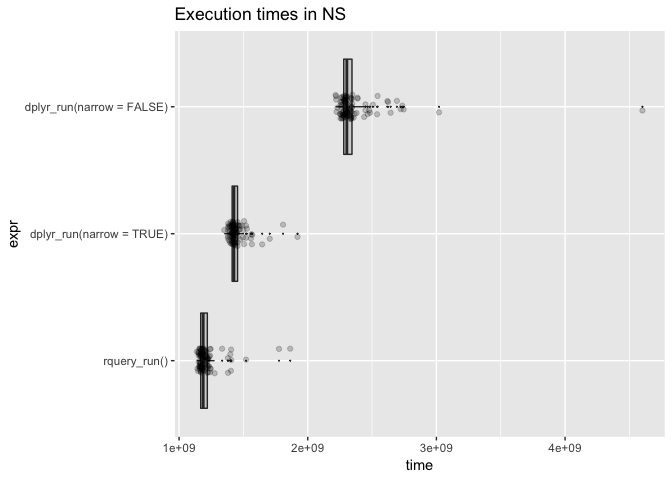

NarrowEffect
================
Win-Vector LLC
12/18/2017

<!-- NarrowEffect.md is generated from NarrowEffect.Rmd. Please edit that file -->
For some time we have been teaching [`R`](https://journal.r-project.org) users "when working with wide tables on Spark or on databases: narrow to the columns you really want to work with early in your analysis."

This issue arises because wide tables (200 to 1000 columns) are quite common in big-data analytics projects. Often these are "denormalized marts" that are used to drive many different projects. For any one project only a small subset of the columns may be relevant in a calculation.

The idea behind the advice is: working with fewer columns makes for quicker queries.

Let's set up our experiment. The data is a larger version of the problem from ["Let’s Have Some Sympathy For The Part-time R User"](http://www.win-vector.com/blog/2017/08/lets-have-some-sympathy-for-the-part-time-r-user/). We have expanded the number of subjects to 50000 and added 500 irrelevant columns to the example. We define a new function that uses `dplyr` and `Sparklyr` to compute the diagnoses. We vary if the table is first limited to columns of interest and if the results are brought back to `R`.

``` r
print(my_db)
```

    ## <PostgreSQLConnection>

``` r
scale <- 0.237
```

``` r
dT %>%
  select(subjectID, surveyCategory, assessmentTotal) %>%
  group_by(subjectID) %>%
  mutate(probability =
           exp(assessmentTotal * scale)/
           sum(exp(assessmentTotal * scale), na.rm = TRUE)) %>%
  arrange(probability, surveyCategory) %>%
  filter(row_number() == n()) %>%
  ungroup() %>%
  rename(diagnosis = surveyCategory) %>%
  select(subjectID, diagnosis, probability) %>%
  arrange(subjectID) %>%
  dbplyr::remote_query(.) %>%
  cat
```

    ## SELECT "subjectID", "diagnosis", "probability"
    ## FROM (SELECT "subjectID", "surveyCategory" AS "diagnosis", "assessmentTotal", "probability"
    ## FROM (SELECT "subjectID", "surveyCategory", "assessmentTotal", "probability"
    ## FROM (SELECT "subjectID", "surveyCategory", "assessmentTotal", "probability", row_number() OVER (PARTITION BY "subjectID" ORDER BY "probability", "surveyCategory") AS "zzz2", COUNT(*) OVER (PARTITION BY "subjectID") AS "zzz3"
    ## FROM (SELECT *
    ## FROM (SELECT "subjectID", "surveyCategory", "assessmentTotal", EXP("assessmentTotal" * 0.237) / sum(EXP("assessmentTotal" * 0.237)) OVER (PARTITION BY "subjectID") AS "probability"
    ## FROM (SELECT "subjectID", "surveyCategory", "assessmentTotal"
    ## FROM "d") "ivjkkogfxm") "zxztyurrmn"
    ## ORDER BY "probability", "surveyCategory") "wdvtuqjwpo") "yaapqffykk"
    ## WHERE ("zzz2" = "zzz3")) "xluagtitke") "wdkthdwnvy"
    ## ORDER BY "subjectID"

``` r
dT %>%
  group_by(subjectID) %>%
  mutate(probability =
           exp(assessmentTotal * scale)/
           sum(exp(assessmentTotal * scale), na.rm = TRUE)) %>%
  arrange(probability, surveyCategory) %>%
  filter(row_number() == n()) %>%
  ungroup() %>%
  rename(diagnosis = surveyCategory) %>%
  select(subjectID, diagnosis, probability) %>%
  arrange(subjectID) %>%
  dbplyr::remote_query(.) %>%
  cat
```

    ## SELECT "subjectID", "diagnosis", "probability"
    ## FROM (SELECT "subjectID", "surveyCategory" AS "diagnosis", "assessmentTotal", "irrelevantCol_0000001", "irrelevantCol_0000002", "irrelevantCol_0000003", "irrelevantCol_0000004", "irrelevantCol_0000005", "irrelevantCol_0000006", "irrelevantCol_0000007", "irrelevantCol_0000008", "irrelevantCol_0000009", "irrelevantCol_0000010", "irrelevantCol_0000011", "irrelevantCol_0000012", "irrelevantCol_0000013", "irrelevantCol_0000014", "irrelevantCol_0000015", "irrelevantCol_0000016", "irrelevantCol_0000017", "irrelevantCol_0000018", "irrelevantCol_0000019", "irrelevantCol_0000020", "irrelevantCol_0000021", "irrelevantCol_0000022", "irrelevantCol_0000023", "irrelevantCol_0000024", "irrelevantCol_0000025", "irrelevantCol_0000026", "irrelevantCol_0000027", "irrelevantCol_0000028", "irrelevantCol_0000029", "irrelevantCol_0000030", "irrelevantCol_0000031", "irrelevantCol_0000032", "irrelevantCol_0000033", "irrelevantCol_0000034", "irrelevantCol_0000035", "irrelevantCol_0000036", "irrelevantCol_0000037", "irrelevantCol_0000038", "irrelevantCol_0000039", "irrelevantCol_0000040", "irrelevantCol_0000041", "irrelevantCol_0000042", "irrelevantCol_0000043", "irrelevantCol_0000044", "irrelevantCol_0000045", "irrelevantCol_0000046", "irrelevantCol_0000047", "irrelevantCol_0000048", "irrelevantCol_0000049", "irrelevantCol_0000050", "irrelevantCol_0000051", "irrelevantCol_0000052", "irrelevantCol_0000053", "irrelevantCol_0000054", "irrelevantCol_0000055", "irrelevantCol_0000056", "irrelevantCol_0000057", "irrelevantCol_0000058", "irrelevantCol_0000059", "irrelevantCol_0000060", "irrelevantCol_0000061", "irrelevantCol_0000062", "irrelevantCol_0000063", "irrelevantCol_0000064", "irrelevantCol_0000065", "irrelevantCol_0000066", "irrelevantCol_0000067", "irrelevantCol_0000068", "irrelevantCol_0000069", "irrelevantCol_0000070", "irrelevantCol_0000071", "irrelevantCol_0000072", "irrelevantCol_0000073", "irrelevantCol_0000074", "irrelevantCol_0000075", "irrelevantCol_0000076", "irrelevantCol_0000077", "irrelevantCol_0000078", "irrelevantCol_0000079", "irrelevantCol_0000080", "irrelevantCol_0000081", "irrelevantCol_0000082", "irrelevantCol_0000083", "irrelevantCol_0000084", "irrelevantCol_0000085", "irrelevantCol_0000086", "irrelevantCol_0000087", "irrelevantCol_0000088", "irrelevantCol_0000089", "irrelevantCol_0000090", "irrelevantCol_0000091", "irrelevantCol_0000092", "irrelevantCol_0000093", "irrelevantCol_0000094", "irrelevantCol_0000095", "irrelevantCol_0000096", "irrelevantCol_0000097", "irrelevantCol_0000098", "irrelevantCol_0000099", "irrelevantCol_0000100", "irrelevantCol_0000101", "irrelevantCol_0000102", "irrelevantCol_0000103", "irrelevantCol_0000104", "irrelevantCol_0000105", "irrelevantCol_0000106", "irrelevantCol_0000107", "irrelevantCol_0000108", "irrelevantCol_0000109", "irrelevantCol_0000110", "irrelevantCol_0000111", "irrelevantCol_0000112", "irrelevantCol_0000113", "irrelevantCol_0000114", "irrelevantCol_0000115", "irrelevantCol_0000116", "irrelevantCol_0000117", "irrelevantCol_0000118", "irrelevantCol_0000119", "irrelevantCol_0000120", "irrelevantCol_0000121", "irrelevantCol_0000122", "irrelevantCol_0000123", "irrelevantCol_0000124", "irrelevantCol_0000125", "irrelevantCol_0000126", "irrelevantCol_0000127", "irrelevantCol_0000128", "irrelevantCol_0000129", "irrelevantCol_0000130", "irrelevantCol_0000131", "irrelevantCol_0000132", "irrelevantCol_0000133", "irrelevantCol_0000134", "irrelevantCol_0000135", "irrelevantCol_0000136", "irrelevantCol_0000137", "irrelevantCol_0000138", "irrelevantCol_0000139", "irrelevantCol_0000140", "irrelevantCol_0000141", "irrelevantCol_0000142", "irrelevantCol_0000143", "irrelevantCol_0000144", "irrelevantCol_0000145", "irrelevantCol_0000146", "irrelevantCol_0000147", "irrelevantCol_0000148", "irrelevantCol_0000149", "irrelevantCol_0000150", "irrelevantCol_0000151", "irrelevantCol_0000152", "irrelevantCol_0000153", "irrelevantCol_0000154", "irrelevantCol_0000155", "irrelevantCol_0000156", "irrelevantCol_0000157", "irrelevantCol_0000158", "irrelevantCol_0000159", "irrelevantCol_0000160", "irrelevantCol_0000161", "irrelevantCol_0000162", "irrelevantCol_0000163", "irrelevantCol_0000164", "irrelevantCol_0000165", "irrelevantCol_0000166", "irrelevantCol_0000167", "irrelevantCol_0000168", "irrelevantCol_0000169", "irrelevantCol_0000170", "irrelevantCol_0000171", "irrelevantCol_0000172", "irrelevantCol_0000173", "irrelevantCol_0000174", "irrelevantCol_0000175", "irrelevantCol_0000176", "irrelevantCol_0000177", "irrelevantCol_0000178", "irrelevantCol_0000179", "irrelevantCol_0000180", "irrelevantCol_0000181", "irrelevantCol_0000182", "irrelevantCol_0000183", "irrelevantCol_0000184", "irrelevantCol_0000185", "irrelevantCol_0000186", "irrelevantCol_0000187", "irrelevantCol_0000188", "irrelevantCol_0000189", "irrelevantCol_0000190", "irrelevantCol_0000191", "irrelevantCol_0000192", "irrelevantCol_0000193", "irrelevantCol_0000194", "irrelevantCol_0000195", "irrelevantCol_0000196", "irrelevantCol_0000197", "irrelevantCol_0000198", "irrelevantCol_0000199", "irrelevantCol_0000200", "irrelevantCol_0000201", "irrelevantCol_0000202", "irrelevantCol_0000203", "irrelevantCol_0000204", "irrelevantCol_0000205", "irrelevantCol_0000206", "irrelevantCol_0000207", "irrelevantCol_0000208", "irrelevantCol_0000209", "irrelevantCol_0000210", "irrelevantCol_0000211", "irrelevantCol_0000212", "irrelevantCol_0000213", "irrelevantCol_0000214", "irrelevantCol_0000215", "irrelevantCol_0000216", "irrelevantCol_0000217", "irrelevantCol_0000218", "irrelevantCol_0000219", "irrelevantCol_0000220", "irrelevantCol_0000221", "irrelevantCol_0000222", "irrelevantCol_0000223", "irrelevantCol_0000224", "irrelevantCol_0000225", "irrelevantCol_0000226", "irrelevantCol_0000227", "irrelevantCol_0000228", "irrelevantCol_0000229", "irrelevantCol_0000230", "irrelevantCol_0000231", "irrelevantCol_0000232", "irrelevantCol_0000233", "irrelevantCol_0000234", "irrelevantCol_0000235", "irrelevantCol_0000236", "irrelevantCol_0000237", "irrelevantCol_0000238", "irrelevantCol_0000239", "irrelevantCol_0000240", "irrelevantCol_0000241", "irrelevantCol_0000242", "irrelevantCol_0000243", "irrelevantCol_0000244", "irrelevantCol_0000245", "irrelevantCol_0000246", "irrelevantCol_0000247", "irrelevantCol_0000248", "irrelevantCol_0000249", "irrelevantCol_0000250", "irrelevantCol_0000251", "irrelevantCol_0000252", "irrelevantCol_0000253", "irrelevantCol_0000254", "irrelevantCol_0000255", "irrelevantCol_0000256", "irrelevantCol_0000257", "irrelevantCol_0000258", "irrelevantCol_0000259", "irrelevantCol_0000260", "irrelevantCol_0000261", "irrelevantCol_0000262", "irrelevantCol_0000263", "irrelevantCol_0000264", "irrelevantCol_0000265", "irrelevantCol_0000266", "irrelevantCol_0000267", "irrelevantCol_0000268", "irrelevantCol_0000269", "irrelevantCol_0000270", "irrelevantCol_0000271", "irrelevantCol_0000272", "irrelevantCol_0000273", "irrelevantCol_0000274", "irrelevantCol_0000275", "irrelevantCol_0000276", "irrelevantCol_0000277", "irrelevantCol_0000278", "irrelevantCol_0000279", "irrelevantCol_0000280", "irrelevantCol_0000281", "irrelevantCol_0000282", "irrelevantCol_0000283", "irrelevantCol_0000284", "irrelevantCol_0000285", "irrelevantCol_0000286", "irrelevantCol_0000287", "irrelevantCol_0000288", "irrelevantCol_0000289", "irrelevantCol_0000290", "irrelevantCol_0000291", "irrelevantCol_0000292", "irrelevantCol_0000293", "irrelevantCol_0000294", "irrelevantCol_0000295", "irrelevantCol_0000296", "irrelevantCol_0000297", "irrelevantCol_0000298", "irrelevantCol_0000299", "irrelevantCol_0000300", "irrelevantCol_0000301", "irrelevantCol_0000302", "irrelevantCol_0000303", "irrelevantCol_0000304", "irrelevantCol_0000305", "irrelevantCol_0000306", "irrelevantCol_0000307", "irrelevantCol_0000308", "irrelevantCol_0000309", "irrelevantCol_0000310", "irrelevantCol_0000311", "irrelevantCol_0000312", "irrelevantCol_0000313", "irrelevantCol_0000314", "irrelevantCol_0000315", "irrelevantCol_0000316", "irrelevantCol_0000317", "irrelevantCol_0000318", "irrelevantCol_0000319", "irrelevantCol_0000320", "irrelevantCol_0000321", "irrelevantCol_0000322", "irrelevantCol_0000323", "irrelevantCol_0000324", "irrelevantCol_0000325", "irrelevantCol_0000326", "irrelevantCol_0000327", "irrelevantCol_0000328", "irrelevantCol_0000329", "irrelevantCol_0000330", "irrelevantCol_0000331", "irrelevantCol_0000332", "irrelevantCol_0000333", "irrelevantCol_0000334", "irrelevantCol_0000335", "irrelevantCol_0000336", "irrelevantCol_0000337", "irrelevantCol_0000338", "irrelevantCol_0000339", "irrelevantCol_0000340", "irrelevantCol_0000341", "irrelevantCol_0000342", "irrelevantCol_0000343", "irrelevantCol_0000344", "irrelevantCol_0000345", "irrelevantCol_0000346", "irrelevantCol_0000347", "irrelevantCol_0000348", "irrelevantCol_0000349", "irrelevantCol_0000350", "irrelevantCol_0000351", "irrelevantCol_0000352", "irrelevantCol_0000353", "irrelevantCol_0000354", "irrelevantCol_0000355", "irrelevantCol_0000356", "irrelevantCol_0000357", "irrelevantCol_0000358", "irrelevantCol_0000359", "irrelevantCol_0000360", "irrelevantCol_0000361", "irrelevantCol_0000362", "irrelevantCol_0000363", "irrelevantCol_0000364", "irrelevantCol_0000365", "irrelevantCol_0000366", "irrelevantCol_0000367", "irrelevantCol_0000368", "irrelevantCol_0000369", "irrelevantCol_0000370", "irrelevantCol_0000371", "irrelevantCol_0000372", "irrelevantCol_0000373", "irrelevantCol_0000374", "irrelevantCol_0000375", "irrelevantCol_0000376", "irrelevantCol_0000377", "irrelevantCol_0000378", "irrelevantCol_0000379", "irrelevantCol_0000380", "irrelevantCol_0000381", "irrelevantCol_0000382", "irrelevantCol_0000383", "irrelevantCol_0000384", "irrelevantCol_0000385", "irrelevantCol_0000386", "irrelevantCol_0000387", "irrelevantCol_0000388", "irrelevantCol_0000389", "irrelevantCol_0000390", "irrelevantCol_0000391", "irrelevantCol_0000392", "irrelevantCol_0000393", "irrelevantCol_0000394", "irrelevantCol_0000395", "irrelevantCol_0000396", "irrelevantCol_0000397", "irrelevantCol_0000398", "irrelevantCol_0000399", "irrelevantCol_0000400", "irrelevantCol_0000401", "irrelevantCol_0000402", "irrelevantCol_0000403", "irrelevantCol_0000404", "irrelevantCol_0000405", "irrelevantCol_0000406", "irrelevantCol_0000407", "irrelevantCol_0000408", "irrelevantCol_0000409", "irrelevantCol_0000410", "irrelevantCol_0000411", "irrelevantCol_0000412", "irrelevantCol_0000413", "irrelevantCol_0000414", "irrelevantCol_0000415", "irrelevantCol_0000416", "irrelevantCol_0000417", "irrelevantCol_0000418", "irrelevantCol_0000419", "irrelevantCol_0000420", "irrelevantCol_0000421", "irrelevantCol_0000422", "irrelevantCol_0000423", "irrelevantCol_0000424", "irrelevantCol_0000425", "irrelevantCol_0000426", "irrelevantCol_0000427", "irrelevantCol_0000428", "irrelevantCol_0000429", "irrelevantCol_0000430", "irrelevantCol_0000431", "irrelevantCol_0000432", "irrelevantCol_0000433", "irrelevantCol_0000434", "irrelevantCol_0000435", "irrelevantCol_0000436", "irrelevantCol_0000437", "irrelevantCol_0000438", "irrelevantCol_0000439", "irrelevantCol_0000440", "irrelevantCol_0000441", "irrelevantCol_0000442", "irrelevantCol_0000443", "irrelevantCol_0000444", "irrelevantCol_0000445", "irrelevantCol_0000446", "irrelevantCol_0000447", "irrelevantCol_0000448", "irrelevantCol_0000449", "irrelevantCol_0000450", "irrelevantCol_0000451", "irrelevantCol_0000452", "irrelevantCol_0000453", "irrelevantCol_0000454", "irrelevantCol_0000455", "irrelevantCol_0000456", "irrelevantCol_0000457", "irrelevantCol_0000458", "irrelevantCol_0000459", "irrelevantCol_0000460", "irrelevantCol_0000461", "irrelevantCol_0000462", "irrelevantCol_0000463", "irrelevantCol_0000464", "irrelevantCol_0000465", "irrelevantCol_0000466", "irrelevantCol_0000467", "irrelevantCol_0000468", "irrelevantCol_0000469", "irrelevantCol_0000470", "irrelevantCol_0000471", "irrelevantCol_0000472", "irrelevantCol_0000473", "irrelevantCol_0000474", "irrelevantCol_0000475", "irrelevantCol_0000476", "irrelevantCol_0000477", "irrelevantCol_0000478", "irrelevantCol_0000479", "irrelevantCol_0000480", "irrelevantCol_0000481", "irrelevantCol_0000482", "irrelevantCol_0000483", "irrelevantCol_0000484", "irrelevantCol_0000485", "irrelevantCol_0000486", "irrelevantCol_0000487", "irrelevantCol_0000488", "irrelevantCol_0000489", "irrelevantCol_0000490", "irrelevantCol_0000491", "irrelevantCol_0000492", "irrelevantCol_0000493", "irrelevantCol_0000494", "irrelevantCol_0000495", "irrelevantCol_0000496", "irrelevantCol_0000497", "irrelevantCol_0000498", "irrelevantCol_0000499", "irrelevantCol_0000500", "probability"
    ## FROM (SELECT "subjectID", "surveyCategory", "assessmentTotal", "irrelevantCol_0000001", "irrelevantCol_0000002", "irrelevantCol_0000003", "irrelevantCol_0000004", "irrelevantCol_0000005", "irrelevantCol_0000006", "irrelevantCol_0000007", "irrelevantCol_0000008", "irrelevantCol_0000009", "irrelevantCol_0000010", "irrelevantCol_0000011", "irrelevantCol_0000012", "irrelevantCol_0000013", "irrelevantCol_0000014", "irrelevantCol_0000015", "irrelevantCol_0000016", "irrelevantCol_0000017", "irrelevantCol_0000018", "irrelevantCol_0000019", "irrelevantCol_0000020", "irrelevantCol_0000021", "irrelevantCol_0000022", "irrelevantCol_0000023", "irrelevantCol_0000024", "irrelevantCol_0000025", "irrelevantCol_0000026", "irrelevantCol_0000027", "irrelevantCol_0000028", "irrelevantCol_0000029", "irrelevantCol_0000030", "irrelevantCol_0000031", "irrelevantCol_0000032", "irrelevantCol_0000033", "irrelevantCol_0000034", "irrelevantCol_0000035", "irrelevantCol_0000036", "irrelevantCol_0000037", "irrelevantCol_0000038", "irrelevantCol_0000039", "irrelevantCol_0000040", "irrelevantCol_0000041", "irrelevantCol_0000042", "irrelevantCol_0000043", "irrelevantCol_0000044", "irrelevantCol_0000045", "irrelevantCol_0000046", "irrelevantCol_0000047", "irrelevantCol_0000048", "irrelevantCol_0000049", "irrelevantCol_0000050", "irrelevantCol_0000051", "irrelevantCol_0000052", "irrelevantCol_0000053", "irrelevantCol_0000054", "irrelevantCol_0000055", "irrelevantCol_0000056", "irrelevantCol_0000057", "irrelevantCol_0000058", "irrelevantCol_0000059", "irrelevantCol_0000060", "irrelevantCol_0000061", "irrelevantCol_0000062", "irrelevantCol_0000063", "irrelevantCol_0000064", "irrelevantCol_0000065", "irrelevantCol_0000066", "irrelevantCol_0000067", "irrelevantCol_0000068", "irrelevantCol_0000069", "irrelevantCol_0000070", "irrelevantCol_0000071", "irrelevantCol_0000072", "irrelevantCol_0000073", "irrelevantCol_0000074", "irrelevantCol_0000075", "irrelevantCol_0000076", "irrelevantCol_0000077", "irrelevantCol_0000078", "irrelevantCol_0000079", "irrelevantCol_0000080", "irrelevantCol_0000081", "irrelevantCol_0000082", "irrelevantCol_0000083", "irrelevantCol_0000084", "irrelevantCol_0000085", "irrelevantCol_0000086", "irrelevantCol_0000087", "irrelevantCol_0000088", "irrelevantCol_0000089", "irrelevantCol_0000090", "irrelevantCol_0000091", "irrelevantCol_0000092", "irrelevantCol_0000093", "irrelevantCol_0000094", "irrelevantCol_0000095", "irrelevantCol_0000096", "irrelevantCol_0000097", "irrelevantCol_0000098", "irrelevantCol_0000099", "irrelevantCol_0000100", "irrelevantCol_0000101", "irrelevantCol_0000102", "irrelevantCol_0000103", "irrelevantCol_0000104", "irrelevantCol_0000105", "irrelevantCol_0000106", "irrelevantCol_0000107", "irrelevantCol_0000108", "irrelevantCol_0000109", "irrelevantCol_0000110", "irrelevantCol_0000111", "irrelevantCol_0000112", "irrelevantCol_0000113", "irrelevantCol_0000114", "irrelevantCol_0000115", "irrelevantCol_0000116", "irrelevantCol_0000117", "irrelevantCol_0000118", "irrelevantCol_0000119", "irrelevantCol_0000120", "irrelevantCol_0000121", "irrelevantCol_0000122", "irrelevantCol_0000123", "irrelevantCol_0000124", "irrelevantCol_0000125", "irrelevantCol_0000126", "irrelevantCol_0000127", "irrelevantCol_0000128", "irrelevantCol_0000129", "irrelevantCol_0000130", "irrelevantCol_0000131", "irrelevantCol_0000132", "irrelevantCol_0000133", "irrelevantCol_0000134", "irrelevantCol_0000135", "irrelevantCol_0000136", "irrelevantCol_0000137", "irrelevantCol_0000138", "irrelevantCol_0000139", "irrelevantCol_0000140", "irrelevantCol_0000141", "irrelevantCol_0000142", "irrelevantCol_0000143", "irrelevantCol_0000144", "irrelevantCol_0000145", "irrelevantCol_0000146", "irrelevantCol_0000147", "irrelevantCol_0000148", "irrelevantCol_0000149", "irrelevantCol_0000150", "irrelevantCol_0000151", "irrelevantCol_0000152", "irrelevantCol_0000153", "irrelevantCol_0000154", "irrelevantCol_0000155", "irrelevantCol_0000156", "irrelevantCol_0000157", "irrelevantCol_0000158", "irrelevantCol_0000159", "irrelevantCol_0000160", "irrelevantCol_0000161", "irrelevantCol_0000162", "irrelevantCol_0000163", "irrelevantCol_0000164", "irrelevantCol_0000165", "irrelevantCol_0000166", "irrelevantCol_0000167", "irrelevantCol_0000168", "irrelevantCol_0000169", "irrelevantCol_0000170", "irrelevantCol_0000171", "irrelevantCol_0000172", "irrelevantCol_0000173", "irrelevantCol_0000174", "irrelevantCol_0000175", "irrelevantCol_0000176", "irrelevantCol_0000177", "irrelevantCol_0000178", "irrelevantCol_0000179", "irrelevantCol_0000180", "irrelevantCol_0000181", "irrelevantCol_0000182", "irrelevantCol_0000183", "irrelevantCol_0000184", "irrelevantCol_0000185", "irrelevantCol_0000186", "irrelevantCol_0000187", "irrelevantCol_0000188", "irrelevantCol_0000189", "irrelevantCol_0000190", "irrelevantCol_0000191", "irrelevantCol_0000192", "irrelevantCol_0000193", "irrelevantCol_0000194", "irrelevantCol_0000195", "irrelevantCol_0000196", "irrelevantCol_0000197", "irrelevantCol_0000198", "irrelevantCol_0000199", "irrelevantCol_0000200", "irrelevantCol_0000201", "irrelevantCol_0000202", "irrelevantCol_0000203", "irrelevantCol_0000204", "irrelevantCol_0000205", "irrelevantCol_0000206", "irrelevantCol_0000207", "irrelevantCol_0000208", "irrelevantCol_0000209", "irrelevantCol_0000210", "irrelevantCol_0000211", "irrelevantCol_0000212", "irrelevantCol_0000213", "irrelevantCol_0000214", "irrelevantCol_0000215", "irrelevantCol_0000216", "irrelevantCol_0000217", "irrelevantCol_0000218", "irrelevantCol_0000219", "irrelevantCol_0000220", "irrelevantCol_0000221", "irrelevantCol_0000222", "irrelevantCol_0000223", "irrelevantCol_0000224", "irrelevantCol_0000225", "irrelevantCol_0000226", "irrelevantCol_0000227", "irrelevantCol_0000228", "irrelevantCol_0000229", "irrelevantCol_0000230", "irrelevantCol_0000231", "irrelevantCol_0000232", "irrelevantCol_0000233", "irrelevantCol_0000234", "irrelevantCol_0000235", "irrelevantCol_0000236", "irrelevantCol_0000237", "irrelevantCol_0000238", "irrelevantCol_0000239", "irrelevantCol_0000240", "irrelevantCol_0000241", "irrelevantCol_0000242", "irrelevantCol_0000243", "irrelevantCol_0000244", "irrelevantCol_0000245", "irrelevantCol_0000246", "irrelevantCol_0000247", "irrelevantCol_0000248", "irrelevantCol_0000249", "irrelevantCol_0000250", "irrelevantCol_0000251", "irrelevantCol_0000252", "irrelevantCol_0000253", "irrelevantCol_0000254", "irrelevantCol_0000255", "irrelevantCol_0000256", "irrelevantCol_0000257", "irrelevantCol_0000258", "irrelevantCol_0000259", "irrelevantCol_0000260", "irrelevantCol_0000261", "irrelevantCol_0000262", "irrelevantCol_0000263", "irrelevantCol_0000264", "irrelevantCol_0000265", "irrelevantCol_0000266", "irrelevantCol_0000267", "irrelevantCol_0000268", "irrelevantCol_0000269", "irrelevantCol_0000270", "irrelevantCol_0000271", "irrelevantCol_0000272", "irrelevantCol_0000273", "irrelevantCol_0000274", "irrelevantCol_0000275", "irrelevantCol_0000276", "irrelevantCol_0000277", "irrelevantCol_0000278", "irrelevantCol_0000279", "irrelevantCol_0000280", "irrelevantCol_0000281", "irrelevantCol_0000282", "irrelevantCol_0000283", "irrelevantCol_0000284", "irrelevantCol_0000285", "irrelevantCol_0000286", "irrelevantCol_0000287", "irrelevantCol_0000288", "irrelevantCol_0000289", "irrelevantCol_0000290", "irrelevantCol_0000291", "irrelevantCol_0000292", "irrelevantCol_0000293", "irrelevantCol_0000294", "irrelevantCol_0000295", "irrelevantCol_0000296", "irrelevantCol_0000297", "irrelevantCol_0000298", "irrelevantCol_0000299", "irrelevantCol_0000300", "irrelevantCol_0000301", "irrelevantCol_0000302", "irrelevantCol_0000303", "irrelevantCol_0000304", "irrelevantCol_0000305", "irrelevantCol_0000306", "irrelevantCol_0000307", "irrelevantCol_0000308", "irrelevantCol_0000309", "irrelevantCol_0000310", "irrelevantCol_0000311", "irrelevantCol_0000312", "irrelevantCol_0000313", "irrelevantCol_0000314", "irrelevantCol_0000315", "irrelevantCol_0000316", "irrelevantCol_0000317", "irrelevantCol_0000318", "irrelevantCol_0000319", "irrelevantCol_0000320", "irrelevantCol_0000321", "irrelevantCol_0000322", "irrelevantCol_0000323", "irrelevantCol_0000324", "irrelevantCol_0000325", "irrelevantCol_0000326", "irrelevantCol_0000327", "irrelevantCol_0000328", "irrelevantCol_0000329", "irrelevantCol_0000330", "irrelevantCol_0000331", "irrelevantCol_0000332", "irrelevantCol_0000333", "irrelevantCol_0000334", "irrelevantCol_0000335", "irrelevantCol_0000336", "irrelevantCol_0000337", "irrelevantCol_0000338", "irrelevantCol_0000339", "irrelevantCol_0000340", "irrelevantCol_0000341", "irrelevantCol_0000342", "irrelevantCol_0000343", "irrelevantCol_0000344", "irrelevantCol_0000345", "irrelevantCol_0000346", "irrelevantCol_0000347", "irrelevantCol_0000348", "irrelevantCol_0000349", "irrelevantCol_0000350", "irrelevantCol_0000351", "irrelevantCol_0000352", "irrelevantCol_0000353", "irrelevantCol_0000354", "irrelevantCol_0000355", "irrelevantCol_0000356", "irrelevantCol_0000357", "irrelevantCol_0000358", "irrelevantCol_0000359", "irrelevantCol_0000360", "irrelevantCol_0000361", "irrelevantCol_0000362", "irrelevantCol_0000363", "irrelevantCol_0000364", "irrelevantCol_0000365", "irrelevantCol_0000366", "irrelevantCol_0000367", "irrelevantCol_0000368", "irrelevantCol_0000369", "irrelevantCol_0000370", "irrelevantCol_0000371", "irrelevantCol_0000372", "irrelevantCol_0000373", "irrelevantCol_0000374", "irrelevantCol_0000375", "irrelevantCol_0000376", "irrelevantCol_0000377", "irrelevantCol_0000378", "irrelevantCol_0000379", "irrelevantCol_0000380", "irrelevantCol_0000381", "irrelevantCol_0000382", "irrelevantCol_0000383", "irrelevantCol_0000384", "irrelevantCol_0000385", "irrelevantCol_0000386", "irrelevantCol_0000387", "irrelevantCol_0000388", "irrelevantCol_0000389", "irrelevantCol_0000390", "irrelevantCol_0000391", "irrelevantCol_0000392", "irrelevantCol_0000393", "irrelevantCol_0000394", "irrelevantCol_0000395", "irrelevantCol_0000396", "irrelevantCol_0000397", "irrelevantCol_0000398", "irrelevantCol_0000399", "irrelevantCol_0000400", "irrelevantCol_0000401", "irrelevantCol_0000402", "irrelevantCol_0000403", "irrelevantCol_0000404", "irrelevantCol_0000405", "irrelevantCol_0000406", "irrelevantCol_0000407", "irrelevantCol_0000408", "irrelevantCol_0000409", "irrelevantCol_0000410", "irrelevantCol_0000411", "irrelevantCol_0000412", "irrelevantCol_0000413", "irrelevantCol_0000414", "irrelevantCol_0000415", "irrelevantCol_0000416", "irrelevantCol_0000417", "irrelevantCol_0000418", "irrelevantCol_0000419", "irrelevantCol_0000420", "irrelevantCol_0000421", "irrelevantCol_0000422", "irrelevantCol_0000423", "irrelevantCol_0000424", "irrelevantCol_0000425", "irrelevantCol_0000426", "irrelevantCol_0000427", "irrelevantCol_0000428", "irrelevantCol_0000429", "irrelevantCol_0000430", "irrelevantCol_0000431", "irrelevantCol_0000432", "irrelevantCol_0000433", "irrelevantCol_0000434", "irrelevantCol_0000435", "irrelevantCol_0000436", "irrelevantCol_0000437", "irrelevantCol_0000438", "irrelevantCol_0000439", "irrelevantCol_0000440", "irrelevantCol_0000441", "irrelevantCol_0000442", "irrelevantCol_0000443", "irrelevantCol_0000444", "irrelevantCol_0000445", "irrelevantCol_0000446", "irrelevantCol_0000447", "irrelevantCol_0000448", "irrelevantCol_0000449", "irrelevantCol_0000450", "irrelevantCol_0000451", "irrelevantCol_0000452", "irrelevantCol_0000453", "irrelevantCol_0000454", "irrelevantCol_0000455", "irrelevantCol_0000456", "irrelevantCol_0000457", "irrelevantCol_0000458", "irrelevantCol_0000459", "irrelevantCol_0000460", "irrelevantCol_0000461", "irrelevantCol_0000462", "irrelevantCol_0000463", "irrelevantCol_0000464", "irrelevantCol_0000465", "irrelevantCol_0000466", "irrelevantCol_0000467", "irrelevantCol_0000468", "irrelevantCol_0000469", "irrelevantCol_0000470", "irrelevantCol_0000471", "irrelevantCol_0000472", "irrelevantCol_0000473", "irrelevantCol_0000474", "irrelevantCol_0000475", "irrelevantCol_0000476", "irrelevantCol_0000477", "irrelevantCol_0000478", "irrelevantCol_0000479", "irrelevantCol_0000480", "irrelevantCol_0000481", "irrelevantCol_0000482", "irrelevantCol_0000483", "irrelevantCol_0000484", "irrelevantCol_0000485", "irrelevantCol_0000486", "irrelevantCol_0000487", "irrelevantCol_0000488", "irrelevantCol_0000489", "irrelevantCol_0000490", "irrelevantCol_0000491", "irrelevantCol_0000492", "irrelevantCol_0000493", "irrelevantCol_0000494", "irrelevantCol_0000495", "irrelevantCol_0000496", "irrelevantCol_0000497", "irrelevantCol_0000498", "irrelevantCol_0000499", "irrelevantCol_0000500", "probability"
    ## FROM (SELECT "subjectID", "surveyCategory", "assessmentTotal", "irrelevantCol_0000001", "irrelevantCol_0000002", "irrelevantCol_0000003", "irrelevantCol_0000004", "irrelevantCol_0000005", "irrelevantCol_0000006", "irrelevantCol_0000007", "irrelevantCol_0000008", "irrelevantCol_0000009", "irrelevantCol_0000010", "irrelevantCol_0000011", "irrelevantCol_0000012", "irrelevantCol_0000013", "irrelevantCol_0000014", "irrelevantCol_0000015", "irrelevantCol_0000016", "irrelevantCol_0000017", "irrelevantCol_0000018", "irrelevantCol_0000019", "irrelevantCol_0000020", "irrelevantCol_0000021", "irrelevantCol_0000022", "irrelevantCol_0000023", "irrelevantCol_0000024", "irrelevantCol_0000025", "irrelevantCol_0000026", "irrelevantCol_0000027", "irrelevantCol_0000028", "irrelevantCol_0000029", "irrelevantCol_0000030", "irrelevantCol_0000031", "irrelevantCol_0000032", "irrelevantCol_0000033", "irrelevantCol_0000034", "irrelevantCol_0000035", "irrelevantCol_0000036", "irrelevantCol_0000037", "irrelevantCol_0000038", "irrelevantCol_0000039", "irrelevantCol_0000040", "irrelevantCol_0000041", "irrelevantCol_0000042", "irrelevantCol_0000043", "irrelevantCol_0000044", "irrelevantCol_0000045", "irrelevantCol_0000046", "irrelevantCol_0000047", "irrelevantCol_0000048", "irrelevantCol_0000049", "irrelevantCol_0000050", "irrelevantCol_0000051", "irrelevantCol_0000052", "irrelevantCol_0000053", "irrelevantCol_0000054", "irrelevantCol_0000055", "irrelevantCol_0000056", "irrelevantCol_0000057", "irrelevantCol_0000058", "irrelevantCol_0000059", "irrelevantCol_0000060", "irrelevantCol_0000061", "irrelevantCol_0000062", "irrelevantCol_0000063", "irrelevantCol_0000064", "irrelevantCol_0000065", "irrelevantCol_0000066", "irrelevantCol_0000067", "irrelevantCol_0000068", "irrelevantCol_0000069", "irrelevantCol_0000070", "irrelevantCol_0000071", "irrelevantCol_0000072", "irrelevantCol_0000073", "irrelevantCol_0000074", "irrelevantCol_0000075", "irrelevantCol_0000076", "irrelevantCol_0000077", "irrelevantCol_0000078", "irrelevantCol_0000079", "irrelevantCol_0000080", "irrelevantCol_0000081", "irrelevantCol_0000082", "irrelevantCol_0000083", "irrelevantCol_0000084", "irrelevantCol_0000085", "irrelevantCol_0000086", "irrelevantCol_0000087", "irrelevantCol_0000088", "irrelevantCol_0000089", "irrelevantCol_0000090", "irrelevantCol_0000091", "irrelevantCol_0000092", "irrelevantCol_0000093", "irrelevantCol_0000094", "irrelevantCol_0000095", "irrelevantCol_0000096", "irrelevantCol_0000097", "irrelevantCol_0000098", "irrelevantCol_0000099", "irrelevantCol_0000100", "irrelevantCol_0000101", "irrelevantCol_0000102", "irrelevantCol_0000103", "irrelevantCol_0000104", "irrelevantCol_0000105", "irrelevantCol_0000106", "irrelevantCol_0000107", "irrelevantCol_0000108", "irrelevantCol_0000109", "irrelevantCol_0000110", "irrelevantCol_0000111", "irrelevantCol_0000112", "irrelevantCol_0000113", "irrelevantCol_0000114", "irrelevantCol_0000115", "irrelevantCol_0000116", "irrelevantCol_0000117", "irrelevantCol_0000118", "irrelevantCol_0000119", "irrelevantCol_0000120", "irrelevantCol_0000121", "irrelevantCol_0000122", "irrelevantCol_0000123", "irrelevantCol_0000124", "irrelevantCol_0000125", "irrelevantCol_0000126", "irrelevantCol_0000127", "irrelevantCol_0000128", "irrelevantCol_0000129", "irrelevantCol_0000130", "irrelevantCol_0000131", "irrelevantCol_0000132", "irrelevantCol_0000133", "irrelevantCol_0000134", "irrelevantCol_0000135", "irrelevantCol_0000136", "irrelevantCol_0000137", "irrelevantCol_0000138", "irrelevantCol_0000139", "irrelevantCol_0000140", "irrelevantCol_0000141", "irrelevantCol_0000142", "irrelevantCol_0000143", "irrelevantCol_0000144", "irrelevantCol_0000145", "irrelevantCol_0000146", "irrelevantCol_0000147", "irrelevantCol_0000148", "irrelevantCol_0000149", "irrelevantCol_0000150", "irrelevantCol_0000151", "irrelevantCol_0000152", "irrelevantCol_0000153", "irrelevantCol_0000154", "irrelevantCol_0000155", "irrelevantCol_0000156", "irrelevantCol_0000157", "irrelevantCol_0000158", "irrelevantCol_0000159", "irrelevantCol_0000160", "irrelevantCol_0000161", "irrelevantCol_0000162", "irrelevantCol_0000163", "irrelevantCol_0000164", "irrelevantCol_0000165", "irrelevantCol_0000166", "irrelevantCol_0000167", "irrelevantCol_0000168", "irrelevantCol_0000169", "irrelevantCol_0000170", "irrelevantCol_0000171", "irrelevantCol_0000172", "irrelevantCol_0000173", "irrelevantCol_0000174", "irrelevantCol_0000175", "irrelevantCol_0000176", "irrelevantCol_0000177", "irrelevantCol_0000178", "irrelevantCol_0000179", "irrelevantCol_0000180", "irrelevantCol_0000181", "irrelevantCol_0000182", "irrelevantCol_0000183", "irrelevantCol_0000184", "irrelevantCol_0000185", "irrelevantCol_0000186", "irrelevantCol_0000187", "irrelevantCol_0000188", "irrelevantCol_0000189", "irrelevantCol_0000190", "irrelevantCol_0000191", "irrelevantCol_0000192", "irrelevantCol_0000193", "irrelevantCol_0000194", "irrelevantCol_0000195", "irrelevantCol_0000196", "irrelevantCol_0000197", "irrelevantCol_0000198", "irrelevantCol_0000199", "irrelevantCol_0000200", "irrelevantCol_0000201", "irrelevantCol_0000202", "irrelevantCol_0000203", "irrelevantCol_0000204", "irrelevantCol_0000205", "irrelevantCol_0000206", "irrelevantCol_0000207", "irrelevantCol_0000208", "irrelevantCol_0000209", "irrelevantCol_0000210", "irrelevantCol_0000211", "irrelevantCol_0000212", "irrelevantCol_0000213", "irrelevantCol_0000214", "irrelevantCol_0000215", "irrelevantCol_0000216", "irrelevantCol_0000217", "irrelevantCol_0000218", "irrelevantCol_0000219", "irrelevantCol_0000220", "irrelevantCol_0000221", "irrelevantCol_0000222", "irrelevantCol_0000223", "irrelevantCol_0000224", "irrelevantCol_0000225", "irrelevantCol_0000226", "irrelevantCol_0000227", "irrelevantCol_0000228", "irrelevantCol_0000229", "irrelevantCol_0000230", "irrelevantCol_0000231", "irrelevantCol_0000232", "irrelevantCol_0000233", "irrelevantCol_0000234", "irrelevantCol_0000235", "irrelevantCol_0000236", "irrelevantCol_0000237", "irrelevantCol_0000238", "irrelevantCol_0000239", "irrelevantCol_0000240", "irrelevantCol_0000241", "irrelevantCol_0000242", "irrelevantCol_0000243", "irrelevantCol_0000244", "irrelevantCol_0000245", "irrelevantCol_0000246", "irrelevantCol_0000247", "irrelevantCol_0000248", "irrelevantCol_0000249", "irrelevantCol_0000250", "irrelevantCol_0000251", "irrelevantCol_0000252", "irrelevantCol_0000253", "irrelevantCol_0000254", "irrelevantCol_0000255", "irrelevantCol_0000256", "irrelevantCol_0000257", "irrelevantCol_0000258", "irrelevantCol_0000259", "irrelevantCol_0000260", "irrelevantCol_0000261", "irrelevantCol_0000262", "irrelevantCol_0000263", "irrelevantCol_0000264", "irrelevantCol_0000265", "irrelevantCol_0000266", "irrelevantCol_0000267", "irrelevantCol_0000268", "irrelevantCol_0000269", "irrelevantCol_0000270", "irrelevantCol_0000271", "irrelevantCol_0000272", "irrelevantCol_0000273", "irrelevantCol_0000274", "irrelevantCol_0000275", "irrelevantCol_0000276", "irrelevantCol_0000277", "irrelevantCol_0000278", "irrelevantCol_0000279", "irrelevantCol_0000280", "irrelevantCol_0000281", "irrelevantCol_0000282", "irrelevantCol_0000283", "irrelevantCol_0000284", "irrelevantCol_0000285", "irrelevantCol_0000286", "irrelevantCol_0000287", "irrelevantCol_0000288", "irrelevantCol_0000289", "irrelevantCol_0000290", "irrelevantCol_0000291", "irrelevantCol_0000292", "irrelevantCol_0000293", "irrelevantCol_0000294", "irrelevantCol_0000295", "irrelevantCol_0000296", "irrelevantCol_0000297", "irrelevantCol_0000298", "irrelevantCol_0000299", "irrelevantCol_0000300", "irrelevantCol_0000301", "irrelevantCol_0000302", "irrelevantCol_0000303", "irrelevantCol_0000304", "irrelevantCol_0000305", "irrelevantCol_0000306", "irrelevantCol_0000307", "irrelevantCol_0000308", "irrelevantCol_0000309", "irrelevantCol_0000310", "irrelevantCol_0000311", "irrelevantCol_0000312", "irrelevantCol_0000313", "irrelevantCol_0000314", "irrelevantCol_0000315", "irrelevantCol_0000316", "irrelevantCol_0000317", "irrelevantCol_0000318", "irrelevantCol_0000319", "irrelevantCol_0000320", "irrelevantCol_0000321", "irrelevantCol_0000322", "irrelevantCol_0000323", "irrelevantCol_0000324", "irrelevantCol_0000325", "irrelevantCol_0000326", "irrelevantCol_0000327", "irrelevantCol_0000328", "irrelevantCol_0000329", "irrelevantCol_0000330", "irrelevantCol_0000331", "irrelevantCol_0000332", "irrelevantCol_0000333", "irrelevantCol_0000334", "irrelevantCol_0000335", "irrelevantCol_0000336", "irrelevantCol_0000337", "irrelevantCol_0000338", "irrelevantCol_0000339", "irrelevantCol_0000340", "irrelevantCol_0000341", "irrelevantCol_0000342", "irrelevantCol_0000343", "irrelevantCol_0000344", "irrelevantCol_0000345", "irrelevantCol_0000346", "irrelevantCol_0000347", "irrelevantCol_0000348", "irrelevantCol_0000349", "irrelevantCol_0000350", "irrelevantCol_0000351", "irrelevantCol_0000352", "irrelevantCol_0000353", "irrelevantCol_0000354", "irrelevantCol_0000355", "irrelevantCol_0000356", "irrelevantCol_0000357", "irrelevantCol_0000358", "irrelevantCol_0000359", "irrelevantCol_0000360", "irrelevantCol_0000361", "irrelevantCol_0000362", "irrelevantCol_0000363", "irrelevantCol_0000364", "irrelevantCol_0000365", "irrelevantCol_0000366", "irrelevantCol_0000367", "irrelevantCol_0000368", "irrelevantCol_0000369", "irrelevantCol_0000370", "irrelevantCol_0000371", "irrelevantCol_0000372", "irrelevantCol_0000373", "irrelevantCol_0000374", "irrelevantCol_0000375", "irrelevantCol_0000376", "irrelevantCol_0000377", "irrelevantCol_0000378", "irrelevantCol_0000379", "irrelevantCol_0000380", "irrelevantCol_0000381", "irrelevantCol_0000382", "irrelevantCol_0000383", "irrelevantCol_0000384", "irrelevantCol_0000385", "irrelevantCol_0000386", "irrelevantCol_0000387", "irrelevantCol_0000388", "irrelevantCol_0000389", "irrelevantCol_0000390", "irrelevantCol_0000391", "irrelevantCol_0000392", "irrelevantCol_0000393", "irrelevantCol_0000394", "irrelevantCol_0000395", "irrelevantCol_0000396", "irrelevantCol_0000397", "irrelevantCol_0000398", "irrelevantCol_0000399", "irrelevantCol_0000400", "irrelevantCol_0000401", "irrelevantCol_0000402", "irrelevantCol_0000403", "irrelevantCol_0000404", "irrelevantCol_0000405", "irrelevantCol_0000406", "irrelevantCol_0000407", "irrelevantCol_0000408", "irrelevantCol_0000409", "irrelevantCol_0000410", "irrelevantCol_0000411", "irrelevantCol_0000412", "irrelevantCol_0000413", "irrelevantCol_0000414", "irrelevantCol_0000415", "irrelevantCol_0000416", "irrelevantCol_0000417", "irrelevantCol_0000418", "irrelevantCol_0000419", "irrelevantCol_0000420", "irrelevantCol_0000421", "irrelevantCol_0000422", "irrelevantCol_0000423", "irrelevantCol_0000424", "irrelevantCol_0000425", "irrelevantCol_0000426", "irrelevantCol_0000427", "irrelevantCol_0000428", "irrelevantCol_0000429", "irrelevantCol_0000430", "irrelevantCol_0000431", "irrelevantCol_0000432", "irrelevantCol_0000433", "irrelevantCol_0000434", "irrelevantCol_0000435", "irrelevantCol_0000436", "irrelevantCol_0000437", "irrelevantCol_0000438", "irrelevantCol_0000439", "irrelevantCol_0000440", "irrelevantCol_0000441", "irrelevantCol_0000442", "irrelevantCol_0000443", "irrelevantCol_0000444", "irrelevantCol_0000445", "irrelevantCol_0000446", "irrelevantCol_0000447", "irrelevantCol_0000448", "irrelevantCol_0000449", "irrelevantCol_0000450", "irrelevantCol_0000451", "irrelevantCol_0000452", "irrelevantCol_0000453", "irrelevantCol_0000454", "irrelevantCol_0000455", "irrelevantCol_0000456", "irrelevantCol_0000457", "irrelevantCol_0000458", "irrelevantCol_0000459", "irrelevantCol_0000460", "irrelevantCol_0000461", "irrelevantCol_0000462", "irrelevantCol_0000463", "irrelevantCol_0000464", "irrelevantCol_0000465", "irrelevantCol_0000466", "irrelevantCol_0000467", "irrelevantCol_0000468", "irrelevantCol_0000469", "irrelevantCol_0000470", "irrelevantCol_0000471", "irrelevantCol_0000472", "irrelevantCol_0000473", "irrelevantCol_0000474", "irrelevantCol_0000475", "irrelevantCol_0000476", "irrelevantCol_0000477", "irrelevantCol_0000478", "irrelevantCol_0000479", "irrelevantCol_0000480", "irrelevantCol_0000481", "irrelevantCol_0000482", "irrelevantCol_0000483", "irrelevantCol_0000484", "irrelevantCol_0000485", "irrelevantCol_0000486", "irrelevantCol_0000487", "irrelevantCol_0000488", "irrelevantCol_0000489", "irrelevantCol_0000490", "irrelevantCol_0000491", "irrelevantCol_0000492", "irrelevantCol_0000493", "irrelevantCol_0000494", "irrelevantCol_0000495", "irrelevantCol_0000496", "irrelevantCol_0000497", "irrelevantCol_0000498", "irrelevantCol_0000499", "irrelevantCol_0000500", "probability", row_number() OVER (PARTITION BY "subjectID" ORDER BY "probability", "surveyCategory") AS "zzz4", COUNT(*) OVER (PARTITION BY "subjectID") AS "zzz5"
    ## FROM (SELECT *
    ## FROM (SELECT "subjectID", "surveyCategory", "assessmentTotal", "irrelevantCol_0000001", "irrelevantCol_0000002", "irrelevantCol_0000003", "irrelevantCol_0000004", "irrelevantCol_0000005", "irrelevantCol_0000006", "irrelevantCol_0000007", "irrelevantCol_0000008", "irrelevantCol_0000009", "irrelevantCol_0000010", "irrelevantCol_0000011", "irrelevantCol_0000012", "irrelevantCol_0000013", "irrelevantCol_0000014", "irrelevantCol_0000015", "irrelevantCol_0000016", "irrelevantCol_0000017", "irrelevantCol_0000018", "irrelevantCol_0000019", "irrelevantCol_0000020", "irrelevantCol_0000021", "irrelevantCol_0000022", "irrelevantCol_0000023", "irrelevantCol_0000024", "irrelevantCol_0000025", "irrelevantCol_0000026", "irrelevantCol_0000027", "irrelevantCol_0000028", "irrelevantCol_0000029", "irrelevantCol_0000030", "irrelevantCol_0000031", "irrelevantCol_0000032", "irrelevantCol_0000033", "irrelevantCol_0000034", "irrelevantCol_0000035", "irrelevantCol_0000036", "irrelevantCol_0000037", "irrelevantCol_0000038", "irrelevantCol_0000039", "irrelevantCol_0000040", "irrelevantCol_0000041", "irrelevantCol_0000042", "irrelevantCol_0000043", "irrelevantCol_0000044", "irrelevantCol_0000045", "irrelevantCol_0000046", "irrelevantCol_0000047", "irrelevantCol_0000048", "irrelevantCol_0000049", "irrelevantCol_0000050", "irrelevantCol_0000051", "irrelevantCol_0000052", "irrelevantCol_0000053", "irrelevantCol_0000054", "irrelevantCol_0000055", "irrelevantCol_0000056", "irrelevantCol_0000057", "irrelevantCol_0000058", "irrelevantCol_0000059", "irrelevantCol_0000060", "irrelevantCol_0000061", "irrelevantCol_0000062", "irrelevantCol_0000063", "irrelevantCol_0000064", "irrelevantCol_0000065", "irrelevantCol_0000066", "irrelevantCol_0000067", "irrelevantCol_0000068", "irrelevantCol_0000069", "irrelevantCol_0000070", "irrelevantCol_0000071", "irrelevantCol_0000072", "irrelevantCol_0000073", "irrelevantCol_0000074", "irrelevantCol_0000075", "irrelevantCol_0000076", "irrelevantCol_0000077", "irrelevantCol_0000078", "irrelevantCol_0000079", "irrelevantCol_0000080", "irrelevantCol_0000081", "irrelevantCol_0000082", "irrelevantCol_0000083", "irrelevantCol_0000084", "irrelevantCol_0000085", "irrelevantCol_0000086", "irrelevantCol_0000087", "irrelevantCol_0000088", "irrelevantCol_0000089", "irrelevantCol_0000090", "irrelevantCol_0000091", "irrelevantCol_0000092", "irrelevantCol_0000093", "irrelevantCol_0000094", "irrelevantCol_0000095", "irrelevantCol_0000096", "irrelevantCol_0000097", "irrelevantCol_0000098", "irrelevantCol_0000099", "irrelevantCol_0000100", "irrelevantCol_0000101", "irrelevantCol_0000102", "irrelevantCol_0000103", "irrelevantCol_0000104", "irrelevantCol_0000105", "irrelevantCol_0000106", "irrelevantCol_0000107", "irrelevantCol_0000108", "irrelevantCol_0000109", "irrelevantCol_0000110", "irrelevantCol_0000111", "irrelevantCol_0000112", "irrelevantCol_0000113", "irrelevantCol_0000114", "irrelevantCol_0000115", "irrelevantCol_0000116", "irrelevantCol_0000117", "irrelevantCol_0000118", "irrelevantCol_0000119", "irrelevantCol_0000120", "irrelevantCol_0000121", "irrelevantCol_0000122", "irrelevantCol_0000123", "irrelevantCol_0000124", "irrelevantCol_0000125", "irrelevantCol_0000126", "irrelevantCol_0000127", "irrelevantCol_0000128", "irrelevantCol_0000129", "irrelevantCol_0000130", "irrelevantCol_0000131", "irrelevantCol_0000132", "irrelevantCol_0000133", "irrelevantCol_0000134", "irrelevantCol_0000135", "irrelevantCol_0000136", "irrelevantCol_0000137", "irrelevantCol_0000138", "irrelevantCol_0000139", "irrelevantCol_0000140", "irrelevantCol_0000141", "irrelevantCol_0000142", "irrelevantCol_0000143", "irrelevantCol_0000144", "irrelevantCol_0000145", "irrelevantCol_0000146", "irrelevantCol_0000147", "irrelevantCol_0000148", "irrelevantCol_0000149", "irrelevantCol_0000150", "irrelevantCol_0000151", "irrelevantCol_0000152", "irrelevantCol_0000153", "irrelevantCol_0000154", "irrelevantCol_0000155", "irrelevantCol_0000156", "irrelevantCol_0000157", "irrelevantCol_0000158", "irrelevantCol_0000159", "irrelevantCol_0000160", "irrelevantCol_0000161", "irrelevantCol_0000162", "irrelevantCol_0000163", "irrelevantCol_0000164", "irrelevantCol_0000165", "irrelevantCol_0000166", "irrelevantCol_0000167", "irrelevantCol_0000168", "irrelevantCol_0000169", "irrelevantCol_0000170", "irrelevantCol_0000171", "irrelevantCol_0000172", "irrelevantCol_0000173", "irrelevantCol_0000174", "irrelevantCol_0000175", "irrelevantCol_0000176", "irrelevantCol_0000177", "irrelevantCol_0000178", "irrelevantCol_0000179", "irrelevantCol_0000180", "irrelevantCol_0000181", "irrelevantCol_0000182", "irrelevantCol_0000183", "irrelevantCol_0000184", "irrelevantCol_0000185", "irrelevantCol_0000186", "irrelevantCol_0000187", "irrelevantCol_0000188", "irrelevantCol_0000189", "irrelevantCol_0000190", "irrelevantCol_0000191", "irrelevantCol_0000192", "irrelevantCol_0000193", "irrelevantCol_0000194", "irrelevantCol_0000195", "irrelevantCol_0000196", "irrelevantCol_0000197", "irrelevantCol_0000198", "irrelevantCol_0000199", "irrelevantCol_0000200", "irrelevantCol_0000201", "irrelevantCol_0000202", "irrelevantCol_0000203", "irrelevantCol_0000204", "irrelevantCol_0000205", "irrelevantCol_0000206", "irrelevantCol_0000207", "irrelevantCol_0000208", "irrelevantCol_0000209", "irrelevantCol_0000210", "irrelevantCol_0000211", "irrelevantCol_0000212", "irrelevantCol_0000213", "irrelevantCol_0000214", "irrelevantCol_0000215", "irrelevantCol_0000216", "irrelevantCol_0000217", "irrelevantCol_0000218", "irrelevantCol_0000219", "irrelevantCol_0000220", "irrelevantCol_0000221", "irrelevantCol_0000222", "irrelevantCol_0000223", "irrelevantCol_0000224", "irrelevantCol_0000225", "irrelevantCol_0000226", "irrelevantCol_0000227", "irrelevantCol_0000228", "irrelevantCol_0000229", "irrelevantCol_0000230", "irrelevantCol_0000231", "irrelevantCol_0000232", "irrelevantCol_0000233", "irrelevantCol_0000234", "irrelevantCol_0000235", "irrelevantCol_0000236", "irrelevantCol_0000237", "irrelevantCol_0000238", "irrelevantCol_0000239", "irrelevantCol_0000240", "irrelevantCol_0000241", "irrelevantCol_0000242", "irrelevantCol_0000243", "irrelevantCol_0000244", "irrelevantCol_0000245", "irrelevantCol_0000246", "irrelevantCol_0000247", "irrelevantCol_0000248", "irrelevantCol_0000249", "irrelevantCol_0000250", "irrelevantCol_0000251", "irrelevantCol_0000252", "irrelevantCol_0000253", "irrelevantCol_0000254", "irrelevantCol_0000255", "irrelevantCol_0000256", "irrelevantCol_0000257", "irrelevantCol_0000258", "irrelevantCol_0000259", "irrelevantCol_0000260", "irrelevantCol_0000261", "irrelevantCol_0000262", "irrelevantCol_0000263", "irrelevantCol_0000264", "irrelevantCol_0000265", "irrelevantCol_0000266", "irrelevantCol_0000267", "irrelevantCol_0000268", "irrelevantCol_0000269", "irrelevantCol_0000270", "irrelevantCol_0000271", "irrelevantCol_0000272", "irrelevantCol_0000273", "irrelevantCol_0000274", "irrelevantCol_0000275", "irrelevantCol_0000276", "irrelevantCol_0000277", "irrelevantCol_0000278", "irrelevantCol_0000279", "irrelevantCol_0000280", "irrelevantCol_0000281", "irrelevantCol_0000282", "irrelevantCol_0000283", "irrelevantCol_0000284", "irrelevantCol_0000285", "irrelevantCol_0000286", "irrelevantCol_0000287", "irrelevantCol_0000288", "irrelevantCol_0000289", "irrelevantCol_0000290", "irrelevantCol_0000291", "irrelevantCol_0000292", "irrelevantCol_0000293", "irrelevantCol_0000294", "irrelevantCol_0000295", "irrelevantCol_0000296", "irrelevantCol_0000297", "irrelevantCol_0000298", "irrelevantCol_0000299", "irrelevantCol_0000300", "irrelevantCol_0000301", "irrelevantCol_0000302", "irrelevantCol_0000303", "irrelevantCol_0000304", "irrelevantCol_0000305", "irrelevantCol_0000306", "irrelevantCol_0000307", "irrelevantCol_0000308", "irrelevantCol_0000309", "irrelevantCol_0000310", "irrelevantCol_0000311", "irrelevantCol_0000312", "irrelevantCol_0000313", "irrelevantCol_0000314", "irrelevantCol_0000315", "irrelevantCol_0000316", "irrelevantCol_0000317", "irrelevantCol_0000318", "irrelevantCol_0000319", "irrelevantCol_0000320", "irrelevantCol_0000321", "irrelevantCol_0000322", "irrelevantCol_0000323", "irrelevantCol_0000324", "irrelevantCol_0000325", "irrelevantCol_0000326", "irrelevantCol_0000327", "irrelevantCol_0000328", "irrelevantCol_0000329", "irrelevantCol_0000330", "irrelevantCol_0000331", "irrelevantCol_0000332", "irrelevantCol_0000333", "irrelevantCol_0000334", "irrelevantCol_0000335", "irrelevantCol_0000336", "irrelevantCol_0000337", "irrelevantCol_0000338", "irrelevantCol_0000339", "irrelevantCol_0000340", "irrelevantCol_0000341", "irrelevantCol_0000342", "irrelevantCol_0000343", "irrelevantCol_0000344", "irrelevantCol_0000345", "irrelevantCol_0000346", "irrelevantCol_0000347", "irrelevantCol_0000348", "irrelevantCol_0000349", "irrelevantCol_0000350", "irrelevantCol_0000351", "irrelevantCol_0000352", "irrelevantCol_0000353", "irrelevantCol_0000354", "irrelevantCol_0000355", "irrelevantCol_0000356", "irrelevantCol_0000357", "irrelevantCol_0000358", "irrelevantCol_0000359", "irrelevantCol_0000360", "irrelevantCol_0000361", "irrelevantCol_0000362", "irrelevantCol_0000363", "irrelevantCol_0000364", "irrelevantCol_0000365", "irrelevantCol_0000366", "irrelevantCol_0000367", "irrelevantCol_0000368", "irrelevantCol_0000369", "irrelevantCol_0000370", "irrelevantCol_0000371", "irrelevantCol_0000372", "irrelevantCol_0000373", "irrelevantCol_0000374", "irrelevantCol_0000375", "irrelevantCol_0000376", "irrelevantCol_0000377", "irrelevantCol_0000378", "irrelevantCol_0000379", "irrelevantCol_0000380", "irrelevantCol_0000381", "irrelevantCol_0000382", "irrelevantCol_0000383", "irrelevantCol_0000384", "irrelevantCol_0000385", "irrelevantCol_0000386", "irrelevantCol_0000387", "irrelevantCol_0000388", "irrelevantCol_0000389", "irrelevantCol_0000390", "irrelevantCol_0000391", "irrelevantCol_0000392", "irrelevantCol_0000393", "irrelevantCol_0000394", "irrelevantCol_0000395", "irrelevantCol_0000396", "irrelevantCol_0000397", "irrelevantCol_0000398", "irrelevantCol_0000399", "irrelevantCol_0000400", "irrelevantCol_0000401", "irrelevantCol_0000402", "irrelevantCol_0000403", "irrelevantCol_0000404", "irrelevantCol_0000405", "irrelevantCol_0000406", "irrelevantCol_0000407", "irrelevantCol_0000408", "irrelevantCol_0000409", "irrelevantCol_0000410", "irrelevantCol_0000411", "irrelevantCol_0000412", "irrelevantCol_0000413", "irrelevantCol_0000414", "irrelevantCol_0000415", "irrelevantCol_0000416", "irrelevantCol_0000417", "irrelevantCol_0000418", "irrelevantCol_0000419", "irrelevantCol_0000420", "irrelevantCol_0000421", "irrelevantCol_0000422", "irrelevantCol_0000423", "irrelevantCol_0000424", "irrelevantCol_0000425", "irrelevantCol_0000426", "irrelevantCol_0000427", "irrelevantCol_0000428", "irrelevantCol_0000429", "irrelevantCol_0000430", "irrelevantCol_0000431", "irrelevantCol_0000432", "irrelevantCol_0000433", "irrelevantCol_0000434", "irrelevantCol_0000435", "irrelevantCol_0000436", "irrelevantCol_0000437", "irrelevantCol_0000438", "irrelevantCol_0000439", "irrelevantCol_0000440", "irrelevantCol_0000441", "irrelevantCol_0000442", "irrelevantCol_0000443", "irrelevantCol_0000444", "irrelevantCol_0000445", "irrelevantCol_0000446", "irrelevantCol_0000447", "irrelevantCol_0000448", "irrelevantCol_0000449", "irrelevantCol_0000450", "irrelevantCol_0000451", "irrelevantCol_0000452", "irrelevantCol_0000453", "irrelevantCol_0000454", "irrelevantCol_0000455", "irrelevantCol_0000456", "irrelevantCol_0000457", "irrelevantCol_0000458", "irrelevantCol_0000459", "irrelevantCol_0000460", "irrelevantCol_0000461", "irrelevantCol_0000462", "irrelevantCol_0000463", "irrelevantCol_0000464", "irrelevantCol_0000465", "irrelevantCol_0000466", "irrelevantCol_0000467", "irrelevantCol_0000468", "irrelevantCol_0000469", "irrelevantCol_0000470", "irrelevantCol_0000471", "irrelevantCol_0000472", "irrelevantCol_0000473", "irrelevantCol_0000474", "irrelevantCol_0000475", "irrelevantCol_0000476", "irrelevantCol_0000477", "irrelevantCol_0000478", "irrelevantCol_0000479", "irrelevantCol_0000480", "irrelevantCol_0000481", "irrelevantCol_0000482", "irrelevantCol_0000483", "irrelevantCol_0000484", "irrelevantCol_0000485", "irrelevantCol_0000486", "irrelevantCol_0000487", "irrelevantCol_0000488", "irrelevantCol_0000489", "irrelevantCol_0000490", "irrelevantCol_0000491", "irrelevantCol_0000492", "irrelevantCol_0000493", "irrelevantCol_0000494", "irrelevantCol_0000495", "irrelevantCol_0000496", "irrelevantCol_0000497", "irrelevantCol_0000498", "irrelevantCol_0000499", "irrelevantCol_0000500", EXP("assessmentTotal" * 0.237) / sum(EXP("assessmentTotal" * 0.237)) OVER (PARTITION BY "subjectID") AS "probability"
    ## FROM "d") "pnwhyfzbbo"
    ## ORDER BY "probability", "surveyCategory") "xzffheorfa") "qigyzzgvsf"
    ## WHERE ("zzz4" = "zzz5")) "xmzayvprni") "dnvskjshoa"
    ## ORDER BY "subjectID"

``` r
dplyr_run <- function(narrow) {
  dR <- dT
  if(narrow) {
    dR <- dR %>%
      select(subjectID, surveyCategory, assessmentTotal)
  }
  dR %>%
    group_by(subjectID) %>%
    mutate(probability =
             exp(assessmentTotal * scale)/
             sum(exp(assessmentTotal * scale), na.rm = TRUE)) %>%
    arrange(probability, surveyCategory) %>%
    filter(row_number() == n()) %>%
    ungroup() %>%
    rename(diagnosis = surveyCategory) %>%
    select(subjectID, diagnosis, probability) %>%
    arrange(subjectID) %>% 
    head(n=1) %>%
    collect() %>%
    as.data.frame()
}


dplyr_run(narrow=FALSE)
```

    ##   subjectID           diagnosis probability
    ## 1         1 withdrawal behavior         0.5

``` r
dplyr_run(narrow=TRUE)
```

    ##   subjectID           diagnosis probability
    ## 1         1 withdrawal behavior         0.5

``` r
optree <- dR %.>%
  extend_nse(.,
             probability %:=%
               exp(assessmentTotal * scale)/
               sum(exp(assessmentTotal * scale)),
             count %:=% count(1),
             partitionby = 'subjectID') %.>%
  extend_nse(.,
             rank %:=% row_number(),
             partitionby = 'subjectID',
             orderby = c('probability', 'surveyCategory'))  %.>%
  rename_columns(., 'diagnosis' %:=% 'surveyCategory') %.>%
  select_rows_nse(., rank == count) %.>%
  select_columns(., c('subjectID', 
                      'diagnosis', 
                      'probability')) %.>%
  orderby(., 'subjectID')

cat(to_sql(optree, my_db))
```

    ## SELECT * FROM (
    ##  SELECT
    ##   "subjectID",
    ##   "diagnosis",
    ##   "probability"
    ##  FROM (
    ##   SELECT * FROM (
    ##    SELECT
    ##     "count" AS "count",
    ##     "probability" AS "probability",
    ##     "rank" AS "rank",
    ##     "subjectID" AS "subjectID",
    ##     "surveyCategory" AS "diagnosis"
    ##    FROM (
    ##     SELECT
    ##      "count",
    ##      "probability",
    ##      "subjectID",
    ##      "surveyCategory",
    ##      row_number ( ) OVER (  PARTITION BY "subjectID" ORDER BY "probability", "surveyCategory" ) AS "rank"
    ##     FROM (
    ##      SELECT
    ##       "subjectID",
    ##       "surveyCategory",
    ##       "assessmentTotal",
    ##       exp ( "assessmentTotal" * 0.237 ) / sum ( exp ( "assessmentTotal" * 0.237 ) ) OVER (  PARTITION BY "subjectID" ) AS "probability",
    ##       count ( 1 ) OVER (  PARTITION BY "subjectID" ) AS "count"
    ##      FROM (
    ##       SELECT
    ##        "subjectID",
    ##        "surveyCategory",
    ##        "assessmentTotal"
    ##       FROM
    ##        "d"
    ##       ) tsql_91294018454456961718_0000000000
    ##      ) tsql_91294018454456961718_0000000001
    ##    ) tsql_91294018454456961718_0000000002
    ##   ) tsql_91294018454456961718_0000000003
    ##   WHERE "rank" = "count"
    ##  ) tsql_91294018454456961718_0000000004
    ## ) tsql_91294018454456961718_0000000005 ORDER BY "subjectID"

``` r
rquery_run <- function() {
  optree <- dR %.>%
    extend_nse(.,
               probability %:=%
                 exp(assessmentTotal * scale)/
                 sum(exp(assessmentTotal * scale)),
               count %:=% count(1),
               partitionby = 'subjectID') %.>%
    extend_nse(.,
               rank %:=% row_number(),
               partitionby = 'subjectID',
               orderby = c('probability', 'surveyCategory'))  %.>%
    rename_columns(., 'diagnosis' %:=% 'surveyCategory') %.>%
    select_rows_nse(., rank == count) %.>%
    select_columns(., c('subjectID', 
                        'diagnosis', 
                        'probability')) %.>%
    orderby(., 'subjectID', limit = 1)
  execute(my_db, optree)
}

rquery_run()
```

    ##   subjectID           diagnosis probability
    ## 1         1 withdrawal behavior         0.5

We can get timings for variations of the function:

``` r
library("microbenchmark")

timings <- microbenchmark(dplyr_run(narrow=FALSE), 
                          dplyr_run(narrow=TRUE),
                          rquery_run())

dT <- NULL
dR <- NULL
```

And then present the results:

``` r
print(timings)
```

    ## Unit: seconds
    ##                       expr      min       lq     mean   median       uq
    ##  dplyr_run(narrow = FALSE) 2.238975 2.256392 2.346004 2.270134 2.351855
    ##   dplyr_run(narrow = TRUE) 1.366126 1.382810 1.430610 1.394329 1.439250
    ##               rquery_run() 1.146685 1.161783 1.205484 1.170381 1.197193
    ##       max neval
    ##  2.863430   100
    ##  1.793921   100
    ##  1.666122   100

``` r
autoplot(timings)
```

    ## Coordinate system already present. Adding new coordinate system, which will replace the existing one.


``` r
tdf <- as.data.frame(timings)

# order the data
tdf <- tdf %>%
  group_by(., expr) %>%
  mutate(., mtime = median(time)) %>%
  ungroup(.)

tdf$expr <- reorder(tdf$expr, tdf$mtime)
WVPlots::ScatterBoxPlotH(tdf, "time", "expr",  
                         pt_alpha=0.2,
                         title="Execution times in NS")
```



The necsissity of the narrowing effect seems to be not present on Spark when we look only at the final result. Though the effect would certainly be there if one inspected an intermediate table.

Of course, narrowing to the exact columns used can be difficult: it can involve inspecting an arbitrarily long pipeline for column uses. That is part of why we are developing a new `R` query generator that automates that procedure: [`rquery`](https://winvector.github.io/rquery/).
