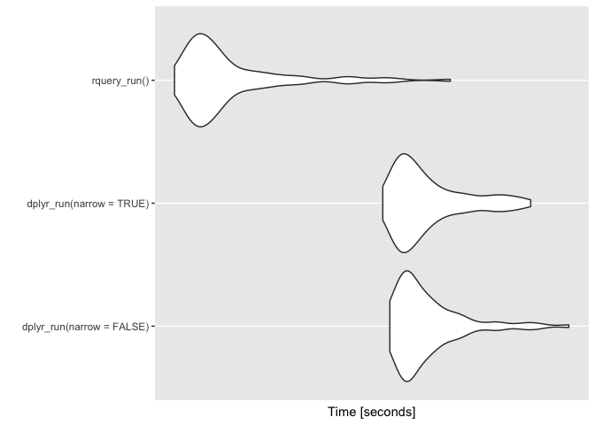

NarrowEffect
================
Win-Vector LLC
12/18/2017

<!-- NarrowEffect.md is generated from NarrowEffect.Rmd. Please edit that file -->
For some time we have been teaching [`R`](https://journal.r-project.org) users "when working with wide tables on Spark or on databases: narrow to the columns you really want to work with early in your analysis."

This issue arises because wide tables (200 to 1000 columns) are quite common in big-data analytics projects. Often these are "denormalized marts" that are used to drive many different projects. For any one project only a small subset of the columns may be relevant in a calculation.

The idea behind the advice is: working with fewer columns makes for quicker queries.

Some wonder is this really an issue or is it something one can ignore in the hope the downstream query optimizer fixes the problem. In this note we will show the effect is real.

Let's set up our experiment. The data is a larger version of the problem from ["Let’s Have Some Sympathy For The Part-time R User"](http://www.win-vector.com/blog/2017/08/lets-have-some-sympathy-for-the-part-time-r-user/). We have expanded the number of subjects to 100000 and added 1000 irrelevant columns to the example. We define a new function that uses `dplyr` and `Sparklyr` to compute the diagnoses. We vary if the table is first limited to columns of interest and if the results are brought back to `R`.

``` r
scale <- 0.237


dplyr_run <- function(narrow, collect = FALSE) {
  dR <- dT
  if(narrow) {
    dR <- dR %>%
      select(subjectID, surveyCategory, assessmentTotal)
  }
  dR <- dR %>%
    group_by(subjectID) %>%
    mutate(probability =
             exp(assessmentTotal * scale)/
             sum(exp(assessmentTotal * scale))) %>%
    arrange(probability, surveyCategory) %>%
    filter(row_number() == n()) %>%
    ungroup() %>%
    rename(diagnosis = surveyCategory) %>%
    select(subjectID, diagnosis, probability) %>%
    arrange(subjectID)
  if(collect) {
    dR <- collect(dR)
  } else {
    dR <- compute(dR)
  }
  dR
}


head(dplyr_run(narrow=FALSE))
```

    ## # Source: lazy query [?? x 3]
    ## # Database: spark_connection
    ## # Ordered by: probability, surveyCategory, subjectID
    ##   subjectID diagnosis           probability
    ##       <int> <chr>                     <dbl>
    ## 1         1 withdrawal behavior       0.559
    ## 2         2 withdrawal behavior       0.500
    ## 3         3 positive re-framing       0.616
    ## 4         4 positive re-framing       0.559
    ## 5         5 withdrawal behavior       0.616
    ## 6         6 positive re-framing       0.869

``` r
head(dplyr_run(narrow=TRUE))
```

    ## # Source: lazy query [?? x 3]
    ## # Database: spark_connection
    ## # Ordered by: probability, surveyCategory, subjectID
    ##   subjectID diagnosis           probability
    ##       <int> <chr>                     <dbl>
    ## 1         1 withdrawal behavior       0.559
    ## 2         2 withdrawal behavior       0.500
    ## 3         3 positive re-framing       0.616
    ## 4         4 positive re-framing       0.559
    ## 5         5 withdrawal behavior       0.616
    ## 6         6 positive re-framing       0.869

We can get timings for variations of the function:

``` r
library("microbenchmark")

timings <- microbenchmark(dplyr_run(narrow=FALSE), 
                          dplyr_run(narrow=TRUE),
                          times = 20)
```

And then present the results:

``` r
print(timings)
```

    ## Unit: milliseconds
    ##                       expr       min        lq     mean   median       uq
    ##  dplyr_run(narrow = FALSE) 2371.2845 2432.6255 2545.488 2479.240 2526.328
    ##   dplyr_run(narrow = TRUE)  937.8512  974.4722 1128.068 1010.134 1080.414
    ##       max neval
    ##  4023.869    20
    ##  2968.788    20

``` r
tdf <- as.data.frame(timings)

# order the data
tdf <- tdf %>%
  group_by(., expr) %>%
  mutate(., mtime = median(time)) %>%
  ungroup(.)

tdf$expr <- reorder(tdf$expr, tdf$mtime)
WVPlots::ScatterBoxPlotH(tdf, "time", "expr",  
                         pt_alpha=0.2,
                         title="Execution times in NS")
```



Notice the times where we have not per-narrowed the table are indeed much slower.

The advice is confirmed: narrow to the columns of interest early in your analysis.

Of course, narrowing to the exact columns used can be difficult: it can involve inspecting an arbitrarily long pipeline for column uses. That is part of why we are developing a new `R` query generator that automates that procedure: [`rquery`](https://winvector.github.io/rquery/).
