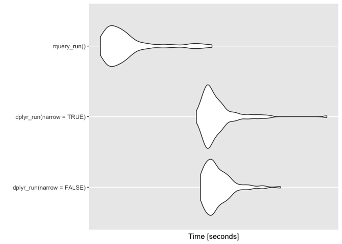
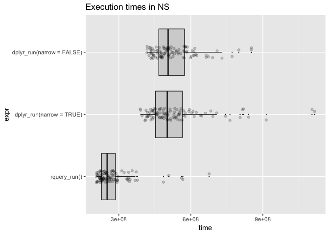

NarrowEffect
================
Win-Vector LLC

<!-- NarrowEffect.md is generated from NarrowEffect.Rmd. Please edit that file -->
For some time we have been teaching [`R`](https://journal.r-project.org) users "when working with wide tables on Spark or on databases: narrow to the columns you really want to work with early in your analysis."

This issue arises because wide tables (200 to 1000 columns) are quite common in big-data analytics projects. Often these are "denormalized marts" that are used to drive many different projects. For any one project only a small subset of the columns may be relevant in a calculation.

The idea behind the advice is: working with fewer columns makes for quicker queries.

Let's set up our experiment. The data is a larger version of the problem from ["Let’s Have Some Sympathy For The Part-time R User"](http://www.win-vector.com/blog/2017/08/lets-have-some-sympathy-for-the-part-time-r-user/). We have expanded the number of subjects to 500000 and added 50 irrelevant columns to the example. We define a new function that uses `dplyr` and `Sparklyr` to compute the diagnoses. We vary if the table is first limited to columns of interest and if the results are brought back to `R`.

``` r
scale <- 0.237
```

``` r
dT %>%
  select(subjectID, surveyCategory, assessmentTotal) %>%
  group_by(subjectID) %>%
  mutate(probability =
           exp(assessmentTotal * scale)/
           sum(exp(assessmentTotal * scale), na.rm = TRUE)) %>%
  arrange(probability, surveyCategory) %>%
  filter(row_number() == n()) %>%
  ungroup() %>%
  rename(diagnosis = surveyCategory) %>%
  select(subjectID, diagnosis, probability) %>%
  arrange(subjectID) %>%
  dbplyr::remote_query(.) %>%
  cat
```

    ## SELECT `subjectID`, `diagnosis`, `probability`
    ## FROM (SELECT `subjectID`, `surveyCategory` AS `diagnosis`, `assessmentTotal`, `probability`
    ## FROM (SELECT `subjectID`, `surveyCategory`, `assessmentTotal`, `probability`
    ## FROM (SELECT `subjectID`, `surveyCategory`, `assessmentTotal`, `probability`, row_number() OVER (PARTITION BY `subjectID` ORDER BY `probability`, `surveyCategory`) AS `zzz3`, COUNT(*) OVER (PARTITION BY `subjectID`) AS `zzz4`
    ## FROM (SELECT *
    ## FROM (SELECT `subjectID`, `surveyCategory`, `assessmentTotal`, EXP(`assessmentTotal` * 0.237) / sum(EXP(`assessmentTotal` * 0.237)) OVER (PARTITION BY `subjectID`) AS `probability`
    ## FROM (SELECT `subjectID`, `surveyCategory`, `assessmentTotal`
    ## FROM `d`) `xqstsesjhs`) `bgmkckvklb`
    ## ORDER BY `probability`, `surveyCategory`) `wqrzhhivab`) `rzhgpshddt`
    ## WHERE (`zzz3` = `zzz4`)) `gjleglpkji`) `onlxzmvvfj`
    ## ORDER BY `subjectID`

``` r
dT %>%
  group_by(subjectID) %>%
  mutate(probability =
           exp(assessmentTotal * scale)/
           sum(exp(assessmentTotal * scale), na.rm = TRUE)) %>%
  arrange(probability, surveyCategory) %>%
  filter(row_number() == n()) %>%
  ungroup() %>%
  rename(diagnosis = surveyCategory) %>%
  select(subjectID, diagnosis, probability) %>%
  arrange(subjectID) %>%
  dbplyr::remote_query(.) %>%
  cat
```

    ## SELECT `subjectID`, `diagnosis`, `probability`
    ## FROM (SELECT `subjectID`, `surveyCategory` AS `diagnosis`, `assessmentTotal`, `irrelevantCol_0000001`, `irrelevantCol_0000002`, `irrelevantCol_0000003`, `irrelevantCol_0000004`, `irrelevantCol_0000005`, `irrelevantCol_0000006`, `irrelevantCol_0000007`, `irrelevantCol_0000008`, `irrelevantCol_0000009`, `irrelevantCol_0000010`, `irrelevantCol_0000011`, `irrelevantCol_0000012`, `irrelevantCol_0000013`, `irrelevantCol_0000014`, `irrelevantCol_0000015`, `irrelevantCol_0000016`, `irrelevantCol_0000017`, `irrelevantCol_0000018`, `irrelevantCol_0000019`, `irrelevantCol_0000020`, `irrelevantCol_0000021`, `irrelevantCol_0000022`, `irrelevantCol_0000023`, `irrelevantCol_0000024`, `irrelevantCol_0000025`, `irrelevantCol_0000026`, `irrelevantCol_0000027`, `irrelevantCol_0000028`, `irrelevantCol_0000029`, `irrelevantCol_0000030`, `irrelevantCol_0000031`, `irrelevantCol_0000032`, `irrelevantCol_0000033`, `irrelevantCol_0000034`, `irrelevantCol_0000035`, `irrelevantCol_0000036`, `irrelevantCol_0000037`, `irrelevantCol_0000038`, `irrelevantCol_0000039`, `irrelevantCol_0000040`, `irrelevantCol_0000041`, `irrelevantCol_0000042`, `irrelevantCol_0000043`, `irrelevantCol_0000044`, `irrelevantCol_0000045`, `irrelevantCol_0000046`, `irrelevantCol_0000047`, `irrelevantCol_0000048`, `irrelevantCol_0000049`, `irrelevantCol_0000050`, `probability`
    ## FROM (SELECT `subjectID`, `surveyCategory`, `assessmentTotal`, `irrelevantCol_0000001`, `irrelevantCol_0000002`, `irrelevantCol_0000003`, `irrelevantCol_0000004`, `irrelevantCol_0000005`, `irrelevantCol_0000006`, `irrelevantCol_0000007`, `irrelevantCol_0000008`, `irrelevantCol_0000009`, `irrelevantCol_0000010`, `irrelevantCol_0000011`, `irrelevantCol_0000012`, `irrelevantCol_0000013`, `irrelevantCol_0000014`, `irrelevantCol_0000015`, `irrelevantCol_0000016`, `irrelevantCol_0000017`, `irrelevantCol_0000018`, `irrelevantCol_0000019`, `irrelevantCol_0000020`, `irrelevantCol_0000021`, `irrelevantCol_0000022`, `irrelevantCol_0000023`, `irrelevantCol_0000024`, `irrelevantCol_0000025`, `irrelevantCol_0000026`, `irrelevantCol_0000027`, `irrelevantCol_0000028`, `irrelevantCol_0000029`, `irrelevantCol_0000030`, `irrelevantCol_0000031`, `irrelevantCol_0000032`, `irrelevantCol_0000033`, `irrelevantCol_0000034`, `irrelevantCol_0000035`, `irrelevantCol_0000036`, `irrelevantCol_0000037`, `irrelevantCol_0000038`, `irrelevantCol_0000039`, `irrelevantCol_0000040`, `irrelevantCol_0000041`, `irrelevantCol_0000042`, `irrelevantCol_0000043`, `irrelevantCol_0000044`, `irrelevantCol_0000045`, `irrelevantCol_0000046`, `irrelevantCol_0000047`, `irrelevantCol_0000048`, `irrelevantCol_0000049`, `irrelevantCol_0000050`, `probability`
    ## FROM (SELECT `subjectID`, `surveyCategory`, `assessmentTotal`, `irrelevantCol_0000001`, `irrelevantCol_0000002`, `irrelevantCol_0000003`, `irrelevantCol_0000004`, `irrelevantCol_0000005`, `irrelevantCol_0000006`, `irrelevantCol_0000007`, `irrelevantCol_0000008`, `irrelevantCol_0000009`, `irrelevantCol_0000010`, `irrelevantCol_0000011`, `irrelevantCol_0000012`, `irrelevantCol_0000013`, `irrelevantCol_0000014`, `irrelevantCol_0000015`, `irrelevantCol_0000016`, `irrelevantCol_0000017`, `irrelevantCol_0000018`, `irrelevantCol_0000019`, `irrelevantCol_0000020`, `irrelevantCol_0000021`, `irrelevantCol_0000022`, `irrelevantCol_0000023`, `irrelevantCol_0000024`, `irrelevantCol_0000025`, `irrelevantCol_0000026`, `irrelevantCol_0000027`, `irrelevantCol_0000028`, `irrelevantCol_0000029`, `irrelevantCol_0000030`, `irrelevantCol_0000031`, `irrelevantCol_0000032`, `irrelevantCol_0000033`, `irrelevantCol_0000034`, `irrelevantCol_0000035`, `irrelevantCol_0000036`, `irrelevantCol_0000037`, `irrelevantCol_0000038`, `irrelevantCol_0000039`, `irrelevantCol_0000040`, `irrelevantCol_0000041`, `irrelevantCol_0000042`, `irrelevantCol_0000043`, `irrelevantCol_0000044`, `irrelevantCol_0000045`, `irrelevantCol_0000046`, `irrelevantCol_0000047`, `irrelevantCol_0000048`, `irrelevantCol_0000049`, `irrelevantCol_0000050`, `probability`, row_number() OVER (PARTITION BY `subjectID` ORDER BY `probability`, `surveyCategory`) AS `zzz5`, COUNT(*) OVER (PARTITION BY `subjectID`) AS `zzz6`
    ## FROM (SELECT *
    ## FROM (SELECT `subjectID`, `surveyCategory`, `assessmentTotal`, `irrelevantCol_0000001`, `irrelevantCol_0000002`, `irrelevantCol_0000003`, `irrelevantCol_0000004`, `irrelevantCol_0000005`, `irrelevantCol_0000006`, `irrelevantCol_0000007`, `irrelevantCol_0000008`, `irrelevantCol_0000009`, `irrelevantCol_0000010`, `irrelevantCol_0000011`, `irrelevantCol_0000012`, `irrelevantCol_0000013`, `irrelevantCol_0000014`, `irrelevantCol_0000015`, `irrelevantCol_0000016`, `irrelevantCol_0000017`, `irrelevantCol_0000018`, `irrelevantCol_0000019`, `irrelevantCol_0000020`, `irrelevantCol_0000021`, `irrelevantCol_0000022`, `irrelevantCol_0000023`, `irrelevantCol_0000024`, `irrelevantCol_0000025`, `irrelevantCol_0000026`, `irrelevantCol_0000027`, `irrelevantCol_0000028`, `irrelevantCol_0000029`, `irrelevantCol_0000030`, `irrelevantCol_0000031`, `irrelevantCol_0000032`, `irrelevantCol_0000033`, `irrelevantCol_0000034`, `irrelevantCol_0000035`, `irrelevantCol_0000036`, `irrelevantCol_0000037`, `irrelevantCol_0000038`, `irrelevantCol_0000039`, `irrelevantCol_0000040`, `irrelevantCol_0000041`, `irrelevantCol_0000042`, `irrelevantCol_0000043`, `irrelevantCol_0000044`, `irrelevantCol_0000045`, `irrelevantCol_0000046`, `irrelevantCol_0000047`, `irrelevantCol_0000048`, `irrelevantCol_0000049`, `irrelevantCol_0000050`, EXP(`assessmentTotal` * 0.237) / sum(EXP(`assessmentTotal` * 0.237)) OVER (PARTITION BY `subjectID`) AS `probability`
    ## FROM `d`) `cumpavgucj`
    ## ORDER BY `probability`, `surveyCategory`) `aoouilopdh`) `hwaohenpqh`
    ## WHERE (`zzz5` = `zzz6`)) `kqpxfifrrx`) `wcwmoslabv`
    ## ORDER BY `subjectID`

``` r
dplyr_run <- function(narrow) {
  dR <- dT
  if(narrow) {
    dR <- dR %>%
      select(subjectID, surveyCategory, assessmentTotal)
  }
  dR %>%
    group_by(subjectID) %>%
    mutate(probability =
             exp(assessmentTotal * scale)/
             sum(exp(assessmentTotal * scale), na.rm = TRUE)) %>%
    arrange(probability, surveyCategory) %>%
    filter(row_number() == n()) %>%
    ungroup() %>%
    rename(diagnosis = surveyCategory) %>%
    select(subjectID, diagnosis, probability) %>%
    arrange(subjectID) %>% 
    head(n=1) %>%
    collect() %>%
    as.data.frame()
}


dplyr_run(narrow=FALSE)
```

    ##   subjectID           diagnosis probability
    ## 1         1 withdrawal behavior   0.6706221

``` r
dplyr_run(narrow=TRUE)
```

    ##   subjectID           diagnosis probability
    ## 1         1 withdrawal behavior   0.6706221

``` r
optree <- dR %.>%
  extend_nse(.,
             probability :=
               exp(assessmentTotal * scale)/
               sum(exp(assessmentTotal * scale)),
             count := count(1),
             partitionby = 'subjectID') %.>%
  extend_nse(.,
             rank := row_number(),
             partitionby = 'subjectID',
             orderby = c('probability', 'surveyCategory'))  %.>%
  rename_columns(., 'diagnosis' := 'surveyCategory') %.>%
  select_rows_nse(., rank == count) %.>%
  select_columns(., c('subjectID', 
                      'diagnosis', 
                      'probability')) %.>%
  orderby(., 'subjectID')

cat(to_sql(optree, my_db))
```

    ## SELECT * FROM (
    ##  SELECT
    ##   `subjectID`,
    ##   `diagnosis`,
    ##   `probability`
    ##  FROM (
    ##   SELECT * FROM (
    ##    SELECT
    ##     `count` AS `count`,
    ##     `probability` AS `probability`,
    ##     `rank` AS `rank`,
    ##     `subjectID` AS `subjectID`,
    ##     `surveyCategory` AS `diagnosis`
    ##    FROM (
    ##     SELECT
    ##      `count`,
    ##      `probability`,
    ##      `subjectID`,
    ##      `surveyCategory`,
    ##      row_number ( ) OVER (  PARTITION BY `subjectID` ORDER BY `probability`, `surveyCategory` ) AS `rank`
    ##     FROM (
    ##      SELECT
    ##       `subjectID`,
    ##       `surveyCategory`,
    ##       `assessmentTotal`,
    ##       exp ( `assessmentTotal` * 0.237 ) / sum ( exp ( `assessmentTotal` * 0.237 ) ) OVER (  PARTITION BY `subjectID` ) AS `probability`,
    ##       count ( 1 ) OVER (  PARTITION BY `subjectID` ) AS `count`
    ##      FROM (
    ##       SELECT
    ##        `d`.`subjectID`,
    ##        `d`.`surveyCategory`,
    ##        `d`.`assessmentTotal`
    ##       FROM
    ##        `d`
    ##       ) tsql_13105981535105768277_0000000000
    ##      ) tsql_13105981535105768277_0000000001
    ##    ) tsql_13105981535105768277_0000000002
    ##   ) tsql_13105981535105768277_0000000003
    ##   WHERE `rank` = `count`
    ##  ) tsql_13105981535105768277_0000000004
    ## ) tsql_13105981535105768277_0000000005 ORDER BY `subjectID`

``` r
rquery_run <- function() {
  optree <- dR %.>%
    extend_nse(.,
               probability :=
                 exp(assessmentTotal * scale)/
                 sum(exp(assessmentTotal * scale)),
               count := count(1),
               partitionby = 'subjectID') %.>%
    extend_nse(.,
               rank := row_number(),
               partitionby = 'subjectID',
               orderby = c('probability', 'surveyCategory'))  %.>%
    rename_columns(., 'diagnosis' := 'surveyCategory') %.>%
    select_rows_nse(., rank == count) %.>%
    select_columns(., c('subjectID', 
                        'diagnosis', 
                        'probability')) %.>%
    orderby(., 'subjectID', limit = 1)
  execute(my_db, optree)
}

rquery_run()
```

    ##   subjectID           diagnosis probability
    ## 1         1 withdrawal behavior   0.6706221

We can get timings for variations of the function:

``` r
library("microbenchmark")

timings <- microbenchmark(dplyr_run(narrow=FALSE), 
                          dplyr_run(narrow=TRUE),
                          rquery_run())

dT <- NULL
dR <- NULL
```

And then present the results:

``` r
print(timings)
```

    ## Unit: seconds
    ##                       expr      min       lq     mean   median       uq
    ##  dplyr_run(narrow = FALSE) 2.122607 2.179801 2.263346 2.223775 2.307436
    ##   dplyr_run(narrow = TRUE) 2.090205 2.174569 2.261127 2.211271 2.288308
    ##               rquery_run() 1.467583 1.516641 1.631944 1.567852 1.640505
    ##       max neval
    ##  2.846989   100
    ##  3.379599   100
    ##  2.213496   100

``` r
autoplot(timings)
```



``` r
tdf <- as.data.frame(timings)

# order the data
tdf <- tdf %>%
  group_by(., expr) %>%
  mutate(., mtime = median(time)) %>%
  ungroup(.)

tdf$expr <- reorder(tdf$expr, tdf$mtime)
WVPlots::ScatterBoxPlotH(tdf, "time", "expr",  
                         pt_alpha=0.2,
                         title="Execution times in NS")
```



The necsissity of the narrowing effect seems to be not present on Spark when we look only at the final result. Though the effect would certainly be there if one inspected an intermediate table.

Of course, narrowing to the exact columns used can be difficult: it can involve inspecting an arbitrarily long pipeline for column uses. That is part of why we are developing a new `R` query generator that automates that procedure: [`rquery`](https://winvector.github.io/rquery/).
