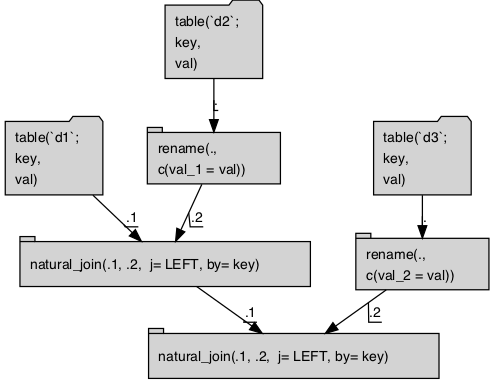

Connect to the `Apache Spark` cluster and copy in 3 tables.

```{r connect}
library("dplyr")
library("sparklyr")
db <- sparklyr::spark_connect(version='2.2.0', 
                              master = "local")

d <- data.frame(key = 1, 
                val = "a", 
                stringsAsFactors = FALSE)
d1 <- dplyr::copy_to(db, d, "d1", overwrite = TRUE)
d2 <- dplyr::copy_to(db, d, "d2", overwrite = TRUE)
d3 <- dplyr::copy_to(db, d, "d3", overwrite = TRUE)
```

Try to use `sparklyr`/`dplyr` to join the tables. Dies due to poor naming of dupicate columns.

```{r sparklyr, error=TRUE}
# works
d1 %>% 
  left_join(., d2, by = "key", suffix = c("_x", "_y")) %>% 
  left_join(., d3, by = "key", suffix = c("_x", "_y"))

# bad query
d1 %>% 
  left_join(., d2, by = "key") %>% 
  left_join(., d3, by = "key") %>%
  dbplyr::remote_query(.)

# fails
d1 %>% 
  left_join(., d2, by = "key") %>% 
  left_join(., d3, by = "key")
```

Similar task with `rquery`.  Note `rquery` natural join does not rename (it coalesces), so we
need a helper function.

```{r rquery}
library("rquery")

dbopts <- rq_connection_tests(db)
print(dbopts)
options(dbopts)
print(getDBOption(db, "control_rownames"))


d1d <- db_td(db, "d1")
d2d <- db_td(db, "d2")
d3d <- db_td(db, "d3")

# disambiguate columns
key <- "key"
col_table <- lapply(
  list(d1d, d2d, d3d),
  function(di) {
    data.frame(table = di$table_name,
             cols = column_names(di),
             stringsAsFactors = FALSE)
  })
col_table <- do.call(rbind, col_table)
col_table$is_key <- col_table$cols %in% key
col_table$new_cols <- col_table$cols
col_table$new_cols[!col_table$is_key] <- make.names(col_table$cols[!col_table$is_key], 
                                          unique = TRUE)
col_table$new_cols <- gsub(".", "_", col_table$new_cols, fixed = TRUE)
knitr::kable(col_table)

rename_it <- function(dd, col_table) {
  ct <- col_table[(col_table$table==dd$table_name) & 
                    (col_table$cols != col_table$new_cols), , drop = FALSE]
  if(nrow(ct)<=0) {
    return(dd)
  }
  mp <- ct$cols
  names(mp) <- ct$new_cols
  rename_columns(dd, mp)
}

d1r <- rename_it(d1d, col_table)
d2r <- rename_it(d2d, col_table)
d3r <- rename_it(d3d, col_table)

optree <- d1r %.>% 
  natural_join(., d2r, by = key) %.>% 
  natural_join(., d3r, by = key) 

# cat(format(optree))

optree %.>%
  op_diagram(.) %.>% 
  DiagrammeR::DiagrammeR(diagram = ., type = "grViz") %.>% 
  DiagrammeRsvg::export_svg(.) %.>% 
  charToRaw(.) %.>%
  rsvg::rsvg_png(., file = "NestedJoin_diagram.png")
```



```{r exrquery}
cat(to_sql(optree, db))

execute(db, optree) %.>%
  knitr::kable(.)
```


Clean up.

```{r cleanup}
sparklyr::spark_disconnect(db)
```


