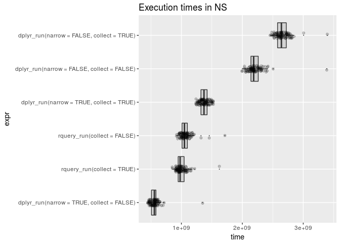

PerfTest
================
2017-12-16

<!-- PerfTest.md is generated from PerfTest.Rmd. Please edit that file -->
Running on a C4.8xlarge EC2 intance.

Define and demonstrate pipelines:

``` r
DBI::dbGetQuery(my_db, paste("SELECT COUNT(1) FROM", d$table_name))
```

    ##   count(1)
    ## 1    4e+05

``` r
length(column_names(d))
```

    ## [1] 1003

``` r
sparklyr::sdf_nrow(dT)
```

    ## [1] 4e+05

``` r
sparklyr::sdf_ncol(dT)
```

    ## [1] 1003

``` r
scale <- 0.237
tng <- wrapr::mk_tmp_name_source("tmptab")

rquery_run <- function(collect) {
  dq <- d %.>%
    extend_nse(.,
               probability :=
                 exp(assessmentTotal * scale)/
                 sum(exp(assessmentTotal * scale)),
               count := count(1),
               partitionby = 'subjectID') %.>%
    extend_nse(.,
               rank := rank(),
               partitionby = 'subjectID',
               orderby = c('probability', 'surveyCategory'))  %.>%
    rename_columns(., 'diagnosis' := 'surveyCategory') %.>%
    select_rows_nse(., rank == count) %.>%
    select_columns(., c('subjectID', 
                        'diagnosis', 
                        'probability')) %.>%
    orderby(., 'subjectID')
  sql <- to_sql(dq, my_db)
  if(collect) {
    dR <- DBI::dbGetQuery(my_db, sql)
  } else {
    tnam <- tng()
    sql <- paste("CREATE TABLE", tnam, "USING PARQUET OPTIONS ('compression'='snappy') AS", 
                 sql)
    DBI::dbExecute(my_db, sql)
    dR <- rquery::dbi_table(my_db, tnam)
  }
  dR
}


dplyr_run <- function(narrow, collect) {
  dR <- dT
  if(narrow) {
    dR <- dR %>%
      select(subjectID, surveyCategory, assessmentTotal)
  }
  dR <- dR %>%
    group_by(subjectID) %>%
    mutate(probability =
             exp(assessmentTotal * scale)/
             sum(exp(assessmentTotal * scale), na.rm = TRUE)) %>%
    arrange(probability, surveyCategory) %>%
    filter(row_number() == n()) %>%
    ungroup() %>%
    rename(diagnosis = surveyCategory) %>%
    select(subjectID, diagnosis, probability) %>%
    arrange(subjectID)
  if(collect) {
    dR <- collect(dR)
  } else {
    dR <- compute(dR)
  }
  dR
}

head(rquery_run(collect=TRUE))
```

    ##   subjectID           diagnosis probability
    ## 1         1 positive re-framing   0.8056518
    ## 2         2 positive re-framing   0.5589742
    ## 3         3 withdrawal behavior   0.5000000
    ## 4         4 positive re-framing   0.5589742
    ## 5         5 withdrawal behavior   0.8401037
    ## 6         6 withdrawal behavior   0.6706221

``` r
dR <- rquery_run(collect=FALSE) 
DBI::dbGetQuery(my_db, 
                paste("SELECT * FROM", dR$table_name, "LIMIT 6"))
```

    ##   subjectID           diagnosis probability
    ## 1     49827 positive re-framing   0.7207128
    ## 2     49828 withdrawal behavior   0.5000000
    ## 3     49829 withdrawal behavior   0.7207128
    ## 4     49830 positive re-framing   0.7207128
    ## 5     49831 positive re-framing   0.8056518
    ## 6     49832 positive re-framing   0.6706221

``` r
head(dplyr_run(narrow=FALSE, collect=TRUE))
```

    ## # A tibble: 6 x 3
    ##   subjectID diagnosis           probability
    ##       <int> <chr>                     <dbl>
    ## 1         1 positive re-framing       0.806
    ## 2         2 positive re-framing       0.559
    ## 3         3 withdrawal behavior       0.500
    ## 4         4 positive re-framing       0.559
    ## 5         5 withdrawal behavior       0.840
    ## 6         6 withdrawal behavior       0.671

``` r
head(dplyr_run(narrow=FALSE, collect=FALSE))
```

    ## # Source:     lazy query [?? x 3]
    ## # Database:   spark_connection
    ## # Ordered by: probability, surveyCategory, subjectID
    ##   subjectID diagnosis           probability
    ##       <int> <chr>                     <dbl>
    ## 1         1 positive re-framing       0.806
    ## 2         2 positive re-framing       0.559
    ## 3         3 withdrawal behavior       0.500
    ## 4         4 positive re-framing       0.559
    ## 5         5 withdrawal behavior       0.840
    ## 6         6 withdrawal behavior       0.671

``` r
head(dplyr_run(narrow=TRUE, collect=TRUE))
```

    ## # A tibble: 6 x 3
    ##   subjectID diagnosis           probability
    ##       <int> <chr>                     <dbl>
    ## 1         1 positive re-framing       0.806
    ## 2         2 positive re-framing       0.559
    ## 3         3 withdrawal behavior       0.500
    ## 4         4 positive re-framing       0.559
    ## 5         5 withdrawal behavior       0.840
    ## 6         6 withdrawal behavior       0.671

``` r
head(dplyr_run(narrow=TRUE, collect=FALSE))
```

    ## # Source:     lazy query [?? x 3]
    ## # Database:   spark_connection
    ## # Ordered by: probability, surveyCategory, subjectID
    ##   subjectID diagnosis           probability
    ##       <int> <chr>                     <dbl>
    ## 1         1 positive re-framing       0.806
    ## 2         2 positive re-framing       0.559
    ## 3         3 withdrawal behavior       0.500
    ## 4         4 positive re-framing       0.559
    ## 5         5 withdrawal behavior       0.840
    ## 6         6 withdrawal behavior       0.671

Get timings:

``` r
timings <- microbenchmark(rquery_run(collect=TRUE), 
                          rquery_run(collect=FALSE), 
                          dplyr_run(narrow=FALSE, collect=TRUE), 
                          dplyr_run(narrow=FALSE, collect=FALSE), 
                          dplyr_run(narrow=TRUE, collect=TRUE),
                          dplyr_run(narrow=TRUE, collect=FALSE))
saveRDS(timings, "PerfTest_timings.RDS")
```

Present results:

``` r
print(timings)
```

    ## Unit: milliseconds
    ##                                        expr       min        lq      mean
    ##                  rquery_run(collect = TRUE)  849.7094  946.3083  999.2847
    ##                 rquery_run(collect = FALSE)  918.5603 1009.7279 1068.6389
    ##   dplyr_run(narrow = FALSE, collect = TRUE) 2456.4549 2577.8453 2658.2569
    ##  dplyr_run(narrow = FALSE, collect = FALSE) 1992.5760 2140.7727 2210.9916
    ##    dplyr_run(narrow = TRUE, collect = TRUE) 1238.3389 1320.8496 1374.9367
    ##   dplyr_run(narrow = TRUE, collect = FALSE)  446.8712  506.8260  557.4533
    ##     median        uq      max neval
    ##   978.5470 1044.6912 1623.464   100
    ##  1050.2751 1098.0227 1713.482   100
    ##  2641.4408 2722.1666 3395.182   100
    ##  2186.0921 2262.4457 3386.330   100
    ##  1370.6747 1422.3974 1524.730   100
    ##   556.1155  582.4891 1348.001   100

``` r
autoplot(timings)
```


``` r
tdf <- as.data.frame(timings)

# order the data
tdf <- tdf %.>%
  group_by_se(., "expr") %.>%
  mutate_se(., qae(mtime := median(time))) %.>%
  ungroup(.)

tdf$expr <- reorder(tdf$expr, tdf$mtime)
WVPlots::ScatterBoxPlotH(tdf, "time", "expr",  
                         pt_alpha=0.2,
                         title="Execution times in NS")
```



``` r
sparklyr::spark_disconnect(my_db)
```
