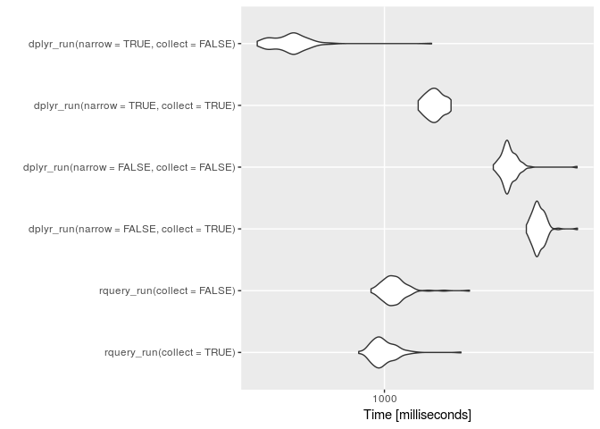

PerfTest
================
2017-12-16

<!-- PerfTest.md is generated from PerfTest.Rmd. Please edit that file -->
Set up experiment:

``` r
library("microbenchmark")
suppressPackageStartupMessages(library("dplyr"))
library("rquery")

my_db <- sparklyr::spark_connect(version='2.2.0', 
                                 master = "local")

nSubj <- 100000
nIrrelCol <- 1000
dL <- data.frame(subjectID = sort(rep(seq_len(nSubj),2)),
                 surveyCategory = c(
                   'withdrawal behavior',
                   'positive re-framing'),
                 stringsAsFactors = FALSE)
dL$assessmentTotal <- sample.int(10, nrow(dL), replace = TRUE)
for(i in seq_len(nIrrelCol)) {
  ni <- paste("irrelevantCol", sprintf("%07g", i), sep = "_")
  dL[[ni]] <- sample(letters, size = nrow(dL), replace = TRUE)
}

d <- dbi_copy_to(my_db, 'd',
                 dL,
                 temporary = TRUE, 
                 overwrite = FALSE)
dL <- NULL

# copy to Parquet to simulate large external data source
dT <- dplyr::tbl(my_db, d$table_name)
sparklyr::spark_write_parquet(dT, "perf_tmp", mode = 'overwrite')
dplyr::db_drop_table(my_db, d$table_name)
```

    ## [1] 0

``` r
dT <- NULL
d <- NULL

# build new refs
dT <- sparklyr::spark_read_parquet(my_db, 'dparq', "perf_tmp", memory = FALSE)
d <- dbi_table(my_db, 'dparq')
```

Define and demonstrate pipelines:

``` r
scale <- 0.237

rquery_run <- function() {
  dq <- d %.>%
    extend_nse(.,
               probability :=
                 exp(assessmentTotal * scale)/
                 sum(exp(assessmentTotal * scale)),
               count := count(1),
               partitionby = 'subjectID') %.>%
    extend_nse(.,
               rank := rank(),
               partitionby = 'subjectID',
               orderby = c('probability', 'surveyCategory'))  %.>%
    rename_columns(., 'diagnosis' := 'surveyCategory') %.>%
    select_rows_nse(., rank == count) %.>%
    select_columns(., c('subjectID', 
                        'diagnosis', 
                        'probability')) %.>%
    order_by(., 'subjectID')
  dR <- dq %.>%
    to_sql(.) %.>%
    DBI::dbGetQuery(my_db, .) 
  dR
}

dplyr_run <- function() {
  dR <- dT %>%
    group_by(subjectID) %>%
    mutate(probability =
             exp(assessmentTotal * scale)/
             sum(exp(assessmentTotal * scale))) %>%
    arrange(probability, surveyCategory) %>%
    filter(row_number() == n()) %>%
    ungroup() %>%
    rename(diagnosis = surveyCategory) %>%
    select(subjectID, diagnosis, probability) %>%
    arrange(subjectID) %>% 
    collect()
  dR
}

dplyr_narrow_run <- function() {
  dR <- dT %>%
    select(subjectID, surveyCategory, assessmentTotal) %>%
    group_by(subjectID) %>%
    mutate(probability =
             exp(assessmentTotal * scale)/
             sum(exp(assessmentTotal * scale))) %>%
    arrange(probability, surveyCategory) %>%
    filter(row_number() == n()) %>%
    ungroup() %>%
    rename(diagnosis = surveyCategory) %>%
    select(subjectID, diagnosis, probability) %>%
    arrange(subjectID) %>% 
    collect()
  dR
}


head(rquery_run())
```

    ##   subjectID           diagnosis probability
    ## 1         1 positive re-framing   0.7658456
    ## 2         2 positive re-framing   0.8940695
    ## 3         3 withdrawal behavior   0.6163301
    ## 4         4 positive re-framing   0.5589742
    ## 5         5 withdrawal behavior   0.7207128
    ## 6         6 withdrawal behavior   0.8401037

``` r
head(dplyr_run())
```

    ## # A tibble: 6 x 3
    ##   subjectID diagnosis           probability
    ##       <int> <chr>                     <dbl>
    ## 1         1 positive re-framing       0.766
    ## 2         2 positive re-framing       0.894
    ## 3         3 withdrawal behavior       0.616
    ## 4         4 positive re-framing       0.559
    ## 5         5 withdrawal behavior       0.721
    ## 6         6 withdrawal behavior       0.840

``` r
head(dplyr_narrow_run())
```

    ## # A tibble: 6 x 3
    ##   subjectID diagnosis           probability
    ##       <int> <chr>                     <dbl>
    ## 1         1 positive re-framing       0.766
    ## 2         2 positive re-framing       0.894
    ## 3         3 withdrawal behavior       0.616
    ## 4         4 positive re-framing       0.559
    ## 5         5 withdrawal behavior       0.721
    ## 6         6 withdrawal behavior       0.840

Get timings:

``` r
timings <- microbenchmark(rquery_run(), 
                          dplyr_run(), 
                          dplyr_narrow_run(),
                          times = 5)
```

Present results:

``` r
print(timings)
```

    ## Unit: milliseconds
    ##                expr       min        lq     mean   median       uq
    ##        rquery_run()  909.5703  969.8015 1091.923 1078.948 1213.966
    ##         dplyr_run() 2798.4506 3044.2357 3104.139 3082.380 3161.290
    ##  dplyr_narrow_run() 1779.1346 1811.2692 1836.615 1842.772 1874.550
    ##       max neval
    ##  1287.327     5
    ##  3434.339     5
    ##  1875.350     5

``` r
plot(timings)
```



``` r
sparklyr::spark_disconnect(my_db)
```
