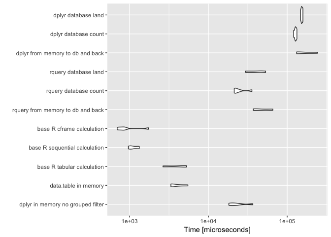
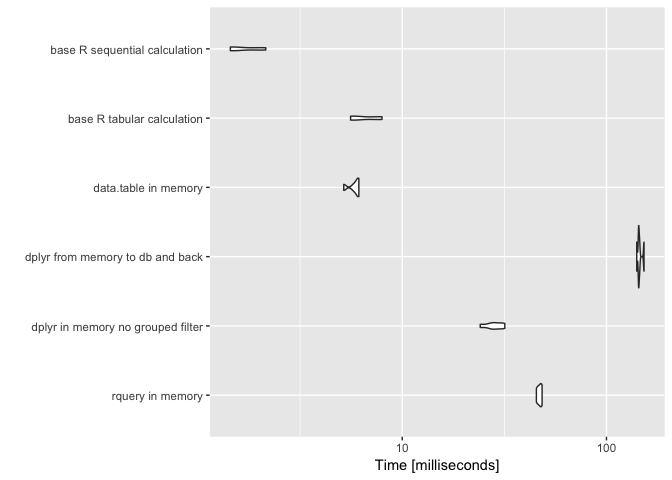
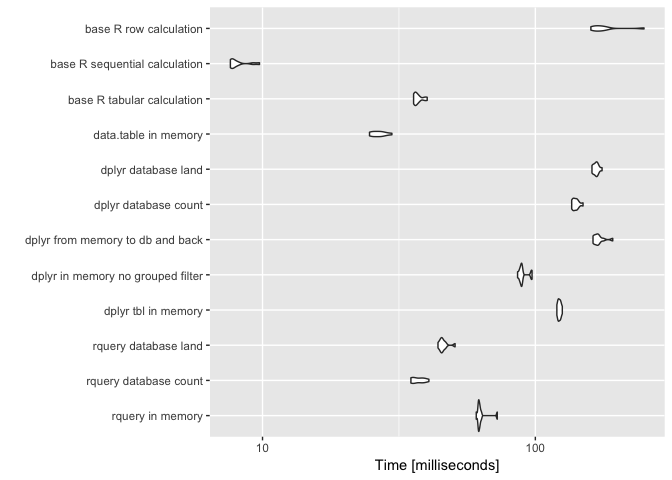
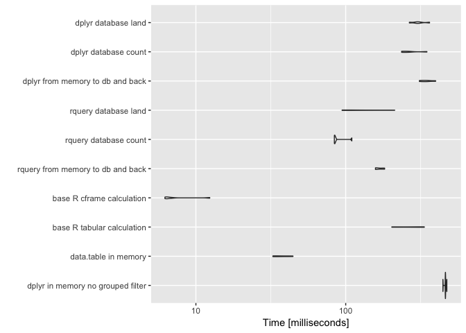
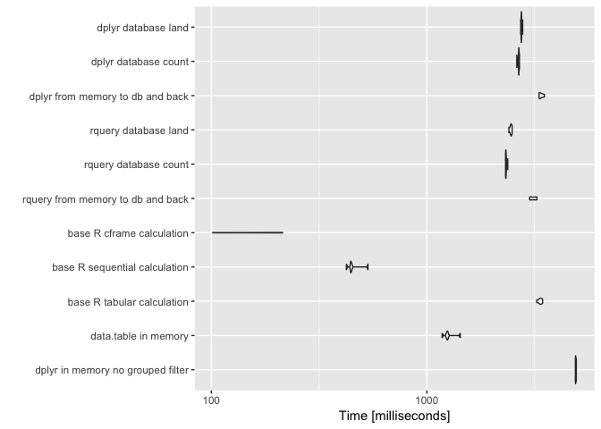
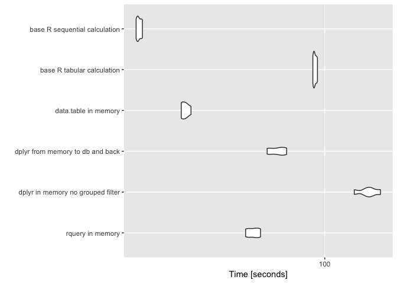

QTiming
================
Win-Vector LLC
1/10/2018

Let's time [`rquery`](https://winvector.github.io/rquery/), [`dplyr`](https://CRAN.R-project.org/package=dplyr), and [`data.table`](https://CRAN.R-project.org/package=data.table) on a non-trivial example.

These timings are on an late 2014 Mac Mini with 8GB of RAM running OSX 10.12.6, version 3.4.3 (2017-11-30) -- "Kite-Eating Tree", and the current (2018-01-07) CRAN versions of all packages (except `rquery`, which is not yet up on CRAN). We are getting database services from PostgreSQL version `9.6.1` in a docker container.

First let's load our packages, establish a database connection, and declare an [`rquery` ad hoc execution service](https://winvector.github.io/rquery/articles/AdHocQueries.html) (the "`winvector_temp_db_handle`").

``` r
library("rquery")
```

    ## Loading required package: wrapr

    ## Loading required package: cdata

``` r
library("dplyr")
```

    ## 
    ## Attaching package: 'dplyr'

    ## The following objects are masked from 'package:stats':
    ## 
    ##     filter, lag

    ## The following objects are masked from 'package:base':
    ## 
    ##     intersect, setdiff, setequal, union

``` r
library("microbenchmark")
library("ggplot2")

db <- DBI::dbConnect(RPostgres::Postgres(),
                     host = 'localhost',
                     port = 5432,
                     user = 'postgres',
                     password = 'pg')
winvector_temp_db_handle <- list(db = db)

packageVersion("rquery")
```

    ## [1] '0.2.0'

``` r
packageVersion("dplyr")
```

    ## [1] '0.7.4'

``` r
packageVersion("dbplyr")
```

    ## [1] '1.2.0'

``` r
packageVersion("DBI")
```

    ## [1] '0.7'

``` r
packageVersion("data.table")
```

    ## [1] '1.10.4.3'

``` r
packageVersion("RPostgres")
```

    ## [1] '1.0.4'

``` r
print(db)
```

    ## <PqConnection> postgres@localhost:5432

``` r
DBI::dbGetQuery(db, "SELECT version()")
```

    ##                                                                                    version
    ## 1 PostgreSQL 9.6.1 on x86_64-pc-linux-gnu, compiled by gcc (Debian 4.9.2-10) 4.9.2, 64-bit

``` r
R.Version()
```

    ## $platform
    ## [1] "x86_64-apple-darwin15.6.0"
    ## 
    ## $arch
    ## [1] "x86_64"
    ## 
    ## $os
    ## [1] "darwin15.6.0"
    ## 
    ## $system
    ## [1] "x86_64, darwin15.6.0"
    ## 
    ## $status
    ## [1] ""
    ## 
    ## $major
    ## [1] "3"
    ## 
    ## $minor
    ## [1] "4.3"
    ## 
    ## $year
    ## [1] "2017"
    ## 
    ## $month
    ## [1] "11"
    ## 
    ## $day
    ## [1] "30"
    ## 
    ## $`svn rev`
    ## [1] "73796"
    ## 
    ## $language
    ## [1] "R"
    ## 
    ## $version.string
    ## [1] "R version 3.4.3 (2017-11-30)"
    ## 
    ## $nickname
    ## [1] "Kite-Eating Tree"

We now build and extended version of the example from [Let’s Have Some Sympathy For The Part-time R User](http://www.win-vector.com/blog/2017/08/lets-have-some-sympathy-for-the-part-time-r-user/).

``` r
nrep <- 10


mkData <- function(nrep) {
  dLocal <- data.frame(
    subjectID = c(1,                   
                  1,
                  2,                   
                  2),
    surveyCategory = c(
      'withdrawal behavior',
      'positive re-framing',
      'withdrawal behavior',
      'positive re-framing'
    ),
    assessmentTotal = c(5,                 
                        2,
                        3,                  
                        4),
    stringsAsFactors = FALSE)
  norig <- nrow(dLocal)
  dLocal <- dLocal[rep(seq_len(norig), nrep), , drop=FALSE]
  dLocal$subjectID <- paste((seq_len(nrow(dLocal)) -1)%/% norig,
                            dLocal$subjectID, 
                            sep = "_")
  rownames(dLocal) <- NULL

  dLocal
}

dLocal <- mkData(nrep)
dR <- rquery::dbi_copy_to(db, 'dR',
                          dLocal,
                          temporary = TRUE, 
                          overwrite = TRUE)
dTbl <- dplyr::tbl(db, dR$table_name)

head(dLocal)
```

    ##   subjectID      surveyCategory assessmentTotal
    ## 1       0_1 withdrawal behavior               5
    ## 2       0_1 positive re-framing               2
    ## 3       0_2 withdrawal behavior               3
    ## 4       0_2 positive re-framing               4
    ## 5       1_1 withdrawal behavior               5
    ## 6       1_1 positive re-framing               2

``` r
cdata::qlook(db, dR$table_name)
```

    ## table "dR" PqConnection 
    ##  nrow: 40 
    ##  NOTE: "obs" below is count of sample, not number of rows of data.
    ## 'data.frame':    10 obs. of  3 variables:
    ##  $ subjectID      : chr  "0_1" "0_1" "0_2" "0_2" ...
    ##  $ surveyCategory : chr  "withdrawal behavior" "positive re-framing" "withdrawal behavior" "positive re-framing" ...
    ##  $ assessmentTotal: num  5 2 3 4 5 2 3 4 5 2

``` r
dplyr::glimpse(dTbl)
```

    ## Observations: NA
    ## Variables: 3
    ## $ subjectID       <chr> "0_1", "0_1", "0_2", "0_2", "1_1", "1_1", "1_2...
    ## $ surveyCategory  <chr> "withdrawal behavior", "positive re-framing", ...
    ## $ assessmentTotal <dbl> 5, 2, 3, 4, 5, 2, 3, 4, 5, 2, 3, 4, 5, 2, 3, 4...

Now we declare our operation pipelines, both on local (in-memory `data.frame`) and remote (already in a database) data.

``` r
scale <- 0.237

# base-R function
# could also try base::split() or base:table()
base_r_calculate_tabular <- function(d) {
  d <- d[order(d$subjectID, d$surveyCategory), , drop=FALSE]
  # compute un-normalized probability
  d$probability <- exp(d$assessmentTotal * scale)
  # set up of for selection
  dmax <- stats::aggregate(d$probability, 
                           by = list(subjectID = d$subjectID), 
                           FUN = max)
  maxv <- dmax$x
  names(maxv) <- dmax$subjectID
  # set up for normalization
  dsum <- stats::aggregate(d$probability, 
                           by = list(subjectID = d$subjectID), 
                           FUN = sum)
  sumv <- dsum$x
  names(sumv) <- dsum$subjectID
  # start selection
  d$maxv <- maxv[d$subjectID]
  d <- d[d$probability >= d$maxv, 
                   , 
                   drop=FALSE]
  # de-dup
  d$rownum <- seq_len(nrow(d))
  drow <-  stats::aggregate(d$rownum, 
                           by = list(subjectID = d$subjectID), 
                           FUN = min)
  minv <- drow$x
  names(minv) <- drow$subjectID
  d$rmin <- minv[d$subjectID]
  d <- d[d$rownum <= d$rmin, , drop=FALSE]
  # renormalize
  d$probability <- d$probability/sumv[d$subjectID]
  d <- d[, c("subjectID", "surveyCategory", "probability")]
  colnames(d)[[2]] <- "diagnosis"
  d
}

# base-R function
# could also try base::split() or base:table()
base_r_calculate_sequenced <- function(d) {
  cats <- base::sort(base::unique(d$surveyCategory))
  res <- NULL
  for(ci in cats) {
    di <- d[d$surveyCategory == ci, , drop=FALSE]
    di <- di[base::order(di$subjectID), , drop=FALSE]
    di$probability <- exp(di$assessmentTotal * scale)
    if(length(base::unique(di$subjectID))!=nrow(di)) {
      stop("base_r_calculate repeated subjectID")
    }
    if(is.null(res)) {
      res <- data.frame(subjectID = di$subjectID,
                        totalProb = di$probability,
                        bestScore = di$probability,
                        diagnosis = ci,
                        stringsAsFactors = FALSE)
    } else {
      if((nrow(di)!=nrow(res)) ||
         (!all(di$subjectID == res$subjectID))) {
        stop("base_r_calculate saw irregular data")
      }
      change <- di$probability > res$bestScore
      res$diagnosis[change] <- ci
      res$bestScore <- base::pmax(res$bestScore, 
                                  di$probability)
      res$totalProb <- res$totalProb + di$probability
    }
  }
  res$probability <- res$bestScore/res$totalProb
  res <- res[, c("subjectID", 
                 "diagnosis", 
                 "probability")]
  res
}


# base-R function
# could also try base::split() or base:table()
base_r_calculate_rows <- function(d) {
  d <- d[base::order(d$subjectID, d$surveyCategory), , drop=FALSE]
  d$probability <- exp(d$assessmentTotal * scale)
  ids <- sort(unique(d$subjectID))
  totals <- numeric(length(ids))
  names(totals) <- ids
  n <- nrow(d)
  choices <- logical(n)
  sum <- 0
  maxID <- 1
  for(i in seq_len(n)) {
    id <- d$subjectID[[i]]
    probi <- d$probability[[i]]
    sum <- sum + probi
    if(probi>d$probability[[maxID]]) {
      maxID <- i
    }
    end_of_group <- (i>=n) || (d$subjectID[[i+1]]!=id)
    if(end_of_group) {
      choices[[maxID]] <- TRUE
      totals[id] <- sum
      sum <- 0
      maxID <- i+1
    }
  }
  d <- d[choices, , drop=FALSE]
  d$probability <- d$probability/totals[d$subjectID]
  d <- d[, c("subjectID", 
               "surveyCategory", 
               "probability")]
  colnames(d)[[2]] <- "diagnosis"
  d
}

# this is a function, 
# so body not evaluated until used
rquery_pipeline <- . := {
  extend_nse(.,
             probability :=
               exp(assessmentTotal * scale)/
               sum(exp(assessmentTotal * scale)),
             count := count(1),
             partitionby = 'subjectID') %.>%
    extend_nse(.,
               rank := rank(),
               partitionby = 'subjectID',
               orderby = c('probability', 'surveyCategory'))  %.>%
    rename_columns(., 'diagnosis' := 'surveyCategory') %.>%
    select_rows_nse(., rank == count) %.>%
    select_columns(., c('subjectID', 
                        'diagnosis', 
                        'probability')) %.>%
    orderby(., 'subjectID') 
}


base_R_row_calculation <- function() {
  base_r_calculate_rows(dLocal)
}

base_R_sequential_calculation <- function() {
  base_r_calculate_sequenced(dLocal)
}

base_R_tabular_calculation <- function() {
  base_r_calculate_tabular(dLocal)
}

rquery_local <- function() {
  dLocal %.>% 
    rquery_pipeline(.) %.>%
    as.data.frame(.) # force execution
}

rquery_database_pull <- function() {
  dR %.>% 
    rquery_pipeline(.) %.>% 
    to_sql(., db) %.>% 
    DBI::dbGetQuery(db, .) %.>%
    as.data.frame(.) # shouldn't be needed
}

rquery_database_land <- function() {
  tabName <- "rquery_tmpx"
  sqlc <- dR %.>% 
    rquery_pipeline(.) %.>% 
    to_sql(., db)
  DBI::dbExecute(db, paste("CREATE TABLE", tabName, "AS", sqlc))
  DBI::dbExecute(db, paste("DROP TABLE", tabName))
  NULL
}

rquery_database_count <- function() {
  dR %.>% 
    rquery_pipeline(.) %.>% 
    sql_node(., "n" := "COUNT(1)") %.>% 
    to_sql(., db) %.>% 
    DBI::dbGetQuery(db, .) %.>%
    as.data.frame(.) # shouldn't be needed
}

# this is a function, 
# so body not evaluated until used
dplyr_pipeline <- . %>%
  group_by(subjectID) %>%
  mutate(probability =
           exp(assessmentTotal * scale)/
           sum(exp(assessmentTotal * scale), na.rm = TRUE)) %>%
  arrange(probability, surveyCategory) %>%
  filter(row_number() == n()) %>%
  ungroup() %>%
  rename(diagnosis = surveyCategory) %>%
  select(subjectID, diagnosis, probability) %>%
  arrange(subjectID)

# this is a function, 
# so body not evaluated until used
# pipeline re-factored to have filter outside
# mutate 
# work around: https://github.com/tidyverse/dplyr/issues/3294
dplyr_pipeline2 <- . %>%
  group_by(subjectID) %>%
  mutate(probability =
           exp(assessmentTotal * scale)/
           sum(exp(assessmentTotal * scale), na.rm = TRUE)) %>%
  arrange(probability, surveyCategory) %>%
  mutate(count = n(), rank = row_number()) %>%
  ungroup() %>%
  filter(count == rank) %>%
  rename(diagnosis = surveyCategory) %>%
  select(subjectID, diagnosis, probability) %>%
  arrange(subjectID)


dplyr_local <- function() {
  dLocal %>% 
    dplyr_pipeline
}

dplyr_local_no_grouped_filter <- function() {
  dLocal %>% 
    dplyr_pipeline2
}

dplyr_tbl <- function() {
  dLocal %>%
    as_tibble %>%
    dplyr_pipeline
}

dplyr_round_trip <- function() {
  dTmp <- dplyr::copy_to(db, dLocal, "dplyr_tmp",
                         # overwrite = TRUE,
                         temporary = TRUE
  )
  res <- dTmp %>% 
    dplyr_pipeline %>%
    collect()
  dplyr::db_drop_table(db, "dplyr_tmp")
  res
}

dplyr_database_pull <- function() {
  dTbl %>% 
    dplyr_pipeline %>%
    collect()
}

dplyr_database_land <- function() {
  tabName = "dplyr_ctmpx"
  dTbl %>% 
    dplyr_pipeline %>%
    compute(name = tabName)
  dplyr::db_drop_table(db, table = tabName)
  NULL
}

dplyr_database_count <- function() {
  dTbl %>% 
    dplyr_pipeline %>%
    tally() %>%
    collect()
}

.datatable.aware <- TRUE

data.table_local <- function() {
  dDT <- data.table::data.table(dLocal)
  dDT[
    , one := 1 ][
      , probability := exp ( assessmentTotal * scale ) / 
        sum ( exp ( assessmentTotal * scale ) ) ,subjectID ][
          , count := sum ( one ) ,subjectID ][
            , rank := rank ( probability ) ,subjectID ][
              rank == count ][
                , diagnosis := surveyCategory ][
                  , c('subjectID', 'diagnosis', 'probability') ][
                    order(subjectID) ]
}
```

Let's inspect the functions.

``` r
head(base_R_sequential_calculation())
```

    ##   subjectID           diagnosis probability
    ## 1       0_1 withdrawal behavior   0.6706221
    ## 2       0_2 positive re-framing   0.5589742
    ## 3       1_1 withdrawal behavior   0.6706221
    ## 4       1_2 positive re-framing   0.5589742
    ## 5       2_1 withdrawal behavior   0.6706221
    ## 6       2_2 positive re-framing   0.5589742

``` r
head(base_R_row_calculation())
```

    ##    subjectID           diagnosis probability
    ## 1        0_1 withdrawal behavior   0.6706221
    ## 4        0_2 positive re-framing   0.5589742
    ## 5        1_1 withdrawal behavior   0.6706221
    ## 8        1_2 positive re-framing   0.5589742
    ## 9        2_1 withdrawal behavior   0.6706221
    ## 12       2_2 positive re-framing   0.5589742

``` r
head(base_R_tabular_calculation())
```

    ##    subjectID           diagnosis probability
    ## 1        0_1 withdrawal behavior   0.6706221
    ## 4        0_2 positive re-framing   0.5589742
    ## 5        1_1 withdrawal behavior   0.6706221
    ## 8        1_2 positive re-framing   0.5589742
    ## 9        2_1 withdrawal behavior   0.6706221
    ## 12       2_2 positive re-framing   0.5589742

``` r
head(rquery_local())
```

    ##   subjectID           diagnosis probability
    ## 1       0_1 withdrawal behavior   0.6706221
    ## 2       0_2 positive re-framing   0.5589742
    ## 3       1_1 withdrawal behavior   0.6706221
    ## 4       1_2 positive re-framing   0.5589742
    ## 5       2_1 withdrawal behavior   0.6706221
    ## 6       2_2 positive re-framing   0.5589742

``` r
rquery_database_land()
```

    ## NULL

``` r
head(rquery_database_pull())
```

    ##   subjectID           diagnosis probability
    ## 1       0_1 withdrawal behavior   0.6706221
    ## 2       0_2 positive re-framing   0.5589742
    ## 3       1_1 withdrawal behavior   0.6706221
    ## 4       1_2 positive re-framing   0.5589742
    ## 5       2_1 withdrawal behavior   0.6706221
    ## 6       2_2 positive re-framing   0.5589742

``` r
rquery_database_count()
```

    ##    n
    ## 1 20

``` r
head(dplyr_local())
```

    ## # A tibble: 6 x 3
    ##   subjectID diagnosis           probability
    ##   <chr>     <chr>                     <dbl>
    ## 1 0_1       withdrawal behavior       0.671
    ## 2 0_2       positive re-framing       0.559
    ## 3 1_1       withdrawal behavior       0.671
    ## 4 1_2       positive re-framing       0.559
    ## 5 2_1       withdrawal behavior       0.671
    ## 6 2_2       positive re-framing       0.559

``` r
head(dplyr_tbl())
```

    ## # A tibble: 6 x 3
    ##   subjectID diagnosis           probability
    ##   <chr>     <chr>                     <dbl>
    ## 1 0_1       withdrawal behavior       0.671
    ## 2 0_2       positive re-framing       0.559
    ## 3 1_1       withdrawal behavior       0.671
    ## 4 1_2       positive re-framing       0.559
    ## 5 2_1       withdrawal behavior       0.671
    ## 6 2_2       positive re-framing       0.559

``` r
head(dplyr_local_no_grouped_filter())
```

    ## # A tibble: 6 x 3
    ##   subjectID diagnosis           probability
    ##   <chr>     <chr>                     <dbl>
    ## 1 0_1       withdrawal behavior       0.671
    ## 2 0_2       positive re-framing       0.559
    ## 3 1_1       withdrawal behavior       0.671
    ## 4 1_2       positive re-framing       0.559
    ## 5 2_1       withdrawal behavior       0.671
    ## 6 2_2       positive re-framing       0.559

``` r
dplyr_database_land()
```

    ## NULL

``` r
head(dplyr_database_pull())
```

    ## # A tibble: 6 x 3
    ##   subjectID diagnosis           probability
    ##   <chr>     <chr>                     <dbl>
    ## 1 0_1       withdrawal behavior       0.671
    ## 2 0_2       positive re-framing       0.559
    ## 3 1_1       withdrawal behavior       0.671
    ## 4 1_2       positive re-framing       0.559
    ## 5 2_1       withdrawal behavior       0.671
    ## 6 2_2       positive re-framing       0.559

``` r
dplyr_database_count()
```

    ## # A tibble: 1 x 1
    ##   n              
    ##   <S3: integer64>
    ## 1 20

``` r
head(dplyr_round_trip())
```

    ## # A tibble: 6 x 3
    ##   subjectID diagnosis           probability
    ##   <chr>     <chr>                     <dbl>
    ## 1 0_1       withdrawal behavior       0.671
    ## 2 0_2       positive re-framing       0.559
    ## 3 1_1       withdrawal behavior       0.671
    ## 4 1_2       positive re-framing       0.559
    ## 5 2_1       withdrawal behavior       0.671
    ## 6 2_2       positive re-framing       0.559

``` r
head(data.table_local())
```

    ##    subjectID           diagnosis probability
    ## 1:       0_1 withdrawal behavior   0.6706221
    ## 2:       0_2 positive re-framing   0.5589742
    ## 3:       1_1 withdrawal behavior   0.6706221
    ## 4:       1_2 positive re-framing   0.5589742
    ## 5:       2_1 withdrawal behavior   0.6706221
    ## 6:       2_2 positive re-framing   0.5589742

Now let's measure the speeds with `microbenchmark`.

``` r
timings <- NULL

expressions <- list(
    "rquery in memory" = bquote({ nrow(rquery_local())}),
    # "rquery from db to memory" =  bquote({nrow(rquery_database_pull())}),
    # "rquery database count" =  bquote({rquery_database_count()}),
    # "rquery database land" =  bquote({rquery_database_land()}),
    # "dplyr in memory" =  bquote({nrow(dplyr_local())}),
    # "dplyr tbl in memory" =  bquote({nrow(dplyr_tbl())}),
    "dplyr in memory no grouped filter" =  bquote({nrow(dplyr_local_no_grouped_filter())}),
    "dplyr from memory to db and back" =  bquote({nrow(dplyr_round_trip())}),
    # "dplyr from db to memory" =  bquote({nrow(dplyr_database_pull())}),
    # "dplyr database count" =  bquote({dplyr_database_count()}),
    # "dplyr database land" =  bquote({dplyr_database_land()}),
    "data.table in memory" =  bquote({nrow(data.table_local())}),
    # "base R row calculation" =  bquote({nrow(base_R_row_calculation())}),
    "base R tabular calculation" =  bquote({nrow(base_R_tabular_calculation())}),
    "base R sequential calculation" =  bquote({nrow(base_R_sequential_calculation())})
)

prune <- FALSE

for(nrep in c(1, 10, 100, 1000, 10000, 100000, 1000000)) {
  print(nrep)
  dLocal <- mkData(nrep)
  dR <- rquery::dbi_copy_to(db, 'dR',
                            dLocal,
                            temporary = TRUE, 
                            overwrite = TRUE)
  dTbl <- dplyr::tbl(db, dR$table_name)
  tm <- microbenchmark(
    list = expressions,
    times = 5L
  )
  print(tm)
  print(autoplot(tm))
  tmi <- as.data.frame(tm)
  tmi$data_size <- nrow(dLocal)
  timings <- rbind(timings, tmi)
  if(prune) {
    baddies <- unique(tmi$expr[tmi$time > 10*1e+9])
    for(bi in baddies) {
      expressions[[bi]] <- NULL
    }
    if(length(expressions)<=0) {
      break
    }
  }
}
```

    ## [1] 1
    ## Unit: milliseconds
    ##                               expr        min         lq       mean
    ##                   rquery in memory  39.779078  40.604831  46.008557
    ##  dplyr in memory no grouped filter  18.564219  19.308280  22.576138
    ##   dplyr from memory to db and back 140.867699 142.886331 150.198291
    ##               data.table in memory   3.226908   3.574737   3.931861
    ##         base R tabular calculation   2.945471   3.701218   3.887709
    ##      base R sequential calculation   1.153425   1.244825   1.455623
    ##      median         uq        max neval
    ##   47.925985  48.416692  53.316199     5
    ##   23.415737  24.127623  27.464833     5
    ##  153.913708 156.088499 157.235219     5
    ##    3.685620   4.292286   4.879756     5
    ##    4.208066   4.285243   4.298547     5
    ##    1.269249   1.498711   2.111904     5


    ## [1] 10
    ## Unit: microseconds
    ##                               expr        min         lq       mean
    ##                   rquery in memory  36983.583  38317.728  39021.424
    ##  dplyr in memory no grouped filter  19396.651  21082.539  21471.000
    ##   dplyr from memory to db and back 130052.588 133140.925 150847.222
    ##               data.table in memory   3681.336   3698.568   3975.883
    ##         base R tabular calculation   2798.403   3232.110   3282.165
    ##      base R sequential calculation    928.326    991.878   1056.529
    ##      median         uq        max neval
    ##   39005.246  39673.826  41126.736     5
    ##   21648.587  22359.139  22868.086     5
    ##  135362.162 141360.473 214319.964     5
    ##    3773.286   3959.441   4766.785     5
    ##    3305.883   3459.265   3615.162     5
    ##    1062.741   1082.826   1216.872     5



    ## [1] 100
    ## Unit: milliseconds
    ##                               expr        min         lq       mean
    ##                   rquery in memory  45.374020  46.294484  47.072182
    ##  dplyr in memory no grouped filter  24.094707  27.294293  28.286300
    ##   dplyr from memory to db and back 140.645574 143.696647 145.192086
    ##               data.table in memory   5.172672   5.796121   5.854938
    ##         base R tabular calculation   5.588602   5.659447   6.575956
    ##      base R sequential calculation   1.441087   1.464886   1.703016
    ##      median         uq        max neval
    ##   47.220991  48.082977  48.388440     5
    ##   27.942542  30.314388  31.785571     5
    ##  143.735844 145.222944 152.659419     5
    ##    6.073777   6.099753   6.132367     5
    ##    6.017738   7.654077   7.959916     5
    ##    1.493083   1.968719   2.147307     5



    ## [1] 1000
    ## Unit: milliseconds
    ##                               expr        min         lq       mean
    ##                   rquery in memory  63.799510  70.289440  73.351117
    ##  dplyr in memory no grouped filter  95.765897  96.989377 102.568832
    ##   dplyr from memory to db and back 190.494263 194.157079 201.852673
    ##               data.table in memory  27.745193  28.749478  29.367093
    ##         base R tabular calculation  38.610091  38.942476  42.299791
    ##      base R sequential calculation   7.833727   7.922312   9.918581
    ##      median        uq       max neval
    ##   70.846050  75.32106  86.49953     5
    ##  102.361925 106.93272 110.79424     5
    ##  198.262015 201.47412 224.87589     5
    ##   29.652164  30.24766  30.44098     5
    ##   40.472232  44.68272  48.79143     5
    ##    9.376368  10.22822  14.23228     5



    ## [1] 10000
    ## Unit: milliseconds
    ##                               expr      min       lq     mean   median
    ##                   rquery in memory 350.8030 354.5570 356.4407 355.4688
    ##  dplyr in memory no grouped filter 854.7167 868.4790 921.7664 932.9553
    ##   dplyr from memory to db and back 609.1121 620.8294 628.8664 636.4191
    ##               data.table in memory 243.9566 244.1184 267.9669 249.6896
    ##         base R tabular calculation 522.3331 524.7129 584.2030 597.0069
    ##      base R sequential calculation 112.9495 113.9135 116.4230 115.4937
    ##        uq      max neval
    ##  360.6519 360.7230     5
    ##  965.3655 987.3157     5
    ##  636.6790 641.2924     5
    ##  259.8860 342.1838     5
    ##  599.4288 677.5333     5
    ##  116.3002 123.4581     5



    ## [1] 1e+05
    ## Unit: seconds
    ##                               expr       min        lq      mean    median
    ##                   rquery in memory  4.453670  4.509838  4.571556  4.520286
    ##  dplyr in memory no grouped filter 11.170001 11.764354 12.406127 11.864324
    ##   dplyr from memory to db and back  5.068130  5.214379  5.933581  5.398077
    ##               data.table in memory  2.769182  2.861850  3.010747  2.923166
    ##         base R tabular calculation  7.440759  7.631743  8.152371  8.119025
    ##      base R sequential calculation  1.581804  1.583368  1.615387  1.595716
    ##         uq       max neval
    ##   4.542765  4.831220     5
    ##  12.699587 14.532367     5
    ##   5.461384  8.525936     5
    ##   2.926903  3.572634     5
    ##   8.463293  9.107037     5
    ##   1.639279  1.676766     5



    ## [1] 1e+06
    ## Unit: seconds
    ##                               expr       min        lq      mean    median
    ##                   rquery in memory  52.67148  53.65697  56.06100  56.24083
    ##  dplyr in memory no grouped filter 127.01978 138.48831 142.55213 143.16143
    ##   dplyr from memory to db and back  62.72159  63.55872  68.04412  69.97168
    ##               data.table in memory  31.25936  31.37426  32.28334  32.29254
    ##         base R tabular calculation  90.81726  91.65821  92.42295  91.92901
    ##      base R sequential calculation  21.68840  22.01426  22.23780  22.02414
    ##         uq       max neval
    ##   58.31786  59.41784     5
    ##  147.02555 157.06555     5
    ##   70.56332  73.40530     5
    ##   32.65741  33.83316     5
    ##   93.44314  94.26713     5
    ##   22.64043  22.82177     5



``` r
saveRDS(timings, "qtimings.RDS")
```

`rquery` appears to be relatively fast. Some of the time for "`rquery` local" is because `rquery` doesn't *really* have a local mode, it has to copy the data to the database and back in that case.

``` r
sessionInfo()
```

    ## R version 3.4.3 (2017-11-30)
    ## Platform: x86_64-apple-darwin15.6.0 (64-bit)
    ## Running under: macOS Sierra 10.12.6
    ## 
    ## Matrix products: default
    ## BLAS: /Library/Frameworks/R.framework/Versions/3.4/Resources/lib/libRblas.0.dylib
    ## LAPACK: /Library/Frameworks/R.framework/Versions/3.4/Resources/lib/libRlapack.dylib
    ## 
    ## locale:
    ## [1] en_US.UTF-8/en_US.UTF-8/en_US.UTF-8/C/en_US.UTF-8/en_US.UTF-8
    ## 
    ## attached base packages:
    ## [1] stats     graphics  grDevices utils     datasets  methods   base     
    ## 
    ## other attached packages:
    ## [1] bindrcpp_0.2         ggplot2_2.2.1        microbenchmark_1.4-3
    ## [4] dplyr_0.7.4          rquery_0.2.0         cdata_0.5.1         
    ## [7] wrapr_1.1.1         
    ## 
    ## loaded via a namespace (and not attached):
    ##  [1] Rcpp_0.12.14.2      dbplyr_1.2.0        pillar_1.0.1       
    ##  [4] compiler_3.4.3      plyr_1.8.4          bindr_0.1          
    ##  [7] tools_3.4.3         RPostgres_1.0-4     digest_0.6.13      
    ## [10] bit_1.1-12          evaluate_0.10.1     tibble_1.4.1       
    ## [13] gtable_0.2.0        pkgconfig_2.0.1     rlang_0.1.6        
    ## [16] cli_1.0.0           DBI_0.7             yaml_2.1.16        
    ## [19] withr_2.1.1         stringr_1.2.0       knitr_1.18         
    ## [22] hms_0.4.0           tidyselect_0.2.3    rprojroot_1.3-2    
    ## [25] bit64_0.9-7         grid_3.4.3          data.table_1.10.4-3
    ## [28] glue_1.2.0          R6_2.2.2            rmarkdown_1.8      
    ## [31] purrr_0.2.4         blob_1.1.0          magrittr_1.5       
    ## [34] backports_1.1.2     scales_0.5.0        htmltools_0.3.6    
    ## [37] assertthat_0.2.0    colorspace_1.3-2    utf8_1.1.3         
    ## [40] stringi_1.1.6       lazyeval_0.2.1      munsell_0.4.3      
    ## [43] crayon_1.3.4

``` r
winvector_temp_db_handle <- NULL
DBI::dbDisconnect(db)
```
