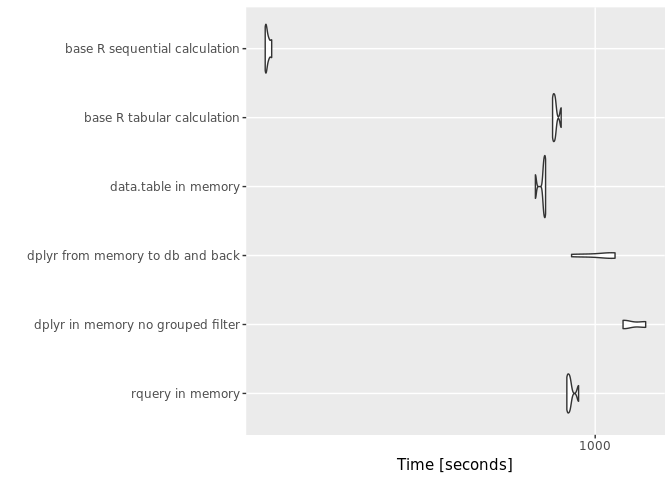

QTiming3
================
Win-Vector LLC
1/11/2018

Let's time [`rquery`](https://winvector.github.io/rquery/), [`dplyr`](https://CRAN.R-project.org/package=dplyr), and [`data.table`](https://CRAN.R-project.org/package=data.table) on a non-trivial example.

These timings are on an Amazon m4.2xlarge (8 vCPU, 32GB RAM) running Ubuntu Server 16.04 LTS (HVM),with the database being PostgreSQL 9.6.5 on a db.4.2xlarge instance.

First let's load our packages, establish a database connection, and declare an [`rquery` ad hoc execution service](https://winvector.github.io/rquery/articles/AdHocQueries.html) (the "`winvector_temp_db_handle`").

``` r
library("rquery")
```

    ## Loading required package: wrapr

    ## Loading required package: cdata

``` r
library("dplyr")
```

    ## 
    ## Attaching package: 'dplyr'

    ## The following objects are masked from 'package:stats':
    ## 
    ##     filter, lag

    ## The following objects are masked from 'package:base':
    ## 
    ##     intersect, setdiff, setequal, union

``` r
library("microbenchmark")
library("ggplot2")

db <- DBI::dbConnect(RPostgres::Postgres(),
                     host = 'wvdbtest.cv9xgzsc2qa1.us-west-2.rds.amazonaws.com',
                     port = 5432,
                     user = 'wvdbinstance',
                     password = 'wvdb9327262643664',
                     dbname = 'wvdb')

winvector_temp_db_handle <- list(db = db)

packageVersion("rquery")
```

    ## [1] '0.2.0'

``` r
packageVersion("dplyr")
```

    ## [1] '0.7.4'

``` r
packageVersion("dbplyr")
```

    ## [1] '1.2.0'

``` r
packageVersion("DBI")
```

    ## [1] '0.7'

``` r
packageVersion("data.table")
```

    ## [1] '1.10.4.3'

``` r
packageVersion("RPostgres")
```

    ## [1] '1.0.4'

``` r
print(db)
```

    ## <PqConnection> wvdb@wvdbtest.cv9xgzsc2qa1.us-west-2.rds.amazonaws.com:5432

``` r
DBI::dbGetQuery(db, "SELECT version()")
```

    ##                                                                                                   version
    ## 1 PostgreSQL 9.6.5 on x86_64-pc-linux-gnu, compiled by gcc (GCC) 4.8.3 20140911 (Red Hat 4.8.3-9), 64-bit

``` r
R.Version()
```

    ## $platform
    ## [1] "x86_64-pc-linux-gnu"
    ## 
    ## $arch
    ## [1] "x86_64"
    ## 
    ## $os
    ## [1] "linux-gnu"
    ## 
    ## $system
    ## [1] "x86_64, linux-gnu"
    ## 
    ## $status
    ## [1] ""
    ## 
    ## $major
    ## [1] "3"
    ## 
    ## $minor
    ## [1] "2.3"
    ## 
    ## $year
    ## [1] "2015"
    ## 
    ## $month
    ## [1] "12"
    ## 
    ## $day
    ## [1] "10"
    ## 
    ## $`svn rev`
    ## [1] "69752"
    ## 
    ## $language
    ## [1] "R"
    ## 
    ## $version.string
    ## [1] "R version 3.2.3 (2015-12-10)"
    ## 
    ## $nickname
    ## [1] "Wooden Christmas-Tree"

We now build and extended version of the example from [Let’s Have Some Sympathy For The Part-time R User](http://www.win-vector.com/blog/2017/08/lets-have-some-sympathy-for-the-part-time-r-user/).

``` r
nrep <- 10


mkData <- function(nrep) {
  dLocal <- data.frame(
    subjectID = c(1,                   
                  1,
                  2,                   
                  2),
    surveyCategory = c(
      'withdrawal behavior',
      'positive re-framing',
      'withdrawal behavior',
      'positive re-framing'
    ),
    assessmentTotal = c(5,                 
                        2,
                        3,                  
                        4),
    stringsAsFactors = FALSE)
  norig <- nrow(dLocal)
  dLocal <- dLocal[rep(seq_len(norig), nrep), , drop=FALSE]
  dLocal$subjectID <- paste((seq_len(nrow(dLocal)) -1)%/% norig,
                            dLocal$subjectID, 
                            sep = "_")
  rownames(dLocal) <- NULL

  dLocal
}

dLocal <- mkData(nrep)
dR <- rquery::dbi_copy_to(db, 'dR',
                          dLocal,
                          temporary = TRUE, 
                          overwrite = TRUE)
dTbl <- dplyr::tbl(db, dR$table_name)
```

    ## Warning: replacing previous import by 'rlang::enquo' when loading 'dbplyr'

    ## Warning: replacing previous import by 'rlang::quo' when loading 'dbplyr'

    ## Warning: replacing previous import by 'rlang::quos' when loading 'dbplyr'

    ## Warning: replacing previous import by 'rlang::quo_name' when loading
    ## 'dbplyr'

``` r
head(dLocal)
```

    ##   subjectID      surveyCategory assessmentTotal
    ## 1       0_1 withdrawal behavior               5
    ## 2       0_1 positive re-framing               2
    ## 3       0_2 withdrawal behavior               3
    ## 4       0_2 positive re-framing               4
    ## 5       1_1 withdrawal behavior               5
    ## 6       1_1 positive re-framing               2

``` r
cdata::qlook(db, dR$table_name)
```

    ## table "dR" PqConnection 
    ##  nrow: 40 
    ##  NOTE: "obs" below is count of sample, not number of rows of data.
    ## 'data.frame':    10 obs. of  3 variables:
    ##  $ subjectID      : chr  "0_1" "0_1" "0_2" "0_2" ...
    ##  $ surveyCategory : chr  "withdrawal behavior" "positive re-framing" "withdrawal behavior" "positive re-framing" ...
    ##  $ assessmentTotal: num  5 2 3 4 5 2 3 4 5 2

``` r
dplyr::glimpse(dTbl)
```

    ## Observations: NA
    ## Variables: 3
    ## $ subjectID       <chr> "0_1", "0_1", "0_2", "0_2", "1_1", "1_1", "1_2...
    ## $ surveyCategory  <chr> "withdrawal behavior", "positive re-framing", ...
    ## $ assessmentTotal <dbl> 5, 2, 3, 4, 5, 2, 3, 4, 5, 2, 3, 4, 5, 2, 3, 4...

Now we declare our operation pipelines, both on local (in-memory `data.frame`) and remote (already in a database) data.

``` r
scale <- 0.237

# base-R function
# could also try base::split() or base:table()
base_r_calculate_tabular <- function(d) {
  d <- d[order(d$subjectID, d$surveyCategory), , drop=FALSE]
  # compute un-normalized probability
  d$probability <- exp(d$assessmentTotal * scale)
  # set up of for selection
  dmax <- stats::aggregate(d$probability, 
                           by = list(subjectID = d$subjectID), 
                           FUN = max)
  maxv <- dmax$x
  names(maxv) <- dmax$subjectID
  # set up for normalization
  dsum <- stats::aggregate(d$probability, 
                           by = list(subjectID = d$subjectID), 
                           FUN = sum)
  sumv <- dsum$x
  names(sumv) <- dsum$subjectID
  # start selection
  d$maxv <- maxv[d$subjectID]
  d <- d[d$probability >= d$maxv, 
                   , 
                   drop=FALSE]
  # de-dup
  d$rownum <- seq_len(nrow(d))
  drow <-  stats::aggregate(d$rownum, 
                           by = list(subjectID = d$subjectID), 
                           FUN = min)
  minv <- drow$x
  names(minv) <- drow$subjectID
  d$rmin <- minv[d$subjectID]
  d <- d[d$rownum <= d$rmin, , drop=FALSE]
  # renormalize
  d$probability <- d$probability/sumv[d$subjectID]
  d <- d[, c("subjectID", "surveyCategory", "probability")]
  colnames(d)[[2]] <- "diagnosis"
  d
}

# base-R function
# could also try base::split() or base:table()
base_r_calculate_sequenced <- function(d) {
  cats <- base::sort(base::unique(d$surveyCategory))
  res <- NULL
  for(ci in cats) {
    di <- d[d$surveyCategory == ci, , drop=FALSE]
    di <- di[base::order(di$subjectID), , drop=FALSE]
    di$probability <- exp(di$assessmentTotal * scale)
    if(length(base::unique(di$subjectID))!=nrow(di)) {
      stop("base_r_calculate repeated subjectID")
    }
    if(is.null(res)) {
      res <- data.frame(subjectID = di$subjectID,
                        totalProb = di$probability,
                        bestScore = di$probability,
                        diagnosis = ci,
                        stringsAsFactors = FALSE)
    } else {
      if((nrow(di)!=nrow(res)) ||
         (!all(di$subjectID == res$subjectID))) {
        stop("base_r_calculate saw irregular data")
      }
      change <- di$probability > res$bestScore
      res$diagnosis[change] <- ci
      res$bestScore <- base::pmax(res$bestScore, 
                                  di$probability)
      res$totalProb <- res$totalProb + di$probability
    }
  }
  res$probability <- res$bestScore/res$totalProb
  res <- res[, c("subjectID", 
                 "diagnosis", 
                 "probability")]
  res
}


# base-R function
# could also try base::split() or base:table()
base_r_calculate_rows <- function(d) {
  d <- d[base::order(d$subjectID, d$surveyCategory), , drop=FALSE]
  d$probability <- exp(d$assessmentTotal * scale)
  ids <- sort(unique(d$subjectID))
  totals <- numeric(length(ids))
  names(totals) <- ids
  n <- nrow(d)
  choices <- logical(n)
  sum <- 0
  maxID <- 1
  for(i in seq_len(n)) {
    id <- d$subjectID[[i]]
    probi <- d$probability[[i]]
    sum <- sum + probi
    if(probi>d$probability[[maxID]]) {
      maxID <- i
    }
    end_of_group <- (i>=n) || (d$subjectID[[i+1]]!=id)
    if(end_of_group) {
      choices[[maxID]] <- TRUE
      totals[id] <- sum
      sum <- 0
      maxID <- i+1
    }
  }
  d <- d[choices, , drop=FALSE]
  d$probability <- d$probability/totals[d$subjectID]
  d <- d[, c("subjectID", 
               "surveyCategory", 
               "probability")]
  colnames(d)[[2]] <- "diagnosis"
  d
}

# this is a function, 
# so body not evaluated until used
rquery_pipeline <- . := {
  extend_nse(.,
             probability :=
               exp(assessmentTotal * scale)/
               sum(exp(assessmentTotal * scale)),
             count := count(1),
             partitionby = 'subjectID') %.>%
    extend_nse(.,
               rank := rank(),
               partitionby = 'subjectID',
               orderby = c('probability', 'surveyCategory'))  %.>%
    rename_columns(., 'diagnosis' := 'surveyCategory') %.>%
    select_rows_nse(., rank == count) %.>%
    select_columns(., c('subjectID', 
                        'diagnosis', 
                        'probability')) %.>%
    orderby(., 'subjectID') 
}


base_R_row_calculation <- function() {
  base_r_calculate_rows(dLocal)
}

base_R_sequential_calculation <- function() {
  base_r_calculate_sequenced(dLocal)
}

base_R_tabular_calculation <- function() {
  base_r_calculate_tabular(dLocal)
}

rquery_local <- function() {
  dLocal %.>% 
    rquery_pipeline(.) %.>%
    as.data.frame(.) # force execution
}

rquery_database_pull <- function() {
  dR %.>% 
    rquery_pipeline(.) %.>% 
    to_sql(., db) %.>% 
    DBI::dbGetQuery(db, .) %.>%
    as.data.frame(.) # shouldn't be needed
}

rquery_database_land <- function() {
  tabName <- "rquery_tmpx"
  sqlc <- dR %.>% 
    rquery_pipeline(.) %.>% 
    to_sql(., db)
  DBI::dbExecute(db, paste("CREATE TABLE", tabName, "AS", sqlc))
  DBI::dbExecute(db, paste("DROP TABLE", tabName))
  NULL
}

rquery_database_count <- function() {
  dR %.>% 
    rquery_pipeline(.) %.>% 
    sql_node(., "n" := "COUNT(1)") %.>% 
    to_sql(., db) %.>% 
    DBI::dbGetQuery(db, .) %.>%
    as.data.frame(.) # shouldn't be needed
}

# this is a function, 
# so body not evaluated until used
dplyr_pipeline <- . %>%
  group_by(subjectID) %>%
  mutate(probability =
           exp(assessmentTotal * scale)/
           sum(exp(assessmentTotal * scale), na.rm = TRUE)) %>%
  arrange(probability, surveyCategory) %>%
  filter(row_number() == n()) %>%
  ungroup() %>%
  rename(diagnosis = surveyCategory) %>%
  select(subjectID, diagnosis, probability) %>%
  arrange(subjectID)

# this is a function, 
# so body not evaluated until used
# pipeline re-factored to have filter outside
# mutate 
# work around: https://github.com/tidyverse/dplyr/issues/3294
dplyr_pipeline2 <- . %>%
  group_by(subjectID) %>%
  mutate(probability =
           exp(assessmentTotal * scale)/
           sum(exp(assessmentTotal * scale), na.rm = TRUE)) %>%
  arrange(probability, surveyCategory) %>%
  mutate(count = n(), rank = row_number()) %>%
  ungroup() %>%
  filter(count == rank) %>%
  rename(diagnosis = surveyCategory) %>%
  select(subjectID, diagnosis, probability) %>%
  arrange(subjectID)


dplyr_local <- function() {
  dLocal %>% 
    dplyr_pipeline
}

dplyr_local_no_grouped_filter <- function() {
  dLocal %>% 
    dplyr_pipeline2
}

dplyr_tbl <- function() {
  dLocal %>%
    as_tibble %>%
    dplyr_pipeline
}

dplyr_round_trip <- function() {
  dTmp <- dplyr::copy_to(db, dLocal, "dplyr_tmp",
                         # overwrite = TRUE,
                         temporary = TRUE
  )
  res <- dTmp %>% 
    dplyr_pipeline %>%
    collect()
  dplyr::db_drop_table(db, "dplyr_tmp")
  res
}

dplyr_database_pull <- function() {
  dTbl %>% 
    dplyr_pipeline %>%
    collect()
}

dplyr_database_land <- function() {
  tabName = "dplyr_ctmpx"
  dTbl %>% 
    dplyr_pipeline %>%
    compute(name = tabName)
  dplyr::db_drop_table(db, table = tabName)
  NULL
}

dplyr_database_count <- function() {
  dTbl %>% 
    dplyr_pipeline %>%
    tally() %>%
    collect()
}

.datatable.aware <- TRUE

data.table_local <- function() {
  dDT <- data.table::data.table(dLocal)
  dDT[
    , one := 1 ][
      , probability := exp ( assessmentTotal * scale ) / 
        sum ( exp ( assessmentTotal * scale ) ) ,subjectID ][
          , count := sum ( one ) ,subjectID ][
            , rank := rank ( probability ) ,subjectID ][
              rank == count ][
                , diagnosis := surveyCategory ][
                  , c('subjectID', 'diagnosis', 'probability') ][
                    order(subjectID) ]
}
```

Let's inspect the functions.

``` r
head(base_R_sequential_calculation())
```

    ##   subjectID           diagnosis probability
    ## 1       0_1 withdrawal behavior   0.6706221
    ## 2       0_2 positive re-framing   0.5589742
    ## 3       1_1 withdrawal behavior   0.6706221
    ## 4       1_2 positive re-framing   0.5589742
    ## 5       2_1 withdrawal behavior   0.6706221
    ## 6       2_2 positive re-framing   0.5589742

``` r
head(base_R_row_calculation())
```

    ##    subjectID           diagnosis probability
    ## 1        0_1 withdrawal behavior   0.6706221
    ## 4        0_2 positive re-framing   0.5589742
    ## 5        1_1 withdrawal behavior   0.6706221
    ## 8        1_2 positive re-framing   0.5589742
    ## 9        2_1 withdrawal behavior   0.6706221
    ## 12       2_2 positive re-framing   0.5589742

``` r
head(base_R_tabular_calculation())
```

    ##    subjectID           diagnosis probability
    ## 1        0_1 withdrawal behavior   0.6706221
    ## 4        0_2 positive re-framing   0.5589742
    ## 5        1_1 withdrawal behavior   0.6706221
    ## 8        1_2 positive re-framing   0.5589742
    ## 9        2_1 withdrawal behavior   0.6706221
    ## 12       2_2 positive re-framing   0.5589742

``` r
head(rquery_local())
```

    ##   subjectID           diagnosis probability
    ## 1       0_1 withdrawal behavior   0.6706221
    ## 2       0_2 positive re-framing   0.5589742
    ## 3       1_1 withdrawal behavior   0.6706221
    ## 4       1_2 positive re-framing   0.5589742
    ## 5       2_1 withdrawal behavior   0.6706221
    ## 6       2_2 positive re-framing   0.5589742

``` r
rquery_database_land()
```

    ## NULL

``` r
head(rquery_database_pull())
```

    ##   subjectID           diagnosis probability
    ## 1       0_1 withdrawal behavior   0.6706221
    ## 2       0_2 positive re-framing   0.5589742
    ## 3       1_1 withdrawal behavior   0.6706221
    ## 4       1_2 positive re-framing   0.5589742
    ## 5       2_1 withdrawal behavior   0.6706221
    ## 6       2_2 positive re-framing   0.5589742

``` r
rquery_database_count()
```

    ##    n
    ## 1 20

``` r
head(dplyr_local())
```

    ## # A tibble: 6 x 3
    ##   subjectID diagnosis           probability
    ##   <chr>     <chr>                     <dbl>
    ## 1 0_1       withdrawal behavior       0.671
    ## 2 0_2       positive re-framing       0.559
    ## 3 1_1       withdrawal behavior       0.671
    ## 4 1_2       positive re-framing       0.559
    ## 5 2_1       withdrawal behavior       0.671
    ## 6 2_2       positive re-framing       0.559

``` r
head(dplyr_tbl())
```

    ## # A tibble: 6 x 3
    ##   subjectID diagnosis           probability
    ##   <chr>     <chr>                     <dbl>
    ## 1 0_1       withdrawal behavior       0.671
    ## 2 0_2       positive re-framing       0.559
    ## 3 1_1       withdrawal behavior       0.671
    ## 4 1_2       positive re-framing       0.559
    ## 5 2_1       withdrawal behavior       0.671
    ## 6 2_2       positive re-framing       0.559

``` r
head(dplyr_local_no_grouped_filter())
```

    ## # A tibble: 6 x 3
    ##   subjectID diagnosis           probability
    ##   <chr>     <chr>                     <dbl>
    ## 1 0_1       withdrawal behavior       0.671
    ## 2 0_2       positive re-framing       0.559
    ## 3 1_1       withdrawal behavior       0.671
    ## 4 1_2       positive re-framing       0.559
    ## 5 2_1       withdrawal behavior       0.671
    ## 6 2_2       positive re-framing       0.559

``` r
dplyr_database_land()
```

    ## NULL

``` r
head(dplyr_database_pull())
```

    ## # A tibble: 6 x 3
    ##   subjectID diagnosis           probability
    ##   <chr>     <chr>                     <dbl>
    ## 1 0_1       withdrawal behavior       0.671
    ## 2 0_2       positive re-framing       0.559
    ## 3 1_1       withdrawal behavior       0.671
    ## 4 1_2       positive re-framing       0.559
    ## 5 2_1       withdrawal behavior       0.671
    ## 6 2_2       positive re-framing       0.559

``` r
dplyr_database_count()
```

    ## # A tibble: 1 x 1
    ##   n              
    ##   <S3: integer64>
    ## 1 20

``` r
head(dplyr_round_trip())
```

    ## # A tibble: 6 x 3
    ##   subjectID diagnosis           probability
    ##   <chr>     <chr>                     <dbl>
    ## 1 0_1       withdrawal behavior       0.671
    ## 2 0_2       positive re-framing       0.559
    ## 3 1_1       withdrawal behavior       0.671
    ## 4 1_2       positive re-framing       0.559
    ## 5 2_1       withdrawal behavior       0.671
    ## 6 2_2       positive re-framing       0.559

``` r
head(data.table_local())
```

    ##    subjectID           diagnosis probability
    ## 1:       0_1 withdrawal behavior   0.6706221
    ## 2:       0_2 positive re-framing   0.5589742
    ## 3:       1_1 withdrawal behavior   0.6706221
    ## 4:       1_2 positive re-framing   0.5589742
    ## 5:       2_1 withdrawal behavior   0.6706221
    ## 6:       2_2 positive re-framing   0.5589742

Now let's measure the speeds with `microbenchmark`.

``` r
timings <- NULL

expressions <- list(
    "rquery in memory" = bquote({ nrow(rquery_local())}),
    # "rquery from db to memory" =  bquote({nrow(rquery_database_pull())}),
    # "rquery database count" =  bquote({rquery_database_count()}),
    # "rquery database land" =  bquote({rquery_database_land()}),
    # "dplyr in memory" =  bquote({nrow(dplyr_local())}),
    # "dplyr tbl in memory" =  bquote({nrow(dplyr_tbl())}),
    "dplyr in memory no grouped filter" =  bquote({nrow(dplyr_local_no_grouped_filter())}),
    "dplyr from memory to db and back" =  bquote({nrow(dplyr_round_trip())}),
    # "dplyr from db to memory" =  bquote({nrow(dplyr_database_pull())}),
    # "dplyr database count" =  bquote({dplyr_database_count()}),
    # "dplyr database land" =  bquote({dplyr_database_land()}),
    "data.table in memory" =  bquote({nrow(data.table_local())}),
    # "base R row calculation" =  bquote({nrow(base_R_row_calculation())}),
    "base R tabular calculation" =  bquote({nrow(base_R_tabular_calculation())}),
    "base R sequential calculation" =  bquote({nrow(base_R_sequential_calculation())})
)

prune <- FALSE

for(nrep in c(1, 10, 100, 1000, 10000, 100000, 1000000, 10000000)) {
  print(nrep)
  dLocal <- mkData(nrep)
  dR <- rquery::dbi_copy_to(db, 'dR',
                            dLocal,
                            temporary = TRUE, 
                            overwrite = TRUE)
  dTbl <- dplyr::tbl(db, dR$table_name)
  tm <- microbenchmark(
    list = expressions,
    times = 5L
  )
  print(tm)
  print(autoplot(tm))
  tmi <- as.data.frame(tm)
  tmi$data_size <- nrow(dLocal)
  timings <- rbind(timings, tmi)
  if(prune) {
    baddies <- unique(tmi$expr[tmi$time > 10*1e+9])
    for(bi in baddies) {
      expressions[[bi]] <- NULL
    }
    if(length(expressions)<=0) {
      break
    }
  }
}
```

    ## [1] 1
    ## Unit: milliseconds
    ##                               expr        min         lq       mean
    ##                   rquery in memory  46.324159  48.183634  49.310796
    ##  dplyr in memory no grouped filter  26.788895  27.275612  27.732604
    ##   dplyr from memory to db and back 173.891020 174.189346 178.636315
    ##               data.table in memory   3.473662   3.498580   3.599451
    ##         base R tabular calculation   3.088106   3.161192   3.260904
    ##      base R sequential calculation   1.075883   1.124854   1.185887
    ##      median         uq        max neval
    ##   50.123158  50.347420  51.575611     5
    ##   27.764663  28.130379  28.703469     5
    ##  178.285425 178.863897 187.951887     5
    ##    3.594901   3.712650   3.717462     5
    ##    3.291621   3.357134   3.406468     5
    ##    1.183520   1.235367   1.309813     5


    ## [1] 10
    ## Unit: milliseconds
    ##                               expr        min         lq       mean
    ##                   rquery in memory  46.332578  48.082346  52.187341
    ##  dplyr in memory no grouped filter  27.646922  28.666360  31.694855
    ##   dplyr from memory to db and back 175.746348 176.316812 178.158038
    ##               data.table in memory   3.983312   4.227204   4.341616
    ##         base R tabular calculation   3.411689   3.509302   3.555573
    ##      base R sequential calculation   1.043478   1.131573   1.161713
    ##      median         uq        max neval
    ##   52.222000  55.510396  58.789386     5
    ##   33.389204  34.052052  34.719738     5
    ##  177.728396 180.313121 180.685513     5
    ##    4.318913   4.540961   4.637688     5
    ##    3.523786   3.645053   3.688037     5
    ##    1.184523   1.222802   1.226190     5


    ## [1] 100
    ## Unit: milliseconds
    ##                               expr        min         lq       mean
    ##                   rquery in memory  49.865983  50.485939  53.413201
    ##  dplyr in memory no grouped filter  35.312055  35.362969  35.907474
    ##   dplyr from memory to db and back 181.853120 183.903600 185.216291
    ##               data.table in memory  10.380560  10.650434  11.046772
    ##         base R tabular calculation   5.819893   6.086304   6.481996
    ##      base R sequential calculation   1.326963   1.422999   1.451894
    ##      median         uq        max neval
    ##   54.629807  54.830511  57.253764     5
    ##   35.924245  36.415454  36.522646     5
    ##  184.006237 185.257133 191.061364     5
    ##   10.711475  10.921668  12.569723     5
    ##    6.191851   6.192510   8.119424     5
    ##    1.456803   1.462733   1.589971     5


    ## [1] 1000
    ## Unit: milliseconds
    ##                               expr        min         lq       mean
    ##                   rquery in memory  81.586347  81.607713  83.582439
    ##  dplyr in memory no grouped filter 104.327675 104.881652 106.812803
    ##   dplyr from memory to db and back 223.292069 229.458127 236.316152
    ##               data.table in memory  72.967432  73.340635  73.746494
    ##         base R tabular calculation  31.399260  32.044896  32.131249
    ##      base R sequential calculation   4.359541   4.462624   4.523377
    ##      median         uq        max neval
    ##   82.020117  85.445675  87.252341     5
    ##  105.405029 107.377640 112.072020     5
    ##  234.167332 237.162827 257.500405     5
    ##   73.362203  74.517521  74.544679     5
    ##   32.072949  32.169228  32.969911     5
    ##    4.463229   4.535819   4.795671     5


    ## [1] 10000
    ## Unit: milliseconds
    ##                               expr       min        lq      mean    median
    ##                   rquery in memory 424.89125 430.39894 454.74810 431.22990
    ##  dplyr in memory no grouped filter 781.46278 793.97010 802.78232 810.74481
    ##   dplyr from memory to db and back 762.60124 841.59005 847.88785 853.76564
    ##               data.table in memory 649.14291 656.53872 688.02318 657.08379
    ##         base R tabular calculation 376.85232 382.55135 429.47088 458.65120
    ##      base R sequential calculation  51.86469  54.20335  55.33465  55.49878
    ##        uq       max neval
    ##  458.5617 528.65876     5
    ##  813.3737 814.36021     5
    ##  869.8993 911.58301     5
    ##  735.3109 742.03958     5
    ##  463.2684 466.03111     5
    ##   57.5316  57.57482     5


    ## [1] 1e+05
    ## Unit: milliseconds
    ##                               expr      min       lq      mean    median
    ##                   rquery in memory 5376.253 5501.719 5870.3518 6068.0499
    ##  dplyr in memory no grouped filter 8387.286 8659.954 8780.7881 8762.3095
    ##   dplyr from memory to db and back 5992.362 6937.301 7445.6252 6979.1186
    ##               data.table in memory 6461.384 6543.666 6561.4020 6545.9676
    ##         base R tabular calculation 5067.914 5103.878 5175.6114 5155.0283
    ##      base R sequential calculation  728.734  759.571  792.7058  813.6133
    ##         uq       max neval
    ##  6140.2615 6265.4756     5
    ##  9021.9783 9072.4124     5
    ##  8509.9160 8809.4283     5
    ##  6556.4499 6699.5418     5
    ##  5181.4211 5369.8151     5
    ##   819.2773  842.3336     5


    ## [1] 1e+06
    ## Unit: seconds
    ##                               expr       min        lq      mean    median
    ##                   rquery in memory  68.60368  69.38575  70.18406  69.75315
    ##  dplyr in memory no grouped filter 107.45930 110.08533 111.19072 111.44929
    ##   dplyr from memory to db and back  81.62889  83.69661  85.51284  84.03793
    ##               data.table in memory  71.66364  71.77992  73.97552  73.53838
    ##         base R tabular calculation  65.00310  66.08329  66.87646  67.07839
    ##      base R sequential calculation  10.76004  10.91342  11.09889  11.10886
    ##         uq       max neval
    ##   69.75682  73.42092     5
    ##  113.00212 113.95758     5
    ##   85.49109  92.70969     5
    ##   75.10842  77.78724     5
    ##   67.90382  68.31371     5
    ##   11.26212  11.45003     5


    ## [1] 1e+07
    ## Unit: seconds
    ##                               expr       min        lq      mean    median
    ##                   rquery in memory  846.5814  850.4437  865.5435  859.1271
    ##  dplyr in memory no grouped filter 1177.7971 1185.1572 1247.5744 1185.7105
    ##   dplyr from memory to db and back  870.4090  968.2674 1033.5964 1087.6149
    ##               data.table in memory  703.7039  737.8843  735.0846  740.7278
    ##         base R tabular calculation  778.4903  781.5992  791.7916  788.0760
    ##      base R sequential calculation  143.8619  144.5055  145.8529  144.6778
    ##         uq       max neval
    ##   864.5941  906.9712     5
    ##  1343.9602 1345.2470     5
    ##  1118.0272 1123.6636     5
    ##   746.0217  747.0852     5
    ##   792.0335  818.7591     5
    ##   146.7830  149.4362     5



``` r
saveRDS(timings, "qtimings3.RDS")
```

`rquery` appears to be relatively fast. Some of the time for "`rquery` local" is because `rquery` doesn't *really* have a local mode, it has to copy the data to the database and back in that case.

``` r
sessionInfo()
```

    ## R version 3.2.3 (2015-12-10)
    ## Platform: x86_64-pc-linux-gnu (64-bit)
    ## Running under: Ubuntu 16.04.3 LTS
    ## 
    ## locale:
    ##  [1] LC_CTYPE=en_US.UTF-8       LC_NUMERIC=C              
    ##  [3] LC_TIME=en_US.UTF-8        LC_COLLATE=en_US.UTF-8    
    ##  [5] LC_MONETARY=en_US.UTF-8    LC_MESSAGES=en_US.UTF-8   
    ##  [7] LC_PAPER=en_US.UTF-8       LC_NAME=C                 
    ##  [9] LC_ADDRESS=C               LC_TELEPHONE=C            
    ## [11] LC_MEASUREMENT=en_US.UTF-8 LC_IDENTIFICATION=C       
    ## 
    ## attached base packages:
    ## [1] stats     graphics  grDevices utils     datasets  methods   base     
    ## 
    ## other attached packages:
    ## [1] bindrcpp_0.2         ggplot2_2.2.1        microbenchmark_1.4-3
    ## [4] dplyr_0.7.4          rquery_0.2.0         cdata_0.5.1         
    ## [7] wrapr_1.1.0         
    ## 
    ## loaded via a namespace (and not attached):
    ##  [1] Rcpp_0.12.14        dbplyr_1.2.0        pillar_1.0.1       
    ##  [4] plyr_1.8.4          bindr_0.1           tools_3.2.3        
    ##  [7] RPostgres_1.0-4     digest_0.6.13       bit_1.1-12         
    ## [10] evaluate_0.10.1     tibble_1.4.1        gtable_0.2.0       
    ## [13] pkgconfig_2.0.1     rlang_0.1.6         cli_1.0.0          
    ## [16] DBI_0.7             yaml_2.1.16         withr_2.1.1        
    ## [19] stringr_1.2.0       knitr_1.18          hms_0.4.0          
    ## [22] tidyselect_0.2.3    rprojroot_1.3-2     bit64_0.9-7        
    ## [25] grid_3.2.3          data.table_1.10.4-3 glue_1.2.0         
    ## [28] R6_2.2.2            rmarkdown_1.8       purrr_0.2.4        
    ## [31] blob_1.1.0          magrittr_1.5        backports_1.1.2    
    ## [34] scales_0.5.0        htmltools_0.3.6     assertthat_0.2.0   
    ## [37] colorspace_1.3-2    utf8_1.1.3          stringi_1.1.6      
    ## [40] lazyeval_0.2.1      munsell_0.4.3       crayon_1.3.4

``` r
winvector_temp_db_handle <- NULL
DBI::dbDisconnect(db)
```
