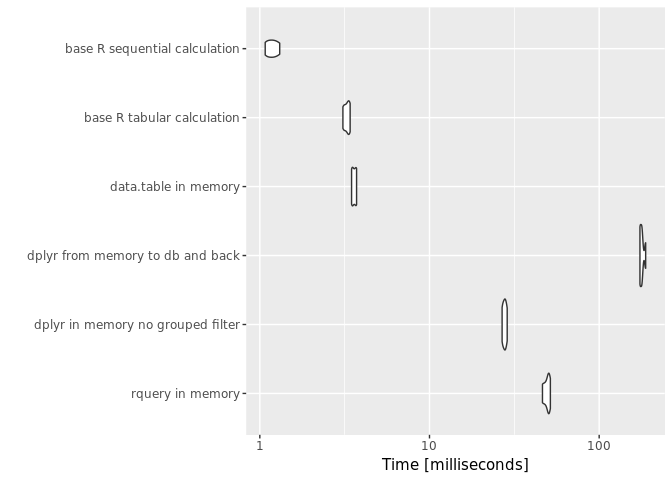
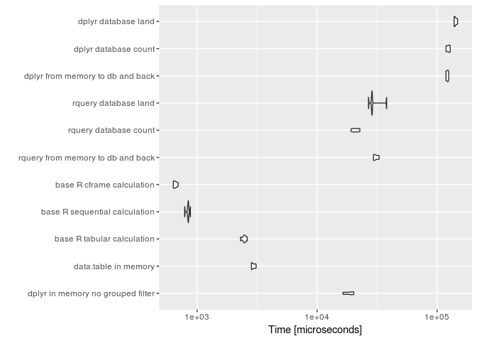
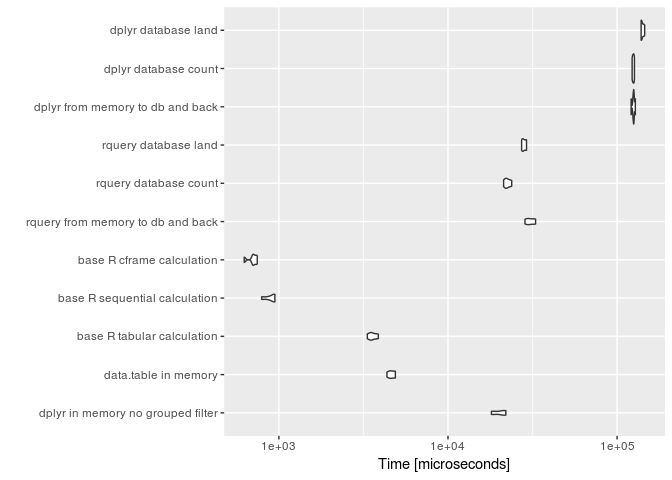
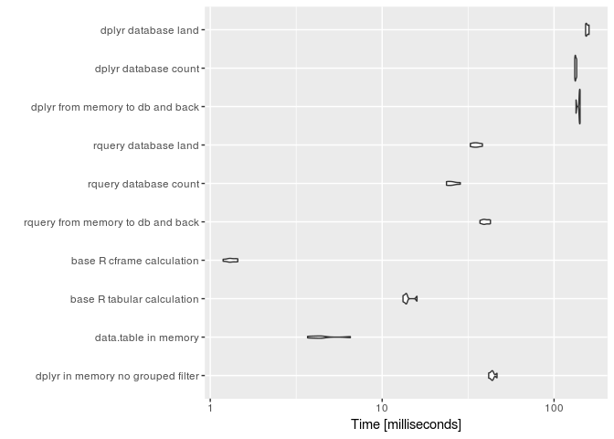
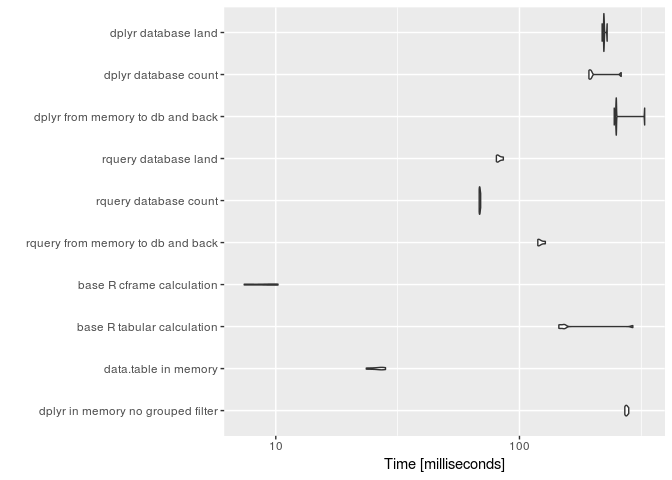
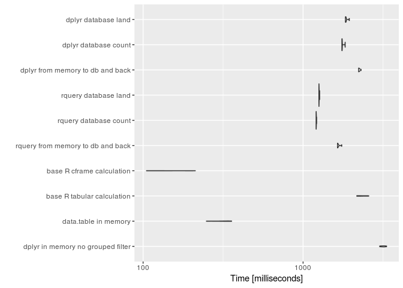
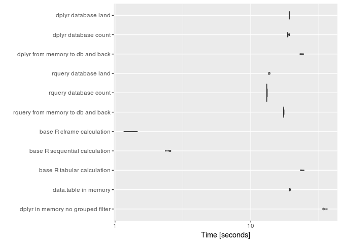

QTiming3
================
Win-Vector LLC
1/13/2018

Let's time [`rquery`](https://winvector.github.io/rquery/), [`dplyr`](https://CRAN.R-project.org/package=dplyr), and [`data.table`](https://CRAN.R-project.org/package=data.table) on a non-trivial example.

These timings are on an Amazon EC2 c5.4xlarge 16 vcpu 32GB RAM, 128GB block storage, Ubuntu Server 16.04 LTS (HVM).

First let's load our packages, establish a database connection, and declare an [`rquery` ad hoc execution service](https://winvector.github.io/rquery/articles/AdHocQueries.html) (the "`winvector_temp_db_handle`").

``` r
library("data.table")  # load first so we can overwrite := with rquery
library("rquery")
```

    ## Loading required package: wrapr

    ## 
    ## Attaching package: 'wrapr'

    ## The following object is masked from 'package:data.table':
    ## 
    ##     :=

    ## Loading required package: cdata

``` r
library("dplyr")
```

    ## 
    ## Attaching package: 'dplyr'

    ## The following objects are masked from 'package:data.table':
    ## 
    ##     between, first, last

    ## The following objects are masked from 'package:stats':
    ## 
    ##     filter, lag

    ## The following objects are masked from 'package:base':
    ## 
    ##     intersect, setdiff, setequal, union

``` r
library("microbenchmark")
library("ggplot2")
source("cscan.R")
source("fns.R")

db <- NULL
db <- DBI::dbConnect(RPostgres::Postgres(),
                     host = 'localhost',
                     port = 5432,
                     user = 'ruser',
                     password = 'ruser')
if(!is.null(db)) {
  winvector_temp_db_handle <- list(db = db)
  print(db)
  DBI::dbGetQuery(db, "SELECT version()", stringsAsFactors = FALSE)
}
```

    ## <PqConnection> ruser@localhost:5432

    ##                                                                                                            version
    ## 1 PostgreSQL 9.5.10 on x86_64-pc-linux-gnu, compiled by gcc (Ubuntu 5.4.0-6ubuntu1~16.04.4) 5.4.0 20160609, 64-bit

``` r
packageVersion("rquery")
```

    ## [1] '0.2.0'

``` r
packageVersion("dplyr")
```

    ## [1] '0.7.4'

``` r
packageVersion("dbplyr")
```

    ## [1] '1.2.0'

``` r
packageVersion("DBI")
```

    ## [1] '0.7'

``` r
packageVersion("data.table")
```

    ## [1] '1.10.4.3'

``` r
packageVersion("RPostgres")
```

    ## [1] '1.0.4'

``` r
R.Version()
```

    ## $platform
    ## [1] "x86_64-pc-linux-gnu"
    ## 
    ## $arch
    ## [1] "x86_64"
    ## 
    ## $os
    ## [1] "linux-gnu"
    ## 
    ## $system
    ## [1] "x86_64, linux-gnu"
    ## 
    ## $status
    ## [1] ""
    ## 
    ## $major
    ## [1] "3"
    ## 
    ## $minor
    ## [1] "2.3"
    ## 
    ## $year
    ## [1] "2015"
    ## 
    ## $month
    ## [1] "12"
    ## 
    ## $day
    ## [1] "10"
    ## 
    ## $`svn rev`
    ## [1] "69752"
    ## 
    ## $language
    ## [1] "R"
    ## 
    ## $version.string
    ## [1] "R version 3.2.3 (2015-12-10)"
    ## 
    ## $nickname
    ## [1] "Wooden Christmas-Tree"

We now build and extended version of the example from [Let’s Have Some Sympathy For The Part-time R User](http://www.win-vector.com/blog/2017/08/lets-have-some-sympathy-for-the-part-time-r-user/).

``` r
nrep <- 10

dLocal <- mkData(nrep)
head(dLocal)
```

    ##   subjectID      surveyCategory assessmentTotal
    ## 1        s1 withdrawal behavior               6
    ## 2        s1 positive re-framing               5
    ## 3       s10 withdrawal behavior               4
    ## 4       s10 positive re-framing               9
    ## 5        s2 withdrawal behavior               9
    ## 6        s2 positive re-framing               9

``` r
dR <- NULL
dTbl <- NULL

if(!is.null(db)) {
  dR <- rquery::dbi_copy_to(db, 'dR',
                            dLocal,
                            temporary = TRUE, 
                            overwrite = TRUE)
  dTbl <- dplyr::tbl(db, dR$table_name)
  
  cdata::qlook(db, dR$table_name)
  
  dplyr::glimpse(dTbl)
}
```

    ## Warning: replacing previous import by 'rlang::enquo' when loading 'dbplyr'

    ## Warning: replacing previous import by 'rlang::quo' when loading 'dbplyr'

    ## Warning: replacing previous import by 'rlang::quos' when loading 'dbplyr'

    ## Warning: replacing previous import by 'rlang::quo_name' when loading
    ## 'dbplyr'

    ## table "dR" PqConnection 
    ##  nrow: 20 
    ##  NOTE: "obs" below is count of sample, not number of rows of data.
    ## 'data.frame':    10 obs. of  3 variables:
    ##  $ subjectID      : chr  "s1" "s1" "s10" "s10" ...
    ##  $ surveyCategory : chr  "withdrawal behavior" "positive re-framing" "withdrawal behavior" "positive re-framing" ...
    ##  $ assessmentTotal: num  6 5 4 9 9 9 4 7 7 5
    ## Observations: NA
    ## Variables: 3
    ## $ subjectID       <chr> "s1", "s1", "s10", "s10", "s2", "s2", "s3", "s...
    ## $ surveyCategory  <chr> "withdrawal behavior", "positive re-framing", ...
    ## $ assessmentTotal <dbl> 6, 5, 4, 9, 9, 9, 4, 7, 7, 5, 5, 5, 9, 5, 8, 8...

Now we declare our operation pipelines, both on local (in-memory `data.frame`) and remote (already in a database) data.

``` r
scale <- 0.237

base_R_row_calculation <- function() {
  base_r_calculate_rows(dLocal)
}

base_R_sequential_calculation <- function() {
  base_r_calculate_sequenced(dLocal)
}

base_R_cframe_calculation <- function() {
  base_r_calculate_cframe(dLocal)
}


base_R_tabular_calculation <- function() {
  base_r_calculate_tabular(dLocal)
}

rquery_local <- function() {
  dLocal %.>% 
    rquery_pipeline(.) %.>%
    as.data.frame(., stringsAsFactors = FALSE) # force execution
}

rquery_database_pull <- function() {
  dR %.>% 
    rquery_pipeline(.) %.>% 
    to_sql(., db) %.>% 
    DBI::dbGetQuery(db, ., stringsAsFactors = FALSE) %.>%
    as.data.frame(., stringsAsFactors = FALSE) # shouldn't be needed
}

rquery_database_land <- function() {
  tabName <- "rquery_tmpx"
  sqlc <- dR %.>% 
    rquery_pipeline(.) %.>% 
    to_sql(., db)
  DBI::dbExecute(db, paste("CREATE TABLE", tabName, "AS", sqlc))
  DBI::dbExecute(db, paste("DROP TABLE", tabName))
  NULL
}

rquery_database_count <- function() {
  dR %.>% 
    rquery_pipeline(.) %.>% 
    sql_node(., "n" := "COUNT(1)") %.>% 
    to_sql(., db) %.>% 
    DBI::dbGetQuery(db, ., stringsAsFactors = FALSE) %.>%
    as.data.frame(., stringsAsFactors = FALSE) # shouldn't be needed
}


dplyr_local <- function() {
  dLocal %>% 
    dplyr_pipeline
}

dplyr_local_no_grouped_filter <- function() {
  dLocal %>% 
    dplyr_pipeline2
}

dplyr_tbl <- function() {
  dLocal %>%
    as_tibble %>%
    dplyr_pipeline
}

dplyr_round_trip <- function() {
  dTmp <- dplyr::copy_to(db, dLocal, "dplyr_tmp",
                         # overwrite = TRUE,
                         temporary = TRUE
  )
  res <- dTmp %>% 
    dplyr_pipeline %>%
    collect()
  dplyr::db_drop_table(db, "dplyr_tmp")
  res
}

dplyr_database_pull <- function() {
  dTbl %>% 
    dplyr_pipeline %>%
    collect()
}

dplyr_database_land <- function() {
  tabName = "dplyr_ctmpx"
  dTbl %>% 
    dplyr_pipeline %>%
    compute(name = tabName)
  dplyr::db_drop_table(db, table = tabName)
  NULL
}

dplyr_database_count <- function() {
  dTbl %>% 
    dplyr_pipeline %>%
    tally() %>%
    collect()
}
```

Let's inspect the functions.

``` r
check <- base_R_sequential_calculation()
head(check)
```

    ##   subjectID           diagnosis probability
    ## 1        s1 withdrawal behavior   0.5589742
    ## 2       s10 positive re-framing   0.7658456
    ## 3        s2 positive re-framing   0.5000000
    ## 4        s3 positive re-framing   0.6706221
    ## 5        s4 withdrawal behavior   0.6163301
    ## 6        s5 positive re-framing   0.5000000

``` r
if(!equiv_res(check, base_R_cframe_calculation())) {
  stop("mismatch")
}

if(!equiv_res(check, base_R_row_calculation())) {
  stop("mismatch")
}

if(!equiv_res(check, base_R_tabular_calculation())) {
  stop("mismatch")
}

if(!equiv_res(check, dplyr_local())) {
  stop("mismatch")
}

if(!equiv_res(check, dplyr_tbl())) {
  stop("mismatch")
}

if(!equiv_res(check, dplyr_local_no_grouped_filter())) {
  stop("mismatch")
}

if(!equiv_res(check, data.table_local())) {
  stop("mismatch")
}

if(!is.null(db)) {
  head(rquery_local())
  
  rquery_database_land()
  
  head(rquery_database_pull())
  
  rquery_database_count()
  
  dplyr_database_land()
  
  head(dplyr_database_pull())
  
  dplyr_database_count()
  
  head(dplyr_round_trip())
}
```

    ## # A tibble: 6 x 3
    ##   subjectID diagnosis           probability
    ##   <chr>     <chr>                     <dbl>
    ## 1 s1        withdrawal behavior       0.559
    ## 2 s10       positive re-framing       0.766
    ## 3 s2        positive re-framing       0.500
    ## 4 s3        positive re-framing       0.671
    ## 5 s4        withdrawal behavior       0.616
    ## 6 s5        positive re-framing       0.500

Now let's measure the speeds with `microbenchmark`.

``` r
timings <- NULL


expressions <- list(
    # "rquery in memory" = bquote({ nrow(rquery_local())}),
    # "rquery from db to memory" =  bquote({nrow(rquery_database_pull())}),
    # "rquery database count" =  bquote({rquery_database_count()}),
    # "rquery database land" =  bquote({rquery_database_land()}),
    # "dplyr in memory" =  bquote({nrow(dplyr_local())}),
    # "dplyr tbl in memory" =  bquote({nrow(dplyr_tbl())}),
    "dplyr in memory no grouped filter" =  bquote({nrow(dplyr_local_no_grouped_filter())}),
    # "dplyr from memory to db and back" =  bquote({nrow(dplyr_round_trip())}),
    # "dplyr from db to memory" =  bquote({nrow(dplyr_database_pull())}),
    # "dplyr database count" =  bquote({dplyr_database_count()}),
    # "dplyr database land" =  bquote({dplyr_database_land()}),
    "data.table in memory" =  bquote({nrow(data.table_local())}),
    # "base R row calculation" =  bquote({nrow(base_R_row_calculation())}),
    "base R tabular calculation" =  bquote({nrow(base_R_tabular_calculation())}),
    # "base R sequential calculation" =  bquote({nrow(base_R_sequential_calculation())}),
    "base R cframe calculation" =  bquote({nrow(base_R_cframe_calculation())})
)

if(!is.null(db)) {
  expressions <- 
    c(expressions,
      list(
        "rquery from memory to db and back" = bquote({ nrow(rquery_local())}),
        # "rquery from db to memory" =  bquote({nrow(rquery_database_pull())}),
        "rquery database count" =  bquote({rquery_database_count()}),
        "rquery database land" =  bquote({rquery_database_land()}),
        # "dplyr in memory" =  bquote({nrow(dplyr_local())}),
        # "dplyr tbl in memory" =  bquote({nrow(dplyr_tbl())}),
        "dplyr from memory to db and back" =  bquote({nrow(dplyr_round_trip())}),
        # "dplyr from db to memory" =  bquote({nrow(dplyr_database_pull())}),
        "dplyr database count" =  bquote({dplyr_database_count()}),
        "dplyr database land" =  bquote({dplyr_database_land()})
      ))
}

prune <- FALSE

for(nrep in c(1,
              10, 
              100, 
              1000,
              10000,
              100000, 
              1000000)) {
  print(nrep)
  dLocal <- mkData(nrep)
  dR <- NULL
  dTbl <- NULL
  if(!is.null(db)) {
    dR <- rquery::dbi_copy_to(db, 'dR',
                              dLocal,
                              temporary = TRUE, 
                              overwrite = TRUE)
    dTbl <- dplyr::tbl(db, dR$table_name)
  }
  tm <- microbenchmark(
    list = expressions,
    times = 5L
  )
  print(tm)
  print(autoplot(tm))
  tmi <- as.data.frame(tm, stringsAsFactors = FALSE)
  tmi$data_size <- nrow(dLocal)
  timings <- rbind(timings, tmi)
  if(prune) {
    baddies <- unique(tmi$expr[tmi$time > 10*1e+9])
    for(bi in baddies) {
      expressions[[bi]] <- NULL
    }
    if(length(expressions)<=0) {
      break
    }
  }
}
```

    ## [1] 1
    ## Unit: microseconds
    ##                               expr        min         lq       mean
    ##  dplyr in memory no grouped filter  15338.788  19036.670  18593.379
    ##               data.table in memory   1662.126   1672.794   3072.087
    ##         base R tabular calculation   2187.931   2379.563   2404.897
    ##          base R cframe calculation    675.522    696.980    717.700
    ##  rquery from memory to db and back  31406.549  31740.547  33338.703
    ##              rquery database count  18780.868  20282.950  21712.430
    ##               rquery database land  27457.926  28056.460  29021.864
    ##   dplyr from memory to db and back 119025.954 123540.051 124317.322
    ##               dplyr database count 122541.825 124135.219 126502.442
    ##                dplyr database land 145138.862 145595.627 146407.931
    ##      median         uq        max neval
    ##   19249.693  19658.015  19683.727     5
    ##    1919.354   4120.800   5985.362     5
    ##    2379.959   2517.521   2559.510     5
    ##     698.121    734.649    783.228     5
    ##   33782.165  34256.567  35507.687     5
    ##   21356.590  23769.515  24372.227     5
    ##   28626.948  29745.939  31222.049     5
    ##  123724.723 127246.116 128049.766     5
    ##  127276.791 127561.638 130996.739     5
    ##  146388.305 146502.412 148414.448     5



    ## [1] 10
    ## Unit: microseconds
    ##                               expr        min         lq        mean
    ##  dplyr in memory no grouped filter  18870.937  19286.067  19973.4462
    ##               data.table in memory   1655.116   1755.354   2480.5236
    ##         base R tabular calculation   2343.834   2345.192   2496.0480
    ##          base R cframe calculation    525.113    691.282    690.3464
    ##  rquery from memory to db and back  31321.619  32031.248  32778.7492
    ##              rquery database count  19062.622  20644.153  21921.7116
    ##               rquery database land  27296.210  27681.421  28611.0944
    ##   dplyr from memory to db and back 124433.369 124757.158 126618.1136
    ##               dplyr database count 124214.809 127018.139 128261.5918
    ##                dplyr database land 143080.528 144163.629 146868.5102
    ##      median         uq        max neval
    ##   19311.044  20049.843  22349.340     5
    ##    1786.227   1962.590   5243.331     5
    ##    2484.715   2621.976   2684.523     5
    ##     732.204    733.422    769.711     5
    ##   32462.206  33979.150  34099.523     5
    ##   21897.580  23405.046  24599.157     5
    ##   28191.787  28831.024  31055.030     5
    ##  127154.633 127300.152 129445.256     5
    ##  129709.545 130087.774 130277.692     5
    ##  146150.359 150393.519 150554.516     5



    ## [1] 100
    ## Unit: microseconds
    ##                               expr        min         lq        mean
    ##  dplyr in memory no grouped filter  18079.903  18747.484  19338.6432
    ##               data.table in memory   1859.226   1930.501   1966.4774
    ##         base R tabular calculation   3288.598   3391.036   3553.8174
    ##          base R cframe calculation    651.643    768.429    775.3362
    ##  rquery from memory to db and back  29673.603  32587.595  32604.6416
    ##              rquery database count  19671.249  24304.388  23653.9888
    ##               rquery database land  28714.467  29128.118  29423.8486
    ##   dplyr from memory to db and back 124594.139 127462.851 127500.4058
    ##               dplyr database count 126252.314 128765.145 128966.1954
    ##                dplyr database land 144034.736 145536.670 148234.2918
    ##      median         uq        max neval
    ##   19357.658  19653.919  20854.252     5
    ##    1934.979   1998.853   2108.828     5
    ##    3662.614   3708.429   3718.410     5
    ##     794.424    794.576    867.609     5
    ##   32666.467  33942.789  34152.754     5
    ##   24529.376  24770.494  24994.437     5
    ##   29517.821  29721.479  30037.358     5
    ##  127541.418 127771.308 130132.313     5
    ##  129087.518 130293.260 130432.740     5
    ##  150054.289 150538.510 151007.254     5



    ## [1] 1000
    ## Unit: milliseconds
    ##                               expr        min         lq       mean
    ##  dplyr in memory no grouped filter  41.669266  42.873415  43.796340
    ##               data.table in memory   3.682479   3.980896   4.610004
    ##         base R tabular calculation  13.222129  13.525646  14.078577
    ##          base R cframe calculation   1.188108   1.293311   1.324195
    ##  rquery from memory to db and back  37.072830  39.156482  39.914949
    ##              rquery database count  23.671654  23.771139  25.435870
    ##               rquery database land  32.582648  33.990675  35.271958
    ##   dplyr from memory to db and back 134.237987 140.345135 139.736060
    ##               dplyr database count 131.961448 132.807203 133.606659
    ##                dplyr database land 152.609256 154.101480 156.114603
    ##      median         uq        max neval
    ##   43.709275  44.149520  46.580223     5
    ##    4.335196   4.517598   6.533851     5
    ##   13.798789  13.896269  15.950052     5
    ##    1.298499   1.394970   1.446087     5
    ##   39.188521  41.508619  42.648294     5
    ##   25.340912  25.905563  28.490084     5
    ##   35.143678  36.331037  38.311754     5
    ##  140.633850 141.731156 141.732174     5
    ##  133.266336 134.564607 135.433699     5
    ##  154.411428 159.675056 159.775796     5



    ## [1] 10000
    ## Unit: milliseconds
    ##                               expr        min         lq       mean
    ##  dplyr in memory no grouped filter 270.580330 272.840970 275.292867
    ##               data.table in memory  23.517347  25.163182  26.172828
    ##         base R tabular calculation 145.061017 147.455977 178.034501
    ##          base R cframe calculation   7.420634   7.661288   8.875186
    ##  rquery from memory to db and back 118.923719 119.304256 121.950075
    ##              rquery database count  68.343990  68.486905  68.761428
    ##               rquery database land  80.400823  81.188162  82.532121
    ##   dplyr from memory to db and back 244.809173 248.780670 263.881755
    ##               dplyr database count 192.736813 193.496348 208.218886
    ##                dplyr database land 218.356046 221.805119 222.770915
    ##     median        uq       max neval
    ##  275.07216 277.20408 280.76679     5
    ##   26.75385  27.22781  28.20195     5
    ##  152.84506 152.93907 291.87138     5
    ##    9.51209   9.57242  10.20950     5
    ##  120.51347 123.31732 127.69160     5
    ##   68.75817  68.92269  69.29539     5
    ##   81.69450  83.52576  85.85136     5
    ##  249.59314 249.82084 326.40495     5
    ##  196.07564 197.29680 261.48883     5
    ##  221.97174 222.72415 228.99752     5



    ## [1] 1e+05
    ## Unit: milliseconds
    ##                               expr       min        lq      mean    median
    ##  dplyr in memory no grouped filter 3011.3576 3091.1754 3166.2591 3178.2724
    ##               data.table in memory  248.6617  291.4997  313.2098  331.8304
    ##         base R tabular calculation 2165.7096 2191.7528 2334.1805 2260.4626
    ##          base R cframe calculation  104.9475  118.8578  150.2384  121.4462
    ##  rquery from memory to db and back 1640.2021 1640.4987 1667.0926 1648.0574
    ##              rquery database count 1205.7596 1206.5030 1209.3348 1208.2432
    ##               rquery database land 1255.2696 1256.7907 1259.7461 1257.4221
    ##   dplyr from memory to db and back 2223.1486 2225.7326 2250.1954 2236.2688
    ##               dplyr database count 1747.6373 1748.4614 1767.8373 1754.6093
    ##                dplyr database land 1838.9779 1839.7384 1866.8273 1852.7373
    ##         uq       max neval
    ##  3223.0675 3327.4226     5
    ##   336.6443  357.4129     5
    ##  2479.9885 2572.9891     5
    ##   193.8714  212.0690     5
    ##  1661.5123 1745.1923     5
    ##  1210.2553 1215.9128     5
    ##  1259.6461 1269.6018     5
    ##  2261.2730 2304.5538     5
    ##  1755.3619 1833.1166     5
    ##  1856.5201 1946.1630     5



    ## [1] 1e+06
    ## Unit: seconds
    ##                               expr       min        lq      mean    median
    ##  dplyr in memory no grouped filter 37.980387 38.184488 38.651868 38.712456
    ##               data.table in memory  2.459652  2.651128  2.686921  2.679885
    ##         base R tabular calculation 25.395699 26.108122 26.199090 26.268544
    ##          base R cframe calculation  1.526913  1.608347  1.656960  1.613296
    ##  rquery from memory to db and back 17.504701 17.768584 17.838068 17.797738
    ##              rquery database count 13.418296 13.426367 13.427267 13.428227
    ##               rquery database land 13.797673 13.817904 13.849136 13.826181
    ##   dplyr from memory to db and back 24.673877 24.707222 24.848534 24.777941
    ##               dplyr database count 20.381686 20.432038 20.497489 20.523414
    ##                dplyr database land 20.833475 20.842960 20.907055 20.888795
    ##         uq       max neval
    ##  39.090250 39.291760     5
    ##   2.725343  2.918595     5
    ##  26.361834 26.861252     5
    ##   1.653220  1.883024     5
    ##  17.823212 18.296107     5
    ##  13.430719 13.432725     5
    ##  13.901715 13.902209     5
    ##  24.813286 25.270344     5
    ##  20.542342 20.607965     5
    ##  20.959950 21.010094     5



``` r
saveRDS(timings, "qtimings3.RDS")
```

``` r
sessionInfo()
```

    ## R version 3.2.3 (2015-12-10)
    ## Platform: x86_64-pc-linux-gnu (64-bit)
    ## Running under: Ubuntu 16.04.3 LTS
    ## 
    ## locale:
    ##  [1] LC_CTYPE=en_US.UTF-8       LC_NUMERIC=C              
    ##  [3] LC_TIME=en_US.UTF-8        LC_COLLATE=en_US.UTF-8    
    ##  [5] LC_MONETARY=en_US.UTF-8    LC_MESSAGES=en_US.UTF-8   
    ##  [7] LC_PAPER=en_US.UTF-8       LC_NAME=C                 
    ##  [9] LC_ADDRESS=C               LC_TELEPHONE=C            
    ## [11] LC_MEASUREMENT=en_US.UTF-8 LC_IDENTIFICATION=C       
    ## 
    ## attached base packages:
    ## [1] stats     graphics  grDevices utils     datasets  methods   base     
    ## 
    ## other attached packages:
    ## [1] bindrcpp_0.2         ggplot2_2.2.1        microbenchmark_1.4-3
    ## [4] dplyr_0.7.4          rquery_0.2.0         cdata_0.5.1         
    ## [7] wrapr_1.1.0          data.table_1.10.4-3 
    ## 
    ## loaded via a namespace (and not attached):
    ##  [1] Rcpp_0.12.14     dbplyr_1.2.0     pillar_1.1.0     plyr_1.8.4      
    ##  [5] bindr_0.1        tools_3.2.3      RPostgres_1.0-4  digest_0.6.14   
    ##  [9] bit_1.1-12       evaluate_0.10.1  tibble_1.4.1     gtable_0.2.0    
    ## [13] pkgconfig_2.0.1  rlang_0.1.6      cli_1.0.0        DBI_0.7         
    ## [17] yaml_2.1.16      withr_2.1.1      stringr_1.2.0    knitr_1.18      
    ## [21] hms_0.4.0        tidyselect_0.2.3 rprojroot_1.3-2  bit64_0.9-7     
    ## [25] grid_3.2.3       glue_1.2.0       R6_2.2.2         rmarkdown_1.8   
    ## [29] purrr_0.2.4      blob_1.1.0       magrittr_1.5     backports_1.1.2 
    ## [33] scales_0.5.0     htmltools_0.3.6  assertthat_0.2.0 colorspace_1.3-2
    ## [37] utf8_1.1.3       stringi_1.1.6    lazyeval_0.2.1   munsell_0.4.3   
    ## [41] crayon_1.3.4

``` r
winvector_temp_db_handle <- NULL
if(!is.null(db)) {
  DBI::dbDisconnect(db)
  db <- NULL
}
```
