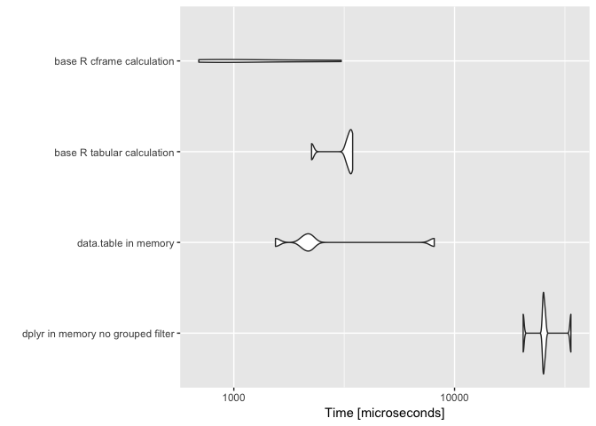
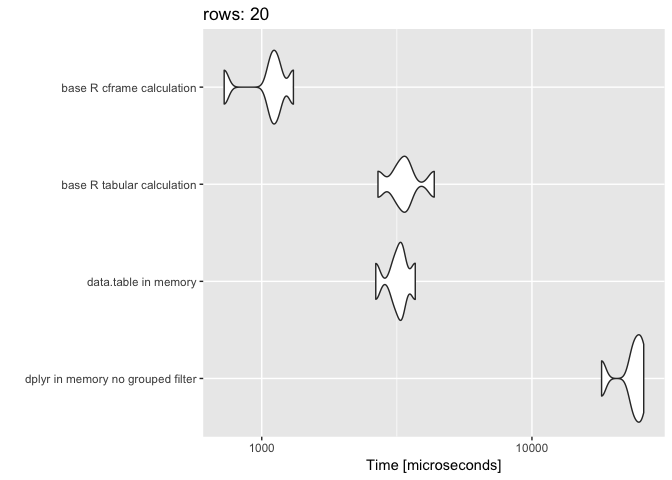
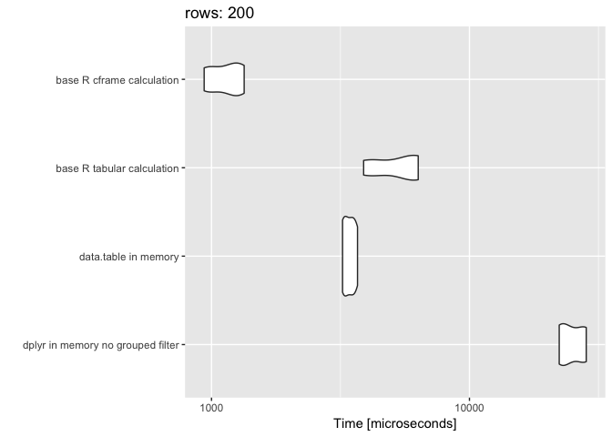
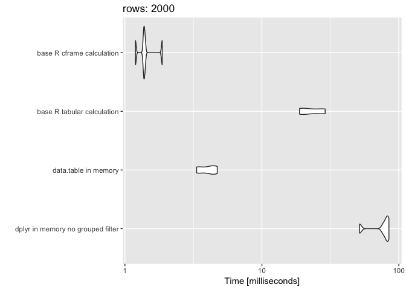
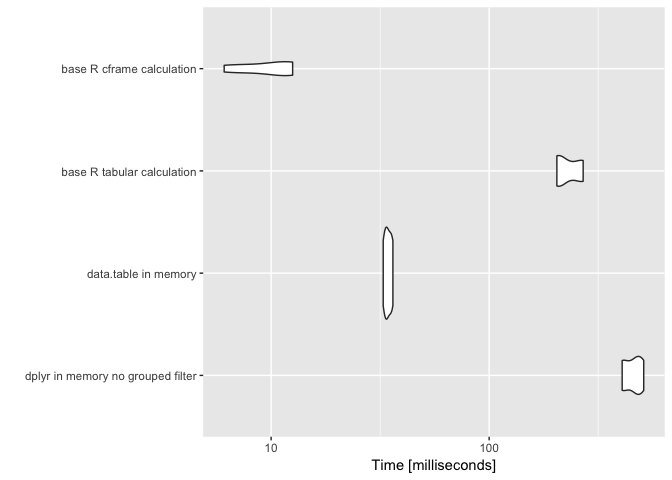
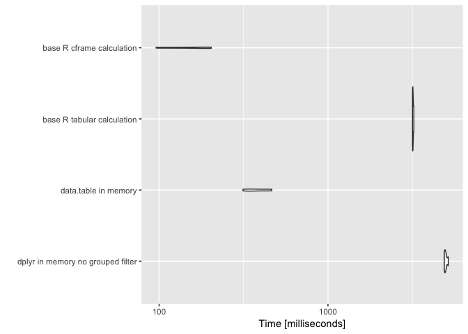
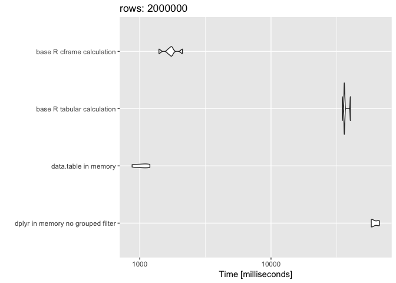

QTiming4
================
Win-Vector LLC
1/15/2018

Let's time [`rquery`](https://winvector.github.io/rquery/), [`dplyr`](https://CRAN.R-project.org/package=dplyr), and [`data.table`](https://CRAN.R-project.org/package=data.table) on a non-trivial example.

These timings are on a late 2014 Mac Mini with 8GB of RAM running OSX 10.12.6, R version 3.4.3 (2017-11-30) -- "Kite-Eating Tree", and the current (2018-01-07) CRAN versions of all packages (except `rquery`, which is not yet up on CRAN). We are getting database services from PostgreSQL version `9.6.1` in a docker container.

First let's load our packages, establish a database connection, and declare an [`rquery` ad hoc execution service](https://winvector.github.io/rquery/articles/AdHocQueries.html) (the "`winvector_temp_db_handle`").

``` r
library("rquery")
```

    ## Loading required package: wrapr

    ## Loading required package: cdata

``` r
library("dplyr")
```

    ## 
    ## Attaching package: 'dplyr'

    ## The following objects are masked from 'package:stats':
    ## 
    ##     filter, lag

    ## The following objects are masked from 'package:base':
    ## 
    ##     intersect, setdiff, setequal, union

``` r
library("microbenchmark")
library("data.table")
```

    ## 
    ## Attaching package: 'data.table'

    ## The following objects are masked from 'package:dplyr':
    ## 
    ##     between, first, last

    ## The following object is masked from 'package:wrapr':
    ## 
    ##     :=

``` r
library("ggplot2")
source("cscan.R")
source("fns.R")


db <- NULL
# db <- DBI::dbConnect(RPostgres::Postgres(),
#                      host = 'localhost',
#                      port = 5432,
#                      user = 'postgres',
#                      password = 'pg')
if(!is.null(db)) {
  winvector_temp_db_handle <- list(db = db)
  print(db)
  DBI::dbGetQuery(db, "SELECT version()", stringsAsFactors = FALSE)
}

packageVersion("rquery")
```

    ## [1] '0.2.0'

``` r
packageVersion("dplyr")
```

    ## [1] '0.7.4'

``` r
packageVersion("dbplyr")
```

    ## [1] '1.2.0'

``` r
packageVersion("DBI")
```

    ## [1] '0.7'

``` r
packageVersion("data.table")
```

    ## [1] '1.10.4.3'

``` r
packageVersion("RPostgres")
```

    ## [1] '1.0.4'

``` r
R.Version()
```

    ## $platform
    ## [1] "x86_64-apple-darwin15.6.0"
    ## 
    ## $arch
    ## [1] "x86_64"
    ## 
    ## $os
    ## [1] "darwin15.6.0"
    ## 
    ## $system
    ## [1] "x86_64, darwin15.6.0"
    ## 
    ## $status
    ## [1] ""
    ## 
    ## $major
    ## [1] "3"
    ## 
    ## $minor
    ## [1] "4.3"
    ## 
    ## $year
    ## [1] "2017"
    ## 
    ## $month
    ## [1] "11"
    ## 
    ## $day
    ## [1] "30"
    ## 
    ## $`svn rev`
    ## [1] "73796"
    ## 
    ## $language
    ## [1] "R"
    ## 
    ## $version.string
    ## [1] "R version 3.4.3 (2017-11-30)"
    ## 
    ## $nickname
    ## [1] "Kite-Eating Tree"

We now build and extended version of the example from [Let’s Have Some Sympathy For The Part-time R User](http://www.win-vector.com/blog/2017/08/lets-have-some-sympathy-for-the-part-time-r-user/).

``` r
nrep <- 10

dLocal <- mkData(nrep)
head(dLocal)
```

    ##   subjectID      surveyCategory assessmentTotal
    ## 1        s1 withdrawal behavior               3
    ## 2        s1 positive re-framing               9
    ## 3       s10 withdrawal behavior               8
    ## 4       s10 positive re-framing               3
    ## 5        s2 withdrawal behavior               2
    ## 6        s2 positive re-framing               8

``` r
dR <- NULL
dTbl <- NULL

if(!is.null(db)) {
  dR <- rquery::dbi_copy_to(db, 'dR',
                            dLocal,
                            temporary = TRUE, 
                            overwrite = TRUE)
  dTbl <- dplyr::tbl(db, dR$table_name)
  
  cdata::qlook(db, dR$table_name)
  
  dplyr::glimpse(dTbl)
}
```

Now we declare our operation pipelines, both on local (in-memory `data.frame`) and remote (already in a database) data.

``` r
scale <- 0.237

base_R_row_calculation <- function() {
  base_r_calculate_rows(dLocal)
}

base_R_sequential_calculation <- function() {
  base_r_calculate_sequenced(dLocal)
}

base_R_cframe_calculation <- function() {
  base_r_calculate_cframe(dLocal)
}


base_R_tabular_calculation <- function() {
  base_r_calculate_tabular(dLocal)
}

rquery_local <- function() {
  dLocal %.>% 
    rquery_pipeline(.) %.>%
    as.data.frame(., stringsAsFactors = FALSE) # force execution
}

rquery_database_pull <- function() {
  dR %.>% 
    rquery_pipeline(.) %.>% 
    to_sql(., db) %.>% 
    DBI::dbGetQuery(db, ., stringsAsFactors = FALSE) %.>%
    as.data.frame(., stringsAsFactors = FALSE) # shouldn't be needed
}

rquery_database_land <- function() {
  tabName <- "rquery_tmpx"
  sqlc <- dR %.>% 
    rquery_pipeline(.) %.>% 
    to_sql(., db)
  DBI::dbExecute(db, paste("CREATE TABLE", tabName, "AS", sqlc))
  DBI::dbExecute(db, paste("DROP TABLE", tabName))
  NULL
}

rquery_database_count <- function() {
  dR %.>% 
    rquery_pipeline(.) %.>% 
    sql_node(., "n" := "COUNT(1)") %.>% 
    to_sql(., db) %.>% 
    DBI::dbGetQuery(db, ., stringsAsFactors = FALSE) %.>%
    as.data.frame(., stringsAsFactors = FALSE) # shouldn't be needed
}


dplyr_local <- function() {
  dLocal %>% 
    dplyr_pipeline
}

dplyr_local_no_grouped_filter <- function() {
  dLocal %>% 
    dplyr_pipeline2
}

dplyr_tbl <- function() {
  dLocal %>%
    as_tibble %>%
    dplyr_pipeline
}

dplyr_round_trip <- function() {
  dTmp <- dplyr::copy_to(db, dLocal, "dplyr_tmp",
                         # overwrite = TRUE,
                         temporary = TRUE
  )
  res <- dTmp %>% 
    dplyr_pipeline %>%
    collect()
  dplyr::db_drop_table(db, "dplyr_tmp")
  res
}

dplyr_database_pull <- function() {
  dTbl %>% 
    dplyr_pipeline %>%
    collect()
}

dplyr_database_land <- function() {
  tabName = "dplyr_ctmpx"
  dTbl %>% 
    dplyr_pipeline %>%
    compute(name = tabName)
  dplyr::db_drop_table(db, table = tabName)
  NULL
}

dplyr_database_count <- function() {
  dTbl %>% 
    dplyr_pipeline %>%
    tally() %>%
    collect()
}
```

Let's inspect the functions.

``` r
check <- base_R_sequential_calculation()
head(check)
```

    ##   subjectID           diagnosis probability
    ## 1        s1 positive re-framing   0.8056518
    ## 2       s10 withdrawal behavior   0.7658456
    ## 3        s2 positive re-framing   0.8056518
    ## 4        s3 withdrawal behavior   0.5589742
    ## 5        s4 positive re-framing   0.6163301
    ## 6        s5 withdrawal behavior   0.6163301

``` r
if(!equiv_res(check, base_R_cframe_calculation())) {
  stop("mismatch")
}

if(!equiv_res(check, base_R_row_calculation())) {
  stop("mismatch")
}

if(!equiv_res(check, base_R_tabular_calculation())) {
  stop("mismatch")
}

if(!equiv_res(check, dplyr_local())) {
  stop("mismatch")
}

if(!equiv_res(check, dplyr_tbl())) {
  stop("mismatch")
}

if(!equiv_res(check, dplyr_local_no_grouped_filter())) {
  stop("mismatch")
}

if(!equiv_res(check, data.table_local())) {
  stop("mismatch")
}

if(!is.null(db)) {
  head(rquery_local())
  
  rquery_database_land()
  
  head(rquery_database_pull())
  
  rquery_database_count()
  
  dplyr_database_land()
  
  head(dplyr_database_pull())
  
  dplyr_database_count()
  
  head(dplyr_round_trip())
}
```

Now let's measure the speeds with `microbenchmark`.

``` r
timings <- NULL


expressions <- list(
    # "rquery in memory" = bquote({ nrow(rquery_local())}),
    # "rquery from db to memory" =  bquote({nrow(rquery_database_pull())}),
    # "rquery database count" =  bquote({rquery_database_count()}),
    # "rquery database land" =  bquote({rquery_database_land()}),
    # "dplyr in memory" =  bquote({nrow(dplyr_local())}),
    # "dplyr tbl in memory" =  bquote({nrow(dplyr_tbl())}),
    "dplyr in memory no grouped filter" =  bquote({nrow(dplyr_local_no_grouped_filter())}),
    # "dplyr from memory to db and back" =  bquote({nrow(dplyr_round_trip())}),
    # "dplyr from db to memory" =  bquote({nrow(dplyr_database_pull())}),
    # "dplyr database count" =  bquote({dplyr_database_count()}),
    # "dplyr database land" =  bquote({dplyr_database_land()}),
    "data.table in memory" =  bquote({nrow(data.table_local())}),
    # "base R row calculation" =  bquote({nrow(base_R_row_calculation())}),
    "base R tabular calculation" =  bquote({nrow(base_R_tabular_calculation())}),
    # "base R sequential calculation" =  bquote({nrow(base_R_sequential_calculation())})
    "base R cframe calculation" =  bquote({nrow(base_R_cframe_calculation())})
)

if(!is.null(db)) {
  expressions <- 
    c(expressions,
      list(
        "rquery from memory to db and back" = bquote({ nrow(rquery_local())}),
        # "rquery from db to memory" =  bquote({nrow(rquery_database_pull())}),
        "rquery database count" =  bquote({rquery_database_count()}),
        "rquery database land" =  bquote({rquery_database_land()}),
        # "dplyr in memory" =  bquote({nrow(dplyr_local())}),
        # "dplyr tbl in memory" =  bquote({nrow(dplyr_tbl())}),
        "dplyr from memory to db and back" =  bquote({nrow(dplyr_round_trip())}),
        # "dplyr from db to memory" =  bquote({nrow(dplyr_database_pull())}),
        "dplyr database count" =  bquote({dplyr_database_count()}),
        "dplyr database land" =  bquote({dplyr_database_land()})
      ))
}

prune <- FALSE

for(nrep in c(1,
              10, 
              100, 
              1000,
              10000,
              100000, 
              1000000)) {
  print(nrep)
  dLocal <- mkData(nrep)
  dR <- NULL
  dTbl <- NULL
  if(!is.null(db)) {
    dR <- rquery::dbi_copy_to(db, 'dR',
                              dLocal,
                              temporary = TRUE, 
                              overwrite = TRUE)
    dTbl <- dplyr::tbl(db, dR$table_name)
  }
  tm <- microbenchmark(
    list = expressions,
    times = 5L
  )
  print(tm)
  print(autoplot(tm))
  tmi <- as.data.frame(tm, stringsAsFactors = FALSE)
  tmi$data_size <- nrow(dLocal)
  timings <- rbind(timings, tmi)
  if(prune) {
    baddies <- unique(tmi$expr[tmi$time > 10*1e+9])
    for(bi in baddies) {
      expressions[[bi]] <- NULL
    }
    if(length(expressions)<=0) {
      break
    }
  }
}
```

    ## [1] 1
    ## Unit: microseconds
    ##                               expr       min        lq      mean    median
    ##  dplyr in memory no grouped filter 20456.661 25218.594 26065.584 25260.418
    ##               data.table in memory  1543.898  2053.692  3224.170  2171.979
    ##         base R tabular calculation  2250.084  3246.387  3140.688  3349.276
    ##          base R cframe calculation   694.016   801.401  1470.955  1072.940
    ##         uq       max neval
    ##  25730.883 33661.363     5
    ##   2260.777  8090.506     5
    ##   3403.702  3453.992     5
    ##   1719.685  3066.734     5



    ## [1] 10
    ## Unit: microseconds
    ##                               expr       min        lq      mean    median
    ##  dplyr in memory no grouped filter 18075.328 18961.904 21128.619 20050.965
    ##               data.table in memory  2039.548  2056.572  2167.230  2088.699
    ##         base R tabular calculation  2574.168  2586.104  3119.151  3123.936
    ##          base R cframe calculation   717.658   774.146   942.837   819.216
    ##         uq       max neval
    ##  22228.320 26326.577     5
    ##   2316.605  2334.726     5
    ##   3654.679  3656.869     5
    ##   1181.305  1221.860     5



    ## [1] 100
    ## Unit: microseconds
    ##                               expr       min        lq      mean    median
    ##  dplyr in memory no grouped filter 22011.682 26295.649 27595.784 27105.854
    ##               data.table in memory  2150.935  2536.765  2825.180  2784.072
    ##         base R tabular calculation  4461.988  5088.133  5712.782  6085.197
    ##          base R cframe calculation   813.244   884.347  1015.407   928.185
    ##         uq       max neval
    ##  29415.315 33150.420     5
    ##   3199.540  3454.590     5
    ##   6312.489  6616.104     5
    ##   1035.777  1415.483     5



    ## [1] 1000
    ## Unit: milliseconds
    ##                               expr       min        lq      mean    median
    ##  dplyr in memory no grouped filter 51.950343 52.497947 60.056860 53.788355
    ##               data.table in memory  4.187219  4.283458  5.293557  5.075521
    ##         base R tabular calculation 18.645295 21.111560 24.992765 26.527032
    ##          base R cframe calculation  1.167351  1.188322  1.322083  1.202917
    ##         uq       max neval
    ##  67.823803 74.223851     5
    ##   6.410136  6.511451     5
    ##  27.694791 30.985146     5
    ##   1.322319  1.729508     5



    ## [1] 10000
    ## Unit: milliseconds
    ##                               expr       min         lq       mean
    ##  dplyr in memory no grouped filter 407.57227 408.732015 456.534921
    ##               data.table in memory  32.67173  33.568880  34.395952
    ##         base R tabular calculation 204.51553 206.352193 231.718029
    ##          base R cframe calculation   6.08986   7.912128   9.934207
    ##     median        uq       max neval
    ##  473.07169 481.51620 511.78242     5
    ##   34.16621  35.38507  36.18787     5
    ##  212.23632 265.52503 269.96108     5
    ##   10.91302  12.20499  12.55103     5



    ## [1] 1e+05
    ## Unit: milliseconds
    ##                               expr        min        lq      mean
    ##  dplyr in memory no grouped filter 4883.60637 4920.4777 4987.7614
    ##               data.table in memory  314.09463  341.8826  386.0243
    ##         base R tabular calculation 3168.06444 3176.0435 3190.6416
    ##          base R cframe calculation   96.01012  123.7556  161.3585
    ##     median        uq       max neval
    ##  4957.4360 5018.8377 5158.4490     5
    ##   366.2532  443.0243  464.8669     5
    ##  3183.9118 3199.3232 3225.8650     5
    ##   189.1735  194.2884  203.5648     5



    ## [1] 1e+06
    ## Unit: seconds
    ##                               expr       min        lq      mean    median
    ##  dplyr in memory no grouped filter 58.452147 58.836308 59.561076 59.124187
    ##               data.table in memory  2.751876  2.966301  3.003676  3.053672
    ##         base R tabular calculation 34.320397 34.862663 35.064516 35.130647
    ##          base R cframe calculation  1.307976  1.344955  1.469113  1.509459
    ##         uq       max neval
    ##  59.709718 61.683019     5
    ##   3.080143  3.166388     5
    ##  35.318436 35.690435     5
    ##   1.563261  1.619915     5



``` r
saveRDS(timings, "qtimings4.RDS")
```

``` r
sessionInfo()
```

    ## R version 3.4.3 (2017-11-30)
    ## Platform: x86_64-apple-darwin15.6.0 (64-bit)
    ## Running under: macOS Sierra 10.12.6
    ## 
    ## Matrix products: default
    ## BLAS: /Library/Frameworks/R.framework/Versions/3.4/Resources/lib/libRblas.0.dylib
    ## LAPACK: /Library/Frameworks/R.framework/Versions/3.4/Resources/lib/libRlapack.dylib
    ## 
    ## locale:
    ## [1] en_US.UTF-8/en_US.UTF-8/en_US.UTF-8/C/en_US.UTF-8/en_US.UTF-8
    ## 
    ## attached base packages:
    ## [1] stats     graphics  grDevices utils     datasets  methods   base     
    ## 
    ## other attached packages:
    ## [1] bindrcpp_0.2         ggplot2_2.2.1        data.table_1.10.4-3 
    ## [4] microbenchmark_1.4-3 dplyr_0.7.4          rquery_0.2.0        
    ## [7] cdata_0.5.1          wrapr_1.1.1         
    ## 
    ## loaded via a namespace (and not attached):
    ##  [1] Rcpp_0.12.14.2   knitr_1.18       bindr_0.1        magrittr_1.5    
    ##  [5] munsell_0.4.3    colorspace_1.3-2 R6_2.2.2         rlang_0.1.6     
    ##  [9] plyr_1.8.4       stringr_1.2.0    tools_3.4.3      grid_3.4.3      
    ## [13] gtable_0.2.0     htmltools_0.3.6  lazyeval_0.2.1   yaml_2.1.16     
    ## [17] rprojroot_1.3-2  digest_0.6.13    assertthat_0.2.0 tibble_1.4.1    
    ## [21] glue_1.2.0       evaluate_0.10.1  rmarkdown_1.8    stringi_1.1.6   
    ## [25] compiler_3.4.3   pillar_1.0.1     scales_0.5.0     backports_1.1.2 
    ## [29] pkgconfig_2.0.1

``` r
winvector_temp_db_handle <- NULL
if(!is.null(db)) {
  DBI::dbDisconnect(db)
  db <- NULL
}
```
