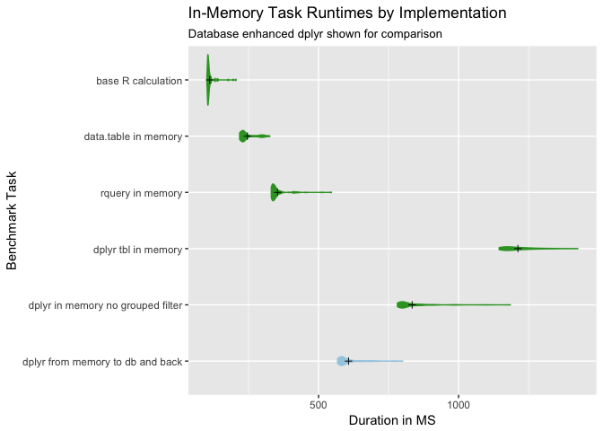
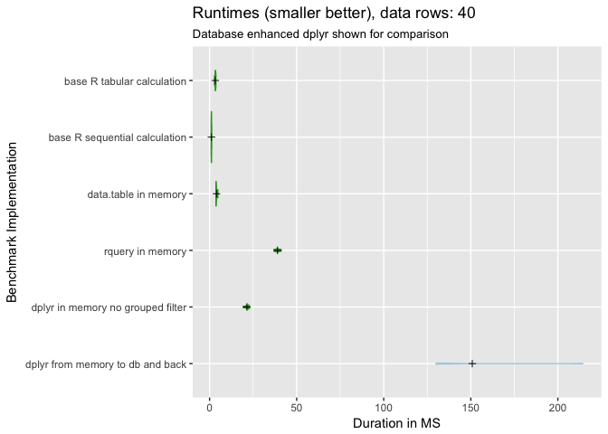
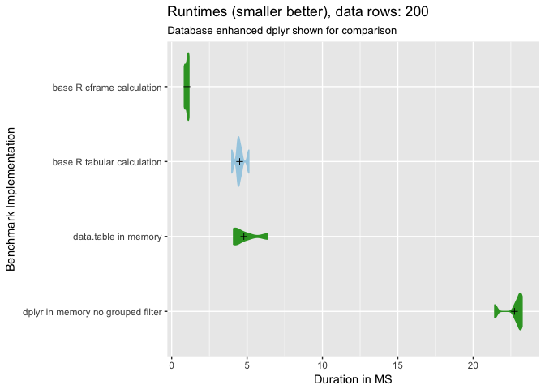
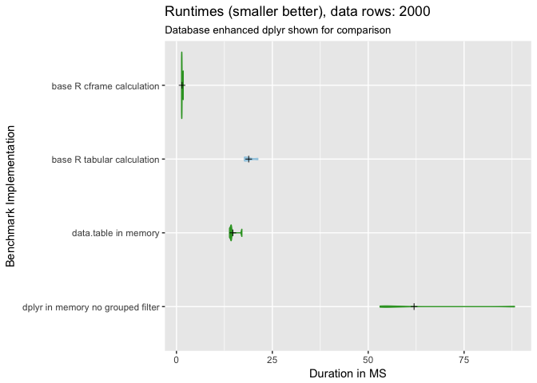
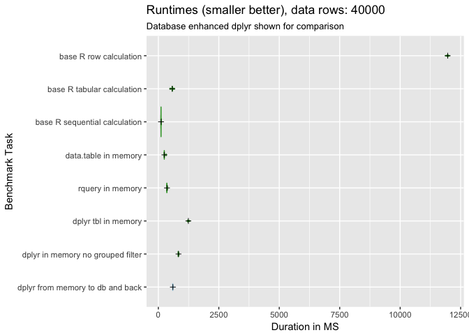
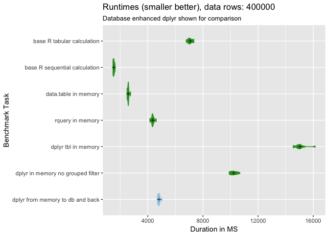
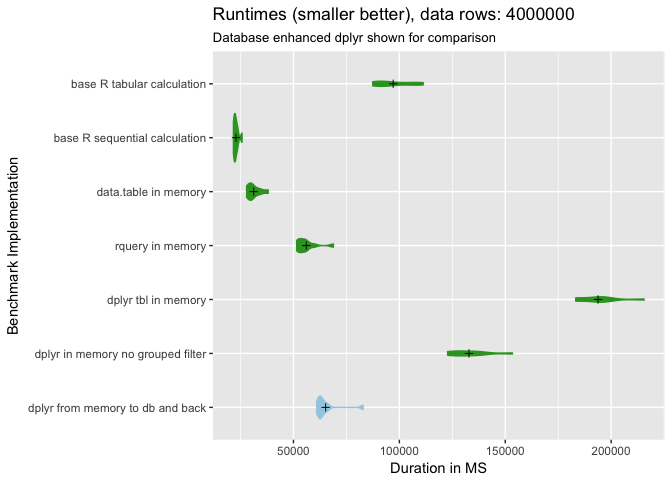
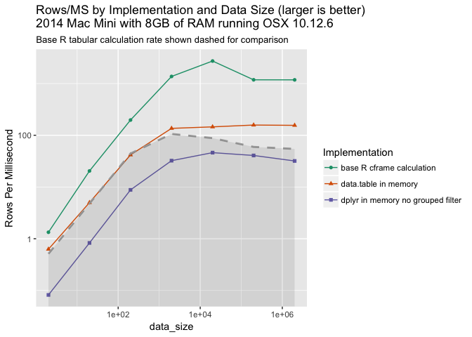
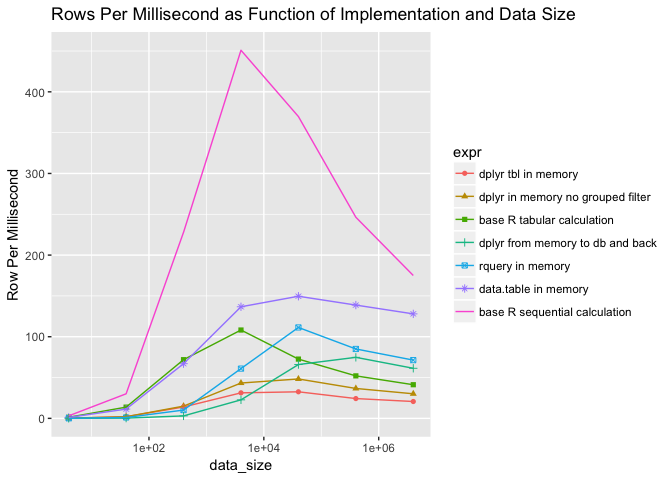

Plotting example
================
John Mount, Nina Zumel
January 10, 2018

As a follow-up to ["rquery: Fast Data Manipulation in R"](http://www.win-vector.com/blog/2018/01/rquery-fast-data-manipulation-in-r/) we [re-ran the experiment with a nice "base `R`" (or "pure `R`") implementation of the calculation added to the assessments](https://github.com/WinVector/rquery/blob/master/extras/QTimingFollowup/QTiming.md).

It turns out base `R` can be much faster than any of the alternatives.

That should not come as a surprise, but we think there are some current gaps in R teaching that make it surprising to many. There is a bit of a "this package is in C/C++, so it is going to be fast" fallacy. Also it has probably been a while since somebody publicly investigated exactly how large the "this package is a little slower at runtime, but the notation allows faster development" trade off actually is.

``` r
knitr::opts_chunk$set(echo = TRUE)
library(dplyr)
```

    ## 
    ## Attaching package: 'dplyr'

    ## The following objects are masked from 'package:stats':
    ## 
    ##     filter, lag

    ## The following objects are masked from 'package:base':
    ## 
    ##     intersect, setdiff, setequal, union

``` r
library(ggplot2)
library(wrapr)
library(rquery)
```

    ## Loading required package: cdata

``` r
source("../plotbenchmark.R")

timings = readRDS("qtimings.RDS")
timings$expr <- as.character(timings$expr)

# colors
highlightcolor = "#33a02c"
backgroundcolor = "#a6cee3"
reruncolor = "#b2df8a"
greycolor = "darkgrey"
```

``` r
runs <- c("base R row calculation",
          "base R tabular calculation",
          "base R sequential calculation",
          "data.table in memory", 
          "rquery in memory",
          "dplyr tbl in memory",
          "dplyr in memory no grouped filter",
          "dplyr from memory to db and back")
colormap = runs := c(highlightcolor,
                     highlightcolor,
                     highlightcolor,
                     highlightcolor,
                     highlightcolor,
                     highlightcolor,
                     highlightcolor,
                     backgroundcolor)

tr <- timings[timings$expr %in% runs, , drop=FALSE]
tr$expr <- factor(tr$expr, levels = rev(runs))
sizes <- sort(unique(tr$data_size))
for(sz in sizes) {
  trs <- tr[tr$data_size==sz, , drop=FALSE]
  print(plotbenchmark(trs, colormap, 
                title = paste0("Runtimes (smaller better), data rows: ", sz),
                subtitle = "Database enhanced dplyr shown for comparison") )
}
```



Note: `"rquery in memory"` is `rquery` starting and finishing with in-memory `data.frame`s, the implementation uses a user chosen SQL engine (usually one of PostgreSQL, SparkSQL, or SQLite; in this case PostgreSQL).

``` r
summary <- tr %.>% 
  as.data.frame(.) %.>%
  project_nse(., groupby = c("expr", "data_size"), 
              durationMS := avg(time)/1000000 ) %.>%
  orderby(., c("data_size", "durationMS")) %>%
  execute(.)
baseTiming <- min(summary$durationMS)
summary$relativeDuration <- summary$durationMS / baseTiming

knitr::kable(summary)
```

| expr                              |  data\_size|    durationMS|  relativeDuration|
|:----------------------------------|-----------:|-------------:|-----------------:|
| base R sequential calculation     |       4e+00|  1.301663e+00|      1.000000e+00|
| base R tabular calculation        |       4e+00|  2.944919e+00|      2.262428e+00|
| data.table in memory              |       4e+00|  3.459755e+00|      2.657950e+00|
| dplyr tbl in memory               |       4e+00|  2.049734e+01|      1.574704e+01|
| dplyr in memory no grouped filter |       4e+00|  2.377391e+01|      1.826426e+01|
| rquery in memory                  |       4e+00|  3.670664e+01|      2.819980e+01|
| dplyr from memory to db and back  |       4e+00|  1.350114e+02|      1.037222e+02|
| base R sequential calculation     |       4e+01|  1.329386e+00|      1.021298e+00|
| base R tabular calculation        |       4e+01|  2.908628e+00|      2.234548e+00|
| data.table in memory              |       4e+01|  3.522076e+00|      2.705827e+00|
| dplyr tbl in memory               |       4e+01|  1.975426e+01|      1.517617e+01|
| dplyr in memory no grouped filter |       4e+01|  1.995960e+01|      1.533392e+01|
| rquery in memory                  |       4e+01|  3.772173e+01|      2.897964e+01|
| dplyr from memory to db and back  |       4e+01|  1.304257e+02|      1.001993e+02|
| base R sequential calculation     |       4e+02|  1.755118e+00|      1.348366e+00|
| base R tabular calculation        |       4e+02|  5.564920e+00|      4.275238e+00|
| data.table in memory              |       4e+02|  5.971650e+00|      4.587708e+00|
| dplyr in memory no grouped filter |       4e+02|  2.669408e+01|      2.050768e+01|
| dplyr tbl in memory               |       4e+02|  2.870596e+01|      2.205330e+01|
| rquery in memory                  |       4e+02|  3.939951e+01|      3.026860e+01|
| dplyr from memory to db and back  |       4e+02|  1.326026e+02|      1.018716e+02|
| base R sequential calculation     |       4e+03|  8.870607e+00|      6.814825e+00|
| data.table in memory              |       4e+03|  2.926444e+01|      2.248234e+01|
| base R tabular calculation        |       4e+03|  3.696395e+01|      2.839748e+01|
| rquery in memory                  |       4e+03|  6.561312e+01|      5.040714e+01|
| dplyr in memory no grouped filter |       4e+03|  9.242966e+01|      7.100890e+01|
| dplyr tbl in memory               |       4e+03|  1.279663e+02|      9.830983e+01|
| dplyr from memory to db and back  |       4e+03|  1.764393e+02|      1.355491e+02|
| base R sequential calculation     |       4e+04|  1.081891e+02|      8.311606e+01|
| data.table in memory              |       4e+04|  2.673961e+02|      2.054265e+02|
| rquery in memory                  |       4e+04|  3.592062e+02|      2.759594e+02|
| base R tabular calculation        |       4e+04|  5.509727e+02|      4.232837e+02|
| dplyr from memory to db and back  |       4e+04|  6.068102e+02|      4.661807e+02|
| dplyr in memory no grouped filter |       4e+04|  8.289808e+02|      6.368628e+02|
| dplyr tbl in memory               |       4e+04|  1.229089e+03|      9.442453e+02|
| base R sequential calculation     |       4e+05|  1.623535e+03|      1.247277e+03|
| data.table in memory              |       4e+05|  2.882483e+03|      2.214461e+03|
| rquery in memory                  |       4e+05|  4.705146e+03|      3.614719e+03|
| dplyr from memory to db and back  |       4e+05|  5.351083e+03|      4.110958e+03|
| base R tabular calculation        |       4e+05|  7.684973e+03|      5.903965e+03|
| dplyr in memory no grouped filter |       4e+05|  1.091728e+04|      8.387176e+03|
| dplyr tbl in memory               |       4e+05|  1.648691e+04|      1.266603e+04|
| base R sequential calculation     |       4e+06|  2.285761e+04|      1.756031e+04|
| data.table in memory              |       4e+06|  3.125141e+04|      2.400883e+04|
| rquery in memory                  |       4e+06|  5.605219e+04|      4.306198e+04|
| dplyr from memory to db and back  |       4e+06|  6.520245e+04|      5.009165e+04|
| base R tabular calculation        |       4e+06|  9.707545e+04|      7.457801e+04|
| dplyr in memory no grouped filter |       4e+06|  1.328798e+05|      1.020847e+05|
| dplyr tbl in memory               |       4e+06|  1.938084e+05|      1.488929e+05|

``` r
summary$expr <- reorder(summary$expr, -summary$durationMS)
ggplot(data=summary, aes(x=data_size, y=durationMS, 
                         color=expr, shape =expr)) +
  geom_point() + geom_line() + scale_x_log10() + scale_y_log10() +
  ggtitle("Task Duration as a Function of Implementation and Data Size")
```

    ## Warning: The shape palette can deal with a maximum of 6 discrete values
    ## because more than 6 becomes difficult to discriminate; you have 7.
    ## Consider specifying shapes manually if you must have them.

    ## Warning: Removed 7 rows containing missing values (geom_point).



``` r
ggplot(data=summary, aes(x=data_size, y=data_size/durationMS, 
                         color=expr, shape=expr)) +
  geom_point() + geom_line() + scale_x_log10() + 
  ylab("Row Per Millisecond") +
  ggtitle("Rows Per Millisecond as Function of Implementation and Data Size")
```

    ## Warning: The shape palette can deal with a maximum of 6 discrete values
    ## because more than 6 becomes difficult to discriminate; you have 7.
    ## Consider specifying shapes manually if you must have them.

    ## Warning: Removed 7 rows containing missing values (geom_point).


