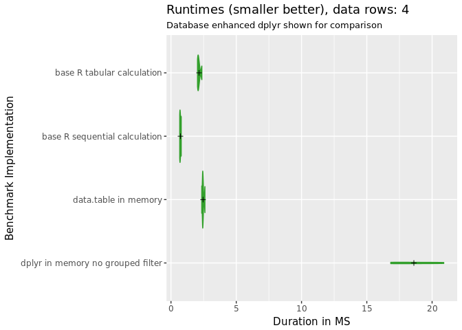
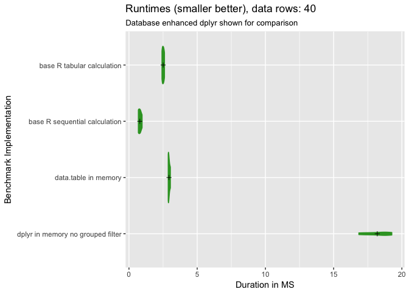
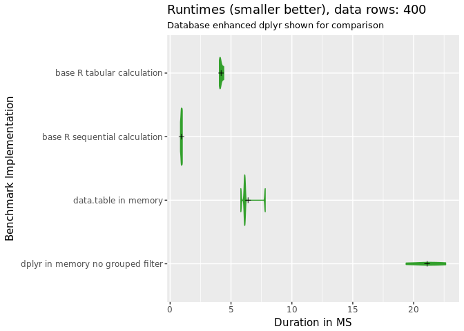
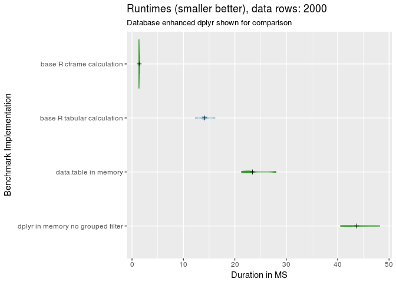
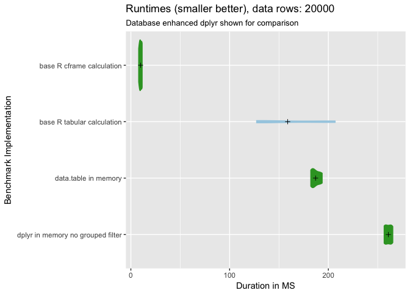
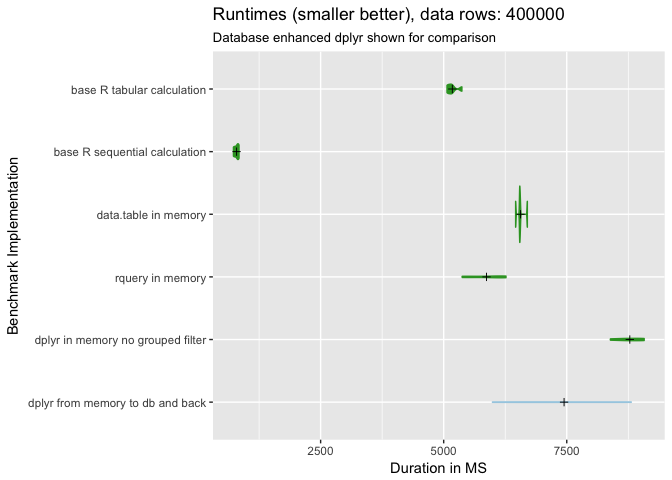
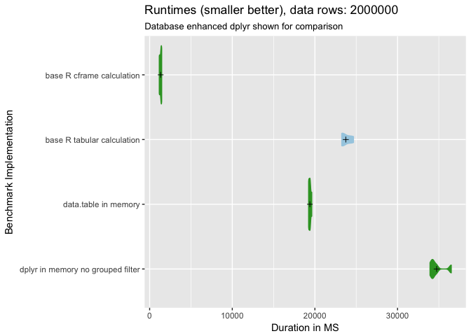
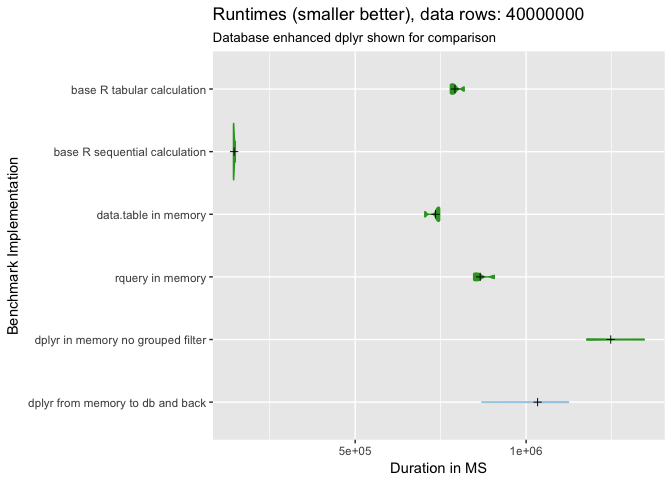
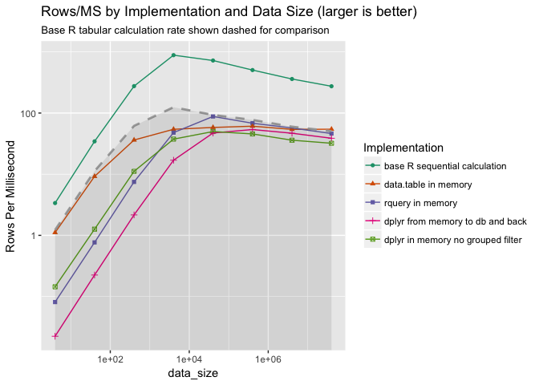

Plotting example
================
John Mount, Nina Zumel
January 10, 2018

As a follow-up to ["rquery: Fast Data Manipulation in R"](http://www.win-vector.com/blog/2018/01/rquery-fast-data-manipulation-in-r/) we [re-ran the experiment with a nice "base `R`" (or "pure `R`") implementation of the calculation added to the assessments](https://github.com/WinVector/rquery/blob/master/extras/QTimingFollowup/QTiming.md).

It turns out base `R` can be much faster than any of the alternatives.

That should not come as a surprise, but we think there are some current gaps in R teaching that make it surprising to many. There is a bit of a "this package is in C/C++, so it is going to be fast" fallacy. Also it has probably been a while since somebody publicly investigated exactly how large the "this package is a little slower at runtime, but the notation allows faster development" trade off actually is.

``` r
knitr::opts_chunk$set(echo = TRUE)
library(dplyr)
```

    ## 
    ## Attaching package: 'dplyr'

    ## The following objects are masked from 'package:stats':
    ## 
    ##     filter, lag

    ## The following objects are masked from 'package:base':
    ## 
    ##     intersect, setdiff, setequal, union

``` r
library(ggplot2)
library(wrapr)
library(rquery)
```

    ## Loading required package: cdata

``` r
source("../plotbenchmark.R")

timings = readRDS("qtimings3.RDS")
timings$expr <- as.character(timings$expr)

# colors
highlightcolor = "#33a02c"
backgroundcolor = "#a6cee3"
reruncolor = "#b2df8a"
greycolor = "darkgrey"
```

``` r
runs <- c("base R row calculation",
          "base R tabular calculation",
          "base R sequential calculation",
          "data.table in memory", 
          "rquery in memory",
          "dplyr tbl in memory",
          "dplyr in memory no grouped filter",
          "dplyr from memory to db and back")
colormap = runs := c(highlightcolor,
                     highlightcolor,
                     highlightcolor,
                     highlightcolor,
                     highlightcolor,
                     highlightcolor,
                     highlightcolor,
                     backgroundcolor)

tr <- timings[timings$expr %in% runs, , drop=FALSE]
tr$expr <- factor(tr$expr, levels = rev(runs))
sizes <- sort(unique(tr$data_size))
for(sz in sizes) {
  trs <- tr[tr$data_size==sz, , drop=FALSE]
  print(plotbenchmark(trs, colormap, 
                title = paste0("Runtimes (smaller better), data rows: ", sz),
                subtitle = "Database enhanced dplyr shown for comparison") )
}
```



Note: `"rquery in memory"` is `rquery` starting and finishing with in-memory `data.frame`s, the implementation uses a user chosen SQL engine (usually one of PostgreSQL, SparkSQL, or SQLite; in this case PostgreSQL).

``` r
summaryF <- tr %.>% 
  as.data.frame(.) %.>%
  project_nse(., groupby = c("expr", "data_size"), 
              durationMS := avg(time)/1000000 ) %.>%
  orderby(., c("data_size", "durationMS")) %>%
  execute(.)
baseTiming <- min(summaryF$durationMS)
summaryF$relativeDuration <- summaryF$durationMS / baseTiming

filtercol = with(summaryF, expr=="base R tabular calculation")
baselineF = summaryF[filtercol, , drop=FALSE]
compsF = summaryF[!filtercol, , drop=FALSE]

baseline_color = "darkgray"

# break the tasks into two groups
compsF$gp = "base R sequential, data.table, and rquery"
compsF$gp[contains("dplyr", vars=compsF$expr)] = "dplyr variations"

# control the ordering of the tasks
compsF$expr = factor(compsF$expr, levels=c(
                       "base R sequential calculation",
                       "data.table in memory",
                       "rquery in memory",
                       "dplyr from memory to db and back",
                       "dplyr in memory no grouped filter",
                       "dplyr tbl in memory"
                       ))


ggplot(data=compsF, aes(x=data_size, y=data_size/durationMS, 
                         color=expr)) +
  geom_point(aes(shape=expr)) + geom_line() + 
  geom_line(data=baselineF, 
            aes(x=data_size, y=data_size/durationMS), 
            color=baseline_color, linetype=2, size=1) +
  geom_ribbon(data=baselineF, 
            aes(x=data_size, ymax=data_size/durationMS, ymin=0), 
            color=baseline_color, alpha=0.1, size=0) +
  scale_x_log10() + ylab("Rows Per Millisecond") +
  #facet_wrap(~gp, ncol=1)  + 
  scale_color_brewer("Implementation", palette="Dark2") + 
  scale_shape_discrete("Implementation") + 
  ggtitle("Rows/MS by Implementation and Data Size (larger is better)", 
          subtitle="Base R tabular calculation rate shown dashed for comparison")
```


