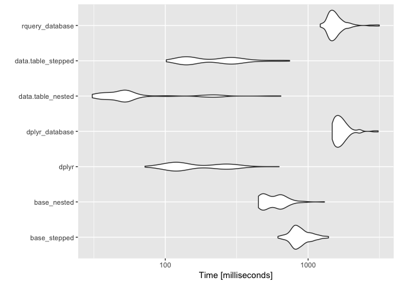

Simple Task
================
John Mount, Win-Vector LLC
3/22/2018

Simple tasks related to [R Tip: Break up Function Nesting for Legibility](http://www.win-vector.com/blog/2018/03/r-tip-break-up-function-nesting-for-legibility/). Most remote data systems start and end with data remote, so we are materializing tables when showing database timings.

``` r
library("dplyr")
```

    ## 
    ## Attaching package: 'dplyr'

    ## The following objects are masked from 'package:stats':
    ## 
    ##     filter, lag

    ## The following objects are masked from 'package:base':
    ## 
    ##     intersect, setdiff, setequal, union

``` r
library("microbenchmark")
library("ggplot2")
library("data.table")
```

    ## 
    ## Attaching package: 'data.table'

    ## The following objects are masked from 'package:dplyr':
    ## 
    ##     between, first, last

``` r
library("rquery")
```

    ## Loading required package: wrapr

    ## 
    ## Attaching package: 'wrapr'

    ## The following object is masked from 'package:data.table':
    ## 
    ##     :=

``` r
db <- DBI::dbConnect(RPostgreSQL::PostgreSQL(),
                     host = 'localhost',
                     port = 5432,
                     user = 'johnmount',
                     password = '')

# PostgreSQL dbExistsTable() does not work
dbopts <- dbi_connection_preferences(db)
print(dbopts)
```

    ## $rquery.PostgreSQLConnection.use_pass_limit
    ## [1] TRUE
    ## 
    ## $rquery.PostgreSQLConnection.use_DBI_dbExistsTable
    ## [1] FALSE
    ## 
    ## $rquery.PostgreSQLConnection.use_DBI_dbListFields
    ## [1] FALSE
    ## 
    ## $rquery.PostgreSQLConnection.use_DBI_dbRemoveTable
    ## [1] FALSE
    ## 
    ## $rquery.PostgreSQLConnection.control_temporary
    ## [1] TRUE
    ## 
    ## $rquery.PostgreSQLConnection.rownames_false
    ## [1] TRUE

``` r
options(dbopts)


nrows <- 100000
```

Simple problem (subset rows and columns).

``` r
mtcarsb <- mtcars[rep(seq_len(nrow(mtcars)), nrows), ,]
print(dim(mtcarsb))
```

    ## [1] 3200000      11

``` r
mtcarsd <- as.data.table(mtcarsb)

mtcarsdb <- dbi_copy_to(db, "mtcarsdb", mtcarsb,
                        overwrite = TRUE,
                        temporary = TRUE)
# DBI::dbGetQuery(db, "CREATE INDEX mtcarsdb_cyl ON mtcarsdb (cyl)")
rquery_sql <- mtcarsdb %.>% 
  select_rows_nse(., cyl == 8) %.>% 
  select_columns(., qc(mpg, cyl, wt)) %.>%
  to_sql(., db)

cat(rquery_sql)
```

    ## SELECT
    ##  "mpg",
    ##  "cyl",
    ##  "wt"
    ## FROM (
    ##  SELECT * FROM (
    ##   SELECT
    ##    "mtcarsdb"."mpg",
    ##    "mtcarsdb"."cyl",
    ##    "mtcarsdb"."wt"
    ##   FROM
    ##    "mtcarsdb"
    ##  ) tsql_35219670634487415022_0000000000
    ##  WHERE "cyl" = 8
    ## ) tsql_35219670634487415022_0000000001

``` r
DBI::dbGetQuery(db, paste("EXPLAIN", rquery_sql))
```

    ##                                                                      QUERY PLAN
    ## 1                          Gather  (cost=1000.00..58315.16 rows=16000 width=24)
    ## 2                                                            Workers Planned: 4
    ## 3   ->  Parallel Seq Scan on mtcarsdb  (cost=0.00..55715.16 rows=4000 width=24)
    ## 4                                         Filter: (cyl = '8'::double precision)

``` r
mtcarst <- dplyr::tbl(db, "mtcarsdb")

dplyr_sql <- mtcarst %>%
  filter(cyl == 8) %>%
  select(mpg, cyl, wt) %>%
  dbplyr::remote_query(.)

cat(dplyr_sql)
```

    ## SELECT "mpg", "cyl", "wt"
    ## FROM "mtcarsdb"
    ## WHERE ("cyl" = 8.0)

``` r
DBI::dbGetQuery(db, paste("EXPLAIN", dplyr_sql))
```

    ##                                                                      QUERY PLAN
    ## 1                          Gather  (cost=1000.00..58315.16 rows=16000 width=24)
    ## 2                                                            Workers Planned: 4
    ## 3   ->  Parallel Seq Scan on mtcarsdb  (cost=0.00..55715.16 rows=4000 width=24)
    ## 4                                         Filter: (cyl = '8'::double precision)

``` r
timings <- microbenchmark(
  base_stepped = {
    . <- mtcarsb
    . <- subset(., cyl == 8)
    . <- .[, c("mpg", "cyl", "wt")]
    nrow(.)
  },
  base_nested = {
    nrow(mtcarsb[mtcarsb$cyl == 8, c("mpg", "cyl", "wt")])
  },
  dplyr = {
    mtcarsb                %>%
      filter(cyl == 8)     %>%
      select(mpg, cyl, wt) %>%
      nrow
  },
  dplyr_database = {
    res <- mtcarst         %>%
      filter(cyl == 8)     %>%
      select(mpg, cyl, wt) %>%
      compute()
    as.numeric(as.data.frame(tally(res))[[1]][[1]])
  },
  data.table_nested = {
    nrow(mtcarsd[cyl==8, c("mpg", "cyl", "wt")])
  },
  data.table_stepped = {
   mtcarsd[cyl==8,        ][,
    c("mpg", "cyl", "wt") ][, 
    .N                    ]
  },
  rquery_database = {
    res <- mtcarsdb                       %.>% 
      select_rows_nse(., cyl == 8)        %.>% 
      select_columns(., qc(mpg, cyl, wt)) %.>%
      materialize(db, ., 
                  table_name = "restab",
                  overwrite = TRUE,
                  temporary = TRUE)
     dbi_nrow(db, res$table_name)
  }
)

print(timings)
```

    ## Unit: milliseconds
    ##                expr        min         lq       mean     median         uq
    ##        base_stepped  614.82463  792.78400  890.51091  852.73570  955.02365
    ##         base_nested  449.00939  482.27757  591.49230  571.01472  654.18352
    ##               dplyr   72.09153  116.90713  180.63522  130.30891  249.84177
    ##      dplyr_database 1474.74979 1578.99341 1733.14745 1680.57031 1797.17749
    ##   data.table_nested   30.79198   39.86689   81.48777   52.01675   59.95158
    ##  data.table_stepped  101.62089  139.95166  241.98376  219.29464  292.24174
    ##     rquery_database 1215.54866 1413.49783 1589.91287 1514.58517 1637.65108
    ##        max neval
    ##  1388.7660   100
    ##  1301.2126   100
    ##   626.5010   100
    ##  3095.6303   100
    ##   644.7626   100
    ##   742.3568   100
    ##  3152.1191   100

``` r
autoplot(timings)
```



Want to add the query to query folding feature that `dbplyr`'s optimizer has.

``` r
DBI::dbDisconnect(db)
```

    ## [1] TRUE
