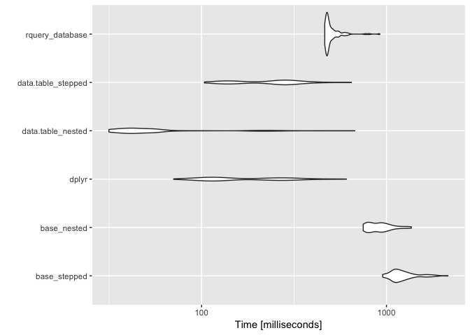

Simple Task
================
John Mount, Win-Vector LLC
3/22/2018

Simple tasks related to [R Tip: Break up Function Nesting for Legibility](http://www.win-vector.com/blog/2018/03/r-tip-break-up-function-nesting-for-legibility/).

``` r
library("dplyr")
```

    ## 
    ## Attaching package: 'dplyr'

    ## The following objects are masked from 'package:stats':
    ## 
    ##     filter, lag

    ## The following objects are masked from 'package:base':
    ## 
    ##     intersect, setdiff, setequal, union

``` r
library("microbenchmark")
library("ggplot2")
library("data.table")
```

    ## 
    ## Attaching package: 'data.table'

    ## The following objects are masked from 'package:dplyr':
    ## 
    ##     between, first, last

``` r
library("rquery")
```

    ## Loading required package: wrapr

    ## 
    ## Attaching package: 'wrapr'

    ## The following object is masked from 'package:data.table':
    ## 
    ##     :=

``` r
mtcarsb <- mtcars[rep(seq_len(nrow(mtcars)), 100000), ,]
print(nrow(mtcarsb))
```

    ## [1] 3200000

``` r
mtcarsd <- as.data.table(mtcarsb)

db <- DBI::dbConnect(RPostgreSQL::PostgreSQL(),
                     host = 'localhost',
                     port = 5432,
                     user = 'johnmount',
                     password = '')

mtcarsdb <- dbi_copy_to(db, "mtcarsdb", mtcarsb,
                        overwrite = TRUE,
                        temporary = TRUE)
# DBI::dbGetQuery(db, "CREATE INDEX mtcarsdb_cyl ON mtcarsdb (cyl)")
mtcarsdb %.>% 
  select_rows_nse(., cyl == 8) %.>% 
  select_columns(., qc(mpg, cyl, wt)) %.>%
  sql_node(., "n" := "COUNT(1)", 
           orig_columns = FALSE) %.>%
  to_sql(., db) %.>%
  DBI::dbGetQuery(db, paste("EXPLAIN", .))
```

    ##                                                                                 QUERY PLAN
    ## 1                             Finalize Aggregate  (cost=56725.58..56725.59 rows=1 width=8)
    ## 2                                     ->  Gather  (cost=56725.16..56725.57 rows=4 width=8)
    ## 3                                                                       Workers Planned: 4
    ## 4                          ->  Partial Aggregate  (cost=55725.16..55725.17 rows=1 width=8)
    ## 5               ->  Parallel Seq Scan on mtcarsdb  (cost=0.00..55715.16 rows=4000 width=0)
    ## 6                                                    Filter: (cyl = '8'::double precision)

``` r
mtcarst <- dplyr::tbl(db, "mtcarsdb")

timings <- microbenchmark(
  base_stepped = {
    . <- mtcarsb
    . <- subset(., cyl == 8)
    . <- .[, c("mpg", "cyl", "wt")]
    nrow(.)
  },
  base_nested = {
    nrow(mtcarsb[mtcarsb$cyl == 8, c("mpg", "cyl", "wt")])
  },
  dplyr = {
    mtcarsb                %>%
      filter(cyl == 8)     %>%
      select(mpg, cyl, wt) %>%
      nrow
  },
  dplyr_database = {
    res <- mtcarst         %>%
      filter(cyl == 8)     %>%
      select(mpg, cyl, wt) %>%
      tally
    as.numeric(as.data.frame(res)[[1]][[1]])
  },
  data.table_nested = {
    nrow(mtcarsd[cyl==8, c("mpg", "cyl", "wt")])
  },
  data.table_stepped = {
   mtcarsd[cyl==8,        ][,
    c("mpg", "cyl", "wt") ][, 
    .N                    ]
  },
  rquery_database = {
    res <- mtcarsdb                       %.>% 
      select_rows_nse(., cyl == 8)        %.>% 
      select_columns(., qc(mpg, cyl, wt)) %.>%
      sql_node(., "n" := "COUNT(1)", 
               orig_columns = FALSE)      %.>%
      execute(db, .)
    as.numeric(res[[1]][[1]])
  }
)

print(timings)
```

    ## Unit: milliseconds
    ##                expr       min        lq      mean    median        uq
    ##        base_stepped 447.52068 582.55921 713.38291 654.42452 787.10021
    ##         base_nested 240.50462 282.67886 409.55758 385.06830 456.02909
    ##               dplyr  73.50962 110.98097 186.07577 130.17617 238.90878
    ##      dplyr_database 265.20716 273.19135 304.20024 280.79591 315.92071
    ##   data.table_nested  31.01306  42.19911  85.27903  49.50752  65.30889
    ##  data.table_stepped 100.38787 140.55734 248.12110 236.01903 269.56178
    ##     rquery_database 424.64349 443.63297 511.61300 462.98186 492.11455
    ##        max neval
    ##  1482.5111   100
    ##  1335.3310   100
    ##   727.6659   100
    ##   454.8025   100
    ##  1649.2550   100
    ##   816.7377   100
    ##  1746.4671   100

``` r
autoplot(timings)
```



``` r
DBI::dbDisconnect(db)
```

    ## [1] TRUE
