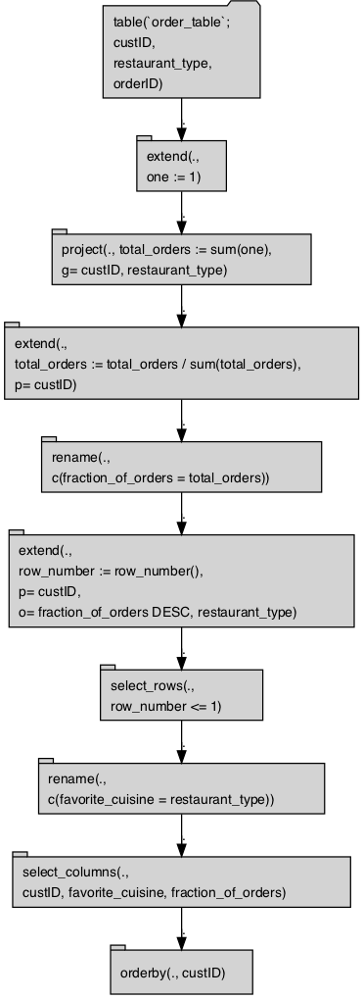

SparkR Example
================
Nina Zumel and John Mount, Win-Vector LLC
07/03/2018

`rquery` is a query generator for R. It is based on [Edgar F. Codd’s relational algebra](https://en.wikipedia.org/wiki/Relational_algebra), informed by our experience using SQL and R packages such as `dplyr` at big data scale. In this article we discuss `rquery`, its advantages relative to SQL, and why its database-first design makes it an attractive alternative for working with Spark in R. \[FIX THIS\]

Data Transformation and Codd's Relational Algebra
-------------------------------------------------

Codd's relational algebra is a formal algebra that describes the semantics of data transformations and queries. Earlier, hierarchical, databases required tables to be representations of functions or maps. Codd relaxed this requirement, allowing tables that represent more general relations (allowing, for instance, two-way multimaps).

Codd's algebra allows most significant data transformations to be decomposed into sequences made up from a smaller set of simpler operations:

-   select (row selection)
-   project (column selection/aggregation)
-   Cartesian product (table joins, row binding, set difference)
-   extend (derived columns)

The earliest, and still most common, implementation of Codd's algebra is SQL. Formally Codd's algebra assumes that all rows in a table are unique; SQL relaxes this restriction to allow multisets.

`rquery` is another realization of the Codd algebra that implements the above operators, in addition to several commonly used composite operations.

SQL vs pipelines for data transformation
----------------------------------------

One issue with SQL, especially for the novice SQL programmer, is that it can be somewhat unintuitive.

-   SQL expresses data transformations as nested function composition.
-   SQL uses some relational concepts as steps, others as modifiers and predicates.

For example, suppose you have a table of information about irises, and you want to find the species with the widest petal (on average). In R the steps would be as follows:

1.  Group the table into Species
2.  Calculate the mean petal width for each Species
3.  Find the widest mean petal width
4.  Return the appropriate species

We can do this in R using `rqdatatable`, an in-memory implementation of `rquery`:

``` r
library(rqdatatable)
```

    ## Loading required package: rquery

``` r
data(iris)

local_td(iris) %.>%
  project_nse(., groupby=c('Species'),
              mean_petal_width = mean(Petal.Width)) %.>%
  pick_top_k(.,  
             k = 1,
             orderby = c('mean_petal_width', 'Species'),
             reverse = c('mean_petal_width')) %.>% 
  select_columns(., 'Species') %.>%
  ex_data_table(.)
```

    ##      Species
    ## 1: virginica

`rquery` is "database" first, which is why when using the local implementation of it (`rqdatatable`) we have to both use `local_td()` to capture the `data.frame` name and description and finish the pipeline with a `ex_data_table(.)` to trigger the execution.

We could also do the same operation using `dplyr`, another R package with Codd-style operators.

In `rquery`, the original table (`iris`) is at the beginning of the query, with successive operations applied to the results of the preceding line. To perform the equivalent operation in SQL, you must write down the operation "backwards":

    SELECT Species FROM (
       SELECT Species, mean('Petal.Width') AS mean_petal_width FROM iris
       GROUP BY Species ) tmp1
    WHERE mean_petal_width = max(mean_petal_width) /* try to get widest species */
    ORDER_BY Species /* To make tiebreaking deterministic */
    LIMIT 1     /* Get only one species back (in case of ties) */

In SQL, the original table is in the *last* SELECT statement, with successive results nested up from there. In addition, column selection directives are at the beginning of a SELECT statement, while row selection criteria (WHERE, LIMIT) and modifiers (GROUP\_BY, ORDER\_BY) are at the end of the statement, with the table in between. So the data transformation goes from the inside of the query to the outside, which can be hard to read -- not to mention hard to write.

`rquery` represents an attempt to make data transformation in a relational database more intuitive by expressing data transformations in a sequential operator pipeline notation instead of nested queries or functions.

`rquery` for Spark/R developers
-------------------------------

For developers working with Spark and R, `rquery` offers a number of advantages. First, R developers can run analyses and perform data transformations in Spark using an easier to read (and to write) sequential pipeline notation instead of nested SQL queries. As we mentioned above, `dplyr` also supplies this capability, but `dplyr` is not compatible with `SparkR` -- only with `sparklyr`. `rquery` is compatible with both `SparkR` and `sparklyr`, as well as with Postgres and other large data stores. In addition, `dplyr`'s lazy evaluation can complicate the running and debugging of large, complex queries (more on this below).

The design of `rquery` is *database-first*, meaning it was developed specifically to address issues that arise when working with big data in remote data stores via R. `rquery` maintains *complete separation between the query specification and query execution phases*, which allows useful error-checking and some optimization before the query is run. This can be useful when running complex queries on large volumes of data; you don't want to run a long query only to discover that there was an error on the last step.

`rquery` checks column names at query specification time to insure that they are available for use, It also checks which columns from a table are involved with a given query, and proactively issues the appropriate SELECT statements to narrow the tables being manipulated. This can help speed up queries that involve excessively wide tables where only a few columns are needed.

`rquery` also offers well-formatted textual as well as graphical presentation of query plans. In addition, you can expect the generated SQL query before execution.

Example
-------

Let's imagine that we run a food delivery business, and we are interested in what types of cuisines ('Mexican', 'Chinese', etc) our customers prefer. We want to sum up the number of orders of each cuisine type (or `restaurant_type`) by customer and compute which cuisine appears to be their favorite, based on what they order the most. We also want to see how strong that preference is, based on what fraction of their orders is of their favorite cuisine.

We'll start with a table of orders, which records order id, customer id, and restaurant type.

To work with the data using `rquery`, we need an rquery handle to the Spark cluster. Since `rquery` interfaces with many different types of SQL-dialect data stores, it needs an adapter to translate `rquery` functions into the appropriate SQL dialect. The default handler assumes a DBI-adapted database. Since `SparkR` is not DBI-adapted, we must define the handler explicitly, using the function `rquery::rquery_db_info()`. The code for the adapter is here \[LINK\]. Let's assume that we have created the handler as `db_hdl`.

``` r
library("rquery")

print(db_hdl) # rquery handle into Spark
```

    ## [1] "rquery_db_info(is_dbi=FALSE, SparkR, <environment: 0x7fdec00051f8>)"

Let's assume that we already have the data in Spark, as `order_table`. To work with the table in `rquery`, we must generate a *table description*, using the function `db_td()`.

``` r
table_description = db_td(db_hdl, "order_table")

print(table_description)
```

    ## [1] "table('`order_table`'; custID, restaurant_type, orderID)"

``` r
print(column_names(table_description))
```

    ## [1] "custID"          "restaurant_type" "orderID"

Now we can compose the necessary processing pipeline (or *operator tree*), using `rquery`'s Codd-style steps and operators:

``` r
rquery_pipeline <- table_description %.>%
  extend_nse(., one = 1) %.>%  # a column to help count
  project_nse(., groupby=c("custID", "restaurant_type"),
              total_orders = sum(one)) %.>%
  normalize_cols(.,   # normalize the total_order counts
                 "total_orders",
                 partitionby = 'custID') %.>%
  rename_columns(.,  # rename the column
                 c('fraction_of_orders' = 'total_orders')) %.>% 
  pick_top_k(.,  # get the most frequent cuisine type
             k = 1,
             partitionby = 'custID',
             orderby = c('fraction_of_orders', 'restaurant_type'),
             reverse = c('fraction_of_orders')) %.>% 
  rename_columns(., c('favorite_cuisine' = 'restaurant_type')) %.>%
  select_columns(., c('custID', 
                      'favorite_cuisine', 
                      'fraction_of_orders')) %.>%
  orderby(., cols = 'custID')
```

Before executing the pipeline, you can inspect it, either as text:

``` r
cat(format(rquery_pipeline))
```

    ## table('`order_table`'; 
    ##   custID,
    ##   restaurant_type,
    ##   orderID) %.>%
    ##  extend(.,
    ##   one := 1) %.>%
    ##  project(., total_orders := sum(one),
    ##   g= custID, restaurant_type) %.>%
    ##  extend(.,
    ##   total_orders := total_orders / sum(total_orders),
    ##   p= custID) %.>%
    ##  rename(.,
    ##   c('fraction_of_orders' = 'total_orders')) %.>%
    ##  extend(.,
    ##   row_number := row_number(),
    ##   p= custID,
    ##   o= "fraction_of_orders" DESC, "restaurant_type") %.>%
    ##  select_rows(.,
    ##    row_number <= 1) %.>%
    ##  rename(.,
    ##   c('favorite_cuisine' = 'restaurant_type')) %.>%
    ##  select_columns(.,
    ##    custID, favorite_cuisine, fraction_of_orders) %.>%
    ##  orderby(., custID)

or as a operator diagram (using the package `DiagrammeR`):

``` r
rquery_pipeline %.>%
  op_diagram(.) %.>% 
  DiagrammeR::DiagrammeR(diagram = ., type = "grViz")
```



Notice that the `normalize_cols` and `pick_top_k` steps were decomposed into more basic Codd operators (for example, the *extend* and *select\_rows* nodes). You can also inspect what tables are used in the pipeline, and which columns in those tables are involved.

``` r
tables_used(rquery_pipeline)
```

    ## [1] "order_table"

``` r
columns_used(rquery_pipeline)
```

    ## $order_table
    ## [1] "custID"          "restaurant_type"

If you want, you can inspect the (complex and heavily nested) SQL query that will be executed in the cluster. Notice that the column `orderID`, which is not involved in this query, is already eliminated in the initial SELECT (tsql\_\*\_0000000000). Winnowing the initial tables down to only the columns used can be a big performance improvement when you are working with excessively wide tables, and using only a few columns.

``` r
cat(to_sql(rquery_pipeline, db_hdl))
```

    ## SELECT * FROM (
    ##  SELECT
    ##   `custID`,
    ##   `favorite_cuisine`,
    ##   `fraction_of_orders`
    ##  FROM (
    ##   SELECT
    ##    `custID` AS `custID`,
    ##    `fraction_of_orders` AS `fraction_of_orders`,
    ##    `restaurant_type` AS `favorite_cuisine`
    ##   FROM (
    ##    SELECT * FROM (
    ##     SELECT
    ##      `custID`,
    ##      `restaurant_type`,
    ##      `fraction_of_orders`,
    ##      row_number ( ) OVER (  PARTITION BY `custID` ORDER BY `fraction_of_orders` DESC, `restaurant_type` ) AS `row_number`
    ##     FROM (
    ##      SELECT
    ##       `custID` AS `custID`,
    ##       `restaurant_type` AS `restaurant_type`,
    ##       `total_orders` AS `fraction_of_orders`
    ##      FROM (
    ##       SELECT
    ##        `custID`,
    ##        `restaurant_type`,
    ##        `total_orders` / sum ( `total_orders` ) OVER (  PARTITION BY `custID` ) AS `total_orders`
    ##       FROM (
    ##        SELECT `custID`, `restaurant_type`, sum ( `one` ) AS `total_orders` FROM (
    ##         SELECT
    ##          `custID`,
    ##          `restaurant_type`,
    ##          1  AS `one`
    ##         FROM (
    ##          SELECT
    ##           `custID`,
    ##           `restaurant_type`
    ##          FROM
    ##           `order_table`
    ##          ) tsql_80822542854048008991_0000000000
    ##         ) tsql_80822542854048008991_0000000001
    ##        GROUP BY
    ##         `custID`, `restaurant_type`
    ##        ) tsql_80822542854048008991_0000000002
    ##      ) tsql_80822542854048008991_0000000003
    ##      ) tsql_80822542854048008991_0000000004
    ##    ) tsql_80822542854048008991_0000000005
    ##    WHERE `row_number` <= 1
    ##   ) tsql_80822542854048008991_0000000006
    ##  ) tsql_80822542854048008991_0000000007
    ## ) tsql_80822542854048008991_0000000008 ORDER BY `custID`

Finally, we can execute the query in the cluster. Note that this same pipeline could also be executed using a `sparklyr` connection.

``` r
execute(db_hdl, rquery_pipeline) %.>%
  knitr::kable(.)
```

| custID  | favorite\_cuisine |  fraction\_of\_orders|
|:--------|:------------------|---------------------:|
| cust\_1 | Italian           |             0.3225806|
| cust\_2 | Italian           |             0.3125000|
| cust\_3 | Indian            |             0.2857143|
| cust\_4 | American          |             0.2916667|
| cust\_5 | American          |             0.2857143|
| cust\_6 | Italian           |             0.2800000|
| cust\_7 | American          |             0.2400000|
| cust\_8 | Indian            |             0.2903226|
| cust\_9 | Chinese           |             0.3000000|

Since many R programmers are familiar with `dplyr`, we can compare `dplyr`'s operators to those of `rquery` (and verify that the calculation is correct), by processing a local copy of the data with `dplyr`.

``` r
library(dplyr)
```

    ## 
    ## Attaching package: 'dplyr'

    ## The following objects are masked from 'package:stats':
    ## 
    ##     filter, lag

    ## The following objects are masked from 'package:base':
    ## 
    ##     intersect, setdiff, setequal, union

``` r
# get the SparkDataFrame by name
order_f = SparkR::tableToDF("order_table")

order_f %>% 
  SparkR::as.data.frame() %>%
  group_by(custID, restaurant_type) %>%
  summarize(total_orders = n()) %>%
  ungroup() %>%
  group_by(custID) %>%
  mutate(fraction_of_orders = total_orders/sum(total_orders)) %>%
  ungroup() %>%
  group_by(custID) %>%
  arrange(desc(fraction_of_orders), restaurant_type) %>%
  mutate(rnk = row_number()) %>%
  ungroup() %>%
  filter(rnk == 1) %>%
  rename(favorite_cuisine = restaurant_type) %>%
  select(custID, favorite_cuisine, fraction_of_orders) %>%
  arrange(custID) %>%
  knitr::kable()
```

| custID  | favorite\_cuisine |  fraction\_of\_orders|
|:--------|:------------------|---------------------:|
| cust\_1 | Italian           |             0.3225806|
| cust\_2 | Italian           |             0.3125000|
| cust\_3 | Indian            |             0.2857143|
| cust\_4 | American          |             0.2916667|
| cust\_5 | American          |             0.2857143|
| cust\_6 | Italian           |             0.2800000|
| cust\_7 | American          |             0.2400000|
| cust\_8 | Indian            |             0.2903226|
| cust\_9 | Chinese           |             0.3000000|

As we mentioned above, `rquery` was designed to work with a variety of SQL-backed data stores; you only need an appropriate adapter. As you saw above, we have also adapted the `rquery` grammar for in-memory use, using `datatable` as the back-end implementation. This local implementation is in the package `rqdatatable`. One of the cool features of the `rquery` grammar is that the `rquery` operator trees and pipelines are back-end independent. This means you can use the pipeline that we created above with Spark through either `SparkR` or `sparklyr`, or on another data source like Postgres (assuming the table on Postgress has the same structure). You can also use the pipeline on local copies of the data, with `rqdatatable`, as we show below.

Note that you MUST use "%.&gt;%" (aka the "dot-arrow" from the `wrapr` package) rather than the magrittr pipe for this next step.

``` r
library(rqdatatable)  
# this automatically registers rqdatatable as the default executor 
# for rquery pipelines

SparkR::as.data.frame(order_f) %.>%
  rquery_pipeline %.>%
  knitr::kable(.)
```

| custID  | favorite\_cuisine |  fraction\_of\_orders|
|:--------|:------------------|---------------------:|
| cust\_1 | Italian           |             0.3225806|
| cust\_2 | Italian           |             0.3125000|
| cust\_3 | Indian            |             0.2857143|
| cust\_4 | American          |             0.2916667|
| cust\_5 | American          |             0.2857143|
| cust\_6 | Italian           |             0.2800000|
| cust\_7 | American          |             0.2400000|
| cust\_8 | Indian            |             0.2903226|
| cust\_9 | Chinese           |             0.3000000|

This feature can be quite useful for "rehearsals" of complex data manipulation/analysis processes, where you'd like to develop and debug the data process quickly, using smaller local versions of the relevant data tables before executing them on the remote system.

Conclusion
----------

blah blah blah
