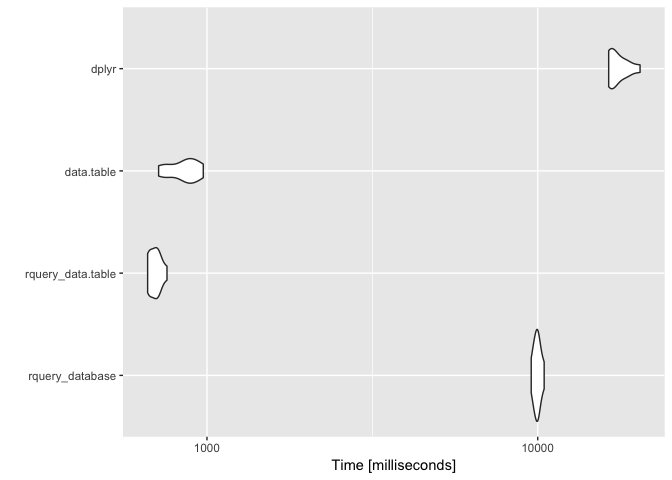
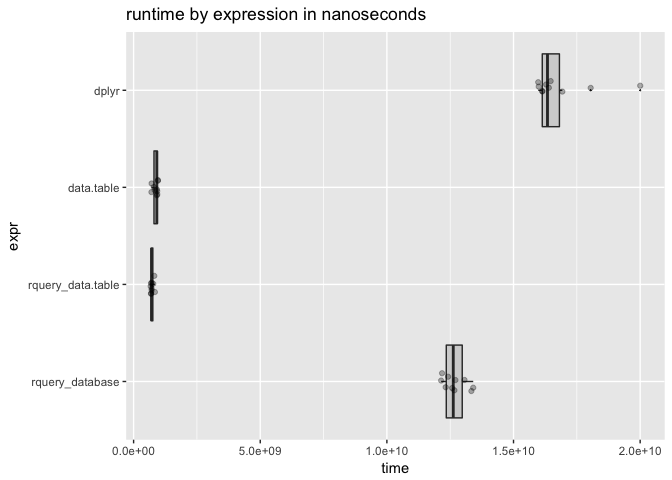

data.table backend for rquery
================
John Mount, Win-Vector LLC
05/30/2018

We can work an example similar to the [`rquery`](https://winvector.github.io/rquery/) [example](https://winvector.github.io/rquery/index.html) using a [`data.table`](http://r-datatable.com/) back-end ([`qdatatable`](https://github.com/WinVector/qdatatable)).

``` r
library("ggplot2")
library("microbenchmark")
library("dplyr")
```

    ## 
    ## Attaching package: 'dplyr'

    ## The following objects are masked from 'package:stats':
    ## 
    ##     filter, lag

    ## The following objects are masked from 'package:base':
    ## 
    ##     intersect, setdiff, setequal, union

``` r
library("dtplyr")
# https://github.com/WinVector/qdatatable
library("qdatatable") # devtools::install.packages("WinVector/qdatatable")
```

    ## Loading required package: rquery

    ## Loading required package: wrapr

    ## 
    ## Attaching package: 'wrapr'

    ## The following object is masked from 'package:dplyr':
    ## 
    ##     coalesce

``` r
packageVersion("dplyr")
```

    ## [1] '0.7.5'

``` r
packageVersion("data.table")
```

    ## [1] '1.10.4.3'

``` r
packageVersion("rquery")
```

    ## [1] '0.5.0'

``` r
# data example
dL <- build_frame(
   "subjectID", "surveyCategory"     , "assessmentTotal" |
   1          , "withdrawal behavior", 5                 |
   1          , "positive re-framing", 2                 |
   2          , "withdrawal behavior", 3                 |
   2          , "positive re-framing", 4                 )
```

``` r
scale <- 0.237

# example rquery pipeline
rquery_pipeline <- local_td(dL) %.>%
  extend_nse(.,
             probability :=
               exp(assessmentTotal * scale))  %.>% 
  normalize_cols(.,
                 "probability",
                 partitionby = 'subjectID') %.>%
  pick_top_k(.,
             partitionby = 'subjectID',
             orderby = c('probability', 'surveyCategory'),
             reverse = c('probability', 'surveyCategory')) %.>% 
  rename_columns(., 'diagnosis' := 'surveyCategory') %.>%
  select_columns(., c('subjectID', 
                      'diagnosis', 
                      'probability')) %.>%
  orderby(., cols = 'subjectID')
```

Show expanded form of query tree.

``` r
cat(format(rquery_pipeline))
```

    table('dL'; 
      subjectID,
      surveyCategory,
      assessmentTotal) %.>%
     extend(.,
      probability := exp(assessmentTotal * scale)) %.>%
     extend(.,
      probability := probability / sum(probability),
      p= subjectID) %.>%
     extend(.,
      row_rank := rank(),
      p= subjectID,
      o= "probability" DESC, "surveyCategory" DESC) %.>%
     select_rows(.,
       row_rank <= 1) %.>%
     rename(.,
      c('diagnosis' = 'surveyCategory')) %.>%
     select_columns(.,
       subjectID, diagnosis, probability) %.>%
     orderby(., subjectID)

Execute `rquery` pipeline using `data.table` as the impementation.

``` r
ex_data_table(rquery_pipeline) %.>%
  knitr::kable(.)
```

|  subjectID| diagnosis           |  probability|
|----------:|:--------------------|------------:|
|          1| withdrawal behavior |    0.6706221|
|          2| positive re-framing |    0.5589742|

Execute `rquery` pipeline using `PostgreSQL` as the implementation.

``` r
# configure a database connection
my_db <- DBI::dbConnect(RPostgreSQL::PostgreSQL(),
                          host = 'localhost',
                          port = 5432,
                          user = 'johnmount',
                          password = '')
dbopts <- rq_connection_tests(my_db)
options(dbopts)
# build the shared handle
winvector_temp_db_handle <- list(db = my_db)


# run the job
execute(dL, rquery_pipeline) %.>%
  knitr::kable(.)
```

|  subjectID| diagnosis           |  probability|
|----------:|:--------------------|------------:|
|          1| withdrawal behavior |    0.6706221|
|          2| positive re-framing |    0.5589742|

`dplyr` pipeline.

``` r
scale <- 0.237

dplyr_pipeline <- . %>% 
  as.tbl(.[, c("subjectID", "surveyCategory", "assessmentTotal")]) %>% # narrow and convert to preferred structure
  group_by(subjectID) %>%
  mutate(probability =
           exp(assessmentTotal * scale)/
           sum(exp(assessmentTotal * scale), na.rm = TRUE)) %>%
  arrange(probability, surveyCategory) %>%
  filter(row_number() == n()) %>%
  ungroup() %>%
  rename(diagnosis = surveyCategory) %>%
  select(subjectID, diagnosis, probability) %>%
  arrange(subjectID) 

dL %>% 
  dplyr_pipeline %>%
  knitr::kable()
```

|  subjectID| diagnosis           |  probability|
|----------:|:--------------------|------------:|
|          1| withdrawal behavior |    0.6706221|
|          2| positive re-framing |    0.5589742|

Try `dtplyr`.

``` r
data.table::as.data.table(dL) %>% 
  dplyr_pipeline
```

    ## Error in rank(x, ties.method = "first", na.last = "keep"): argument "x" is missing, with no default

Idiomatic `data.table` pipeline.

``` r
# improved code from:
# http://www.win-vector.com/blog/2018/01/base-r-can-be-fast/#comment-66746
data.table_local <- function(dL) {
  # data.table is paying for this copy in its timings (not quite fair)
  # so we will try to minimize it by narrowing columns.
  dDT <- data.table::as.data.table(dL[, c("subjectID", "surveyCategory", "assessmentTotal")])
  dDT <- dDT[, list(diagnosis = surveyCategory,
                    probability = exp (assessmentTotal * scale ) /
                      sum ( exp ( assessmentTotal * scale ) ))
             , subjectID ]
  data.table::setorder(dDT, subjectID, probability, -diagnosis)
  dDT <- dDT[, .SD[.N], subjectID]
  data.table::setorder(dDT, subjectID)
}

data.table_local(dL) %.>%
  knitr::kable(.)
```

|  subjectID| diagnosis           |  probability|
|----------:|:--------------------|------------:|
|          1| withdrawal behavior |    0.6706221|
|          2| positive re-framing |    0.5589742|

Timings.

``` r
# fatten up data.frame a bit
dL <- dL[rep(seq_len(nrow(dL)), 100000), , drop = FALSE]
dL$subjectID <- paste(dL$subjectID, (1+seq_len(nrow(dL))) %/% 2, sep = "_")
for(i in seq_len(10)) {
  dL[[paste0("irrelevantCol", i)]] <- runif(nrow(dL))
}
dLorig <- dL
```

``` r
# show we are working on the new larger data and results agree
ref <- as.data.frame(ex_data_table(rquery_pipeline))
assertthat::assert_that(min(ref$probability)>=0.5) # sensible effect
```

    ## [1] TRUE

``` r
c1 <- as.data.frame(execute(dL, rquery_pipeline))
assertthat::are_equal(ref, c1)
```

    ## [1] TRUE

``` r
c2 <- as.data.frame(dplyr_pipeline(dL))
assertthat::are_equal(ref, c2)
```

    ## [1] TRUE

``` r
c3 <- as.data.frame(data.table_local(dL))
assertthat::are_equal(ref, c3)
```

    ## [1] TRUE

``` r
# confirm no side-effects back to orginal frame
assertthat::are_equal(dLorig, dL)
```

    ## [1] TRUE

``` r
timings <- microbenchmark(times = 10L,
  rquery_database = nrow(execute(dL, rquery_pipeline)),
  rquery_data.table = nrow(ex_data_table(rquery_pipeline)),
  data.table = nrow(data.table_local(dL)),
  dplyr = nrow(dplyr_pipeline(dL)))
```

``` r
print(timings)
```

    ## Unit: milliseconds
    ##               expr        min         lq       mean     median         uq
    ##    rquery_database  9557.6507  9769.8670  9974.0528  9970.5300 10142.3420
    ##  rquery_data.table   661.5817   670.0105   697.4420   697.3102   715.1854
    ##         data.table   714.1491   760.9654   852.9112   865.7167   924.6815
    ##              dplyr 16389.5809 16585.1609 17513.4590 16979.4044 18518.0801
    ##         max neval
    ##  10459.1781    10
    ##    757.0487    10
    ##    974.5648    10
    ##  20392.0191    10

``` r
# summarize by hand using rquery database connector
summary_pipeline <- timings %.>%
  as.data.frame(.) %.>%
  project_nse(., groupby = "expr", mean = avg(time)) 
timings %.>% 
  as.data.frame(.) %.>%
  summary_pipeline %.>%
  knitr::kable(.)
```

| expr               |         mean|
|:-------------------|------------:|
| dplyr              |  17513458966|
| rquery\_database   |   9974052834|
| rquery\_data.table |    697441982|
| data.table         |    852911245|

``` r
autoplot(timings)
```



``` r
WVPlots::ScatterBoxPlotH(as.data.frame(timings), "time", "expr", "runtime by expression in nanoseconds")
```



For more timings (including fast base-R implementations), please see [here](https://github.com/WinVector/rquery/blob/master/extras/QTimingFollowup/QTiming4.md).
