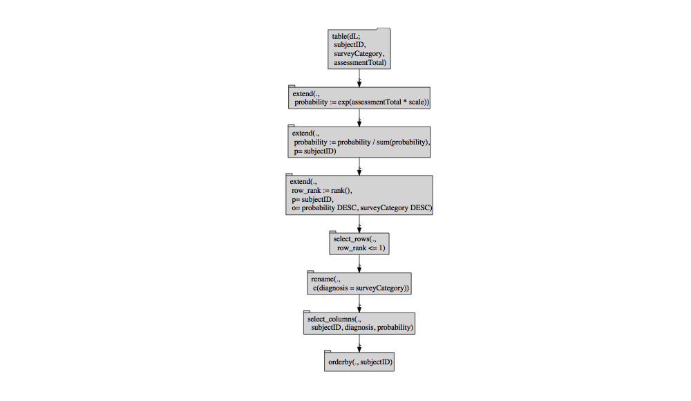
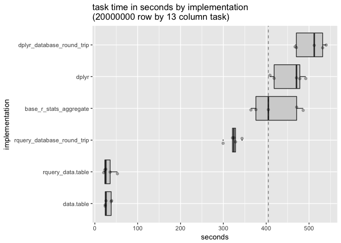
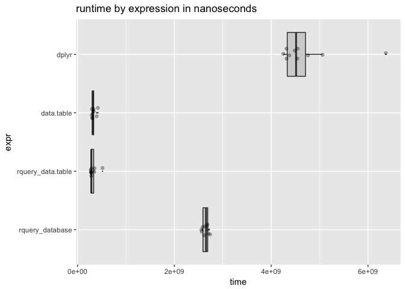

data.table backend for rquery
================
John Mount, Win-Vector LLC
05/31/2018

We can work an example similar to the [`rquery`](https://winvector.github.io/rquery/) [example](https://winvector.github.io/rquery/index.html) using a [`data.table`](http://r-datatable.com/) back-end ([`rqdatatable`](https://github.com/WinVector/rqdatatable)).

``` r
library("ggplot2")
library("microbenchmark")
library("dplyr")
```

    ## 
    ## Attaching package: 'dplyr'

    ## The following objects are masked from 'package:stats':
    ## 
    ##     filter, lag

    ## The following objects are masked from 'package:base':
    ## 
    ##     intersect, setdiff, setequal, union

``` r
library("dtplyr")
# https://github.com/WinVector/rqdatatable
library("rqdatatable") # devtools::install.packages("WinVector/rqdatatable")
```

    ## Loading required package: rquery

    ## Loading required package: wrapr

    ## 
    ## Attaching package: 'wrapr'

    ## The following object is masked from 'package:dplyr':
    ## 
    ##     coalesce

``` r
packageVersion("dplyr")
```

    ## [1] '0.7.5'

``` r
packageVersion("data.table")
```

    ## [1] '1.10.4.3'

``` r
packageVersion("rquery")
```

    ## [1] '0.5.0'

``` r
# data example
set.seed(2362)
mk_example <- function(nsubjects, nirrelcols) {
  d <- rbind(data.frame(subjectID = seq_len(nsubjects), 
                        surveyCategory = "withdrawal behavior",
                        stringsAsFactors = FALSE),
             data.frame(subjectID = seq_len(nsubjects), 
                        surveyCategory = "positive re-framing",
                        stringsAsFactors = FALSE))
  d <- d[order(d$subjectID, d$surveyCategory), , drop = FALSE]
  d$assessmentTotal <- rbinom(nrow(d), 10, 0.3)
  for(i in seq_len(nirrelcols)) {
    d[[paste0("irrelevantCol_", i)]] <- runif(nrow(dL))
  }
  rownames(d) <- NULL
  d
}

dL <- mk_example(2, 0)
```

``` r
scale <- 0.237

# example rquery pipeline
rquery_pipeline <- local_td(dL) %.>%
  extend_nse(.,
             probability :=
               exp(assessmentTotal * scale))  %.>% 
  normalize_cols(.,
                 "probability",
                 partitionby = 'subjectID') %.>%
  pick_top_k(.,
             partitionby = 'subjectID',
             orderby = c('probability', 'surveyCategory'),
             reverse = c('probability', 'surveyCategory')) %.>% 
  rename_columns(., 'diagnosis' := 'surveyCategory') %.>%
  select_columns(., c('subjectID', 
                      'diagnosis', 
                      'probability')) %.>%
  orderby(., cols = 'subjectID')
```

Show expanded form of query tree.

``` r
cat(format(rquery_pipeline))
```

    table('dL'; 
      subjectID,
      surveyCategory,
      assessmentTotal) %.>%
     extend(.,
      probability := exp(assessmentTotal * scale)) %.>%
     extend(.,
      probability := probability / sum(probability),
      p= subjectID) %.>%
     extend(.,
      row_rank := rank(),
      p= subjectID,
      o= "probability" DESC, "surveyCategory" DESC) %.>%
     select_rows(.,
       row_rank <= 1) %.>%
     rename(.,
      c('diagnosis' = 'surveyCategory')) %.>%
     select_columns(.,
       subjectID, diagnosis, probability) %.>%
     orderby(., subjectID)

``` r
rquery_pipeline %.>%
  op_diagram(.) %.>% 
  DiagrammeR::grViz(.)
```



Execute `rquery` pipeline using `data.table` as the implementation.

``` r
ex_data_table(rquery_pipeline) %.>%
  knitr::kable(.)
```

|  subjectID| diagnosis           |  probability|
|----------:|:--------------------|------------:|
|          1| positive re-framing |    0.6706221|
|          2| positive re-framing |    0.5589742|

Execute `rquery` pipeline using `PostgreSQL` as the implementation.

``` r
# configure a database connection
my_db <- DBI::dbConnect(RPostgreSQL::PostgreSQL(),
                          host = 'localhost',
                          port = 5432,
                          user = 'johnmount',
                          password = '')
dbopts <- rq_connection_tests(my_db)
options(dbopts)
# build the shared handle
winvector_temp_db_handle <- list(db = my_db)

# run the job
execute(dL, rquery_pipeline) %.>%
  knitr::kable(.)
```

|  subjectID| diagnosis           |  probability|
|----------:|:--------------------|------------:|
|          1| positive re-framing |    0.6706221|
|          2| positive re-framing |    0.5589742|

`dplyr` pipeline.

``` r
scale <- 0.237

dplyr_pipeline <- . %>% 
  select(subjectID, surveyCategory, assessmentTotal) %>% # narrow to columns of interest
  rename(diagnosis = surveyCategory) %>%
  mutate(probability = exp(assessmentTotal * scale)) %>%
  group_by(subjectID) %>%
  mutate(probability = probability / sum(probability, na.rm = TRUE)) %>%
  arrange(probability, diagnosis) %>%
  mutate(isDiagnosis = row_number() == n()) %>% # try to avoid grouped filtering overhead
  ungroup() %>% 
  filter(isDiagnosis) %>% 
  select(subjectID, diagnosis, probability) %>%
  arrange(subjectID) 

dL %>% 
  dplyr_pipeline %>%
  knitr::kable()
```

|  subjectID| diagnosis           |  probability|
|----------:|:--------------------|------------:|
|          1| positive re-framing |    0.6706221|
|          2| positive re-framing |    0.5589742|

Try `dtplyr`.

``` r
data.table::as.data.table(dL) %>% 
  dplyr_pipeline
```

    ## Error in rank(x, ties.method = "first", na.last = "keep"): argument "x" is missing, with no default

Idiomatic `data.table` pipeline.

``` r
# improved code from:
# http://www.win-vector.com/blog/2018/01/base-r-can-be-fast/#comment-66746
data.table_function <- function(dL) {
  # data.table is paying for this copy in its timings (not quite fair)
  # so we will try to minimize it by narrowing columns.
  dDT <- data.table::as.data.table(dL[, c("subjectID", "surveyCategory", "assessmentTotal")])
  data.table::setnames(dDT, old = "surveyCategory", new = "diagnosis")
  dDT[, probability := exp(assessmentTotal * scale)]
  dDT[, probability := probability / sum( probability ), subjectID ]
  data.table::setorder(dDT, subjectID, probability, -diagnosis)
  dDT <- dDT[, .SD[.N], subjectID]
  data.table::setorder(dDT, subjectID)
}

data.table_function(dL) %.>%
  knitr::kable(.)
```

|  subjectID| diagnosis           |  assessmentTotal|  probability|
|----------:|:--------------------|----------------:|------------:|
|          1| positive re-framing |                6|    0.6706221|
|          2| positive re-framing |                3|    0.5589742|

Timings on a larger example.

``` r
nSubj <- 1000000
dL <- mk_example(nSubj, 10)

# and an in-database copy
dR <- rq_copy_to(my_db, table_name = "dL", dL, 
                 temporary = TRUE, overwrite = TRUE)
dRtbl <- dplyr::tbl(my_db, dR$table_name)
```

``` r
# show we are working on the new larger data and results agree
dLorig <- dL

ref <- as.data.frame(ex_data_table(rquery_pipeline))
# sensible consequences we can check
assertthat::assert_that(min(ref$probability)>=0.5) 
```

    ## [1] TRUE

``` r
assertthat::are_equal(nSubj, nrow(ref))
```

    ## [1] TRUE

``` r
assertthat::are_equal(ref$subjectID, seq_len(nSubj))
```

    ## [1] TRUE

``` r
assertthat::are_equal(colnames(ref), c("subjectID", "diagnosis", "probability"))
```

    ## [1] TRUE

``` r
# from database version
c0 <- as.data.frame(execute(my_db, rquery_pipeline))
assertthat::are_equal(ref, c0)
```

    ## [1] TRUE

``` r
# database round trip version
c1 <- as.data.frame(execute(dL, rquery_pipeline))
assertthat::are_equal(ref, c1)
```

    ## [1] TRUE

``` r
c2 <- as.data.frame(dplyr_pipeline(dL))
assertthat::are_equal(ref, c2)
```

    ## [1] TRUE

``` r
# from database version
c3 <- as.data.frame(dplyr_pipeline(dRtbl))
assertthat::are_equal(ref, c3)
```

    ## [1] TRUE

``` r
# database round trip version
# narrow by hand before copying to give all advantages.
c4 <- as.data.frame(dplyr_pipeline(dplyr::copy_to(my_db, 
                                                  select(dL, subjectID, surveyCategory, assessmentTotal), 
                                                  "dLtmp", overwrite = TRUE, temporary = TRUE)))
assertthat::are_equal(ref, c4)
```

    ## [1] TRUE

``` r
c5 <- as.data.frame(data.table_function(dL))
assertthat::are_equal(ref, c5)
```

    ## [1] FALSE

``` r
# confirm no side-effects back to orginal frame
assertthat::are_equal(dLorig, dL)
```

    ## [1] TRUE

``` r
timings <- microbenchmark(times = 10L,
  rquery_database_round_trip = nrow(execute(dL, rquery_pipeline)),
  rquery_database_read = nrow(as.data.frame(execute(my_db, rquery_pipeline))),
  rquery_data.table = nrow(ex_data_table(rquery_pipeline)),
  data.table = nrow(data.table_function(dL)),
  dplyr = nrow(dplyr_pipeline(dL)),
  dplyr_database_read = nrow(as.data.frame(dplyr_pipeline(dRtbl))),
  dplyr_database_round_trip = nrow(as.data.frame(dplyr_pipeline(dplyr::copy_to(my_db, 
                                                  select(dL, subjectID, surveyCategory, assessmentTotal), 
                                                  "dLtmp", overwrite = TRUE, temporary = TRUE))))
)
```

``` r
print(timings)
```

    ## Unit: seconds
    ##                        expr       min        lq      mean    median
    ##  rquery_database_round_trip 25.073923 25.511922 26.476737 26.213450
    ##        rquery_database_read 22.122548 22.449000 23.217000 22.976704
    ##           rquery_data.table  1.948125  2.017964  2.546166  2.096369
    ##                  data.table  1.983775  2.032302  2.149564  2.088585
    ##                       dplyr 38.683119 39.352977 40.995207 40.055997
    ##         dplyr_database_read 25.390203 25.734740 26.776651 26.391443
    ##   dplyr_database_round_trip 58.310197 59.455975 62.334416 62.846960
    ##         uq       max neval
    ##  27.068791 28.504425    10
    ##  23.615097 24.916866    10
    ##   3.181604  4.215407    10
    ##   2.131426  2.698049    10
    ##  43.501381 44.644376    10
    ##  27.624446 29.125548    10
    ##  64.142818 67.516631    10

``` r
# summarize by hand using rquery database connector
summary_pipeline <- timings %.>%
  as.data.frame(.) %.>%
  project_nse(., groupby = "expr", mean_time = avg(time)) %.>%
  orderby(., "mean_time")
means <- timings %.>% 
  as.data.frame(.) %.>%
  summary_pipeline 
knitr::kable(means)
```

| expr                          |   mean\_time|
|:------------------------------|------------:|
| data.table                    |   2149564386|
| rquery\_data.table            |   2546165543|
| rquery\_database\_read        |  23216999521|
| rquery\_database\_round\_trip |  26476736507|
| dplyr\_database\_read         |  26776650863|
| dplyr                         |  40995207251|
| dplyr\_database\_round\_trip  |  62334416223|

``` r
autoplot(timings)
```



``` r
timings <- as.data.frame(timings)
timings$expr <- factor(timings$expr, rev(means$expr))
WVPlots::ScatterBoxPlotH(as.data.frame(timings), 
                         "time", "expr", 
                         "runtime in nanoseconds by implementation")
```



For more timings (including fast base-R implementations), please see [here](https://github.com/WinVector/rquery/blob/master/extras/QTimingFollowup/QTiming4.md).
