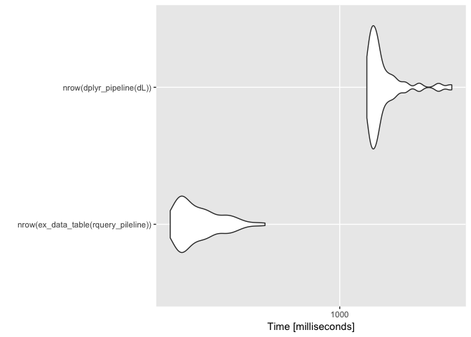
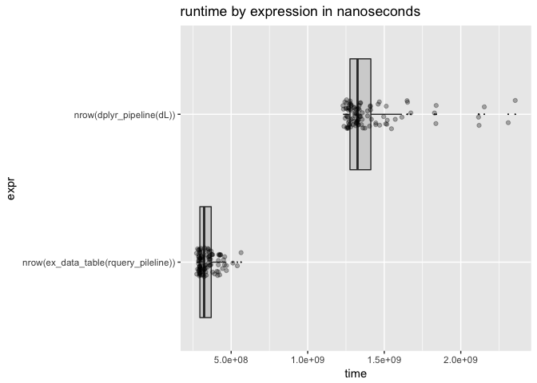

data.table backend for rquery
================
John Mount, Win-Vector LLC
05/29/2018

We can work an example similar to the [`rquery`](https://winvector.github.io/rquery/) [example](https://winvector.github.io/rquery/index.html) using a [`data.table`](http://r-datatable.com/) back-end ([`qdatatable`](https://github.com/WinVector/qdatatable)).

``` r
library("ggplot2")
library("microbenchmark")
library("dplyr")
```

    ## 
    ## Attaching package: 'dplyr'

    ## The following objects are masked from 'package:stats':
    ## 
    ##     filter, lag

    ## The following objects are masked from 'package:base':
    ## 
    ##     intersect, setdiff, setequal, union

``` r
library("rquery")
```

    ## Loading required package: wrapr

    ## 
    ## Attaching package: 'wrapr'

    ## The following object is masked from 'package:dplyr':
    ## 
    ##     coalesce

``` r
# load data.table second so its definiton of := wins
library("data.table")
```

    ## 
    ## Attaching package: 'data.table'

    ## The following object is masked from 'package:wrapr':
    ## 
    ##     :=

    ## The following objects are masked from 'package:dplyr':
    ## 
    ##     between, first, last

``` r
library("dtplyr")
library("qdatatable") # devtools::install.packages("WinVector/qdatatable")
```

``` r
# data example
dL <- build_frame(
   "subjectID", "surveyCategory"     , "assessmentTotal" |
   1          , "withdrawal behavior", 5                 |
   1          , "positive re-framing", 2                 |
   2          , "withdrawal behavior", 3                 |
   2          , "positive re-framing", 4                 )
```

``` r
scale <- 0.237

# example rquery pipeline
rquery_pileline <- local_td(dL) %.>%
  extend_nse(.,
             one := 1) %.>%
  extend_nse(.,
             probability :=
               exp(assessmentTotal * scale)/
               sum(exp(assessmentTotal * scale)),
             count := sum(one),
             rank := rank(probability, surveyCategory),
             partitionby = 'subjectID') %.>%
  extend_nse(.,
             isdiagnosis := rank == count,
             diagnosis := surveyCategory) %.>%
  select_rows_nse(., 
                  isdiagnosis == TRUE) %.>%
  select_columns(., 
                 c('subjectID', 'diagnosis', 'probability')) %.>%
  orderby(., 'subjectID')
```

Show expanded form of query tree.

``` r
cat(format(rquery_pileline))
```

    table('dL'; 
      subjectID,
      surveyCategory,
      assessmentTotal) %.>%
     extend(.,
      one := 1) %.>%
     extend(.,
      probability := exp(assessmentTotal * scale)/sum(exp(assessmentTotal * scale)),
      count := sum(one),
      p= subjectID) %.>%
     extend(.,
      rank := rank(probability, surveyCategory),
      p= subjectID) %.>%
     extend(.,
      isdiagnosis := rank == count,
      diagnosis := surveyCategory) %.>%
     select_rows(.,
       isdiagnosis == TRUE) %.>%
     select_columns(.,
       subjectID, diagnosis, probability) %.>%
     orderby(., subjectID)

``` r
# execute
# https://stackoverflow.com/questions/10527072/using-data-table-package-inside-my-own-package
#.datatable.aware <- TRUE

ex_data_table(rquery_pileline) %.>%
  knitr::kable(.)
```

|  subjectID| diagnosis           |  probability|
|----------:|:--------------------|------------:|
|          1| withdrawal behavior |    0.6706221|
|          2| positive re-framing |    0.5589742|

`dplyr` pipeline.

``` r
scale <- 0.237

dplyr_pipeline <- . %>% group_by(subjectID) %>%
  mutate(probability =
           exp(assessmentTotal * scale)/
           sum(exp(assessmentTotal * scale), na.rm = TRUE)) %>%
  arrange(probability, surveyCategory) %>%
  filter(row_number() == n()) %>%
  ungroup() %>%
  rename(diagnosis = surveyCategory) %>%
  select(subjectID, diagnosis, probability) %>%
  arrange(subjectID) 

dL %>% 
  dplyr_pipeline %>%
  knitr::kable()
```

|  subjectID| diagnosis           |  probability|
|----------:|:--------------------|------------:|
|          1| withdrawal behavior |    0.6706221|
|          2| positive re-framing |    0.5589742|

Try `dtplyr`.

``` r
data.table::as.data.table(dL) %>% 
  dplyr_pipeline
```

    ## Error in rank(x, ties.method = "first", na.last = "keep"): argument "x" is missing, with no default

Timings.

``` r
# fatten up data.frame a bit
dL <- dL[rep(seq_len(nrow(dL)), 10000), , drop = FALSE]
dL$subjectID <- paste(dL$subjectID, (1+seq_len(nrow(dL))) %/% 2, sep = "_")
for(i in seq_len(10)) {
  dL[[paste0("irrelevantCol", i)]] <- runif(nrow(dL))
}

# show we are working on the new larger data
system.time(print(nrow(ex_data_table(rquery_pileline))))
```

    ## [1] 20000

    ##    user  system elapsed 
    ##   0.562   0.029   0.386

``` r
system.time(print(nrow(dplyr_pipeline(dL))))
```

    ## [1] 20000

    ##    user  system elapsed 
    ##   1.310   0.020   1.372

``` r
timings <- microbenchmark(
  nrow(ex_data_table(rquery_pileline)),
  nrow(dplyr_pipeline(dL)))
```

``` r
print(timings)
```

    ## Unit: milliseconds
    ##                                  expr       min        lq      mean
    ##  nrow(ex_data_table(rquery_pileline))  257.9102  273.8922  334.8001
    ##              nrow(dplyr_pipeline(dL)) 1185.0832 1233.9211 1422.0820
    ##     median        uq       max neval
    ##   322.5735  373.5357  565.5198   100
    ##  1284.1473 1511.5009 2920.6255   100

``` r
# summarize by hand using rquery database connector
summary_pipeline <- timings %.>%
  as.data.frame(.) %.>%
  project_nse(., groupby = "expr", mean = avg(time)) 
timings %.>% 
  as.data.frame(.) %.>%
  summary_pipeline %.>%
  knitr::kable(.)
```

| expr                                    |        mean|
|:----------------------------------------|-----------:|
| nrow(dplyr\_pipeline(dL))               |  1422081990|
| nrow(ex\_data\_table(rquery\_pileline)) |   334800089|

``` r
autoplot(timings)
```



``` r
WVPlots::ScatterBoxPlotH(as.data.frame(timings), "time", "expr", "runtime by expression in nanoseconds")
```


