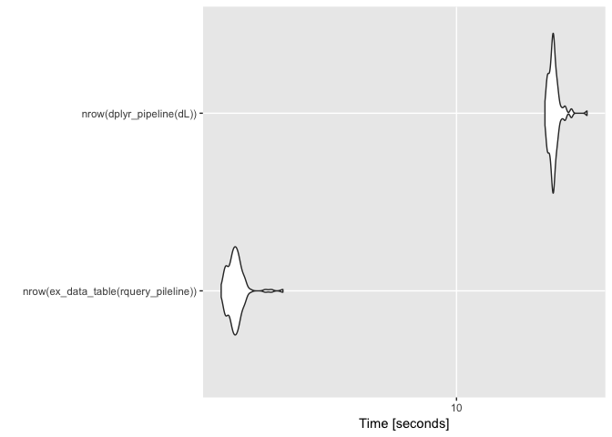

data.table backend for rquery
================
John Mount, Win-Vector LLC
05/28/2018

We can work an example similar to the [`rquery`](https://winvector.github.io/rquery/) [example](https://winvector.github.io/rquery/index.html) using a [`data.table`](http://r-datatable.com/) back-end.

``` r
library("ggplot2")
library("microbenchmark")
library("dplyr")
```

    ## 
    ## Attaching package: 'dplyr'

    ## The following objects are masked from 'package:stats':
    ## 
    ##     filter, lag

    ## The following objects are masked from 'package:base':
    ## 
    ##     intersect, setdiff, setequal, union

``` r
library("rquery")
```

    ## Loading required package: wrapr

    ## 
    ## Attaching package: 'wrapr'

    ## The following object is masked from 'package:dplyr':
    ## 
    ##     coalesce

``` r
# load data.table second so its definiton of := wins
library("data.table")
```

    ## 
    ## Attaching package: 'data.table'

    ## The following object is masked from 'package:wrapr':
    ## 
    ##     :=

    ## The following objects are masked from 'package:dplyr':
    ## 
    ##     between, first, last

``` r
source("data_table.R") # our example data.table back-end

dL <- data.frame(
    subjectID = c(1,                   
                  1,
                  2,                   
                  2),
    surveyCategory = c(
      'withdrawal behavior',
      'positive re-framing',
      'withdrawal behavior',
      'positive re-framing'
    ),
    assessmentTotal = c(5,                 
                        2,
                        3,                  
                        4),
    irrelevantCol1 = "irrel1",
    irrelevantCol2 = "irrel2",
    stringsAsFactors = FALSE)
```

``` r
scale <- 0.237

# example rquery pipeline
rquery_pileline <- local_td(dL) %.>%
  extend_nse(.,
             one := 1) %.>%
  extend_nse(.,
             probability :=
               exp(assessmentTotal * scale)/
               sum(exp(assessmentTotal * scale)),
             count := sum(one),
             rank := rank(probability, surveyCategory),
             partitionby = 'subjectID') %.>%
  extend_nse(.,
             isdiagnosis := rank == count,
             diagnosis := surveyCategory) %.>%
  select_rows_nse(., 
                  isdiagnosis == TRUE) %.>%
  select_columns(., 
                 c('subjectID', 'diagnosis', 'probability')) %.>%
  orderby(., 'subjectID')
```

Show expanded form of query tree.

``` r
cat(format(rquery_pileline))
```

    table('dL'; 
      subjectID,
      surveyCategory,
      assessmentTotal,
      irrelevantCol1,
      irrelevantCol2) %.>%
     extend(.,
      one := 1) %.>%
     extend(.,
      probability := exp(assessmentTotal * scale)/sum(exp(assessmentTotal * scale)),
      count := sum(one),
      p= subjectID) %.>%
     extend(.,
      rank := rank(probability, surveyCategory),
      p= subjectID) %.>%
     extend(.,
      isdiagnosis := rank == count,
      diagnosis := surveyCategory) %.>%
     select_rows(.,
       isdiagnosis == TRUE) %.>%
     select_columns(.,
       subjectID, diagnosis, probability) %.>%
     orderby(., subjectID)

``` r
# execute
# https://stackoverflow.com/questions/10527072/using-data-table-package-inside-my-own-package
.datatable.aware <- TRUE

res <- ex_data_table(rquery_pileline)

knitr::kable(res)
```

|  subjectID| diagnosis           |  probability|
|----------:|:--------------------|------------:|
|          1| withdrawal behavior |    0.6706221|
|          2| positive re-framing |    0.5589742|

`dplyr` pipeline.

``` r
scale <- 0.237

dplyr_pipeline <- . %>% group_by(subjectID) %>%
  mutate(probability =
           exp(assessmentTotal * scale)/
           sum(exp(assessmentTotal * scale), na.rm = TRUE)) %>%
  arrange(probability, surveyCategory) %>%
  filter(row_number() == n()) %>%
  ungroup() %>%
  rename(diagnosis = surveyCategory) %>%
  select(subjectID, diagnosis, probability) %>%
  arrange(subjectID) 

dL %>% dplyr_pipeline
```

    ## # A tibble: 2 x 3
    ##   subjectID diagnosis           probability
    ##       <dbl> <chr>                     <dbl>
    ## 1         1 withdrawal behavior       0.671
    ## 2         2 positive re-framing       0.559

Timings.

``` r
# fatten up data.frame a bit
dL <- dL[rep(seq_len(nrow(dL)), 100000), , drop = FALSE]
dL$subjectID <- paste(dL$subjectID, (1+seq_len(nrow(dL))) %/% 2, sep = "_")
for(i in seq_len(10)) {
  dL[[paste0("irrelevantCol", i)]] <- runif(nrow(dL))
}
```

``` r
timings <- microbenchmark(nrow(ex_data_table(rquery_pileline)),
                          nrow(dplyr_pipeline(dL)))

print(timings)
```

    ## Unit: seconds
    ##                                  expr       min       lq      mean
    ##  nrow(ex_data_table(rquery_pileline))  2.880735  3.02395  3.109183
    ##              nrow(dplyr_pipeline(dL)) 15.963767 16.41814 16.728273
    ##     median        uq       max neval
    ##   3.091604  3.161661  3.993402   100
    ##  16.655399 16.884735 19.943980   100

``` r
autoplot(timings)
```


