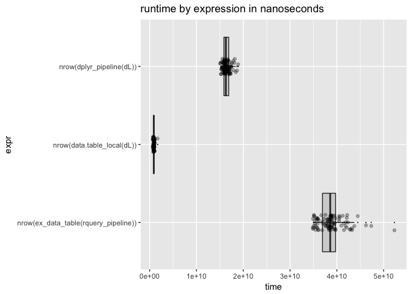

data.table backend for rquery
================
John Mount, Win-Vector LLC
05/30/2018

We can work an example similar to the [`rquery`](https://winvector.github.io/rquery/) [example](https://winvector.github.io/rquery/index.html) using a [`data.table`](http://r-datatable.com/) back-end ([`qdatatable`](https://github.com/WinVector/qdatatable)).

``` r
library("ggplot2")
library("microbenchmark")
library("dplyr")
```

    ## 
    ## Attaching package: 'dplyr'

    ## The following objects are masked from 'package:stats':
    ## 
    ##     filter, lag

    ## The following objects are masked from 'package:base':
    ## 
    ##     intersect, setdiff, setequal, union

``` r
library("dtplyr")
# https://github.com/WinVector/qdatatable
library("qdatatable") # devtools::install.packages("WinVector/qdatatable")
```

    ## Loading required package: rquery

    ## Loading required package: wrapr

    ## 
    ## Attaching package: 'wrapr'

    ## The following object is masked from 'package:dplyr':
    ## 
    ##     coalesce

``` r
# data example
dL <- build_frame(
   "subjectID", "surveyCategory"     , "assessmentTotal" |
   1          , "withdrawal behavior", 5                 |
   1          , "positive re-framing", 2                 |
   2          , "withdrawal behavior", 3                 |
   2          , "positive re-framing", 4                 )
```

``` r
scale <- 0.237

# example rquery pipeline
rquery_pipeline <- local_td(dL) %.>%
  extend_nse(.,
             probability :=
               exp(assessmentTotal * scale))  %.>% 
  normalize_cols(.,
                 "probability",
                 partitionby = 'subjectID') %.>%
  pick_top_k(.,
             partitionby = 'subjectID',
             orderby = c('probability', 'surveyCategory'),
             reverse = c('probability', 'surveyCategory')) %.>% 
  rename_columns(., 'diagnosis' := 'surveyCategory') %.>%
  select_columns(., c('subjectID', 
                      'diagnosis', 
                      'probability')) %.>%
  orderby(., cols = 'subjectID')
```

Show expanded form of query tree.

``` r
cat(format(rquery_pipeline))
```

    table('dL'; 
      subjectID,
      surveyCategory,
      assessmentTotal) %.>%
     extend(.,
      probability := exp(assessmentTotal * scale)) %.>%
     extend(.,
      probability := probability / sum(probability),
      p= subjectID) %.>%
     extend(.,
      row_rank := rank(),
      p= subjectID,
      o= "probability" DESC, "surveyCategory" DESC) %.>%
     select_rows(.,
       row_rank <= 1) %.>%
     rename(.,
      c('diagnosis' = 'surveyCategory')) %.>%
     select_columns(.,
       subjectID, diagnosis, probability) %.>%
     orderby(., subjectID)

Execute `rquery` pipeline using `data.table` as the impementation.

``` r
ex_data_table(rquery_pipeline) %.>%
  knitr::kable(.)
```

|  subjectID| diagnosis           |  probability|
|----------:|:--------------------|------------:|
|          1| withdrawal behavior |    0.6706221|
|          2| positive re-framing |    0.5589742|

Execute `rquery` pipeline using `PostgreSQL` as the implementation.

``` r
# configure a database connection
my_db <- DBI::dbConnect(RPostgreSQL::PostgreSQL(),
                          host = 'localhost',
                          port = 5432,
                          user = 'johnmount',
                          password = '')
dbopts <- rq_connection_tests(my_db)
options(dbopts)
# build the shared handle
winvector_temp_db_handle <- list(db = my_db)


# run the job
execute(dL, rquery_pipeline) %.>%
  knitr::kable(.)
```

|  subjectID| diagnosis           |  probability|
|----------:|:--------------------|------------:|
|          1| withdrawal behavior |    0.6706221|
|          2| positive re-framing |    0.5589742|

`dplyr` pipeline.

``` r
scale <- 0.237

dplyr_pipeline <- . %>% group_by(subjectID) %>%
  mutate(probability =
           exp(assessmentTotal * scale)/
           sum(exp(assessmentTotal * scale), na.rm = TRUE)) %>%
  arrange(probability, surveyCategory) %>%
  filter(row_number() == n()) %>%
  ungroup() %>%
  rename(diagnosis = surveyCategory) %>%
  select(subjectID, diagnosis, probability) %>%
  arrange(subjectID) 

dL %>% 
  dplyr_pipeline %>%
  knitr::kable()
```

|  subjectID| diagnosis           |  probability|
|----------:|:--------------------|------------:|
|          1| withdrawal behavior |    0.6706221|
|          2| positive re-framing |    0.5589742|

Try `dtplyr`.

``` r
data.table::as.data.table(dL) %>% 
  dplyr_pipeline
```

    ## Error in rank(x, ties.method = "first", na.last = "keep"): argument "x" is missing, with no default

Idiomatic `data.table` pipeline.

``` r
# improved code from:
# http://www.win-vector.com/blog/2018/01/base-r-can-be-fast/#comment-66746
data.table_local <- function(dL) {
  dDT <- data.table::as.data.table(dL)
  dDT <- dDT[, list(diagnosis = surveyCategory,
                    probability = exp (assessmentTotal * scale ) /
                      sum ( exp ( assessmentTotal * scale ) ))
             , subjectID ]
  data.table::setorder(dDT, subjectID, probability, -diagnosis)
  dDT <- dDT[, .SD[.N], subjectID]
  data.table::setorder(dDT, subjectID)
}

data.table_local(dL) %.>%
  knitr::kable(.)
```

|  subjectID| diagnosis           |  probability|
|----------:|:--------------------|------------:|
|          1| withdrawal behavior |    0.6706221|
|          2| positive re-framing |    0.5589742|

Timings.

``` r
# fatten up data.frame a bit
dL <- dL[rep(seq_len(nrow(dL)), 1000), , drop = FALSE]
dL$subjectID <- paste(dL$subjectID, (1+seq_len(nrow(dL))) %/% 2, sep = "_")
for(i in seq_len(10)) {
  dL[[paste0("irrelevantCol", i)]] <- runif(nrow(dL))
}

# show we are working on the new larger data
system.time(print(nrow(ex_data_table(rquery_pipeline))))
```

    ## [1] 2000

    ##    user  system elapsed 
    ##   0.972   0.038   0.425

``` r
system.time(print(nrow(dplyr_pipeline(dL))))
```

    ## [1] 2000

    ##    user  system elapsed 
    ##   0.399   0.007   0.162

``` r
system.time(nrow(data.table_local(dL)))
```

    ##    user  system elapsed 
    ##   0.024   0.000   0.015

``` r
timings <- microbenchmark(
  nrow(ex_data_table(rquery_pipeline)),
  nrow(data.table_local(dL)),
  nrow(dplyr_pipeline(dL)))
```

``` r
print(timings)
```

    ## Unit: milliseconds
    ##                                  expr        min        lq      mean
    ##  nrow(ex_data_table(rquery_pipeline)) 391.962113 416.69022 440.90833
    ##            nrow(data.table_local(dL))   6.726181   9.44222  11.74941
    ##              nrow(dplyr_pipeline(dL)) 110.235372 133.27840 162.92683
    ##     median        uq       max neval
    ##  430.11953 448.85524 610.36693   100
    ##   11.16799  12.70062  53.89847   100
    ##  171.69554 185.02202 210.10075   100

``` r
# summarize by hand using rquery database connector
summary_pipeline <- timings %.>%
  as.data.frame(.) %.>%
  project_nse(., groupby = "expr", mean = avg(time)) 
timings %.>% 
  as.data.frame(.) %.>%
  summary_pipeline %.>%
  knitr::kable(.)
```

| expr                                    |       mean|
|:----------------------------------------|----------:|
| nrow(dplyr\_pipeline(dL))               |  162926829|
| nrow(data.table\_local(dL))             |   11749411|
| nrow(ex\_data\_table(rquery\_pipeline)) |  440908327|

``` r
autoplot(timings)
```


``` r
WVPlots::ScatterBoxPlotH(as.data.frame(timings), "time", "expr", "runtime by expression in nanoseconds")
```



For more timings (including fast base-R implementations), please see [here](https://github.com/WinVector/rquery/blob/master/extras/QTimingFollowup/QTiming4.md).
