data.table backend for rquery replot
================
John Mount, Win-Vector LLC
06/04/2018

Re-plot some of the measurements from [here](https://github.com/WinVector/rquery/blob/master/extras/data_table.md).

``` r
library("ggplot2")
# https://github.com/WinVector/rqdatatable
library("rqdatatable") # devtools::install.packages("WinVector/rqdatatable")
```

``` r
all_timings <- readRDS("all_timings.RDS")
all_timings$seconds <- all_timings$time/1e9

summary_pipeline <- local_td(all_timings) %.>%
  project_nse(., groupby = c("nrows", "expr"), mean_time_seconds = mean(seconds)) %.>%
  orderby(., c("nrows", "expr"))
all_means <- as.data.frame(ex_data_table(summary_pipeline))
knitr::kable(all_means)
```

|  nrows| expr                          |  mean\_time\_seconds|
|------:|:------------------------------|--------------------:|
|  2e+00| rquery\_database\_round\_trip |            0.0654814|
|  2e+00| rquery\_data.table            |            0.0108208|
|  2e+00| data.table                    |            0.0033844|
|  2e+00| dplyr\_data\_frame            |            0.0106840|
|  2e+00| dplyr\_tbl                    |            0.0094259|
|  2e+00| dplyr\_database\_round\_trip  |            0.1836964|
|  2e+00| base\_r\_stats\_aggregate     |            0.0040605|
|  4e+00| rquery\_database\_round\_trip |            0.0830495|
|  4e+00| rquery\_data.table            |            0.0095108|
|  4e+00| data.table                    |            0.0043406|
|  4e+00| dplyr\_data\_frame            |            0.0117333|
|  4e+00| dplyr\_tbl                    |            0.0109606|
|  4e+00| dplyr\_database\_round\_trip  |            0.1735006|
|  4e+00| base\_r\_stats\_aggregate     |            0.0043916|
|  1e+01| rquery\_database\_round\_trip |            0.0733981|
|  1e+01| rquery\_data.table            |            0.0100308|
|  1e+01| data.table                    |            0.0028250|
|  1e+01| dplyr\_data\_frame            |            0.0115701|
|  1e+01| dplyr\_tbl                    |            0.0089683|
|  1e+01| dplyr\_database\_round\_trip  |            0.1961207|
|  1e+01| base\_r\_stats\_aggregate     |            0.0036994|
|  2e+01| rquery\_database\_round\_trip |            0.0786481|
|  2e+01| rquery\_data.table            |            0.0095924|
|  2e+01| data.table                    |            0.0038322|
|  2e+01| dplyr\_data\_frame            |            0.0106201|
|  2e+01| dplyr\_tbl                    |            0.0107345|
|  2e+01| dplyr\_database\_round\_trip  |            0.1674403|
|  2e+01| base\_r\_stats\_aggregate     |            0.0048509|
|  4e+01| rquery\_database\_round\_trip |            0.0817040|
|  4e+01| rquery\_data.table            |            0.0099081|
|  4e+01| data.table                    |            0.0037267|
|  4e+01| dplyr\_data\_frame            |            0.0133294|
|  4e+01| dplyr\_tbl                    |            0.0111169|
|  4e+01| dplyr\_database\_round\_trip  |            0.1730015|
|  4e+01| base\_r\_stats\_aggregate     |            0.0041934|
|  1e+02| rquery\_database\_round\_trip |            0.1025533|
|  1e+02| rquery\_data.table            |            0.0100890|
|  1e+02| data.table                    |            0.0034931|
|  1e+02| dplyr\_data\_frame            |            0.0127589|
|  1e+02| dplyr\_tbl                    |            0.0143131|
|  1e+02| dplyr\_database\_round\_trip  |            0.2007111|
|  1e+02| base\_r\_stats\_aggregate     |            0.0061682|
|  2e+02| rquery\_database\_round\_trip |            0.1147537|
|  2e+02| rquery\_data.table            |            0.0113551|
|  2e+02| data.table                    |            0.0042214|
|  2e+02| dplyr\_data\_frame            |            0.0176142|
|  2e+02| dplyr\_tbl                    |            0.0190319|
|  2e+02| dplyr\_database\_round\_trip  |            0.2594731|
|  2e+02| base\_r\_stats\_aggregate     |            0.0137462|
|  4e+02| rquery\_database\_round\_trip |            0.0728453|
|  4e+02| rquery\_data.table            |            0.0101235|
|  4e+02| data.table                    |            0.0036705|
|  4e+02| dplyr\_data\_frame            |            0.0182649|
|  4e+02| dplyr\_tbl                    |            0.0187859|
|  4e+02| dplyr\_database\_round\_trip  |            0.1827481|
|  4e+02| base\_r\_stats\_aggregate     |            0.0057901|
|  1e+03| rquery\_database\_round\_trip |            0.0989568|
|  1e+03| rquery\_data.table            |            0.0108178|
|  1e+03| data.table                    |            0.0055226|
|  1e+03| dplyr\_data\_frame            |            0.0290568|
|  1e+03| dplyr\_tbl                    |            0.0311728|
|  1e+03| dplyr\_database\_round\_trip  |            0.1897072|
|  1e+03| base\_r\_stats\_aggregate     |            0.0119885|
|  2e+03| rquery\_database\_round\_trip |            0.0981908|
|  2e+03| rquery\_data.table            |            0.0137548|
|  2e+03| data.table                    |            0.0070157|
|  2e+03| dplyr\_data\_frame            |            0.0709655|
|  2e+03| dplyr\_tbl                    |            0.0571365|
|  2e+03| dplyr\_database\_round\_trip  |            0.2172660|
|  2e+03| base\_r\_stats\_aggregate     |            0.0202563|
|  4e+03| rquery\_database\_round\_trip |            0.1452668|
|  4e+03| rquery\_data.table            |            0.0164238|
|  4e+03| data.table                    |            0.0118542|
|  4e+03| dplyr\_data\_frame            |            0.1219377|
|  4e+03| dplyr\_tbl                    |            0.1015341|
|  4e+03| dplyr\_database\_round\_trip  |            0.2689793|
|  4e+03| base\_r\_stats\_aggregate     |            0.0365467|
|  1e+04| rquery\_database\_round\_trip |            0.1994007|
|  1e+04| rquery\_data.table            |            0.0262523|
|  1e+04| data.table                    |            0.0200566|
|  1e+04| dplyr\_data\_frame            |            0.2104650|
|  1e+04| dplyr\_tbl                    |            0.2198989|
|  1e+04| dplyr\_database\_round\_trip  |            0.3109264|
|  1e+04| base\_r\_stats\_aggregate     |            0.1171423|
|  2e+04| rquery\_database\_round\_trip |            0.3578869|
|  2e+04| rquery\_data.table            |            0.0445040|
|  2e+04| data.table                    |            0.0437927|
|  2e+04| dplyr\_data\_frame            |            0.4570072|
|  2e+04| dplyr\_tbl                    |            0.4226030|
|  2e+04| dplyr\_database\_round\_trip  |            0.5308257|
|  2e+04| base\_r\_stats\_aggregate     |            0.1945873|
|  4e+04| rquery\_database\_round\_trip |            0.5850938|
|  4e+04| rquery\_data.table            |            0.0750215|
|  4e+04| data.table                    |            0.0824241|
|  4e+04| dplyr\_data\_frame            |            0.9001748|
|  4e+04| dplyr\_tbl                    |            0.8718410|
|  4e+04| dplyr\_database\_round\_trip  |            0.8561995|
|  4e+04| base\_r\_stats\_aggregate     |            0.4161678|
|  1e+05| rquery\_database\_round\_trip |            1.3177568|
|  1e+05| rquery\_data.table            |            0.1845145|
|  1e+05| data.table                    |            0.1985531|
|  1e+05| dplyr\_data\_frame            |            1.9865069|
|  1e+05| dplyr\_tbl                    |            1.8862559|
|  1e+05| dplyr\_database\_round\_trip  |            1.9380941|
|  1e+05| base\_r\_stats\_aggregate     |            1.3115429|
|  2e+05| rquery\_database\_round\_trip |            2.5084395|
|  2e+05| rquery\_data.table            |            0.3159885|
|  2e+05| data.table                    |            0.3390903|
|  2e+05| dplyr\_data\_frame            |            4.5489106|
|  2e+05| dplyr\_tbl                    |            4.2946216|
|  2e+05| dplyr\_database\_round\_trip  |            3.7869956|
|  2e+05| base\_r\_stats\_aggregate     |            2.4347116|
|  4e+05| rquery\_database\_round\_trip |            5.7816050|
|  4e+05| rquery\_data.table            |            0.5910693|
|  4e+05| data.table                    |            0.6513486|
|  4e+05| dplyr\_data\_frame            |            7.9060443|
|  4e+05| dplyr\_tbl                    |            8.5016137|
|  4e+05| dplyr\_database\_round\_trip  |            8.1757056|
|  4e+05| base\_r\_stats\_aggregate     |            4.3274996|
|  1e+06| rquery\_database\_round\_trip |           13.5909247|
|  1e+06| rquery\_data.table            |            1.4106712|
|  1e+06| data.table                    |            1.4632462|
|  1e+06| dplyr\_data\_frame            |           20.3271250|
|  1e+06| dplyr\_tbl                    |           19.5561871|
|  1e+06| dplyr\_database\_round\_trip  |           20.3892507|
|  1e+06| base\_r\_stats\_aggregate     |           11.0431010|
|  2e+06| rquery\_database\_round\_trip |           27.0604623|
|  2e+06| rquery\_data.table            |            2.6854535|
|  2e+06| data.table                    |            2.9283660|
|  2e+06| dplyr\_data\_frame            |           40.6944977|
|  2e+06| dplyr\_tbl                    |           40.2082821|
|  2e+06| dplyr\_database\_round\_trip  |           41.6983661|
|  2e+06| base\_r\_stats\_aggregate     |           22.1890656|
|  4e+06| rquery\_database\_round\_trip |           57.6204792|
|  4e+06| rquery\_data.table            |            4.9765232|
|  4e+06| data.table                    |            5.9540594|
|  4e+06| dplyr\_data\_frame            |           78.8708303|
|  4e+06| dplyr\_tbl                    |           80.4030980|
|  4e+06| dplyr\_database\_round\_trip  |           88.2261153|
|  4e+06| base\_r\_stats\_aggregate     |           51.4177099|
|  1e+07| rquery\_database\_round\_trip |          141.7345717|
|  1e+07| rquery\_data.table            |           12.4899875|
|  1e+07| data.table                    |           13.9822876|
|  1e+07| dplyr\_data\_frame            |          184.9806182|
|  1e+07| dplyr\_tbl                    |          188.3135020|
|  1e+07| dplyr\_database\_round\_trip  |          225.7453855|
|  1e+07| base\_r\_stats\_aggregate     |          125.0941576|

``` r
# get a shared lvel ordering
means <- all_means[all_means$nrows == max(all_means$nrows), , drop = FALSE]
means <- means[order(means$mean_time_seconds), , drop = FALSE]
levels <-  means$expr

# plot scatter plots for each experiment
for(target_size in sort(unique(all_timings$nrows))) {
  timings <- all_timings[all_timings$nrows == target_size, , drop = FALSE]
  timings$implementation <- factor(timings$expr, levels)
  cutpt <- median(timings$seconds[timings$expr=="base_r_stats_aggregate"])
  plt <- WVPlots::ScatterBoxPlotH(timings, 
                                  "seconds", "implementation", 
                                  paste0("task time in seconds by implementation\n(",
                                         timings$nrows[[1]], " row by ", timings$ncols[[1]], " column task)")) +
    geom_hline(yintercept = cutpt, linetype=2, alpha = 0.5) 
  print(plt)
}
```

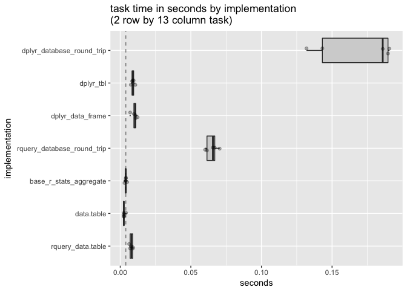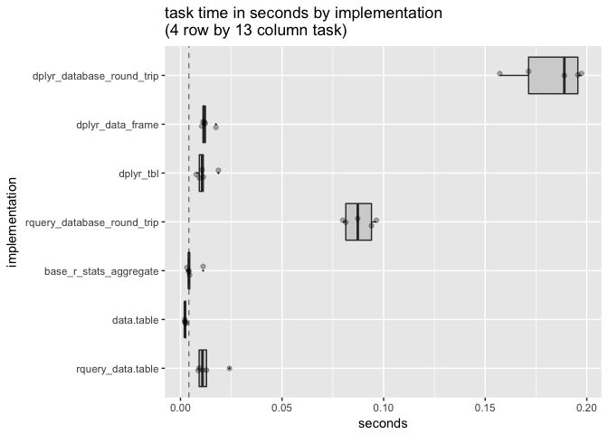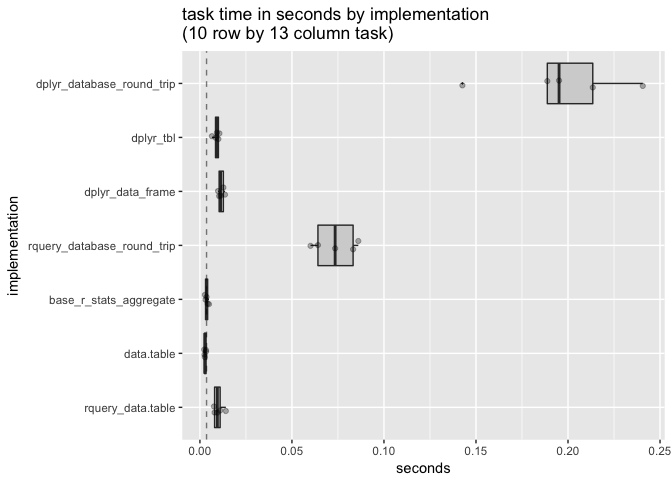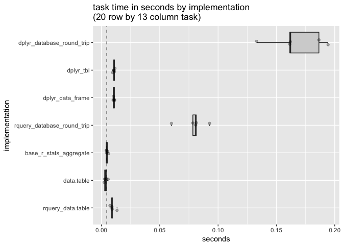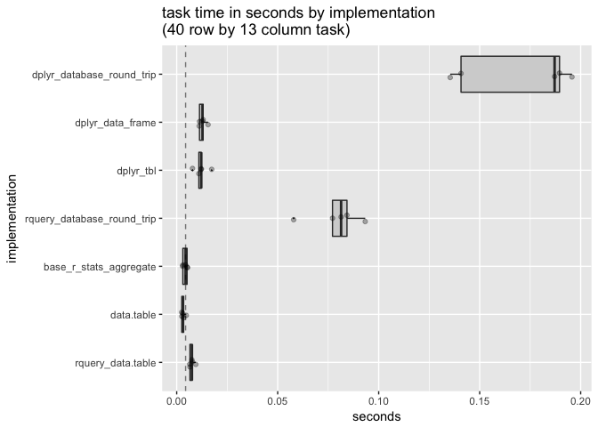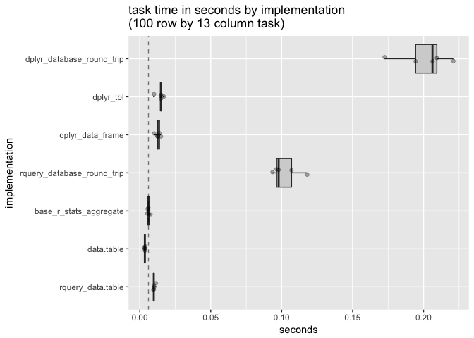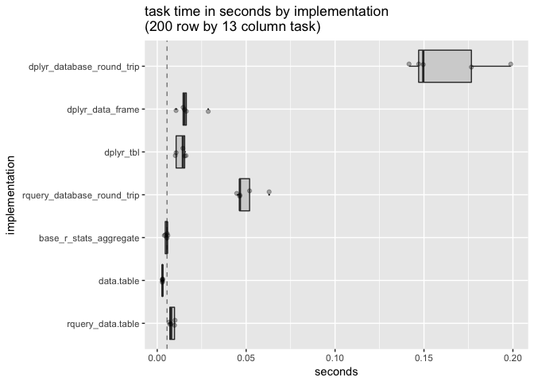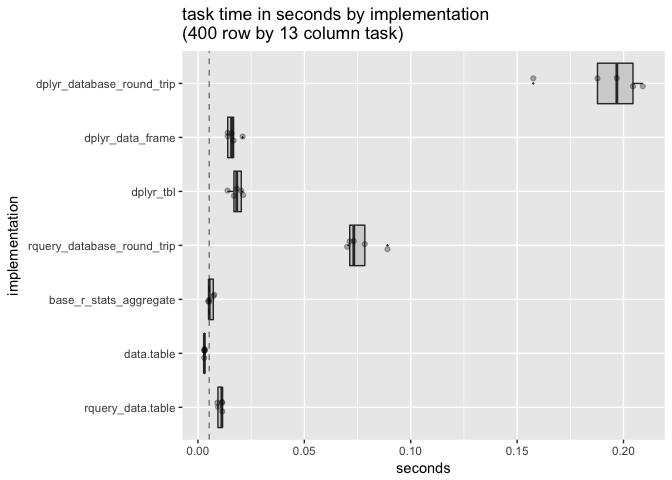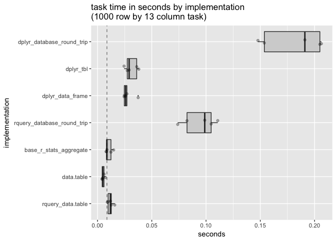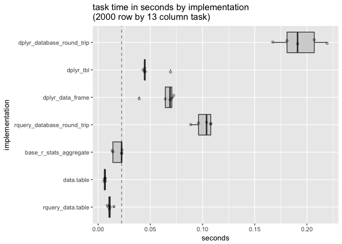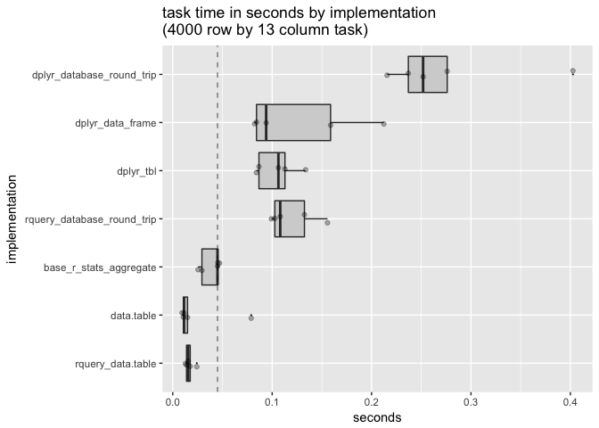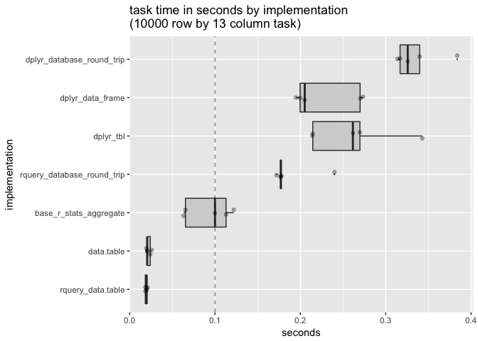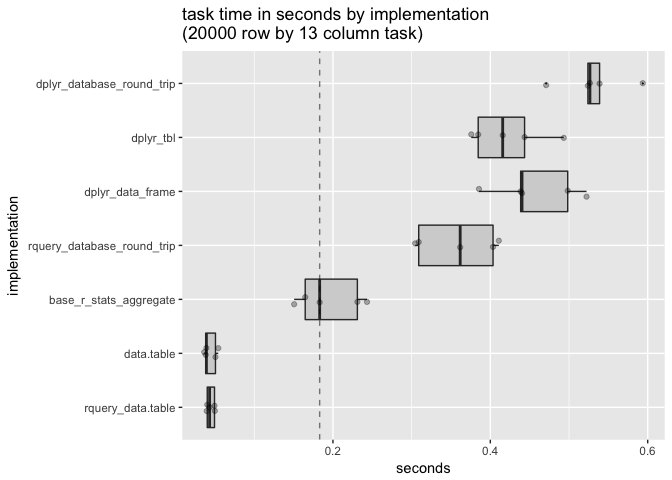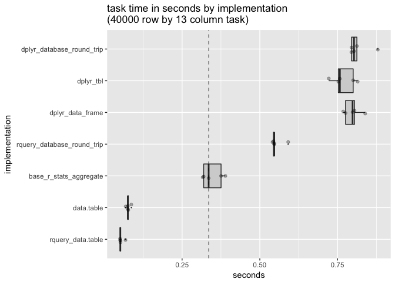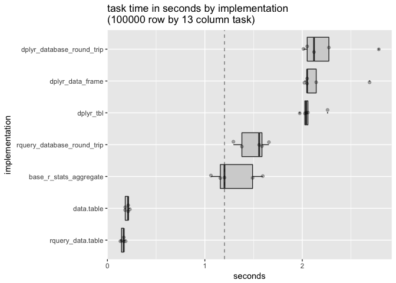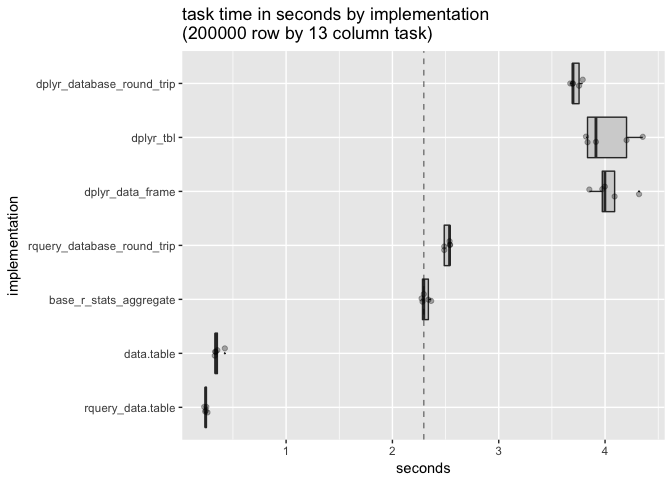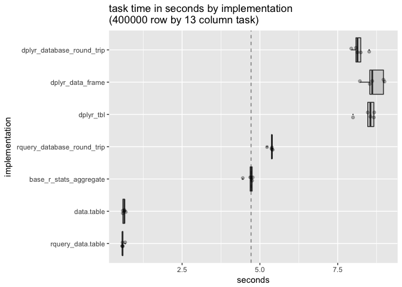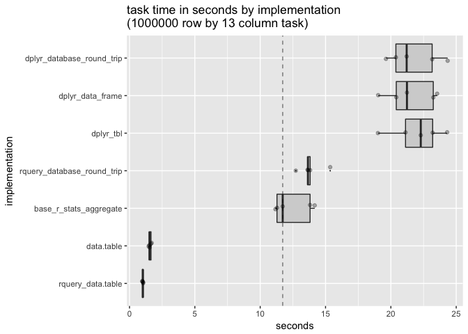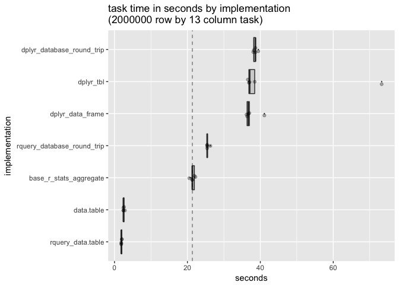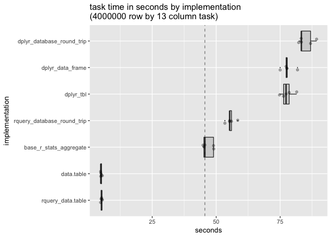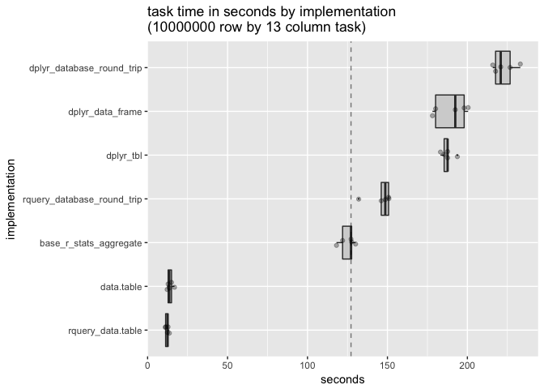

``` r
# plot as a function of problem size
cmap <- 
  c(dplyr_data_frame = "#a63603",
    dplyr_tbl = "#e6550d",
    dplyr_database_round_trip = "#fd8d3c",
    data.table = "#7851a9",
    rquery_database_round_trip = "#31a354",
    rquery_data.table = "#006d2c")
lmap <- c(dplyr_data_frame = 1,
          dplyr_tbl = 3,
          dplyr_database_round_trip = 4,
          data.table = 1,
          rquery_database_round_trip = 4,
          rquery_data.table = 2)
all_timings$implementation <- factor(all_timings$expr, rev(levels))
ex1 <- all_timings[all_timings$expr != 'base_r_stats_aggregate', , drop = FALSE]
exb <- all_timings[all_timings$expr == 'base_r_stats_aggregate', , drop = FALSE]
sm <- loess(seconds ~ nrows, data= exb)
smf <- data.frame(nrows = exp(seq(log(min(ex1$nrows)), log(max(ex1$nrows)), length.out = 100)))
smf$seconds <- predict(sm, newdata=smf)
ymin = min(all_timings$seconds)
ggplot(mapping = aes(x = nrows, y = seconds, ymax = seconds, ymin = ymin)) +
  geom_ribbon(data = smf, alpha = 0.3) +
  geom_line(data = ex1, se = FALSE, aes(color = implementation, linetype = implementation), 
            stat = "smooth", method = "loess", alpha = 0.7, size = 1) + 
  scale_x_log10() + scale_y_log10() +
  scale_color_manual(values = cmap) +
  scale_linetype_manual(values = lmap) +
  ggtitle("task time in seconds by nrows and implementation",
          subtitle = "shading boundary time taken by base R stats::aggregate() solution")
```

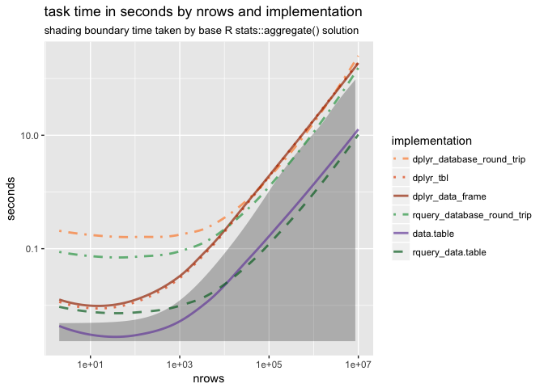

``` r
# look at slopes
summaries <- split(all_timings, all_timings$expr) %.>%
  lapply(., 
         function(gi) {
           model <- lm(seconds ~ nrows, data= gi)
           si <- as.data.frame(summary(model)$coefficients)
           si$coef <- rownames(si)
           si$impementation <- as.character(gi$expr[[1]])
           si
         }) %.>%
  data.table::rbindlist(.)
colnames(summaries) <- gsub("Pr(>|t|)", "P[g.t. abs(t)]", colnames(summaries), fixed = TRUE)
knitr::kable(summaries)
```

|    Estimate|  Std. Error|      t value|  P\[g.t. abs(t)\]| coef        | impementation                 |
|-----------:|-----------:|------------:|-----------------:|:------------|:------------------------------|
|  -0.0151133|   0.2349371|   -0.0643292|         0.9488328| (Intercept) | rquery\_database\_round\_trip |
|   0.0000142|   0.0000001|  145.0066467|         0.0000000| nrows       | rquery\_database\_round\_trip |
|   0.0349215|   0.0249315|    1.4006996|         0.1643094| (Intercept) | rquery\_data.table            |
|   0.0000012|   0.0000000|  120.2752990|         0.0000000| nrows       | rquery\_data.table            |
|   0.0321537|   0.0482951|    0.6657759|         0.5070426| (Intercept) | data.table                    |
|   0.0000014|   0.0000000|   70.0728403|         0.0000000| nrows       | data.table                    |
|   0.4394796|   0.2053032|    2.1406372|         0.0346632| (Intercept) | dplyr\_data\_frame            |
|   0.0000187|   0.0000001|  218.5266100|         0.0000000| nrows       | dplyr\_data\_frame            |
|   0.3417861|   0.2416780|    1.4142208|         0.1603128| (Intercept) | dplyr\_tbl                    |
|   0.0000190|   0.0000001|  188.8861895|         0.0000000| nrows       | dplyr\_tbl                    |
|  -0.2626280|   0.3120026|   -0.8417493|         0.4018784| (Intercept) | dplyr\_database\_round\_trip  |
|   0.0000225|   0.0000001|  172.9896993|         0.0000000| nrows       | dplyr\_database\_round\_trip  |
|  -0.1876453|   0.3188291|   -0.5885452|         0.5574548| (Intercept) | base\_r\_stats\_aggregate     |
|   0.0000125|   0.0000001|   94.3532753|         0.0000000| nrows       | base\_r\_stats\_aggregate     |
