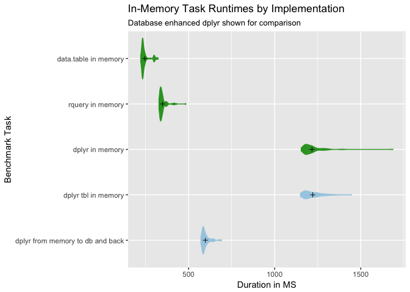
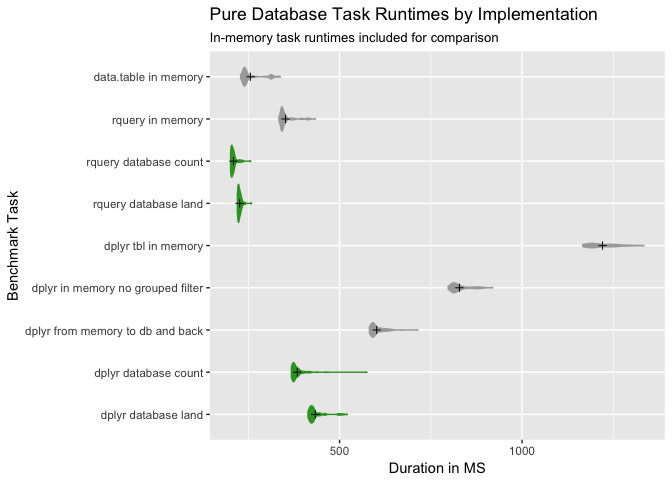
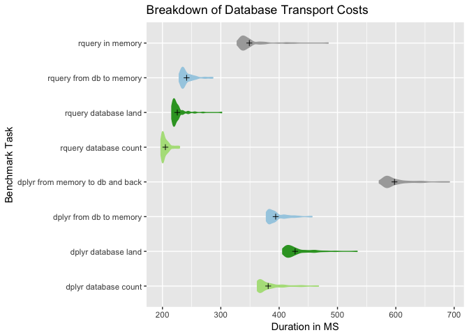

Plotting example
================
Nina Zumel
January 8, 2018

``` r
timings = readRDS("qtimings.RDS")
timings$expr <- as.character(timings$expr)

# colors
highlightcolor = "#33a02c"
backgroundcolor = "#a6cee3"
reruncolor = "#b2df8a"
greycolor = "darkgrey"


runs <- c("nrow(data.table_local())", 
          "nrow(rquery_local())",
          "nrow(dplyr_local())",
          "nrow(dplyr_round_trip())")
colormap = runs := c(highlightcolor,
                     highlightcolor,
                     highlightcolor,
                     backgroundcolor)

tr <- timings[timings$expr %in% runs, , drop=FALSE]
tr$expr <- factor(tr$expr, levels = rev(runs))
plotbenchmark(tr, colormap, "In-Memory Task Runtimes by Implementation")
```



``` r
runs <- c("nrow(data.table_local())", 
          "nrow(rquery_local())",
          "rquery_database_count()",
          "nrow(dplyr_local())",
          "nrow(dplyr_round_trip())",
          "dplyr_database_count()")
colormap = runs := c(greycolor,
                     greycolor,
                     highlightcolor,
                     greycolor,
                     greycolor,
                     highlightcolor)

tr <- timings[timings$expr %in% runs, , drop=FALSE]
tr$expr <- factor(tr$expr, levels = rev(runs))
plotbenchmark(tr, colormap, 
              title = "Pure Database Task Runtimes by Implementation",
              subtitle = "In-memory task runtimes included for comparison")
```



``` r
followups <- c("nrow(rquery_local())",
               "nrow(rquery_database_pull())", 
               "rquery_database_count()", 
               "nrow(dplyr_round_trip())",
               "nrow(dplyr_database_pull())",
               "dplyr_database_count()")     
colormap = followups := c(highlightcolor,
                          backgroundcolor,
                          reruncolor,
                          highlightcolor,
                          backgroundcolor,
                          reruncolor)
tf <- timings[timings$expr %in% followups, , drop=FALSE]
tf$expr <- factor(tf$expr, levels = rev(followups))
plotbenchmark(tf, colormap, "Breakdown of Transport Costs")
```


