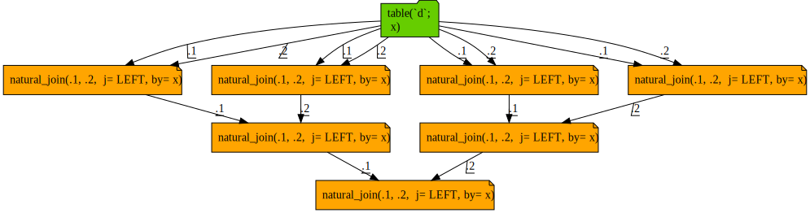
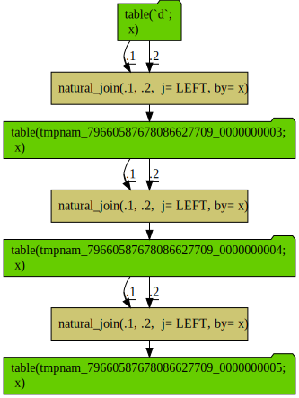

Query sequences joined to themselves blow up the query complexity exponentially, as each path is re-build on each attempted re-use.

```{r}
library("rquery")

db <- DBI::dbConnect(RSQLite::SQLite(), ":memory:")

db_rquery <- rquery_db_info(
  connection = db,
  is_dbi = TRUE,
  connection_options = rq_connection_tests(db))
tmps <- wrapr::mk_tmp_name_source()

d <- data.frame(x = -3:3)

d0 <- rq_copy_to(db_rquery, "d", d)

d1 <- natural_join(d0, d0, by = "x", jointype = "LEFT")
d2 <- natural_join(d1, d1, by = "x", jointype = "LEFT")
d3 <- natural_join(d2, d2, by = "x", jointype = "LEFT")

cat(format(d3))
```

Notice the depth 3 expression exploded into tree with 7 joins.

This is not unique to [`rquery`](https://CRAN.R-project.org/package=rquery), [`dplyr`](https://CRAN.R-project.org/package=dplyr) has the same issue.

```{r}
library("dplyr")

d0_dplyr <- tbl(db, "d")

d1_dplyr <- left_join(d0_dplyr, d0_dplyr, by = "x")
d2_dplyr <- left_join(d1_dplyr, d1_dplyr, by = "x")
d3_dplyr <- left_join(d2_dplyr, d2_dplyr, by = "x")
dbplyr::remote_query(d3_dplyr)
```

Largely it is a lack of a convenient way to name and cache the intermediate results in basic `SQL` without landing a table or view and starting a new query.  Without value re-use, re-writing a directed-acyclic graph (the specified input) into a tree (the basis of `SQL`) can cause a query explosion.

`dplyr` can easily overcome this limitation with it's `compute()` node.

```{r}
d1_dplyr <- compute(left_join(d0_dplyr, d0_dplyr, by = "x"))
d2_dplyr <- compute(left_join(d1_dplyr, d1_dplyr, by = "x"))
d3_dplyr <- compute(left_join(d2_dplyr, d2_dplyr, by = "x"))
dbplyr::remote_query(d3_dplyr)
```

`rquery` can also fix the issue by landing intermediate results, though the table lifetime tracking is intentionally more explicit.

```{r}
d1_mat <- materialize(
  db,
  natural_join(d0, d0, by = "x", jointype = "LEFT"),
  table_name = tmps(), temporary = TRUE, overwrite = TRUE)
d2_mat <- materialize(
  db,
  natural_join(d1_mat, d1_mat, by = "x", jointype = "LEFT"),
  table_name = tmps(), temporary = TRUE, overwrite = TRUE)
d3_mat <- materialize(
  db,
  natural_join(d2_mat, d2_mat, by = "x", jointype = "LEFT"),
  table_name = tmps(), temporary = TRUE, overwrite = TRUE)
cat(format(d3_mat))
```


And `rquery`'s query diagrammer can help spot and diagnose these issues.

```{r diagram, fig.width=8, fig.height=8}
d3 %.>%
  op_diagram(., merge_tables = TRUE) %.>% 
  DiagrammeR::grViz(.) %.>%
  DiagrammeRsvg::export_svg(.) %.>%
  write(., file="query_growth_diagram.svg")
```



The gold nodes are possibly repeated calculations, and the warning also notes the issue. 


One could hope the query optimizer will eliminate the common sub-expressions, but that is not always going to be the case.  In fact sometimes the very size of a query turns off the query optimizer in systems such as `Spark`.  It is better to organize your calculation to not emit so many common sub-expressions in the first place.

With a little more notation we can even produce a diagram of the materialized strategy.

```{r}
stages <- list()
add_stage <- function(ops, table_name = tmps()) {
  ops$materialize_as <- table_name
  table <- mk_td(table_name, column_names(ops))
  stages <<- c(stages, list(ops))
  table
}

d1_tab <- add_stage(natural_join(d0, d0, by = "x", jointype = "LEFT"))
d2_tab <- add_stage(natural_join(d1_tab, d1_tab, by = "x", jointype = "LEFT"))
d3_tab <- add_stage(natural_join(d2_tab, d2_tab, by = "x", jointype = "LEFT"))
stages <- c(stages, list(d3_tab))
cat(format(d3_tab))
```

```{r diagram2, fig.width=8, fig.height=8}
stages %.>%
  op_diagram(., merge_tables = TRUE) %.>% 
  DiagrammeR::grViz(.) %.>%
  DiagrammeRsvg::export_svg(.) %.>%
  write(., file="query_growth_diagram2.svg")
```




For a non-trivial example of computation management and value re-use please see [here](https://github.com/WinVector/rquery/blob/master/db_examples/RSQLite.md).


```{r}
# clean up tmps
intermediates <- tmps(dumpList = TRUE)
for(ti in intermediates) {
  rquery::rq_remove_table(db, ti)
}

DBI::dbDisconnect(db)
```
