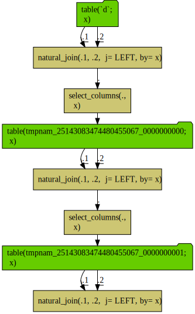
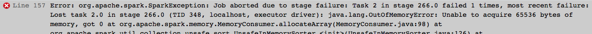

Time DAG
================

Query sequences joined to themselves blow up the query complexity exponentially, as each path is re-build on each attempted re-use. Here we will work a deliberately nasty example. We are going to push hard on the infrastructure to see how strong it is.

First we set up an `Apache Spark` example in `R`.

``` r
library("rquery")
packageVersion("rquery")
```

    ## [1] '1.3.1'

``` r
library("wrapr")
library("sparklyr")
```

    ## Warning: package 'sparklyr' was built under R version 3.5.2

``` r
packageVersion("sparklyr")
```

    ## [1] '0.9.4'

``` r
conf <- sparklyr::spark_config()
conf$spark.executor.cores <- 2
conf$spark.executor.memory <- "4G"
conf$spark.yarn.am.cores <- 2
conf$spark.yarn.am.memory <- "4G"
conf$spark.driver.memory <- "4G"
conf$spark.executor.memory <- "4G"
conf$spark.yarn.am.memory <- "4G"
conf$`sparklyr.shell.driver-memory` <- "4G"
conf$`sparklyr.shell.executor-memory` <- "4G"
conf$`spark.yarn.executor.memoryOverhead` <- "4G"
raw_connection <- sparklyr::spark_connect(version='2.2.0', 
                                          master = "local",
                                          config = conf)
cname <- rq_connection_name(raw_connection)
rquery::setDBOption(raw_connection, 
                    "create_options",
                    "USING PARQUET OPTIONS ('compression'='snappy')")

dbopts <- rq_connection_tests(raw_connection)
db_rquery <- rquery_db_info(connection = raw_connection,
                     is_dbi = TRUE,
                     connection_options = dbopts)

d <- data.frame(x = paste0("v_", 1:100000),
                stringsAsFactors = FALSE)

d0 <- rq_copy_to(db_rquery, "d", d)

d1 <- natural_join(d0, d0, by = "x", jointype = "LEFT")
d2 <- natural_join(d1, d1, by = "x", jointype = "LEFT")
d3 <- natural_join(d2, d2, by = "x", jointype = "LEFT")

cat(format(d3))
```

    ## table(`d`; 
    ##   x) %.>%
    ##  natural_join(.,
    ##   table(`d`; 
    ##     x),
    ##   j= LEFT, by= x) %.>%
    ##  natural_join(.,
    ##   table(`d`; 
    ##     x) %.>%
    ##    natural_join(.,
    ##     table(`d`; 
    ##       x),
    ##     j= LEFT, by= x),
    ##   j= LEFT, by= x) %.>%
    ##  natural_join(.,
    ##   table(`d`; 
    ##     x) %.>%
    ##    natural_join(.,
    ##     table(`d`; 
    ##       x),
    ##     j= LEFT, by= x) %.>%
    ##    natural_join(.,
    ##     table(`d`; 
    ##       x) %.>%
    ##      natural_join(.,
    ##       table(`d`; 
    ##         x),
    ##       j= LEFT, by= x),
    ##     j= LEFT, by= x),
    ##   j= LEFT, by= x)

Notice the depth 3 expression exploded into tree with 7 joins. This may be easier to see in the following diagram.

``` r
d3 %.>%
  op_diagram(., merge_tables = TRUE) %.>% 
  DiagrammeR::grViz(.) %.>%
  DiagrammeRsvg::export_svg(.) %.>%
  write(., file="time_dag_diagram1.svg")
```

    ## Warning in op_diagram(., merge_tables = TRUE): possible repeated calculation:
    ##  natural_join(.1, .2,  j= LEFT, by= x)


This is not unique to [`rquery`](https://CRAN.R-project.org/package=rquery), [`dplyr`](https://CRAN.R-project.org/package=dplyr) has the same issue. This is the consequence of re-using results in SQL (without the the use of intermediate tables or common tabel expressions).

``` r
library("dplyr")
```

    ## 
    ## Attaching package: 'dplyr'

    ## The following object is masked from 'package:wrapr':
    ## 
    ##     coalesce

    ## The following objects are masked from 'package:stats':
    ## 
    ##     filter, lag

    ## The following objects are masked from 'package:base':
    ## 
    ##     intersect, setdiff, setequal, union

``` r
packageVersion("dplyr")
```

    ## [1] '0.8.0'

``` r
packageVersion("dbplyr")
```

    ## [1] '1.3.0'

``` r
d0_dplyr <- tbl(raw_connection, "d")

d1_dplyr <- left_join(d0_dplyr, d0_dplyr, by = "x")
d2_dplyr <- left_join(d1_dplyr, d1_dplyr, by = "x")
d3_dplyr <- left_join(d2_dplyr, d2_dplyr, by = "x")
dbplyr::remote_query(d3_dplyr)
```

    ## <SQL> SELECT `TBL_LEFT`.`x` AS `x`
    ##   FROM (SELECT `TBL_LEFT`.`x` AS `x`
    ##   FROM (SELECT `TBL_LEFT`.`x` AS `x`
    ##   FROM `d` AS `TBL_LEFT`
    ##   LEFT JOIN `d` AS `TBL_RIGHT`
    ##   ON (`TBL_LEFT`.`x` = `TBL_RIGHT`.`x`)
    ## ) `TBL_LEFT`
    ##   LEFT JOIN (SELECT `TBL_LEFT`.`x` AS `x`
    ##   FROM `d` AS `TBL_LEFT`
    ##   LEFT JOIN `d` AS `TBL_RIGHT`
    ##   ON (`TBL_LEFT`.`x` = `TBL_RIGHT`.`x`)
    ## ) `TBL_RIGHT`
    ##   ON (`TBL_LEFT`.`x` = `TBL_RIGHT`.`x`)
    ## ) `TBL_LEFT`
    ##   LEFT JOIN (SELECT `TBL_LEFT`.`x` AS `x`
    ##   FROM (SELECT `TBL_LEFT`.`x` AS `x`
    ##   FROM `d` AS `TBL_LEFT`
    ##   LEFT JOIN `d` AS `TBL_RIGHT`
    ##   ON (`TBL_LEFT`.`x` = `TBL_RIGHT`.`x`)
    ## ) `TBL_LEFT`
    ##   LEFT JOIN (SELECT `TBL_LEFT`.`x` AS `x`
    ##   FROM `d` AS `TBL_LEFT`
    ##   LEFT JOIN `d` AS `TBL_RIGHT`
    ##   ON (`TBL_LEFT`.`x` = `TBL_RIGHT`.`x`)
    ## ) `TBL_RIGHT`
    ##   ON (`TBL_LEFT`.`x` = `TBL_RIGHT`.`x`)
    ## ) `TBL_RIGHT`
    ##   ON (`TBL_LEFT`.`x` = `TBL_RIGHT`.`x`)

Largely it is a lack of a convenient way to name and cache the intermediate results in basic `SQL` without landing a table or view and starting a new query. Without value re-use, re-writing a directed-acyclic graph (the specified input) into a tree (the basis of `SQL`) can cause a query explosion.

Now a query planner may be able to eliminate the redundant steps- but that same planner is also facing a query that has size exponential in the query depth.

`dplyr` can easily overcome this limitation with it's `compute()` node.

``` r
d1_dplyr <- compute(left_join(d0_dplyr, d0_dplyr, by = "x"))
d2_dplyr <- compute(left_join(d1_dplyr, d1_dplyr, by = "x"))
d3_dplyr <- compute(left_join(d2_dplyr, d2_dplyr, by = "x"))
dbplyr::remote_query(d3_dplyr)
```

    ## <SQL> SELECT *
    ## FROM `uvfhdjijne`

`rquery` can also fix the issue by landing intermediate results, though the table lifetime tracking is intentionally more explicit through either a [`materialize()`](https://winvector.github.io/rquery/reference/materialize.html) or [`relop_list`](https://winvector.github.io/rquery/reference/relop_list-class.html) step. With a more advanced "collector" notation we can both build the efficient query plan, but also the diagram certifying the lack of redundant stages.

``` r
tmps <- wrapr::mk_tmp_name_source()
collector <- make_relop_list(tmps)

d1_tab <- natural_join(d0, d0, by = "x", jointype = "LEFT") %.>%
  collector
d2_tab <- natural_join(d1_tab, d1_tab, by = "x", jointype = "LEFT") %.>%
  collector
d3_tab <- natural_join(d2_tab, d2_tab, by = "x", jointype = "LEFT") %.>%
  collector

stages <- get_relop_list_stages(collector)
```

``` r
stages %.>%
  op_diagram(., merge_tables = TRUE) %.>% 
  DiagrammeR::grViz(.) %.>%
  DiagrammeRsvg::export_svg(.) %.>%
  write(., file="time_dag_diagram2.svg")
```



We can also time the various methods. For each function we are re-creating the table to try and defeat the result cache and ensure the calculation actually runs (i.e. to get timings similar to what a user would see on first application). For intermediate results the query planner may or may not eliminate redundant calculations at will.

``` r
depth <- 6

f_dplyr <- function() {
  d_dplyr <- dplyr::copy_to(raw_connection, d, overwrite = TRUE)
  for(i in 1:depth) {
    d_dplyr <- left_join(d_dplyr, d_dplyr, by = "x")
  }
  compute(d_dplyr)
}

f_dplyr_compute <- function() {
  d_dplyr <- dplyr::copy_to(raw_connection, d, overwrite = TRUE)
  for(i in 1:depth) {
    d_dplyr <- compute(left_join(d_dplyr, d_dplyr, by = "x"))
  }
  d_dplyr
}

f_rquery <- function() {
  d_rquery <- rq_copy_to(db_rquery, "d", d, overwrite = TRUE)
  for(i in 1:depth) {
    d_rquery <- natural_join(d_rquery, d_rquery, by = "x", jointype = "LEFT")
  }
  materialize(db_rquery, d3)
}

f_rquery_materialize <- function() {
  d_rquery <- rq_copy_to(db_rquery, "d", d, overwrite = TRUE)
  for(i in 1:depth) {
    d_rquery <- materialize(db_rquery,
                            natural_join(d_rquery, d_rquery, by = "x", jointype = "LEFT"))
  }
  d_rquery
}
```

We can't include the non-cached `dplyr` calculation as, with the above configuration on the test machine, it bombs-out with the following error message (hard-crahsing RStudio):

``` r
f_dplyr()
```



We can time the rest of the methods.

``` r
timings <- microbenchmark::microbenchmark(
  # dplyr = f_dplyr(),
  dplyr_compute = f_dplyr_compute(),
  rquery = f_rquery(),
  rquery_materialize = f_rquery_materialize(),
  times = 5L)

timings
```

    ## Unit: seconds
    ##                expr      min       lq     mean   median       uq      max
    ##       dplyr_compute 4.099576 4.123249 4.666769 4.187276 5.193542 5.730202
    ##              rquery 1.652492 1.668255 1.797867 1.755601 1.941893 1.971093
    ##  rquery_materialize 4.052829 4.391686 4.744455 4.445506 4.978082 5.854170
    ##  neval cld
    ##      5   b
    ##      5  a 
    ##      5   b

I would say concentrate on the mean and median times (as they are similar). Notice `rquery` with no intermediate value saving is by far the fastest (about 2.5 times as fast as `dplyr`). However, for safety, we recommend using some variation of the calculations that save intermediate results (though perhaps saving less often). On re-runs `dplyr_compute` often appears to be a bit faster than `rquery_materialize` (we think [`compute()` may in fact achieve less isolation](https://github.com/rstudio/sparklyr/issues/1026) than `materialize()`), but can be considered to be roughly running at the same rate.

The timings indicate introducing the intermediate computes actually slows things down (as they take effort and move data away from the faster representations). These results above are consistent with `sparklyr` itself reducing the query from the exponential blow-up back down to the linear tree by itself eliminating repeated calculation. However, note the query optimizer has to survive the query to do this- and in our experience with client `sparklyr` work very long queries (which turn into very deep nested queries) often overrun the query optimizer. So users must be cautions and break up their calculations in places (though at some cost).

The above may seem extreme, but in our experience we have seen teams working with `Spark` through automatic query generators spend a *lot* of time running into and debugging very opaque query growth problems. The issues include that long sequences of operations get translated into very deep nested queries *and* any re-use of intermediate values translates into unexpected (and not-signaled) query explosion. Some things that are cheap in immediate/imperative systems are in fact hard in delayed evaluation systems (so common intuition fails). Our hope is that with diagramming tools such as `rquery::op_diagram()` users can anticipate the issues tune their calculation plans using methods such as `rquery::materialize()` and `rquery::relop_list()`.

For a non-trivial example of computation management and value re-use please see [here](https://github.com/WinVector/rquery/blob/master/db_examples/RSQLite.md). Some more discussion of the query explosion effect is available [here](https://github.com/WinVector/rquery/blob/master/extras/query_growth/query_growth.md).

``` r
library("rqdatatable")

summary <- data.frame(timings) %.>% 
  project(., 
          time_seconds := median(time)/1e+9,
          groupby = "expr") 
print(summary)
```

    ##                  expr time_seconds
    ## 1:      dplyr_compute     4.187276
    ## 2: rquery_materialize     4.445506
    ## 3:             rquery     1.755601

``` r
# clean up tmps
intermediates <- tmps(dumpList = TRUE)
for(ti in intermediates) {
  rquery::rq_remove_table(raw_connection, ti)
}

sparklyr::spark_disconnect(raw_connection)
```

    ## NULL

``` r
rm(list = c("raw_connection", "db_rquery"))
```
