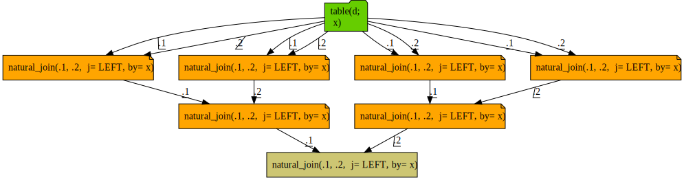
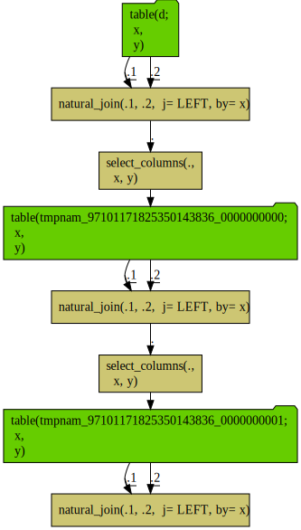

Time DAG PostgreSQL
================

Query sequences joined to themselves blow up the query complexity exponentially, as each path is re-build on each attempted re-use. Here we will work a deliberately nasty example. We are going to push hard on the infrastructure to see how strong it is.

First we set up a `PostgreSQL` example in `R`.

``` r
library("rquery")
packageVersion("rquery")
```

    ## [1] '1.3.1'

``` r
library("wrapr")

raw_connection <- DBI::dbConnect(RPostgreSQL::PostgreSQL(),
                                 host = 'localhost',
                                 port = 5432,
                                 user = 'johnmount',
                                 password = '')

dbopts <- rq_connection_tests(raw_connection)
```

    ## Error in postgresqlExecStatement(conn, statement, ...) : 
    ##   RS-DBI driver: (could not Retrieve the result : ERROR:  syntax error at or near "INT"
    ## LINE 1: ...ARY VIEW "rq_test_80884892739119718260_0000000000" ( x INT )
    ##                                                                   ^
    ## )
    ## Error in postgresqlExecStatement(conn, statement, ...) : 
    ##   RS-DBI driver: (could not Retrieve the result : ERROR:  relation "rq_test_80884892739119718260_0000000000" does not exist
    ## LINE 1: SELECT * FROM "rq_test_80884892739119718260_0000000000" LIMI...
    ##                       ^
    ## )

``` r
db_rquery <- rquery_db_info(connection = raw_connection,
                     is_dbi = TRUE,
                     connection_options = dbopts)

d <- data.frame(x = paste0("v_", 1:100000),
                y = 1.0,
                stringsAsFactors = FALSE)

d0 <- rq_copy_to(db_rquery, "d", d,
                 temporary = TRUE, 
                 overwrite = TRUE)
```

    ## Error in postgresqlExecStatement(conn, statement, ...) : 
    ##   RS-DBI driver: (could not Retrieve the result : ERROR:  relation "d" does not exist
    ## LINE 1: SELECT * FROM "d" LIMIT 1
    ##                       ^
    ## )

``` r
d1 <- natural_join(d0, d0, by = "x", jointype = "LEFT") %.>%
  extend(., y = y + 1)
d2 <- natural_join(d1, d1, by = "x", jointype = "LEFT") %.>%
  extend(., y = y + 1)
d3 <- natural_join(d2, d2, by = "x", jointype = "LEFT") %.>%
  extend(., y = y + 1)

cat(format(d3))
```

    ## table("d"; 
    ##   x,
    ##   y) %.>%
    ##  natural_join(.,
    ##   table("d"; 
    ##     x,
    ##     y),
    ##   j= LEFT, by= x) %.>%
    ##  extend(.,
    ##   y := y + 1) %.>%
    ##  natural_join(.,
    ##   table("d"; 
    ##     x,
    ##     y) %.>%
    ##    natural_join(.,
    ##     table("d"; 
    ##       x,
    ##       y),
    ##     j= LEFT, by= x) %.>%
    ##    extend(.,
    ##     y := y + 1),
    ##   j= LEFT, by= x) %.>%
    ##  extend(.,
    ##   y := y + 1) %.>%
    ##  natural_join(.,
    ##   table("d"; 
    ##     x,
    ##     y) %.>%
    ##    natural_join(.,
    ##     table("d"; 
    ##       x,
    ##       y),
    ##     j= LEFT, by= x) %.>%
    ##    extend(.,
    ##     y := y + 1) %.>%
    ##    natural_join(.,
    ##     table("d"; 
    ##       x,
    ##       y) %.>%
    ##      natural_join(.,
    ##       table("d"; 
    ##         x,
    ##         y),
    ##       j= LEFT, by= x) %.>%
    ##      extend(.,
    ##       y := y + 1),
    ##     j= LEFT, by= x) %.>%
    ##    extend(.,
    ##     y := y + 1),
    ##   j= LEFT, by= x) %.>%
    ##  extend(.,
    ##   y := y + 1)

Notice the depth 3 expression exploded into tree with 7 joins. This may be easier to see in the following diagram.

``` r
d3 %.>%
  op_diagram(., merge_tables = TRUE) %.>% 
  DiagrammeR::grViz(.) %.>%
  DiagrammeRsvg::export_svg(.) %.>%
  write(., file="time_dag_diagram1p.svg")
```

    ## Warning in op_diagram(., merge_tables = TRUE): possible repeated calculation:
    ##  natural_join(.1, .2,  j= LEFT, by= x)

    ## Warning in op_diagram(., merge_tables = TRUE): possible repeated calculation:
    ##  extend(.,
    ##   y := y + 1)

``` r
res_rquery <- materialize(db_rquery, d3)
```

    ## Error in postgresqlExecStatement(conn, statement, ...) : 
    ##   RS-DBI driver: (could not Retrieve the result : ERROR:  relation "rquery_mat_60277111377272645665_0000000000" does not exist
    ## LINE 1: SELECT * FROM "rquery_mat_60277111377272645665_0000000000" L...
    ##                       ^
    ## )

``` r
rstr(db_rquery, res_rquery)
```

    ## table "rquery_mat_60277111377272645665_0000000000" rquery_db_info 
    ##  nrow: 1e+05 
    ##  NOTE: "obs" below is count of sample, not number of rows of data.
    ## 'data.frame':    10 obs. of  2 variables:
    ##  $ x: chr  "v_1" "v_10" "v_100" "v_1000" ...
    ##  $ y: num  4 4 4 4 4 4 4 4 4 4



Notice the directed acyclic graph of three joins exploded into diagram of seven joins (due to the re-computation of intermediate results). This is the consequence of re-using results in SQL (without the the use of intermediate tables or common tabel expressions).

This is not unique to [`rquery`](https://CRAN.R-project.org/package=rquery), [`dplyr`](https://CRAN.R-project.org/package=dplyr) has the same issue.

``` r
library("dplyr")
```

    ## 
    ## Attaching package: 'dplyr'

    ## The following object is masked from 'package:wrapr':
    ## 
    ##     coalesce

    ## The following objects are masked from 'package:stats':
    ## 
    ##     filter, lag

    ## The following objects are masked from 'package:base':
    ## 
    ##     intersect, setdiff, setequal, union

``` r
packageVersion("dplyr")
```

    ## [1] '0.8.0'

``` r
packageVersion("dbplyr")
```

    ## [1] '1.3.0'

``` r
d0_dplyr <- tbl(raw_connection, "d")

d1_dplyr <- left_join(d0_dplyr, select(d0_dplyr, x), by = "x") %>%
  mutate(y = y + 1)
d2_dplyr <- left_join(d1_dplyr, select(d1_dplyr, x), by = "x") %>%
  mutate(y = y + 1)
d3_dplyr <- left_join(d2_dplyr, select(d2_dplyr, x), by = "x") %>%
  mutate(y = y + 1)
dbplyr::remote_query(d3_dplyr)
```

    ## <SQL> SELECT "x", "y" + 1.0 AS "y"
    ## FROM (SELECT "TBL_LEFT"."x" AS "x", "TBL_LEFT"."y" AS "y"
    ##   FROM (SELECT "x", "y" + 1.0 AS "y"
    ## FROM (SELECT "TBL_LEFT"."x" AS "x", "TBL_LEFT"."y" AS "y"
    ##   FROM (SELECT "x", "y" + 1.0 AS "y"
    ## FROM (SELECT "TBL_LEFT"."x" AS "x", "TBL_LEFT"."y" AS "y"
    ##   FROM "d" AS "TBL_LEFT"
    ##   LEFT JOIN (SELECT "x"
    ## FROM "d") "TBL_RIGHT"
    ##   ON ("TBL_LEFT"."x" = "TBL_RIGHT"."x")
    ## ) "kzidcivnwo") "TBL_LEFT"
    ##   LEFT JOIN (SELECT "x"
    ## FROM (SELECT "x", "y" + 1.0 AS "y"
    ## FROM (SELECT "TBL_LEFT"."x" AS "x", "TBL_LEFT"."y" AS "y"
    ##   FROM "d" AS "TBL_LEFT"
    ##   LEFT JOIN (SELECT "x"
    ## FROM "d") "TBL_RIGHT"
    ##   ON ("TBL_LEFT"."x" = "TBL_RIGHT"."x")
    ## ) "vqmycetcqp") "vyirgwlghj") "TBL_RIGHT"
    ##   ON ("TBL_LEFT"."x" = "TBL_RIGHT"."x")
    ## ) "kiyofgylpy") "TBL_LEFT"
    ##   LEFT JOIN (SELECT "x"
    ## FROM (SELECT "x", "y" + 1.0 AS "y"
    ## FROM (SELECT "TBL_LEFT"."x" AS "x", "TBL_LEFT"."y" AS "y"
    ##   FROM (SELECT "x", "y" + 1.0 AS "y"
    ## FROM (SELECT "TBL_LEFT"."x" AS "x", "TBL_LEFT"."y" AS "y"
    ##   FROM "d" AS "TBL_LEFT"
    ##   LEFT JOIN (SELECT "x"
    ## FROM "d") "TBL_RIGHT"
    ##   ON ("TBL_LEFT"."x" = "TBL_RIGHT"."x")
    ## ) "irlkodmwax") "TBL_LEFT"
    ##   LEFT JOIN (SELECT "x"
    ## FROM (SELECT "x", "y" + 1.0 AS "y"
    ## FROM (SELECT "TBL_LEFT"."x" AS "x", "TBL_LEFT"."y" AS "y"
    ##   FROM "d" AS "TBL_LEFT"
    ##   LEFT JOIN (SELECT "x"
    ## FROM "d") "TBL_RIGHT"
    ##   ON ("TBL_LEFT"."x" = "TBL_RIGHT"."x")
    ## ) "bksznzdugj") "drfsatdnjf") "TBL_RIGHT"
    ##   ON ("TBL_LEFT"."x" = "TBL_RIGHT"."x")
    ## ) "bksvtjzkrg") "uvdjvgyhlu") "TBL_RIGHT"
    ##   ON ("TBL_LEFT"."x" = "TBL_RIGHT"."x")
    ## ) "mswfqfrbat"

``` r
d3_dplyr
```

    ## # Source:   lazy query [?? x 2]
    ## # Database: postgres 10.4.0 [johnmount@localhost:5432/johnmount]
    ##    x         y
    ##    <chr> <dbl>
    ##  1 v_1       4
    ##  2 v_2       4
    ##  3 v_3       4
    ##  4 v_4       4
    ##  5 v_5       4
    ##  6 v_6       4
    ##  7 v_7       4
    ##  8 v_8       4
    ##  9 v_9       4
    ## 10 v_10      4
    ## # … with more rows

The expanded query again contains seven joins.

Largely it is a lack of a convenient way to name and cache the intermediate results in basic `SQL` without landing a table or view and starting a new query. Without value re-use, re-writing a directed-acyclic graph (the specified input) into a tree (the basis of `SQL`) can cause a query explosion.

Now a query planner may be able to eliminate the redundant steps- but that same planner is also facing a query that has size exponential in the query depth.

`dplyr` can easily overcome this limitation with it's `compute()` node.

``` r
d1_dplyr <- compute(left_join(d0_dplyr, d0_dplyr, by = "x"))
d2_dplyr <- compute(left_join(d1_dplyr, d1_dplyr, by = "x"))
d3_dplyr <- compute(left_join(d2_dplyr, d2_dplyr, by = "x"))
dbplyr::remote_query(d3_dplyr)
```

    ## <SQL> SELECT *
    ## FROM "skwxzcafnb"

`rquery` can also fix the issue by landing intermediate results, though the table lifetime tracking is intentionally more explicit through either a [`materialize()`](https://winvector.github.io/rquery/reference/materialize.html) or [`relop_list`](https://winvector.github.io/rquery/reference/relop_list-class.html) step. With a more advanced "collector" notation we can both build the efficient query plan, but also the diagram certifying the lack of redundant stages.

``` r
tmps <- wrapr::mk_tmp_name_source()
collector <- make_relop_list(tmps)

d1_tab <- natural_join(d0, d0, by = "x", jointype = "LEFT") %.>%
  collector
d2_tab <- natural_join(d1_tab, d1_tab, by = "x", jointype = "LEFT") %.>%
  collector
d3_tab <- natural_join(d2_tab, d2_tab, by = "x", jointype = "LEFT") %.>%
  collector

stages <- get_relop_list_stages(collector)
```

``` r
stages %.>%
  op_diagram(., merge_tables = TRUE) %.>% 
  DiagrammeR::grViz(.) %.>%
  DiagrammeRsvg::export_svg(.) %.>%
  write(., file="time_dag_diagram2p.svg")
```



We can also time the various methods. For each function we are re-creating the table to try and defeat the result cache and ensure the calculation actually runs (i.e. to get timings similar to what a user would see on first application). For intermediate results the query planner may or may not eliminate redundant calculations at will.

``` r
depth <- 6

f_dplyr <- function() {
  d_dplyr <- dplyr::copy_to(raw_connection, d, 
                            overwrite = TRUE,
                            temporary = TRUE)
  for(i in 1:depth) {
    d_dplyr <- left_join(d_dplyr, select(d_dplyr, x), by = "x")
  }
  compute(d_dplyr)
}

f_dplyr_compute <- function() {
  d_dplyr <- dplyr::copy_to(raw_connection, d, 
                            overwrite = TRUE,
                            temporary = TRUE)
  for(i in 1:depth) {
    d_dplyr <- compute(left_join(d_dplyr, select(d_dplyr, x), by = "x"))
  }
  d_dplyr
}

f_rquery <- function() {
  d_rquery <- rq_copy_to(db_rquery, "d", d, 
                         temporary = TRUE,
                         overwrite = TRUE)
  for(i in 1:depth) {
    d_rquery <- natural_join(d_rquery, d_rquery, by = "x", jointype = "LEFT")
  }
  materialize(db_rquery, d3)
}

f_rquery_materialize <- function() {
  d_rquery <- rq_copy_to(db_rquery, "d", d, 
                         temporary = TRUE,
                         overwrite = TRUE)
  for(i in 1:depth) {
    d_rquery <- materialize(db_rquery,
                            natural_join(d_rquery, d_rquery, by = "x", jointype = "LEFT"))
  }
  d_rquery
}
```

``` r
timings <- microbenchmark::microbenchmark(
  dplyr = f_dplyr(),
  dplyr_compute = f_dplyr_compute(),
  rquery = f_rquery(),
  rquery_materialize = f_rquery_materialize(),
  times = 5L)
```

    ## Error in postgresqlExecStatement(conn, statement, ...) : 
    ##   RS-DBI driver: (could not Retrieve the result : ERROR:  relation "rquery_mat_60054897360644991736_0000000000" does not exist
    ## LINE 1: SELECT * FROM "rquery_mat_60054897360644991736_0000000000" L...
    ##                       ^
    ## )
    ## Error in postgresqlExecStatement(conn, statement, ...) : 
    ##   RS-DBI driver: (could not Retrieve the result : ERROR:  relation "rquery_mat_84909515694601295417_0000000000" does not exist
    ## LINE 1: SELECT * FROM "rquery_mat_84909515694601295417_0000000000" L...
    ##                       ^
    ## )
    ## Error in postgresqlExecStatement(conn, statement, ...) : 
    ##   RS-DBI driver: (could not Retrieve the result : ERROR:  relation "rquery_mat_88487258245613697141_0000000000" does not exist
    ## LINE 1: SELECT * FROM "rquery_mat_88487258245613697141_0000000000" L...
    ##                       ^
    ## )
    ## Error in postgresqlExecStatement(conn, statement, ...) : 
    ##   RS-DBI driver: (could not Retrieve the result : ERROR:  relation "rquery_mat_57214846859650630573_0000000000" does not exist
    ## LINE 1: SELECT * FROM "rquery_mat_57214846859650630573_0000000000" L...
    ##                       ^
    ## )
    ## Error in postgresqlExecStatement(conn, statement, ...) : 
    ##   RS-DBI driver: (could not Retrieve the result : ERROR:  relation "rquery_mat_12038686371945960155_0000000000" does not exist
    ## LINE 1: SELECT * FROM "rquery_mat_12038686371945960155_0000000000" L...
    ##                       ^
    ## )
    ## Error in postgresqlExecStatement(conn, statement, ...) : 
    ##   RS-DBI driver: (could not Retrieve the result : ERROR:  relation "rquery_mat_88673251566643793949_0000000000" does not exist
    ## LINE 1: SELECT * FROM "rquery_mat_88673251566643793949_0000000000" L...
    ##                       ^
    ## )
    ## Error in postgresqlExecStatement(conn, statement, ...) : 
    ##   RS-DBI driver: (could not Retrieve the result : ERROR:  relation "rquery_mat_86105413054882622507_0000000000" does not exist
    ## LINE 1: SELECT * FROM "rquery_mat_86105413054882622507_0000000000" L...
    ##                       ^
    ## )
    ## Error in postgresqlExecStatement(conn, statement, ...) : 
    ##   RS-DBI driver: (could not Retrieve the result : ERROR:  relation "rquery_mat_54995760803769852748_0000000000" does not exist
    ## LINE 1: SELECT * FROM "rquery_mat_54995760803769852748_0000000000" L...
    ##                       ^
    ## )
    ## Error in postgresqlExecStatement(conn, statement, ...) : 
    ##   RS-DBI driver: (could not Retrieve the result : ERROR:  relation "rquery_mat_01548262617824061989_0000000000" does not exist
    ## LINE 1: SELECT * FROM "rquery_mat_01548262617824061989_0000000000" L...
    ##                       ^
    ## )
    ## Error in postgresqlExecStatement(conn, statement, ...) : 
    ##   RS-DBI driver: (could not Retrieve the result : ERROR:  relation "rquery_mat_51592523848367610430_0000000000" does not exist
    ## LINE 1: SELECT * FROM "rquery_mat_51592523848367610430_0000000000" L...
    ##                       ^
    ## )
    ## Error in postgresqlExecStatement(conn, statement, ...) : 
    ##   RS-DBI driver: (could not Retrieve the result : ERROR:  relation "rquery_mat_22675285598226148235_0000000000" does not exist
    ## LINE 1: SELECT * FROM "rquery_mat_22675285598226148235_0000000000" L...
    ##                       ^
    ## )
    ## Error in postgresqlExecStatement(conn, statement, ...) : 
    ##   RS-DBI driver: (could not Retrieve the result : ERROR:  relation "rquery_mat_43112176051786193424_0000000000" does not exist
    ## LINE 1: SELECT * FROM "rquery_mat_43112176051786193424_0000000000" L...
    ##                       ^
    ## )
    ## Error in postgresqlExecStatement(conn, statement, ...) : 
    ##   RS-DBI driver: (could not Retrieve the result : ERROR:  relation "rquery_mat_71191978633270086149_0000000000" does not exist
    ## LINE 1: SELECT * FROM "rquery_mat_71191978633270086149_0000000000" L...
    ##                       ^
    ## )
    ## Error in postgresqlExecStatement(conn, statement, ...) : 
    ##   RS-DBI driver: (could not Retrieve the result : ERROR:  relation "rquery_mat_84382785460970371019_0000000000" does not exist
    ## LINE 1: SELECT * FROM "rquery_mat_84382785460970371019_0000000000" L...
    ##                       ^
    ## )
    ## Error in postgresqlExecStatement(conn, statement, ...) : 
    ##   RS-DBI driver: (could not Retrieve the result : ERROR:  relation "rquery_mat_83534386008237492245_0000000000" does not exist
    ## LINE 1: SELECT * FROM "rquery_mat_83534386008237492245_0000000000" L...
    ##                       ^
    ## )
    ## Error in postgresqlExecStatement(conn, statement, ...) : 
    ##   RS-DBI driver: (could not Retrieve the result : ERROR:  relation "rquery_mat_75245398720944467854_0000000000" does not exist
    ## LINE 1: SELECT * FROM "rquery_mat_75245398720944467854_0000000000" L...
    ##                       ^
    ## )
    ## Error in postgresqlExecStatement(conn, statement, ...) : 
    ##   RS-DBI driver: (could not Retrieve the result : ERROR:  relation "rquery_mat_89307364231142410621_0000000000" does not exist
    ## LINE 1: SELECT * FROM "rquery_mat_89307364231142410621_0000000000" L...
    ##                       ^
    ## )
    ## Error in postgresqlExecStatement(conn, statement, ...) : 
    ##   RS-DBI driver: (could not Retrieve the result : ERROR:  relation "rquery_mat_25725283357963195660_0000000000" does not exist
    ## LINE 1: SELECT * FROM "rquery_mat_25725283357963195660_0000000000" L...
    ##                       ^
    ## )
    ## Error in postgresqlExecStatement(conn, statement, ...) : 
    ##   RS-DBI driver: (could not Retrieve the result : ERROR:  relation "rquery_mat_85506285142578119610_0000000000" does not exist
    ## LINE 1: SELECT * FROM "rquery_mat_85506285142578119610_0000000000" L...
    ##                       ^
    ## )
    ## Error in postgresqlExecStatement(conn, statement, ...) : 
    ##   RS-DBI driver: (could not Retrieve the result : ERROR:  relation "rquery_mat_69132455788003891160_0000000000" does not exist
    ## LINE 1: SELECT * FROM "rquery_mat_69132455788003891160_0000000000" L...
    ##                       ^
    ## )
    ## Error in postgresqlExecStatement(conn, statement, ...) : 
    ##   RS-DBI driver: (could not Retrieve the result : ERROR:  relation "rquery_mat_82323813176265817660_0000000000" does not exist
    ## LINE 1: SELECT * FROM "rquery_mat_82323813176265817660_0000000000" L...
    ##                       ^
    ## )
    ## Error in postgresqlExecStatement(conn, statement, ...) : 
    ##   RS-DBI driver: (could not Retrieve the result : ERROR:  relation "rquery_mat_47540023056979863258_0000000000" does not exist
    ## LINE 1: SELECT * FROM "rquery_mat_47540023056979863258_0000000000" L...
    ##                       ^
    ## )
    ## Error in postgresqlExecStatement(conn, statement, ...) : 
    ##   RS-DBI driver: (could not Retrieve the result : ERROR:  relation "rquery_mat_76153264631208043937_0000000000" does not exist
    ## LINE 1: SELECT * FROM "rquery_mat_76153264631208043937_0000000000" L...
    ##                       ^
    ## )
    ## Error in postgresqlExecStatement(conn, statement, ...) : 
    ##   RS-DBI driver: (could not Retrieve the result : ERROR:  relation "rquery_mat_72663248696089306724_0000000000" does not exist
    ## LINE 1: SELECT * FROM "rquery_mat_72663248696089306724_0000000000" L...
    ##                       ^
    ## )
    ## Error in postgresqlExecStatement(conn, statement, ...) : 
    ##   RS-DBI driver: (could not Retrieve the result : ERROR:  relation "rquery_mat_27213528116851908794_0000000000" does not exist
    ## LINE 1: SELECT * FROM "rquery_mat_27213528116851908794_0000000000" L...
    ##                       ^
    ## )
    ## Error in postgresqlExecStatement(conn, statement, ...) : 
    ##   RS-DBI driver: (could not Retrieve the result : ERROR:  relation "rquery_mat_58959455709891941830_0000000000" does not exist
    ## LINE 1: SELECT * FROM "rquery_mat_58959455709891941830_0000000000" L...
    ##                       ^
    ## )
    ## Error in postgresqlExecStatement(conn, statement, ...) : 
    ##   RS-DBI driver: (could not Retrieve the result : ERROR:  relation "rquery_mat_81660605590358122321_0000000000" does not exist
    ## LINE 1: SELECT * FROM "rquery_mat_81660605590358122321_0000000000" L...
    ##                       ^
    ## )
    ## Error in postgresqlExecStatement(conn, statement, ...) : 
    ##   RS-DBI driver: (could not Retrieve the result : ERROR:  relation "rquery_mat_20113149402243561513_0000000000" does not exist
    ## LINE 1: SELECT * FROM "rquery_mat_20113149402243561513_0000000000" L...
    ##                       ^
    ## )
    ## Error in postgresqlExecStatement(conn, statement, ...) : 
    ##   RS-DBI driver: (could not Retrieve the result : ERROR:  relation "rquery_mat_06301642139402631649_0000000000" does not exist
    ## LINE 1: SELECT * FROM "rquery_mat_06301642139402631649_0000000000" L...
    ##                       ^
    ## )
    ## Error in postgresqlExecStatement(conn, statement, ...) : 
    ##   RS-DBI driver: (could not Retrieve the result : ERROR:  relation "rquery_mat_57492776673112451765_0000000000" does not exist
    ## LINE 1: SELECT * FROM "rquery_mat_57492776673112451765_0000000000" L...
    ##                       ^
    ## )
    ## Error in postgresqlExecStatement(conn, statement, ...) : 
    ##   RS-DBI driver: (could not Retrieve the result : ERROR:  relation "rquery_mat_99373496910119515493_0000000000" does not exist
    ## LINE 1: SELECT * FROM "rquery_mat_99373496910119515493_0000000000" L...
    ##                       ^
    ## )
    ## Error in postgresqlExecStatement(conn, statement, ...) : 
    ##   RS-DBI driver: (could not Retrieve the result : ERROR:  relation "rquery_mat_02562118078867202713_0000000000" does not exist
    ## LINE 1: SELECT * FROM "rquery_mat_02562118078867202713_0000000000" L...
    ##                       ^
    ## )
    ## Error in postgresqlExecStatement(conn, statement, ...) : 
    ##   RS-DBI driver: (could not Retrieve the result : ERROR:  relation "rquery_mat_10754652125869699067_0000000000" does not exist
    ## LINE 1: SELECT * FROM "rquery_mat_10754652125869699067_0000000000" L...
    ##                       ^
    ## )
    ## Error in postgresqlExecStatement(conn, statement, ...) : 
    ##   RS-DBI driver: (could not Retrieve the result : ERROR:  relation "rquery_mat_01739036377241701851_0000000000" does not exist
    ## LINE 1: SELECT * FROM "rquery_mat_01739036377241701851_0000000000" L...
    ##                       ^
    ## )
    ## Error in postgresqlExecStatement(conn, statement, ...) : 
    ##   RS-DBI driver: (could not Retrieve the result : ERROR:  relation "rquery_mat_03100776644511206408_0000000000" does not exist
    ## LINE 1: SELECT * FROM "rquery_mat_03100776644511206408_0000000000" L...
    ##                       ^
    ## )

``` r
timings
```

    ## Unit: seconds
    ##                expr       min        lq      mean    median        uq
    ##               dplyr  7.312025  7.401322  7.581391  7.683292  7.711282
    ##       dplyr_compute  5.467150  5.849717  5.924574  5.870465  5.929925
    ##              rquery 15.964567 17.087479 17.913497 17.780672 18.585362
    ##  rquery_materialize  6.966945  7.040421  7.279604  7.206862  7.380541
    ##        max neval cld
    ##   7.799032     5  b 
    ##   6.505611     5 a  
    ##  20.149403     5   c
    ##   7.803252     5 ab

I would say concentrate on the mean and median times (as they are similar). In this example `dplyr`'s `SQL` seems to not need the caching steps, though `rquery` does.

The above may seem extreme, but in our experience we have seen teams working with database systems through automatic query generators spend a *lot* of time running into and debugging very opaque query growth problems. The issues include that long sequences of operations get translated into very deep nested queries *and* any re-use of intermediate values translates into unexpected (and not-signaled) query explosion. Some things that are cheap in immediate/imperative systems are in fact hard in delayed evaluation systems (so common intuition fails). Our hope is that with diagramming tools such as `rquery::op_diagram()` users can anticipate the issues tune their calculation plans using methods such as `rquery::materialize()` and `rquery::relop_list()`.

For a non-trivial example of computation management and value re-use please see [here](https://github.com/WinVector/rquery/blob/master/db_examples/RSQLite.md). Some more discussion of the query explosion effect is available [here](https://github.com/WinVector/rquery/blob/master/extras/query_growth/query_growth.md).

``` r
library("rqdatatable")

summary <- data.frame(timings) %.>% 
  project(., 
          time_seconds := median(time)/1e+9,
          groupby = "expr") 
print(summary)
```

    ##                  expr time_seconds
    ## 1: rquery_materialize     7.206862
    ## 2:             rquery    17.780672
    ## 3:      dplyr_compute     5.870465
    ## 4:              dplyr     7.683292

``` r
# clean up tmps
intermediates <- tmps(dumpList = TRUE)
for(ti in intermediates) {
  rquery::rq_remove_table(raw_connection, ti)
}
```

    ## Error in postgresqlExecStatement(conn, statement, ...) : 
    ##   RS-DBI driver: (could not Retrieve the result : ERROR:  relation "tmpnam_97101171825350143836_0000000000" does not exist
    ## LINE 1: SELECT * FROM "tmpnam_97101171825350143836_0000000000" LIMIT...
    ##                       ^
    ## )
    ## Error in postgresqlExecStatement(conn, statement, ...) : 
    ##   RS-DBI driver: (could not Retrieve the result : ERROR:  relation "tmpnam_97101171825350143836_0000000001" does not exist
    ## LINE 1: SELECT * FROM "tmpnam_97101171825350143836_0000000001" LIMIT...
    ##                       ^
    ## )
    ## Error in postgresqlExecStatement(conn, statement, ...) : 
    ##   RS-DBI driver: (could not Retrieve the result : ERROR:  relation "tmpnam_97101171825350143836_0000000002" does not exist
    ## LINE 1: SELECT * FROM "tmpnam_97101171825350143836_0000000002" LIMIT...
    ##                       ^
    ## )

``` r
DBI::dbDisconnect(raw_connection)
```

    ## [1] TRUE

``` r
rm(list = c("raw_connection", "db_rquery"))
```
