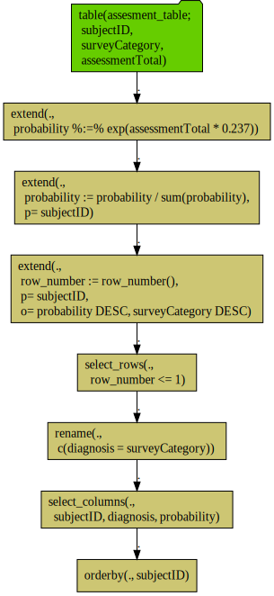

Example of drawing an `rquery` pipeline diagram.

```{r example}
library("rquery")

scale <- 0.237

rquery_pipeline <- mk_td("assesment_table", 
                         qc(subjectID, surveyCategory, assessmentTotal)) %.>%
  extend_nse(.,
             probability %:=%
               exp(assessmentTotal * scale))  %.>% 
  normalize_cols(.,
                 "probability",
                 partitionby = 'subjectID') %.>%
  pick_top_k(.,
             partitionby = 'subjectID',
             orderby = c('probability', 'surveyCategory'),
             reverse = c('probability', 'surveyCategory')) %.>% 
  rename_columns(., 'diagnosis' %:=% 'surveyCategory') %.>%
  select_columns(., c('subjectID', 
                      'diagnosis', 
                      'probability')) %.>%
  orderby(., cols = 'subjectID')

# https://github.com/rich-iannone/DiagrammeR/issues/70
rquery_pipeline %.>%
  op_diagram(.) %.>% 
  DiagrammeR::DiagrammeR(diagram = ., type = "grViz") %.>% 
  DiagrammeRsvg::export_svg(.) %.>% 
  write(., file="rquery_diagram_files/diagram1.svg")
```


